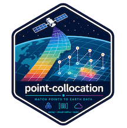

# point-collocation


*A helper package for doing lat/lon/time matchups using `earthaccess` and NASA EarthData products*

Point-collocation is for the moment when you have field stations, animal tracks, survey points, or other lat/lon/time observations and need the corresponding satellite or model values from NASA Earthdata. It wraps the hard parts—granule search, subsetting, cloud access, and memory-aware extraction—so you can focus on the science instead of the plumbing.


## Documentation

Full documentation is available at: **<https://fish-pace.github.io/point-collocation/>**

- [Installation](https://fish-pace.github.io/point-collocation/installation/)
- [Quickstart](https://fish-pace.github.io/point-collocation/quickstart/)
- [API Reference](https://fish-pace.github.io/point-collocation/api/)
- [Pangeo Showcase Lightning Talk](https://www.youtube.com/watch?v=d0vQthvX41o)
- [Demo recording](https://youtu.be/o9bLQ8Vn69w)


Examples are included for PACE, MUR, TEMPO, ICESat-2 ATL21, ECCO and DISCOVR EPIC. Distance metrics include 1D euclidian, 2D kdtree and 2D haversine for distances near poles.

## PyPI

```
pip install point-collocation
```

<https://pypi.org/project/point-collocation/>

## Data Regions

This package currently is designed to do point matchups against NASA EarthData. In a virtual machine in AWS us-west-2, where NASA cloud data is, the point matchups are fast. In Colab, say, your comppute is not in the same data region nor provider (Google versus AWS), and the same matchups might take 10x longer. Thus if you have big matchup tasks, 10s of thousands of points, it is wise to do that in AWS us-west-2.
