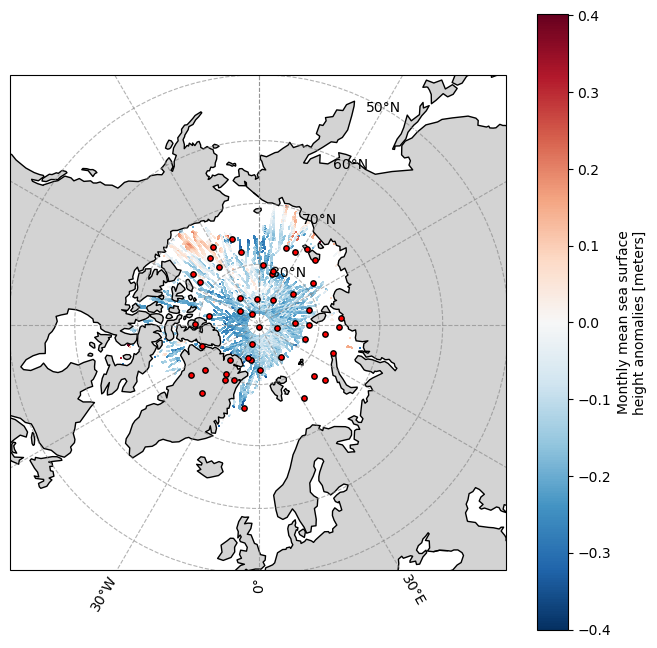

# ICESat-2 ATL21 Matchups

ATL21 is the gridded sea surface height anomaly (SSHA) product derived from ICESat-2 sea-ice measurements. Because it is a gridded product, we can use `point-collocation` to do matchups. Other ICESat-2 products like ATL07 are along track (lines) and `point-collocation` will not work for those data.

ATL21 has
* Daily Arctic/Antarctic SSHA fields
* Monthly averaged SSHA fields

The granules are h5 grouped netcdf files. It has monthly, daily, and metadata all in one netcdf.

## First generate some points over the arctic


```python
import numpy as np
import pandas as pd

n_points = 50

# generate Arctic points (lat > 60)
points = []
while len(points) < n_points:
    batch = 500
    lat = np.degrees(np.arcsin(np.random.uniform(-1, 1, batch)))
    lon = np.random.uniform(-180, 180, batch)

    mask = lat > 75
    for la, lo in zip(lat[mask], lon[mask]):
        points.append((la, lo))
        if len(points) >= n_points:
            break

lat, lon = np.array(points).T

# random dates after Oct 2018
start = pd.Timestamp("2018-10-01")
end = pd.Timestamp.now()

days = pd.date_range(start, end, freq="D")
date = np.random.choice(days, n_points)

# dataframe
df = pd.DataFrame({
    "lat": lat,
    "lon": lon,
    "date": date
})

print(df.head())
```

             lat         lon       date
    0  75.335363   61.929180 2022-03-07
    1  88.342307 -150.168110 2024-12-28
    2  75.697007  127.289327 2024-03-24
    3  82.851837 -101.584590 2021-05-26
    4  83.636097 -102.690326 2019-11-03


### Next get the granule plan


```python
import point_collocation as pc
import pandas as pd
short_name="ATL21"
plan = pc.plan(
    df,
    data_source="earthaccess",
    source_kwargs={
        "short_name": short_name,
        "version": "004"
    }
)
```


```python
# Some points are probably over land
plan.summary(n=0)
```

    Plan: 50 points → 32 unique granule(s)
      Points with 0 matches : 2
      Points with >1 matches: 0
      Time buffer: 0 days 00:00:00


### Show the groups in the files

`plan.open_dataset(0, open_method="auto")` will open a granule and show us the open_method spec and geolocation. This uses `open_method="auto"` which is not what we want but is enough to see what the groups are.

Looking at this, we see we want groups `"/"` and `"/monthly"`. Unfortunately, getting the daily values from these files would require setting a time variable somehow. The coords are `grid_lat` and `grid_lon`.


```python
%%time
plan.open_dataset(0, open_method="auto")
```

    open_method: {'xarray_open': 'auto', 'open_kwargs': {'chunks': {}, 'engine': 'h5netcdf', 'decode_timedelta': False}, 'coords': 'auto', 'set_coords': True, 'dim_renames': None, 'auto_align_phony_dims': None}
    
    Group /
      Dimensions: {'grid_y': 448, 'grid_x': 304, 'dim_0': 304}
      Variables:  crs(), grid_lat('grid_y', 'grid_x'), grid_lon('grid_y', 'grid_x'), grid_x('dim_0',), grid_y('dim_0',), land_mask_map('grid_y', 'grid_x')
    
    Group /METADATA
      Dimensions: {'dim_0': 1}
      Variables:  iso_19139_dataset_xml('dim_0',), iso_19139_series_xml('dim_0',)
    
    Group /METADATA/AcquisitionInformation
    
    Group /METADATA/AcquisitionInformation/lidar
    
    Group /METADATA/AcquisitionInformation/lidarDocument
    
    Group /METADATA/AcquisitionInformation/platform
    
    Group /METADATA/AcquisitionInformation/platformDocument
    
    Group /METADATA/DataQuality
    
    Group /METADATA/DataQuality/CompletenessOmission
    
    Group /METADATA/DataQuality/DomainConsistency
    
    Group /METADATA/DatasetIdentification
    
    Group /METADATA/Extent
    
    Group /METADATA/Lineage
    
    Group /METADATA/Lineage/ANC19
    
    Group /METADATA/Lineage/ANC25-21
    
    Group /METADATA/Lineage/ANC26-21
    
    Group /METADATA/Lineage/ANC36-21
    
    Group /METADATA/Lineage/ANC38-21
    
    Group /METADATA/Lineage/ATL10
    
    Group /METADATA/Lineage/Control
    
    Group /METADATA/ProcessStep
    
    Group /METADATA/ProcessStep/Browse
    
    Group /METADATA/ProcessStep/Metadata
    
    Group /METADATA/ProcessStep/PGE
    
    Group /METADATA/ProcessStep/QA
    
    Group /METADATA/ProductSpecificationDocument
    
    Group /METADATA/QADatasetIdentification
    
    Group /METADATA/SeriesIdentification
    
    Group /ancillary_data
      Dimensions: {'dim_0': 1}
      Variables:  atlas_sdp_gps_epoch('dim_0',), control('dim_0',), data_end_utc('dim_0',), data_start_utc('dim_0',), end_cycle('dim_0',), end_delta_time('dim_0',), end_geoseg('dim_0',), end_gpssow('dim_0',), end_gpsweek('dim_0',), end_orbit('dim_0',), end_region('dim_0',), end_rgt('dim_0',), granule_end_utc('dim_0',), granule_start_utc('dim_0',), release('dim_0',), start_cycle('dim_0',), start_delta_time('dim_0',), start_geoseg('dim_0',), start_gpssow('dim_0',), start_gpsweek('dim_0',), start_orbit('dim_0',), start_region('dim_0',), start_rgt('dim_0',), version('dim_0',)
    
    Group /ancillary_data/beam_selection
      Dimensions: {'dim_0': 1}
      Variables:  proc_atl21_spot_1('dim_0',), proc_atl21_spot_2('dim_0',), proc_atl21_spot_3('dim_0',), proc_atl21_spot_4('dim_0',), proc_atl21_spot_5('dim_0',), proc_atl21_spot_6('dim_0',)
    
    Group /ancillary_data/refsurf_selection
      Dimensions: {'dim_0': 1}
      Variables:  process_refsurf_0('dim_0',), process_refsurf_1('dim_0',), process_refsurf_2('dim_0',), process_refsurf_3('dim_0',)
    
    Group /daily
    
    Group /daily/day14
      Dimensions: {'dim_0': 1, 'grid_y': 448, 'grid_x': 304}
      Variables:  delta_time_beg('dim_0',), delta_time_end('dim_0',), mean_ssha('grid_y', 'grid_x'), mean_weighted_earth_free2mean('grid_y', 'grid_x'), mean_weighted_geoid('grid_y', 'grid_x'), mean_weighted_geoid_free2mean('grid_y', 'grid_x'), mean_weighted_mss('grid_y', 'grid_x'), n_refsurfs('grid_y', 'grid_x'), sigma('grid_y', 'grid_x')
    
    Group /daily/day15
      Dimensions: {'dim_0': 1, 'grid_y': 448, 'grid_x': 304}
      Variables:  delta_time_beg('dim_0',), delta_time_end('dim_0',), mean_ssha('grid_y', 'grid_x'), mean_weighted_earth_free2mean('grid_y', 'grid_x'), mean_weighted_geoid('grid_y', 'grid_x'), mean_weighted_geoid_free2mean('grid_y', 'grid_x'), mean_weighted_mss('grid_y', 'grid_x'), n_refsurfs('grid_y', 'grid_x'), sigma('grid_y', 'grid_x')
    
    Group /daily/day16
      Dimensions: {'dim_0': 1, 'grid_y': 448, 'grid_x': 304}
      Variables:  delta_time_beg('dim_0',), delta_time_end('dim_0',), mean_ssha('grid_y', 'grid_x'), mean_weighted_earth_free2mean('grid_y', 'grid_x'), mean_weighted_geoid('grid_y', 'grid_x'), mean_weighted_geoid_free2mean('grid_y', 'grid_x'), mean_weighted_mss('grid_y', 'grid_x'), n_refsurfs('grid_y', 'grid_x'), sigma('grid_y', 'grid_x')
    
    Group /daily/day17
      Dimensions: {'dim_0': 1, 'grid_y': 448, 'grid_x': 304}
      Variables:  delta_time_beg('dim_0',), delta_time_end('dim_0',), mean_ssha('grid_y', 'grid_x'), mean_weighted_earth_free2mean('grid_y', 'grid_x'), mean_weighted_geoid('grid_y', 'grid_x'), mean_weighted_geoid_free2mean('grid_y', 'grid_x'), mean_weighted_mss('grid_y', 'grid_x'), n_refsurfs('grid_y', 'grid_x'), sigma('grid_y', 'grid_x')
    
    Group /daily/day18
      Dimensions: {'dim_0': 1, 'grid_y': 448, 'grid_x': 304}
      Variables:  delta_time_beg('dim_0',), delta_time_end('dim_0',), mean_ssha('grid_y', 'grid_x'), mean_weighted_earth_free2mean('grid_y', 'grid_x'), mean_weighted_geoid('grid_y', 'grid_x'), mean_weighted_geoid_free2mean('grid_y', 'grid_x'), mean_weighted_mss('grid_y', 'grid_x'), n_refsurfs('grid_y', 'grid_x'), sigma('grid_y', 'grid_x')
    
    Group /daily/day19
      Dimensions: {'dim_0': 1, 'grid_y': 448, 'grid_x': 304}
      Variables:  delta_time_beg('dim_0',), delta_time_end('dim_0',), mean_ssha('grid_y', 'grid_x'), mean_weighted_earth_free2mean('grid_y', 'grid_x'), mean_weighted_geoid('grid_y', 'grid_x'), mean_weighted_geoid_free2mean('grid_y', 'grid_x'), mean_weighted_mss('grid_y', 'grid_x'), n_refsurfs('grid_y', 'grid_x'), sigma('grid_y', 'grid_x')
    
    Group /daily/day20
      Dimensions: {'dim_0': 1, 'grid_y': 448, 'grid_x': 304}
      Variables:  delta_time_beg('dim_0',), delta_time_end('dim_0',), mean_ssha('grid_y', 'grid_x'), mean_weighted_earth_free2mean('grid_y', 'grid_x'), mean_weighted_geoid('grid_y', 'grid_x'), mean_weighted_geoid_free2mean('grid_y', 'grid_x'), mean_weighted_mss('grid_y', 'grid_x'), n_refsurfs('grid_y', 'grid_x'), sigma('grid_y', 'grid_x')
    
    Group /daily/day21
      Dimensions: {'dim_0': 1, 'grid_y': 448, 'grid_x': 304}
      Variables:  delta_time_beg('dim_0',), delta_time_end('dim_0',), mean_ssha('grid_y', 'grid_x'), mean_weighted_earth_free2mean('grid_y', 'grid_x'), mean_weighted_geoid('grid_y', 'grid_x'), mean_weighted_geoid_free2mean('grid_y', 'grid_x'), mean_weighted_mss('grid_y', 'grid_x'), n_refsurfs('grid_y', 'grid_x'), sigma('grid_y', 'grid_x')
    
    Group /daily/day22
      Dimensions: {'dim_0': 1, 'grid_y': 448, 'grid_x': 304}
      Variables:  delta_time_beg('dim_0',), delta_time_end('dim_0',), mean_ssha('grid_y', 'grid_x'), mean_weighted_earth_free2mean('grid_y', 'grid_x'), mean_weighted_geoid('grid_y', 'grid_x'), mean_weighted_geoid_free2mean('grid_y', 'grid_x'), mean_weighted_mss('grid_y', 'grid_x'), n_refsurfs('grid_y', 'grid_x'), sigma('grid_y', 'grid_x')
    
    Group /daily/day23
      Dimensions: {'dim_0': 1, 'grid_y': 448, 'grid_x': 304}
      Variables:  delta_time_beg('dim_0',), delta_time_end('dim_0',), mean_ssha('grid_y', 'grid_x'), mean_weighted_earth_free2mean('grid_y', 'grid_x'), mean_weighted_geoid('grid_y', 'grid_x'), mean_weighted_geoid_free2mean('grid_y', 'grid_x'), mean_weighted_mss('grid_y', 'grid_x'), n_refsurfs('grid_y', 'grid_x'), sigma('grid_y', 'grid_x')
    
    Group /daily/day24
      Dimensions: {'dim_0': 1, 'grid_y': 448, 'grid_x': 304}
      Variables:  delta_time_beg('dim_0',), delta_time_end('dim_0',), mean_ssha('grid_y', 'grid_x'), mean_weighted_earth_free2mean('grid_y', 'grid_x'), mean_weighted_geoid('grid_y', 'grid_x'), mean_weighted_geoid_free2mean('grid_y', 'grid_x'), mean_weighted_mss('grid_y', 'grid_x'), n_refsurfs('grid_y', 'grid_x'), sigma('grid_y', 'grid_x')
    
    Group /daily/day25
      Dimensions: {'dim_0': 1, 'grid_y': 448, 'grid_x': 304}
      Variables:  delta_time_beg('dim_0',), delta_time_end('dim_0',), mean_ssha('grid_y', 'grid_x'), mean_weighted_earth_free2mean('grid_y', 'grid_x'), mean_weighted_geoid('grid_y', 'grid_x'), mean_weighted_geoid_free2mean('grid_y', 'grid_x'), mean_weighted_mss('grid_y', 'grid_x'), n_refsurfs('grid_y', 'grid_x'), sigma('grid_y', 'grid_x')
    
    Group /daily/day26
      Dimensions: {'dim_0': 1, 'grid_y': 448, 'grid_x': 304}
      Variables:  delta_time_beg('dim_0',), delta_time_end('dim_0',), mean_ssha('grid_y', 'grid_x'), mean_weighted_earth_free2mean('grid_y', 'grid_x'), mean_weighted_geoid('grid_y', 'grid_x'), mean_weighted_geoid_free2mean('grid_y', 'grid_x'), mean_weighted_mss('grid_y', 'grid_x'), n_refsurfs('grid_y', 'grid_x'), sigma('grid_y', 'grid_x')
    
    Group /daily/day27
      Dimensions: {'dim_0': 1, 'grid_y': 448, 'grid_x': 304}
      Variables:  delta_time_beg('dim_0',), delta_time_end('dim_0',), mean_ssha('grid_y', 'grid_x'), mean_weighted_earth_free2mean('grid_y', 'grid_x'), mean_weighted_geoid('grid_y', 'grid_x'), mean_weighted_geoid_free2mean('grid_y', 'grid_x'), mean_weighted_mss('grid_y', 'grid_x'), n_refsurfs('grid_y', 'grid_x'), sigma('grid_y', 'grid_x')
    
    Group /daily/day28
      Dimensions: {'dim_0': 1, 'grid_y': 448, 'grid_x': 304}
      Variables:  delta_time_beg('dim_0',), delta_time_end('dim_0',), mean_ssha('grid_y', 'grid_x'), mean_weighted_earth_free2mean('grid_y', 'grid_x'), mean_weighted_geoid('grid_y', 'grid_x'), mean_weighted_geoid_free2mean('grid_y', 'grid_x'), mean_weighted_mss('grid_y', 'grid_x'), n_refsurfs('grid_y', 'grid_x'), sigma('grid_y', 'grid_x')
    
    Group /daily/day29
      Dimensions: {'dim_0': 1, 'grid_y': 448, 'grid_x': 304}
      Variables:  delta_time_beg('dim_0',), delta_time_end('dim_0',), mean_ssha('grid_y', 'grid_x'), mean_weighted_earth_free2mean('grid_y', 'grid_x'), mean_weighted_geoid('grid_y', 'grid_x'), mean_weighted_geoid_free2mean('grid_y', 'grid_x'), mean_weighted_mss('grid_y', 'grid_x'), n_refsurfs('grid_y', 'grid_x'), sigma('grid_y', 'grid_x')
    
    Group /daily/day30
      Dimensions: {'dim_0': 1, 'grid_y': 448, 'grid_x': 304}
      Variables:  delta_time_beg('dim_0',), delta_time_end('dim_0',), mean_ssha('grid_y', 'grid_x'), mean_weighted_earth_free2mean('grid_y', 'grid_x'), mean_weighted_geoid('grid_y', 'grid_x'), mean_weighted_geoid_free2mean('grid_y', 'grid_x'), mean_weighted_mss('grid_y', 'grid_x'), n_refsurfs('grid_y', 'grid_x'), sigma('grid_y', 'grid_x')
    
    Group /daily/day31
      Dimensions: {'dim_0': 1, 'grid_y': 448, 'grid_x': 304}
      Variables:  delta_time_beg('dim_0',), delta_time_end('dim_0',), mean_ssha('grid_y', 'grid_x'), mean_weighted_earth_free2mean('grid_y', 'grid_x'), mean_weighted_geoid('grid_y', 'grid_x'), mean_weighted_geoid_free2mean('grid_y', 'grid_x'), mean_weighted_mss('grid_y', 'grid_x'), n_refsurfs('grid_y', 'grid_x'), sigma('grid_y', 'grid_x')
    
    Group /monthly
      Dimensions: {'dim_0': 1, 'grid_y': 448, 'grid_x': 304}
      Variables:  delta_time_beg('dim_0',), delta_time_end('dim_0',), mean_ssha('grid_y', 'grid_x'), mean_weighted_earth_free2mean('grid_y', 'grid_x'), mean_weighted_geoid('grid_y', 'grid_x'), mean_weighted_geoid_free2mean('grid_y', 'grid_x'), mean_weighted_mss('grid_y', 'grid_x'), n_refsurfs('grid_y', 'grid_x'), sigma('grid_y', 'grid_x')
    
    Group /orbit_info
      Dimensions: {'dim_0': 235, 'crossing_time': 235, 'sc_orient_time': 1}
      Variables:  crossing_time('dim_0',), cycle_number('crossing_time',), lan('crossing_time',), orbit_number('crossing_time',), rgt('crossing_time',), sc_orient('sc_orient_time',), sc_orient_time('dim_0',)
    
    Group /quality_assessment
      Dimensions: {'dim_0': 1}
      Variables:  qa_granule_fail_reason('dim_0',), qa_granule_pass_fail('dim_0',)
    
    Dimensions: {'grid_y': 448, 'grid_x': 304, 'dim_0': 304, 'crossing_time': 235, 'sc_orient_time': 1}
    
    Variables: ['crs', 'grid_lat', 'grid_lon', 'grid_x', 'grid_y', 'land_mask_map', 'iso_19139_dataset_xml', 'iso_19139_series_xml', 'atlas_sdp_gps_epoch', 'control', 'data_end_utc', 'data_start_utc', 'end_cycle', 'end_delta_time', 'end_geoseg', 'end_gpssow', 'end_gpsweek', 'end_orbit', 'end_region', 'end_rgt', 'granule_end_utc', 'granule_start_utc', 'release', 'start_cycle', 'start_delta_time', 'start_geoseg', 'start_gpssow', 'start_gpsweek', 'start_orbit', 'start_region', 'start_rgt', 'version', 'proc_atl21_spot_1', 'proc_atl21_spot_2', 'proc_atl21_spot_3', 'proc_atl21_spot_4', 'proc_atl21_spot_5', 'proc_atl21_spot_6', 'process_refsurf_0', 'process_refsurf_1', 'process_refsurf_2', 'process_refsurf_3', 'delta_time_beg', 'delta_time_end', 'mean_ssha', 'mean_weighted_earth_free2mean', 'mean_weighted_geoid', 'mean_weighted_geoid_free2mean', 'mean_weighted_mss', 'n_refsurfs', 'sigma', 'crossing_time', 'cycle_number', 'lan', 'orbit_number', 'rgt', 'sc_orient', 'sc_orient_time', 'qa_granule_fail_reason', 'qa_granule_pass_fail']
    
    Geolocation: NONE detected with 'coords': 'auto', 'set_coords': True. Try open_method='datatree-merge' or specify open_method={'coords': {'lat': '...', 'lon': '...'}}.
    
    Dataset Detail:
    <xarray.Dataset> Size: 3MB
    Dimensions:        (grid_y: 448, grid_x: 304)
    Coordinates:
      * grid_y         (grid_y) float64 4kB 5.838e+06 5.812e+06 ... -5.338e+06
      * grid_x         (grid_x) float64 2kB -3.838e+06 -3.812e+06 ... 3.738e+06
    Data variables:
        crs            int8 1B ...
        grid_lat       (grid_y, grid_x) float64 1MB dask.array<chunksize=(448, 304), meta=np.ndarray>
        grid_lon       (grid_y, grid_x) float64 1MB dask.array<chunksize=(448, 304), meta=np.ndarray>
        land_mask_map  (grid_y, grid_x) float64 1MB dask.array<chunksize=(448, 304), meta=np.ndarray>
    Attributes: (12/46)
        short_name:                         ATL21
        level:                              L3B
        description:                        This data set (ATL21) contains daily ...
        Conventions:                        CF-1.7
        contributor_name:                   Alek Petty (alek.a.petty@nasa.gov), R...
        contributor_role:                   Investigator, Investigator, Investiga...
        ...                                 ...
        processing_level:                   3B
        references:                         http://nsidc.org/data/icesat2/data.html
        project:                            ICESat-2 > Ice, Cloud, and land Eleva...
        instrument:                         ATLAS > Advanced Topographic Laser Al...
        platform:                           ICESat-2 > Ice, Cloud, and land Eleva...
        source:                             Spacecraft
    CPU times: user 1.01 s, sys: 10.4 ms, total: 1.02 s
    Wall time: 1.2 s


### Specify a `open_method` profile

Now that we know what the groups are and what the latitude and longitude are called, we can set up a `open_method` profile. This is used to tell `point-collocation` how to open the file (`open_dataset` or `open_datatree` and what groups (if any) to merge. Note, `open_dataset` and merge is faster than `open_datatree` and merge.

Let's open one file and plot our points on that data. A bunch of points are on land and those will be NaN. A few points are on white (NaN) and those will be NaN also.


```python
%%time
icesat2_atl21 = {
    'xarray_open': 'dataset',
    'merge': ['/', '/monthly'],
    'coords': {'lat': 'grid_lat', 'lon': 'grid_lon'},
    'set_coords': True,
}
dt2 = plan.open_dataset(plan[0], open_method=icesat2_atl21)
```

    CPU times: user 1.57 s, sys: 10.5 ms, total: 1.58 s
    Wall time: 1.69 s


```python
import matplotlib.pyplot as plt
import cartopy.crs as ccrs
import cartopy.feature as cfeature
import numpy as np

fig = plt.figure(figsize=(8,8))
ax = plt.axes(projection=ccrs.NorthPolarStereo())

# plot the field
dt2.mean_ssha.plot.pcolormesh(
    x="grid_lon",
    y="grid_lat",
    transform=ccrs.PlateCarree(),
    ax=ax,
    shading="auto",
    add_colorbar=True,
)

ax.coastlines()
ax.add_feature(cfeature.LAND, facecolor="lightgray")

# Arctic extent
ax.set_extent([-180, 180, 50, 90], crs=ccrs.PlateCarree())

# gridlines
gl = ax.gridlines(
    crs=ccrs.PlateCarree(),
    draw_labels=True,
    linewidth=0.8,
    color="gray",
    alpha=0.6,
    linestyle="--",
)

gl.top_labels = False
gl.right_labels = False
gl.xlocator = plt.FixedLocator(np.arange(-180, 181, 30))
gl.ylocator = plt.FixedLocator(np.arange(50, 91, 10))

# ---- add points from dataframe ----
ax.scatter(
    df.lon,
    df.lat,
    transform=ccrs.PlateCarree(),
    s=15,
    color="red",
    edgecolor="black",
    zorder=10,
)

plt.show()
```


    

    


```python
%%time
# this takes about 2 minutes
res = pc.matchup(plan, 
                 variables = ["mean_ssha"], 
                 open_method=icesat2_atl21,
                 spatial_method="xoak-kdtree")
```

The full `res` output shows the granules and granules closest lat/lon. Here is just the matchups.


```python
res[['lat', 'lon', 'time', 'mean_ssha']].dropna(subset=['mean_ssha'])
```


<div>
<style scoped>
    .dataframe tbody tr th:only-of-type {
        vertical-align: middle;
    }

    .dataframe tbody tr th {
        vertical-align: top;
    }

    .dataframe thead th {
        text-align: right;
    }
</style>
<table border="1" class="dataframe">
  <thead>
    <tr style="text-align: right;">
      <th></th>
      <th>lat</th>
      <th>lon</th>
      <th>time</th>
      <th>mean_ssha</th>
    </tr>
  </thead>
  <tbody>
    <tr>
      <th>2</th>
      <td>85.220474</td>
      <td>149.930499</td>
      <td>2019-01-18 12:00:00</td>
      <td>-0.192034</td>
    </tr>
    <tr>
      <th>3</th>
      <td>78.376089</td>
      <td>-145.026835</td>
      <td>2019-01-18 12:00:00</td>
      <td>-0.117620</td>
    </tr>
    <tr>
      <th>11</th>
      <td>86.520073</td>
      <td>-18.274879</td>
      <td>2019-10-13 12:00:00</td>
      <td>-0.102046</td>
    </tr>
    <tr>
      <th>13</th>
      <td>84.046653</td>
      <td>-18.159051</td>
      <td>2020-03-16 12:00:00</td>
      <td>-0.149427</td>
    </tr>
    <tr>
      <th>14</th>
      <td>81.545401</td>
      <td>-99.980171</td>
      <td>2020-05-05 12:00:00</td>
      <td>-0.264338</td>
    </tr>
    <tr>
      <th>15</th>
      <td>80.720945</td>
      <td>165.106976</td>
      <td>2020-05-22 12:00:00</td>
      <td>-0.221109</td>
    </tr>
    <tr>
      <th>16</th>
      <td>83.455607</td>
      <td>34.289036</td>
      <td>2020-07-04 12:00:00</td>
      <td>-0.095293</td>
    </tr>
    <tr>
      <th>17</th>
      <td>80.049427</td>
      <td>176.091898</td>
      <td>2020-08-06 12:00:00</td>
      <td>-0.234110</td>
    </tr>
    <tr>
      <th>19</th>
      <td>76.264785</td>
      <td>-143.783821</td>
      <td>2020-09-22 12:00:00</td>
      <td>-0.145541</td>
    </tr>
    <tr>
      <th>22</th>
      <td>81.259284</td>
      <td>165.112196</td>
      <td>2020-10-05 12:00:00</td>
      <td>-0.164445</td>
    </tr>
    <tr>
      <th>24</th>
      <td>82.398088</td>
      <td>0.966748</td>
      <td>2021-03-20 12:00:00</td>
      <td>-0.147885</td>
    </tr>
    <tr>
      <th>25</th>
      <td>77.977570</td>
      <td>-125.621637</td>
      <td>2021-03-21 12:00:00</td>
      <td>-0.150316</td>
    </tr>
    <tr>
      <th>26</th>
      <td>85.688853</td>
      <td>-175.928456</td>
      <td>2021-05-19 12:00:00</td>
      <td>-0.154804</td>
    </tr>
    <tr>
      <th>28</th>
      <td>83.909789</td>
      <td>-11.789233</td>
      <td>2021-06-19 12:00:00</td>
      <td>-0.109942</td>
    </tr>
    <tr>
      <th>30</th>
      <td>83.876660</td>
      <td>91.821700</td>
      <td>2021-11-05 12:00:00</td>
      <td>-0.111732</td>
    </tr>
    <tr>
      <th>32</th>
      <td>82.362668</td>
      <td>132.392313</td>
      <td>2021-11-01 12:00:00</td>
      <td>-0.014126</td>
    </tr>
    <tr>
      <th>35</th>
      <td>86.184603</td>
      <td>-125.854679</td>
      <td>2022-10-27 12:00:00</td>
      <td>-0.108561</td>
    </tr>
    <tr>
      <th>36</th>
      <td>87.882029</td>
      <td>-148.341462</td>
      <td>2023-05-09 12:00:00</td>
      <td>-0.137922</td>
    </tr>
    <tr>
      <th>37</th>
      <td>86.965969</td>
      <td>79.330880</td>
      <td>2023-07-08 12:00:00</td>
      <td>-0.093270</td>
    </tr>
    <tr>
      <th>38</th>
      <td>76.636988</td>
      <td>88.065294</td>
      <td>2023-11-03 12:00:00</td>
      <td>-0.009214</td>
    </tr>
    <tr>
      <th>39</th>
      <td>81.376226</td>
      <td>106.167399</td>
      <td>2024-01-31 12:00:00</td>
      <td>-0.068507</td>
    </tr>
    <tr>
      <th>41</th>
      <td>75.954196</td>
      <td>-9.850488</td>
      <td>2024-03-29 12:00:00</td>
      <td>-0.168875</td>
    </tr>
    <tr>
      <th>43</th>
      <td>78.638909</td>
      <td>126.894627</td>
      <td>2024-11-24 12:00:00</td>
      <td>-0.055914</td>
    </tr>
    <tr>
      <th>45</th>
      <td>84.583223</td>
      <td>-145.284703</td>
      <td>2025-01-28 12:00:00</td>
      <td>-0.138104</td>
    </tr>
    <tr>
      <th>46</th>
      <td>75.055770</td>
      <td>-149.868932</td>
      <td>2025-03-20 12:00:00</td>
      <td>-0.165014</td>
    </tr>
    <tr>
      <th>47</th>
      <td>76.804280</td>
      <td>68.967764</td>
      <td>2025-03-08 12:00:00</td>
      <td>-0.088710</td>
    </tr>
  </tbody>
</table>
</div>


```python

```
