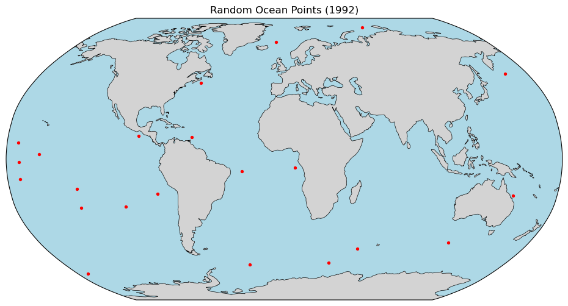
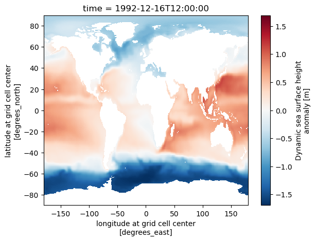
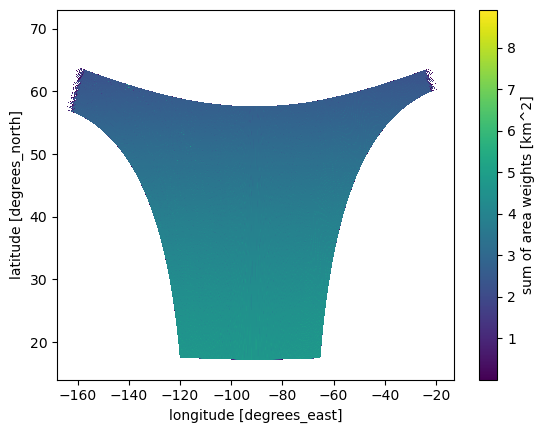

# Testing across multiple products

## Level 3

* WORKS `short_name="ECCO_L4_SSH_05DEG_MONTHLY_V4R4"` level 4, ECCO Sea Surface Height - Monthly Mean 0.5 Degree (Version 4 Release 4)
* WORKS `short_name="MUR-JPL-L4-GLOB-v4.1"` level 4 SST
* WORKS `short_name="MUR25-JPL-L4-GLOB-v04.2"` level 4 SST
* WORKS `short_name = "TEMPO_NO2_L3", version = "V03"` level 3 [notebook](https://nasa.github.io/ASDC_Data_and_User_Services/TEMPO/how_to_examine_TEMPO_data_using_earthaccess.html)

## Level 2

* `concept_id = "C1962643459-LARC_ASDC"` level 2 [notebook](https://nasa.github.io/ASDC_Data_and_User_Services/DSCOVR/how_to_explore_aerosol_data_from_EPIC_and_EPA-AQS.html)
* `short_name="ATL03"` level 2, icesat-2. [notebook](https://nasa-openscapes.github.io/earthdata-cloud-cookbook/tutorials/Harmony.html)
* `short_name = "PREFIRE_SAT2_2B-CLD"` level 2 [notebook](https://nasa.github.io/ASDC_Data_and_User_Services/PREFIRE/plot_PREFIRE_L2_CLD_with_earthaccess_and_Harmony.html)
* `short_name = "DSCOVR_EPIC_L2_AER"` level 2 [notebook](https://nasa.github.io/ASDC_Data_and_User_Services/DSCOVR/how_to_compare_TEMPO_with_DSCOVR_and_AERONET_uvai.html)
* `short_name = "TEMPO_O3TOT_L2"` level 2 [notebook](https://nasa.github.io/ASDC_Data_and_User_Services/DSCOVR/how_to_compare_spatially_TEMPO_with_DSCOVR_uvai.html) [notebook](https://nasa.github.io/ASDC_Data_and_User_Services/DSCOVR/how_to_compare_TEMPO_with_DSCOVR_and_AERONET_uvai.html)
* `short_name = "DSCOVR_EPIC_L2_TO3", version = "03"` level 2 [notebook](https://nasa.github.io/ASDC_Data_and_User_Services/DSCOVR/how_to_plot_ozone_product_parameters.html)


### Special cases

* `short_name = "CAL_LID_L1-Standard-V4-51", version = "V4-51"` level 1b  Cloud-Aerosol Lidar and Infrared Pathfinder Satellite Observations (CALIPSO) [notebook](https://nasa.github.io/ASDC_Data_and_User_Services/CALIPSO/how_to_plot_ozone_number_densities.html)
* `short_name=['HLSL30','HLSS30']` Harmonized Landsat Sentinel-2 (HLS) data [notebook](https://nasa-openscapes.github.io/earthdata-cloud-cookbook/tutorials/Observing_Seasonal_Ag_Changes.html) These are tifs. Need different kind of opening.
  

## Create some points

Random global.


```python
import pandas as pd
df_points = pd.read_csv(
    "fixtures/points_1000.csv",
    parse_dates=["time"]
)
df = df_points[
    (df_points["time"].dt.year > 2018) &
    (df_points["land"] == False)
]
print(len(df))
df
```

    125


<div>
<style scoped>
    .dataframe tbody tr th:only-of-type {
        vertical-align: middle;
    }

    .dataframe tbody tr th {
        vertical-align: top;
    }

    .dataframe thead th {
        text-align: right;
    }
</style>
<table border="1" class="dataframe">
  <thead>
    <tr style="text-align: right;">
      <th></th>
      <th>lat</th>
      <th>lon</th>
      <th>time</th>
      <th>land</th>
    </tr>
  </thead>
  <tbody>
    <tr>
      <th>1</th>
      <td>17.935653</td>
      <td>165.980637</td>
      <td>2022-05-04</td>
      <td>False</td>
    </tr>
    <tr>
      <th>17</th>
      <td>-26.145951</td>
      <td>-40.385013</td>
      <td>2021-01-15</td>
      <td>False</td>
    </tr>
    <tr>
      <th>43</th>
      <td>-67.209878</td>
      <td>-62.734423</td>
      <td>2024-04-16</td>
      <td>False</td>
    </tr>
    <tr>
      <th>58</th>
      <td>13.211277</td>
      <td>90.046051</td>
      <td>2021-01-10</td>
      <td>False</td>
    </tr>
    <tr>
      <th>75</th>
      <td>-38.012141</td>
      <td>-33.070238</td>
      <td>2022-09-05</td>
      <td>False</td>
    </tr>
    <tr>
      <th>...</th>
      <td>...</td>
      <td>...</td>
      <td>...</td>
      <td>...</td>
    </tr>
    <tr>
      <th>958</th>
      <td>26.443381</td>
      <td>34.696393</td>
      <td>2020-09-23</td>
      <td>False</td>
    </tr>
    <tr>
      <th>960</th>
      <td>-44.627334</td>
      <td>6.938868</td>
      <td>2021-03-24</td>
      <td>False</td>
    </tr>
    <tr>
      <th>976</th>
      <td>-57.961156</td>
      <td>-109.641930</td>
      <td>2022-09-14</td>
      <td>False</td>
    </tr>
    <tr>
      <th>978</th>
      <td>-21.342933</td>
      <td>53.452957</td>
      <td>2022-04-09</td>
      <td>False</td>
    </tr>
    <tr>
      <th>989</th>
      <td>44.354435</td>
      <td>-175.309679</td>
      <td>2023-03-16</td>
      <td>False</td>
    </tr>
  </tbody>
</table>
<p>125 rows × 4 columns</p>
</div>


## ECCO


```python
df_points = pd.read_csv(
    "fixtures/points_1000.csv",
    parse_dates=["time"]
)
df = df_points[
    (df_points["time"].dt.year == 1992) &
    (df_points["land"] == False)
].reset_index(drop=True)
df
```


<div>
<style scoped>
    .dataframe tbody tr th:only-of-type {
        vertical-align: middle;
    }

    .dataframe tbody tr th {
        vertical-align: top;
    }

    .dataframe thead th {
        text-align: right;
    }
</style>
<table border="1" class="dataframe">
  <thead>
    <tr style="text-align: right;">
      <th></th>
      <th>lat</th>
      <th>lon</th>
      <th>time</th>
      <th>land</th>
    </tr>
  </thead>
  <tbody>
    <tr>
      <th>0</th>
      <td>-49.208746</td>
      <td>130.302670</td>
      <td>1992-03-23</td>
      <td>False</td>
    </tr>
    <tr>
      <th>1</th>
      <td>28.169083</td>
      <td>174.932647</td>
      <td>1992-03-25</td>
      <td>False</td>
    </tr>
    <tr>
      <th>2</th>
      <td>7.490259</td>
      <td>-31.147141</td>
      <td>1992-01-11</td>
      <td>False</td>
    </tr>
    <tr>
      <th>3</th>
      <td>-51.149209</td>
      <td>96.765089</td>
      <td>1992-01-10</td>
      <td>False</td>
    </tr>
    <tr>
      <th>4</th>
      <td>32.184394</td>
      <td>-147.449519</td>
      <td>1992-12-18</td>
      <td>False</td>
    </tr>
    <tr>
      <th>5</th>
      <td>-30.461383</td>
      <td>-1.285569</td>
      <td>1992-01-24</td>
      <td>False</td>
    </tr>
    <tr>
      <th>6</th>
      <td>-55.525274</td>
      <td>-66.685759</td>
      <td>1992-01-10</td>
      <td>False</td>
    </tr>
    <tr>
      <th>7</th>
      <td>1.356566</td>
      <td>-107.987387</td>
      <td>1992-09-13</td>
      <td>False</td>
    </tr>
    <tr>
      <th>8</th>
      <td>-48.149322</td>
      <td>51.787091</td>
      <td>1992-03-17</td>
      <td>False</td>
    </tr>
    <tr>
      <th>9</th>
      <td>-34.766117</td>
      <td>98.371848</td>
      <td>1992-10-16</td>
      <td>False</td>
    </tr>
    <tr>
      <th>10</th>
      <td>-51.219680</td>
      <td>-165.721149</td>
      <td>1992-07-13</td>
      <td>False</td>
    </tr>
    <tr>
      <th>11</th>
      <td>79.640201</td>
      <td>167.200968</td>
      <td>1992-11-24</td>
      <td>False</td>
    </tr>
    <tr>
      <th>12</th>
      <td>-78.661221</td>
      <td>-74.898600</td>
      <td>1992-10-21</td>
      <td>False</td>
    </tr>
    <tr>
      <th>13</th>
      <td>24.674833</td>
      <td>-96.500447</td>
      <td>1992-10-13</td>
      <td>False</td>
    </tr>
    <tr>
      <th>14</th>
      <td>-24.704266</td>
      <td>-177.276012</td>
      <td>1992-06-08</td>
      <td>False</td>
    </tr>
    <tr>
      <th>15</th>
      <td>-9.816165</td>
      <td>-82.739954</td>
      <td>1992-09-11</td>
      <td>False</td>
    </tr>
    <tr>
      <th>16</th>
      <td>-42.895477</td>
      <td>-112.663241</td>
      <td>1992-01-30</td>
      <td>False</td>
    </tr>
    <tr>
      <th>17</th>
      <td>-41.897009</td>
      <td>178.427146</td>
      <td>1992-09-01</td>
      <td>False</td>
    </tr>
    <tr>
      <th>18</th>
      <td>-47.022957</td>
      <td>-25.214043</td>
      <td>1992-06-15</td>
      <td>False</td>
    </tr>
    <tr>
      <th>19</th>
      <td>-23.481993</td>
      <td>84.277957</td>
      <td>1992-03-18</td>
      <td>False</td>
    </tr>
    <tr>
      <th>20</th>
      <td>-41.818309</td>
      <td>-58.404942</td>
      <td>1992-08-03</td>
      <td>False</td>
    </tr>
    <tr>
      <th>21</th>
      <td>-54.135502</td>
      <td>-117.178770</td>
      <td>1992-04-25</td>
      <td>False</td>
    </tr>
  </tbody>
</table>
</div>


```python
import matplotlib.pyplot as plt
import cartopy.crs as ccrs
import cartopy.feature as cfeature

# filter points
df = df_points[
    (df_points["time"].dt.year == 1992) &
    (~df_points["land"])
]

# create Robinson projection
proj = ccrs.Robinson()

fig = plt.figure(figsize=(12,6))
ax = plt.axes(projection=proj)

# add map features
ax.add_feature(cfeature.LAND, facecolor="lightgray")
ax.add_feature(cfeature.OCEAN, facecolor="lightblue")
ax.add_feature(cfeature.COASTLINE, linewidth=0.5)

# plot points
ax.scatter(
    df["lon"],
    df["lat"],
    s=8,
    color="red",
    transform=ccrs.PlateCarree()
)

ax.set_global()
plt.title("Random Ocean Points (1992)")
plt.show()
```


    

    


```python
import point_collocation as pc
short_name="ECCO_L4_SSH_05DEG_MONTHLY_V4R4"
plan = pc.plan(
    df,
    data_source="earthaccess",
    source_kwargs={
        "short_name": short_name,
    }
)
plan.summary()
```

    Plan: 22 points → 11 unique granule(s)
      Points with 0 matches : 0
      Points with >1 matches: 1
      Time buffer: 0 days 00:00:00
    
    First 5 point(s):
      [66] lat=-19.9151, lon=-83.3885, time=1992-12-16 00:00:00: 1 match(es)
        → https://archive.podaac.earthdata.nasa.gov/podaac-ops-cumulus-protected/ECCO_L4_SSH_05DEG_MONTHLY_V4R4/SEA_SURFACE_HEIGHT_mon_mean_1992-12_ECCO_V4r4_latlon_0p50deg.nc
      [75] lat=2.8745, lon=-158.7048, time=1992-03-20 00:00:00: 1 match(es)
        → https://archive.podaac.earthdata.nasa.gov/podaac-ops-cumulus-protected/ECCO_L4_SSH_05DEG_MONTHLY_V4R4/SEA_SURFACE_HEIGHT_mon_mean_1992-03_ECCO_V4r4_latlon_0p50deg.nc
      [147] lat=-11.6778, lon=-172.1407, time=1992-09-14 00:00:00: 1 match(es)
        → https://archive.podaac.earthdata.nasa.gov/podaac-ops-cumulus-protected/ECCO_L4_SSH_05DEG_MONTHLY_V4R4/SEA_SURFACE_HEIGHT_mon_mean_1992-09_ECCO_V4r4_latlon_0p50deg.nc
      [217] lat=-1.7123, lon=-171.7242, time=1992-12-09 00:00:00: 1 match(es)
        → https://archive.podaac.earthdata.nasa.gov/podaac-ops-cumulus-protected/ECCO_L4_SSH_05DEG_MONTHLY_V4R4/SEA_SURFACE_HEIGHT_mon_mean_1992-12_ECCO_V4r4_latlon_0p50deg.nc
      [224] lat=-20.9909, lon=150.9106, time=1992-04-15 00:00:00: 1 match(es)
        → https://archive.podaac.earthdata.nasa.gov/podaac-ops-cumulus-protected/ECCO_L4_SSH_05DEG_MONTHLY_V4R4/SEA_SURFACE_HEIGHT_mon_mean_1992-04_ECCO_V4r4_latlon_0p50deg.nc


```python
plan.show_variables()
```

    geometry     : 'grid'
    open_method  : 'dataset'
    Dimensions : {'time': 1, 'latitude': 360, 'longitude': 720, 'nv': 2}
    Variables  : ['SSH', 'SSHIBC', 'SSHNOIBC']
    
    Geolocation: ('longitude', 'latitude') — lon dims=('longitude',), lat dims=('latitude',)


```python
%%time
res = pc.matchup(plan, variables = ["SSH"])
```

    CPU times: user 2.18 s, sys: 158 ms, total: 2.34 s
    Wall time: 5.03 s


```python
res
```


<div>
<style scoped>
    .dataframe tbody tr th:only-of-type {
        vertical-align: middle;
    }

    .dataframe tbody tr th {
        vertical-align: top;
    }

    .dataframe thead th {
        text-align: right;
    }
</style>
<table border="1" class="dataframe">
  <thead>
    <tr style="text-align: right;">
      <th></th>
      <th>lat</th>
      <th>lon</th>
      <th>time</th>
      <th>land</th>
      <th>pc_id</th>
      <th>granule_id</th>
      <th>granule_time</th>
      <th>granule_lat</th>
      <th>granule_lon</th>
      <th>SSH</th>
    </tr>
  </thead>
  <tbody>
    <tr>
      <th>0</th>
      <td>68.818342</td>
      <td>-7.273068</td>
      <td>1992-01-26</td>
      <td>False</td>
      <td>703</td>
      <td>https://archive.podaac.earthdata.nasa.gov/poda...</td>
      <td>1992-01-16 18:00:00+00:00</td>
      <td>68.75</td>
      <td>-7.25</td>
      <td>-0.781884</td>
    </tr>
    <tr>
      <th>1</th>
      <td>-47.800668</td>
      <td>120.321372</td>
      <td>1992-02-08</td>
      <td>False</td>
      <td>495</td>
      <td>https://archive.podaac.earthdata.nasa.gov/poda...</td>
      <td>1992-02-15 12:00:00+00:00</td>
      <td>-47.75</td>
      <td>120.25</td>
      <td>0.016839</td>
    </tr>
    <tr>
      <th>2</th>
      <td>2.874521</td>
      <td>-158.704773</td>
      <td>1992-03-20</td>
      <td>False</td>
      <td>75</td>
      <td>https://archive.podaac.earthdata.nasa.gov/poda...</td>
      <td>1992-03-16 12:00:00+00:00</td>
      <td>2.75</td>
      <td>-158.75</td>
      <td>0.603334</td>
    </tr>
    <tr>
      <th>3</th>
      <td>-20.990884</td>
      <td>150.910649</td>
      <td>1992-04-15</td>
      <td>False</td>
      <td>224</td>
      <td>https://archive.podaac.earthdata.nasa.gov/poda...</td>
      <td>1992-04-16 00:00:00+00:00</td>
      <td>-20.75</td>
      <td>150.75</td>
      <td>0.731124</td>
    </tr>
    <tr>
      <th>4</th>
      <td>-67.251397</td>
      <td>-171.320942</td>
      <td>1992-04-11</td>
      <td>False</td>
      <td>277</td>
      <td>https://archive.podaac.earthdata.nasa.gov/poda...</td>
      <td>1992-04-16 00:00:00+00:00</td>
      <td>-67.25</td>
      <td>-171.25</td>
      <td>-1.572482</td>
    </tr>
    <tr>
      <th>5</th>
      <td>-4.801420</td>
      <td>6.959748</td>
      <td>1992-04-29</td>
      <td>False</td>
      <td>382</td>
      <td>https://archive.podaac.earthdata.nasa.gov/poda...</td>
      <td>1992-04-16 00:00:00+00:00</td>
      <td>-4.75</td>
      <td>6.75</td>
      <td>0.031338</td>
    </tr>
    <tr>
      <th>6</th>
      <td>-17.262822</td>
      <td>-136.033246</td>
      <td>1992-04-30</td>
      <td>False</td>
      <td>676</td>
      <td>https://archive.podaac.earthdata.nasa.gov/poda...</td>
      <td>1992-04-16 00:00:00+00:00</td>
      <td>-17.25</td>
      <td>-136.25</td>
      <td>0.705870</td>
    </tr>
    <tr>
      <th>7</th>
      <td>43.852275</td>
      <td>-59.583430</td>
      <td>1992-04-19</td>
      <td>False</td>
      <td>833</td>
      <td>https://archive.podaac.earthdata.nasa.gov/poda...</td>
      <td>1992-04-16 00:00:00+00:00</td>
      <td>43.75</td>
      <td>-59.75</td>
      <td>-0.583091</td>
    </tr>
    <tr>
      <th>8</th>
      <td>-27.919489</td>
      <td>-136.118250</td>
      <td>1992-05-23</td>
      <td>False</td>
      <td>375</td>
      <td>https://archive.podaac.earthdata.nasa.gov/poda...</td>
      <td>1992-05-16 12:00:00+00:00</td>
      <td>-27.75</td>
      <td>-136.25</td>
      <td>0.544468</td>
    </tr>
    <tr>
      <th>9</th>
      <td>48.952954</td>
      <td>163.570656</td>
      <td>1992-06-01</td>
      <td>False</td>
      <td>531</td>
      <td>https://archive.podaac.earthdata.nasa.gov/poda...</td>
      <td>1992-05-16 12:00:00+00:00</td>
      <td>48.75</td>
      <td>163.75</td>
      <td>-0.161831</td>
    </tr>
    <tr>
      <th>10</th>
      <td>48.952954</td>
      <td>163.570656</td>
      <td>1992-06-01</td>
      <td>False</td>
      <td>531</td>
      <td>https://archive.podaac.earthdata.nasa.gov/poda...</td>
      <td>1992-06-16 00:00:00+00:00</td>
      <td>48.75</td>
      <td>163.75</td>
      <td>-0.147753</td>
    </tr>
    <tr>
      <th>11</th>
      <td>79.340135</td>
      <td>80.543047</td>
      <td>1992-06-27</td>
      <td>False</td>
      <td>533</td>
      <td>https://archive.podaac.earthdata.nasa.gov/poda...</td>
      <td>1992-06-16 00:00:00+00:00</td>
      <td>79.25</td>
      <td>80.75</td>
      <td>-0.654381</td>
    </tr>
    <tr>
      <th>12</th>
      <td>-6.969358</td>
      <td>-27.537569</td>
      <td>1992-08-18</td>
      <td>False</td>
      <td>544</td>
      <td>https://archive.podaac.earthdata.nasa.gov/poda...</td>
      <td>1992-08-16 12:00:00+00:00</td>
      <td>-6.75</td>
      <td>-27.75</td>
      <td>0.143762</td>
    </tr>
    <tr>
      <th>13</th>
      <td>-11.677792</td>
      <td>-172.140659</td>
      <td>1992-09-14</td>
      <td>False</td>
      <td>147</td>
      <td>https://archive.podaac.earthdata.nasa.gov/poda...</td>
      <td>1992-09-16 00:00:00+00:00</td>
      <td>-11.75</td>
      <td>-172.25</td>
      <td>0.839221</td>
    </tr>
    <tr>
      <th>14</th>
      <td>-61.202947</td>
      <td>-28.178236</td>
      <td>1992-10-23</td>
      <td>False</td>
      <td>238</td>
      <td>https://archive.podaac.earthdata.nasa.gov/poda...</td>
      <td>1992-10-16 12:00:00+00:00</td>
      <td>-61.25</td>
      <td>-28.25</td>
      <td>-1.602313</td>
    </tr>
    <tr>
      <th>15</th>
      <td>-51.600470</td>
      <td>55.130332</td>
      <td>1992-10-30</td>
      <td>False</td>
      <td>574</td>
      <td>https://archive.podaac.earthdata.nasa.gov/poda...</td>
      <td>1992-10-16 12:00:00+00:00</td>
      <td>-51.75</td>
      <td>55.25</td>
      <td>-0.962046</td>
    </tr>
    <tr>
      <th>16</th>
      <td>13.436697</td>
      <td>-95.087053</td>
      <td>1992-11-03</td>
      <td>False</td>
      <td>401</td>
      <td>https://archive.podaac.earthdata.nasa.gov/poda...</td>
      <td>1992-11-16 00:00:00+00:00</td>
      <td>13.25</td>
      <td>-95.25</td>
      <td>0.356034</td>
    </tr>
    <tr>
      <th>17</th>
      <td>-60.157191</td>
      <td>35.980449</td>
      <td>1992-11-04</td>
      <td>False</td>
      <td>459</td>
      <td>https://archive.podaac.earthdata.nasa.gov/poda...</td>
      <td>1992-11-16 00:00:00+00:00</td>
      <td>-60.25</td>
      <td>35.75</td>
      <td>-1.448132</td>
    </tr>
    <tr>
      <th>18</th>
      <td>9.424658</td>
      <td>-172.898351</td>
      <td>1992-11-05</td>
      <td>False</td>
      <td>595</td>
      <td>https://archive.podaac.earthdata.nasa.gov/poda...</td>
      <td>1992-11-16 00:00:00+00:00</td>
      <td>9.25</td>
      <td>-172.75</td>
      <td>0.512995</td>
    </tr>
    <tr>
      <th>19</th>
      <td>-19.915085</td>
      <td>-83.388496</td>
      <td>1992-12-16</td>
      <td>False</td>
      <td>66</td>
      <td>https://archive.podaac.earthdata.nasa.gov/poda...</td>
      <td>1992-12-16 12:00:00+00:00</td>
      <td>-19.75</td>
      <td>-83.25</td>
      <td>0.236695</td>
    </tr>
    <tr>
      <th>20</th>
      <td>-1.712276</td>
      <td>-171.724172</td>
      <td>1992-12-09</td>
      <td>False</td>
      <td>217</td>
      <td>https://archive.podaac.earthdata.nasa.gov/poda...</td>
      <td>1992-12-16 12:00:00+00:00</td>
      <td>-1.75</td>
      <td>-171.75</td>
      <td>0.711104</td>
    </tr>
    <tr>
      <th>21</th>
      <td>12.463292</td>
      <td>-60.125725</td>
      <td>1992-12-11</td>
      <td>False</td>
      <td>258</td>
      <td>https://archive.podaac.earthdata.nasa.gov/poda...</td>
      <td>1992-12-16 12:00:00+00:00</td>
      <td>12.25</td>
      <td>-60.25</td>
      <td>0.227335</td>
    </tr>
    <tr>
      <th>22</th>
      <td>-27.118502</td>
      <td>-106.063492</td>
      <td>1992-12-10</td>
      <td>False</td>
      <td>627</td>
      <td>https://archive.podaac.earthdata.nasa.gov/poda...</td>
      <td>1992-12-16 12:00:00+00:00</td>
      <td>-27.25</td>
      <td>-106.25</td>
      <td>0.473264</td>
    </tr>
  </tbody>
</table>
</div>


```python
import xarray as xr
import earthaccess
results = earthaccess.search_data(
    short_name="ECCO_L4_SSH_05DEG_MONTHLY_V4R4",
    temporal = (df.time.iloc[0], df.time.iloc[0])
)
f = earthaccess.open(results[0:1])
ds = xr.open_dataset(f[0])
ds.SSH.sel(latitude=df.lat.iloc[0], longitude=df.lon.iloc[0], method="nearest").values
```


    QUEUEING TASKS | :   0%|          | 0/1 [00:00<?, ?it/s]


    PROCESSING TASKS | :   0%|          | 0/1 [00:00<?, ?it/s]


    COLLECTING RESULTS | :   0%|          | 0/1 [00:00<?, ?it/s]


    array([0.23669547], dtype=float32)


```python
df.time.iloc[0]
```


    Timestamp('1992-12-16 00:00:00')


```python
ds.SSH.plot()
```


    <matplotlib.collections.QuadMesh at 0x7f35378ace30>


    

    


```python
ds.SSH.sel(latitude=df.lat.iloc[0], longitude=df.lon.iloc[0], method="nearest").values
```


    array([0.10287101], dtype=float32)


```python
df.lon.iloc[0]
```


    np.float64(-107.62675250689612)


## MUR SST

* short_name="MUR-JPL-L4-GLOB-v4.1" level 4 SST

* short_name="MUR25-JPL-L4-GLOB-v04.2" level 4 SST


```python
df_points = pd.read_csv(
    "fixtures/points_1000.csv",
    parse_dates=["time"]
)
df = df_points[
    (df_points["time"].dt.year == 2024) &
    (df_points["land"] == False)
].reset_index(drop=True)
df
```


<div>
<style scoped>
    .dataframe tbody tr th:only-of-type {
        vertical-align: middle;
    }

    .dataframe tbody tr th {
        vertical-align: top;
    }

    .dataframe thead th {
        text-align: right;
    }
</style>
<table border="1" class="dataframe">
  <thead>
    <tr style="text-align: right;">
      <th></th>
      <th>lat</th>
      <th>lon</th>
      <th>time</th>
      <th>land</th>
    </tr>
  </thead>
  <tbody>
    <tr>
      <th>0</th>
      <td>-67.209878</td>
      <td>-62.734423</td>
      <td>2024-04-16</td>
      <td>False</td>
    </tr>
    <tr>
      <th>1</th>
      <td>87.228338</td>
      <td>-29.718344</td>
      <td>2024-10-13</td>
      <td>False</td>
    </tr>
    <tr>
      <th>2</th>
      <td>34.701655</td>
      <td>-20.040258</td>
      <td>2024-04-21</td>
      <td>False</td>
    </tr>
    <tr>
      <th>3</th>
      <td>-8.043907</td>
      <td>41.779801</td>
      <td>2024-08-31</td>
      <td>False</td>
    </tr>
    <tr>
      <th>4</th>
      <td>6.631233</td>
      <td>-138.494233</td>
      <td>2024-05-08</td>
      <td>False</td>
    </tr>
    <tr>
      <th>5</th>
      <td>-20.064168</td>
      <td>-173.807753</td>
      <td>2024-02-16</td>
      <td>False</td>
    </tr>
    <tr>
      <th>6</th>
      <td>-57.605068</td>
      <td>12.223938</td>
      <td>2024-04-12</td>
      <td>False</td>
    </tr>
    <tr>
      <th>7</th>
      <td>34.247526</td>
      <td>-166.904639</td>
      <td>2024-08-21</td>
      <td>False</td>
    </tr>
    <tr>
      <th>8</th>
      <td>18.685278</td>
      <td>-67.641855</td>
      <td>2024-03-28</td>
      <td>False</td>
    </tr>
    <tr>
      <th>9</th>
      <td>84.699959</td>
      <td>42.721278</td>
      <td>2024-07-17</td>
      <td>False</td>
    </tr>
    <tr>
      <th>10</th>
      <td>-65.157387</td>
      <td>130.559992</td>
      <td>2024-08-10</td>
      <td>False</td>
    </tr>
    <tr>
      <th>11</th>
      <td>-61.359784</td>
      <td>-64.893449</td>
      <td>2024-11-11</td>
      <td>False</td>
    </tr>
    <tr>
      <th>12</th>
      <td>62.830150</td>
      <td>-10.438830</td>
      <td>2024-10-16</td>
      <td>False</td>
    </tr>
    <tr>
      <th>13</th>
      <td>12.707836</td>
      <td>132.684608</td>
      <td>2024-07-29</td>
      <td>False</td>
    </tr>
    <tr>
      <th>14</th>
      <td>-1.303385</td>
      <td>-135.037143</td>
      <td>2024-05-24</td>
      <td>False</td>
    </tr>
    <tr>
      <th>15</th>
      <td>42.847598</td>
      <td>-56.167466</td>
      <td>2024-03-07</td>
      <td>False</td>
    </tr>
    <tr>
      <th>16</th>
      <td>-18.358865</td>
      <td>10.312633</td>
      <td>2024-04-13</td>
      <td>False</td>
    </tr>
    <tr>
      <th>17</th>
      <td>-25.357839</td>
      <td>-87.780626</td>
      <td>2024-07-15</td>
      <td>False</td>
    </tr>
    <tr>
      <th>18</th>
      <td>21.884016</td>
      <td>-179.393583</td>
      <td>2024-02-08</td>
      <td>False</td>
    </tr>
    <tr>
      <th>19</th>
      <td>-30.963044</td>
      <td>155.013920</td>
      <td>2024-07-21</td>
      <td>False</td>
    </tr>
    <tr>
      <th>20</th>
      <td>-43.425290</td>
      <td>38.594008</td>
      <td>2024-07-31</td>
      <td>False</td>
    </tr>
    <tr>
      <th>21</th>
      <td>-66.911156</td>
      <td>38.368105</td>
      <td>2024-12-10</td>
      <td>False</td>
    </tr>
    <tr>
      <th>22</th>
      <td>4.231947</td>
      <td>57.759900</td>
      <td>2024-10-20</td>
      <td>False</td>
    </tr>
    <tr>
      <th>23</th>
      <td>-2.322180</td>
      <td>122.790420</td>
      <td>2024-06-28</td>
      <td>False</td>
    </tr>
    <tr>
      <th>24</th>
      <td>59.893949</td>
      <td>-54.159188</td>
      <td>2024-05-16</td>
      <td>False</td>
    </tr>
    <tr>
      <th>25</th>
      <td>32.468498</td>
      <td>-41.978897</td>
      <td>2024-05-18</td>
      <td>False</td>
    </tr>
  </tbody>
</table>
</div>


```python
import point_collocation as pc
short_name="MUR-JPL-L4-GLOB-v4.1"
plan = pc.plan(
    df,
    data_source="earthaccess",
    source_kwargs={
        "short_name": short_name,
    }
)
plan.summary()
```

    Plan: 22 points → 21 unique granule(s)
      Points with 0 matches : 0
      Points with >1 matches: 0
      Time buffer: 0 days 00:00:00
    
    First 5 point(s):
      [28] lat=-11.1527, lon=82.7665, time=2024-09-17 00:00:00: 1 match(es)
        → https://archive.podaac.earthdata.nasa.gov/podaac-ops-cumulus-protected/MUR-JPL-L4-GLOB-v4.1/20240917090000-JPL-L4_GHRSST-SSTfnd-MUR-GLOB-v02.0-fv04.1.nc
      [127] lat=-55.8639, lon=-78.0021, time=2024-05-24 00:00:00: 1 match(es)
        → https://archive.podaac.earthdata.nasa.gov/podaac-ops-cumulus-protected/MUR-JPL-L4-GLOB-v4.1/20240524090000-JPL-L4_GHRSST-SSTfnd-MUR-GLOB-v02.0-fv04.1.nc
      [157] lat=0.2829, lon=-109.7569, time=2024-02-01 00:00:00: 1 match(es)
        → https://archive.podaac.earthdata.nasa.gov/podaac-ops-cumulus-protected/MUR-JPL-L4-GLOB-v4.1/20240201090000-JPL-L4_GHRSST-SSTfnd-MUR-GLOB-v02.0-fv04.1.nc
      [165] lat=-26.4759, lon=-77.7499, time=2024-10-23 00:00:00: 1 match(es)
        → https://archive.podaac.earthdata.nasa.gov/podaac-ops-cumulus-protected/MUR-JPL-L4-GLOB-v4.1/20241023090000-JPL-L4_GHRSST-SSTfnd-MUR-GLOB-v02.0-fv04.1.nc
      [177] lat=-51.4652, lon=39.2627, time=2024-05-16 00:00:00: 1 match(es)
        → https://archive.podaac.earthdata.nasa.gov/podaac-ops-cumulus-protected/MUR-JPL-L4-GLOB-v4.1/20240516090000-JPL-L4_GHRSST-SSTfnd-MUR-GLOB-v02.0-fv04.1.nc


```python
plan.show_variables()
```

    geometry     : 'grid'
    open_method  : 'dataset'


    /home/jovyan/point-collocation/src/point_collocation/core/plan.py:470: FutureWarning: In a future version, xarray will not decode the variable 'dt_1km_data' into a timedelta64 dtype based on the presence of a timedelta-like 'units' attribute by default. Instead it will rely on the presence of a timedelta64 'dtype' attribute, which is now xarray's default way of encoding timedelta64 values.
    To continue decoding into a timedelta64 dtype, either set `decode_timedelta=True` when opening this dataset, or add the attribute `dtype='timedelta64[ns]'` to this variable on disk.
    To opt-in to future behavior, set `decode_timedelta=False`.
      ds_flat = xr.open_dataset(file_obj, **kwargs)  # type: ignore[arg-type]


    Dimensions : {'time': 1, 'lat': 17999, 'lon': 36000}
    Variables  : ['analysed_sst', 'analysis_error', 'mask', 'sea_ice_fraction', 'dt_1km_data', 'sst_anomaly']
    
    Geolocation: ('lon', 'lat') — lon dims=('lon',), lat dims=('lat',)


```python
%%time
res = pc.matchup(plan, variables = ["analysed_sst"])
res
```

    /home/jovyan/point-collocation/src/point_collocation/core/engine.py:497: FutureWarning: In a future version, xarray will not decode the variable 'dt_1km_data' into a timedelta64 dtype based on the presence of a timedelta-like 'units' attribute by default. Instead it will rely on the presence of a timedelta64 'dtype' attribute, which is now xarray's default way of encoding timedelta64 values.
    To continue decoding into a timedelta64 dtype, either set `decode_timedelta=True` when opening this dataset, or add the attribute `dtype='timedelta64[ns]'` to this variable on disk.
    To opt-in to future behavior, set `decode_timedelta=False`.
      with xr.open_dataset(file_obj, **kwargs) as ds:  # type: ignore[arg-type]
    /home/jovyan/point-collocation/src/point_collocation/core/engine.py:497: FutureWarning: In a future version, xarray will not decode the variable 'dt_1km_data' into a timedelta64 dtype based on the presence of a timedelta-like 'units' attribute by default. Instead it will rely on the presence of a timedelta64 'dtype' attribute, which is now xarray's default way of encoding timedelta64 values.
    To continue decoding into a timedelta64 dtype, either set `decode_timedelta=True` when opening this dataset, or add the attribute `dtype='timedelta64[ns]'` to this variable on disk.
    To opt-in to future behavior, set `decode_timedelta=False`.
      with xr.open_dataset(file_obj, **kwargs) as ds:  # type: ignore[arg-type]
    /home/jovyan/point-collocation/src/point_collocation/core/engine.py:497: FutureWarning: In a future version, xarray will not decode the variable 'dt_1km_data' into a timedelta64 dtype based on the presence of a timedelta-like 'units' attribute by default. Instead it will rely on the presence of a timedelta64 'dtype' attribute, which is now xarray's default way of encoding timedelta64 values.
    To continue decoding into a timedelta64 dtype, either set `decode_timedelta=True` when opening this dataset, or add the attribute `dtype='timedelta64[ns]'` to this variable on disk.
    To opt-in to future behavior, set `decode_timedelta=False`.
      with xr.open_dataset(file_obj, **kwargs) as ds:  # type: ignore[arg-type]
    /home/jovyan/point-collocation/src/point_collocation/core/engine.py:497: FutureWarning: In a future version, xarray will not decode the variable 'dt_1km_data' into a timedelta64 dtype based on the presence of a timedelta-like 'units' attribute by default. Instead it will rely on the presence of a timedelta64 'dtype' attribute, which is now xarray's default way of encoding timedelta64 values.
    To continue decoding into a timedelta64 dtype, either set `decode_timedelta=True` when opening this dataset, or add the attribute `dtype='timedelta64[ns]'` to this variable on disk.
    To opt-in to future behavior, set `decode_timedelta=False`.
      with xr.open_dataset(file_obj, **kwargs) as ds:  # type: ignore[arg-type]
    /home/jovyan/point-collocation/src/point_collocation/core/engine.py:497: FutureWarning: In a future version, xarray will not decode the variable 'dt_1km_data' into a timedelta64 dtype based on the presence of a timedelta-like 'units' attribute by default. Instead it will rely on the presence of a timedelta64 'dtype' attribute, which is now xarray's default way of encoding timedelta64 values.
    To continue decoding into a timedelta64 dtype, either set `decode_timedelta=True` when opening this dataset, or add the attribute `dtype='timedelta64[ns]'` to this variable on disk.
    To opt-in to future behavior, set `decode_timedelta=False`.
      with xr.open_dataset(file_obj, **kwargs) as ds:  # type: ignore[arg-type]
    /home/jovyan/point-collocation/src/point_collocation/core/engine.py:497: FutureWarning: In a future version, xarray will not decode the variable 'dt_1km_data' into a timedelta64 dtype based on the presence of a timedelta-like 'units' attribute by default. Instead it will rely on the presence of a timedelta64 'dtype' attribute, which is now xarray's default way of encoding timedelta64 values.
    To continue decoding into a timedelta64 dtype, either set `decode_timedelta=True` when opening this dataset, or add the attribute `dtype='timedelta64[ns]'` to this variable on disk.
    To opt-in to future behavior, set `decode_timedelta=False`.
      with xr.open_dataset(file_obj, **kwargs) as ds:  # type: ignore[arg-type]
    /home/jovyan/point-collocation/src/point_collocation/core/engine.py:497: FutureWarning: In a future version, xarray will not decode the variable 'dt_1km_data' into a timedelta64 dtype based on the presence of a timedelta-like 'units' attribute by default. Instead it will rely on the presence of a timedelta64 'dtype' attribute, which is now xarray's default way of encoding timedelta64 values.
    To continue decoding into a timedelta64 dtype, either set `decode_timedelta=True` when opening this dataset, or add the attribute `dtype='timedelta64[ns]'` to this variable on disk.
    To opt-in to future behavior, set `decode_timedelta=False`.
      with xr.open_dataset(file_obj, **kwargs) as ds:  # type: ignore[arg-type]
    /home/jovyan/point-collocation/src/point_collocation/core/engine.py:497: FutureWarning: In a future version, xarray will not decode the variable 'dt_1km_data' into a timedelta64 dtype based on the presence of a timedelta-like 'units' attribute by default. Instead it will rely on the presence of a timedelta64 'dtype' attribute, which is now xarray's default way of encoding timedelta64 values.
    To continue decoding into a timedelta64 dtype, either set `decode_timedelta=True` when opening this dataset, or add the attribute `dtype='timedelta64[ns]'` to this variable on disk.
    To opt-in to future behavior, set `decode_timedelta=False`.
      with xr.open_dataset(file_obj, **kwargs) as ds:  # type: ignore[arg-type]
    /home/jovyan/point-collocation/src/point_collocation/core/engine.py:497: FutureWarning: In a future version, xarray will not decode the variable 'dt_1km_data' into a timedelta64 dtype based on the presence of a timedelta-like 'units' attribute by default. Instead it will rely on the presence of a timedelta64 'dtype' attribute, which is now xarray's default way of encoding timedelta64 values.
    To continue decoding into a timedelta64 dtype, either set `decode_timedelta=True` when opening this dataset, or add the attribute `dtype='timedelta64[ns]'` to this variable on disk.
    To opt-in to future behavior, set `decode_timedelta=False`.
      with xr.open_dataset(file_obj, **kwargs) as ds:  # type: ignore[arg-type]
    /home/jovyan/point-collocation/src/point_collocation/core/engine.py:497: FutureWarning: In a future version, xarray will not decode the variable 'dt_1km_data' into a timedelta64 dtype based on the presence of a timedelta-like 'units' attribute by default. Instead it will rely on the presence of a timedelta64 'dtype' attribute, which is now xarray's default way of encoding timedelta64 values.
    To continue decoding into a timedelta64 dtype, either set `decode_timedelta=True` when opening this dataset, or add the attribute `dtype='timedelta64[ns]'` to this variable on disk.
    To opt-in to future behavior, set `decode_timedelta=False`.
      with xr.open_dataset(file_obj, **kwargs) as ds:  # type: ignore[arg-type]
    /home/jovyan/point-collocation/src/point_collocation/core/engine.py:497: FutureWarning: In a future version, xarray will not decode the variable 'dt_1km_data' into a timedelta64 dtype based on the presence of a timedelta-like 'units' attribute by default. Instead it will rely on the presence of a timedelta64 'dtype' attribute, which is now xarray's default way of encoding timedelta64 values.
    To continue decoding into a timedelta64 dtype, either set `decode_timedelta=True` when opening this dataset, or add the attribute `dtype='timedelta64[ns]'` to this variable on disk.
    To opt-in to future behavior, set `decode_timedelta=False`.
      with xr.open_dataset(file_obj, **kwargs) as ds:  # type: ignore[arg-type]
    /home/jovyan/point-collocation/src/point_collocation/core/engine.py:497: FutureWarning: In a future version, xarray will not decode the variable 'dt_1km_data' into a timedelta64 dtype based on the presence of a timedelta-like 'units' attribute by default. Instead it will rely on the presence of a timedelta64 'dtype' attribute, which is now xarray's default way of encoding timedelta64 values.
    To continue decoding into a timedelta64 dtype, either set `decode_timedelta=True` when opening this dataset, or add the attribute `dtype='timedelta64[ns]'` to this variable on disk.
    To opt-in to future behavior, set `decode_timedelta=False`.
      with xr.open_dataset(file_obj, **kwargs) as ds:  # type: ignore[arg-type]
    /home/jovyan/point-collocation/src/point_collocation/core/engine.py:497: FutureWarning: In a future version, xarray will not decode the variable 'dt_1km_data' into a timedelta64 dtype based on the presence of a timedelta-like 'units' attribute by default. Instead it will rely on the presence of a timedelta64 'dtype' attribute, which is now xarray's default way of encoding timedelta64 values.
    To continue decoding into a timedelta64 dtype, either set `decode_timedelta=True` when opening this dataset, or add the attribute `dtype='timedelta64[ns]'` to this variable on disk.
    To opt-in to future behavior, set `decode_timedelta=False`.
      with xr.open_dataset(file_obj, **kwargs) as ds:  # type: ignore[arg-type]
    /home/jovyan/point-collocation/src/point_collocation/core/engine.py:497: FutureWarning: In a future version, xarray will not decode the variable 'dt_1km_data' into a timedelta64 dtype based on the presence of a timedelta-like 'units' attribute by default. Instead it will rely on the presence of a timedelta64 'dtype' attribute, which is now xarray's default way of encoding timedelta64 values.
    To continue decoding into a timedelta64 dtype, either set `decode_timedelta=True` when opening this dataset, or add the attribute `dtype='timedelta64[ns]'` to this variable on disk.
    To opt-in to future behavior, set `decode_timedelta=False`.
      with xr.open_dataset(file_obj, **kwargs) as ds:  # type: ignore[arg-type]
    /home/jovyan/point-collocation/src/point_collocation/core/engine.py:497: FutureWarning: In a future version, xarray will not decode the variable 'dt_1km_data' into a timedelta64 dtype based on the presence of a timedelta-like 'units' attribute by default. Instead it will rely on the presence of a timedelta64 'dtype' attribute, which is now xarray's default way of encoding timedelta64 values.
    To continue decoding into a timedelta64 dtype, either set `decode_timedelta=True` when opening this dataset, or add the attribute `dtype='timedelta64[ns]'` to this variable on disk.
    To opt-in to future behavior, set `decode_timedelta=False`.
      with xr.open_dataset(file_obj, **kwargs) as ds:  # type: ignore[arg-type]
    /home/jovyan/point-collocation/src/point_collocation/core/engine.py:497: FutureWarning: In a future version, xarray will not decode the variable 'dt_1km_data' into a timedelta64 dtype based on the presence of a timedelta-like 'units' attribute by default. Instead it will rely on the presence of a timedelta64 'dtype' attribute, which is now xarray's default way of encoding timedelta64 values.
    To continue decoding into a timedelta64 dtype, either set `decode_timedelta=True` when opening this dataset, or add the attribute `dtype='timedelta64[ns]'` to this variable on disk.
    To opt-in to future behavior, set `decode_timedelta=False`.
      with xr.open_dataset(file_obj, **kwargs) as ds:  # type: ignore[arg-type]
    /home/jovyan/point-collocation/src/point_collocation/core/engine.py:497: FutureWarning: In a future version, xarray will not decode the variable 'dt_1km_data' into a timedelta64 dtype based on the presence of a timedelta-like 'units' attribute by default. Instead it will rely on the presence of a timedelta64 'dtype' attribute, which is now xarray's default way of encoding timedelta64 values.
    To continue decoding into a timedelta64 dtype, either set `decode_timedelta=True` when opening this dataset, or add the attribute `dtype='timedelta64[ns]'` to this variable on disk.
    To opt-in to future behavior, set `decode_timedelta=False`.
      with xr.open_dataset(file_obj, **kwargs) as ds:  # type: ignore[arg-type]
    /home/jovyan/point-collocation/src/point_collocation/core/engine.py:497: FutureWarning: In a future version, xarray will not decode the variable 'dt_1km_data' into a timedelta64 dtype based on the presence of a timedelta-like 'units' attribute by default. Instead it will rely on the presence of a timedelta64 'dtype' attribute, which is now xarray's default way of encoding timedelta64 values.
    To continue decoding into a timedelta64 dtype, either set `decode_timedelta=True` when opening this dataset, or add the attribute `dtype='timedelta64[ns]'` to this variable on disk.
    To opt-in to future behavior, set `decode_timedelta=False`.
      with xr.open_dataset(file_obj, **kwargs) as ds:  # type: ignore[arg-type]
    /home/jovyan/point-collocation/src/point_collocation/core/engine.py:497: FutureWarning: In a future version, xarray will not decode the variable 'dt_1km_data' into a timedelta64 dtype based on the presence of a timedelta-like 'units' attribute by default. Instead it will rely on the presence of a timedelta64 'dtype' attribute, which is now xarray's default way of encoding timedelta64 values.
    To continue decoding into a timedelta64 dtype, either set `decode_timedelta=True` when opening this dataset, or add the attribute `dtype='timedelta64[ns]'` to this variable on disk.
    To opt-in to future behavior, set `decode_timedelta=False`.
      with xr.open_dataset(file_obj, **kwargs) as ds:  # type: ignore[arg-type]
    /home/jovyan/point-collocation/src/point_collocation/core/engine.py:497: FutureWarning: In a future version, xarray will not decode the variable 'dt_1km_data' into a timedelta64 dtype based on the presence of a timedelta-like 'units' attribute by default. Instead it will rely on the presence of a timedelta64 'dtype' attribute, which is now xarray's default way of encoding timedelta64 values.
    To continue decoding into a timedelta64 dtype, either set `decode_timedelta=True` when opening this dataset, or add the attribute `dtype='timedelta64[ns]'` to this variable on disk.
    To opt-in to future behavior, set `decode_timedelta=False`.
      with xr.open_dataset(file_obj, **kwargs) as ds:  # type: ignore[arg-type]
    /home/jovyan/point-collocation/src/point_collocation/core/engine.py:497: FutureWarning: In a future version, xarray will not decode the variable 'dt_1km_data' into a timedelta64 dtype based on the presence of a timedelta-like 'units' attribute by default. Instead it will rely on the presence of a timedelta64 'dtype' attribute, which is now xarray's default way of encoding timedelta64 values.
    To continue decoding into a timedelta64 dtype, either set `decode_timedelta=True` when opening this dataset, or add the attribute `dtype='timedelta64[ns]'` to this variable on disk.
    To opt-in to future behavior, set `decode_timedelta=False`.
      with xr.open_dataset(file_obj, **kwargs) as ds:  # type: ignore[arg-type]


    CPU times: user 6.55 s, sys: 1.79 s, total: 8.33 s
    Wall time: 34 s


<div>
<style scoped>
    .dataframe tbody tr th:only-of-type {
        vertical-align: middle;
    }

    .dataframe tbody tr th {
        vertical-align: top;
    }

    .dataframe thead th {
        text-align: right;
    }
</style>
<table border="1" class="dataframe">
  <thead>
    <tr style="text-align: right;">
      <th></th>
      <th>lat</th>
      <th>lon</th>
      <th>time</th>
      <th>land</th>
      <th>pc_id</th>
      <th>granule_id</th>
      <th>granule_time</th>
      <th>granule_lat</th>
      <th>granule_lon</th>
      <th>analysed_sst</th>
    </tr>
  </thead>
  <tbody>
    <tr>
      <th>0</th>
      <td>0.282850</td>
      <td>-109.756855</td>
      <td>2024-02-01</td>
      <td>False</td>
      <td>157</td>
      <td>https://archive.podaac.earthdata.nasa.gov/poda...</td>
      <td>2024-02-01 09:00:00+00:00</td>
      <td>0.280000</td>
      <td>-109.760002</td>
      <td>300.271</td>
    </tr>
    <tr>
      <th>1</th>
      <td>47.246201</td>
      <td>-157.731765</td>
      <td>2024-02-02</td>
      <td>False</td>
      <td>786</td>
      <td>https://archive.podaac.earthdata.nasa.gov/poda...</td>
      <td>2024-02-02 09:00:00+00:00</td>
      <td>47.250000</td>
      <td>-157.729996</td>
      <td>279.360</td>
    </tr>
    <tr>
      <th>2</th>
      <td>19.473225</td>
      <td>-56.276119</td>
      <td>2024-02-18</td>
      <td>False</td>
      <td>658</td>
      <td>https://archive.podaac.earthdata.nasa.gov/poda...</td>
      <td>2024-02-18 09:00:00+00:00</td>
      <td>19.469999</td>
      <td>-56.279999</td>
      <td>299.637</td>
    </tr>
    <tr>
      <th>3</th>
      <td>-59.220576</td>
      <td>-88.712641</td>
      <td>2024-02-22</td>
      <td>False</td>
      <td>725</td>
      <td>https://archive.podaac.earthdata.nasa.gov/poda...</td>
      <td>2024-02-22 09:00:00+00:00</td>
      <td>-59.220001</td>
      <td>-88.709999</td>
      <td>278.401</td>
    </tr>
    <tr>
      <th>4</th>
      <td>49.130090</td>
      <td>168.960272</td>
      <td>2024-03-25</td>
      <td>False</td>
      <td>993</td>
      <td>https://archive.podaac.earthdata.nasa.gov/poda...</td>
      <td>2024-03-25 09:00:00+00:00</td>
      <td>49.130001</td>
      <td>168.960007</td>
      <td>275.937</td>
    </tr>
    <tr>
      <th>5</th>
      <td>-59.832796</td>
      <td>-132.928057</td>
      <td>2024-04-06</td>
      <td>False</td>
      <td>939</td>
      <td>https://archive.podaac.earthdata.nasa.gov/poda...</td>
      <td>2024-04-06 09:00:00+00:00</td>
      <td>-59.830002</td>
      <td>-132.929993</td>
      <td>276.149</td>
    </tr>
    <tr>
      <th>6</th>
      <td>11.593167</td>
      <td>-126.863850</td>
      <td>2024-04-12</td>
      <td>False</td>
      <td>224</td>
      <td>https://archive.podaac.earthdata.nasa.gov/poda...</td>
      <td>2024-04-12 09:00:00+00:00</td>
      <td>11.590000</td>
      <td>-126.860001</td>
      <td>300.258</td>
    </tr>
    <tr>
      <th>7</th>
      <td>60.586935</td>
      <td>-12.237935</td>
      <td>2024-05-06</td>
      <td>False</td>
      <td>179</td>
      <td>https://archive.podaac.earthdata.nasa.gov/poda...</td>
      <td>2024-05-06 09:00:00+00:00</td>
      <td>60.590000</td>
      <td>-12.240000</td>
      <td>282.405</td>
    </tr>
    <tr>
      <th>8</th>
      <td>-51.465215</td>
      <td>39.262678</td>
      <td>2024-05-16</td>
      <td>False</td>
      <td>177</td>
      <td>https://archive.podaac.earthdata.nasa.gov/poda...</td>
      <td>2024-05-16 09:00:00+00:00</td>
      <td>-51.470001</td>
      <td>39.259998</td>
      <td>276.571</td>
    </tr>
    <tr>
      <th>9</th>
      <td>4.128974</td>
      <td>-35.368958</td>
      <td>2024-05-16</td>
      <td>False</td>
      <td>265</td>
      <td>https://archive.podaac.earthdata.nasa.gov/poda...</td>
      <td>2024-05-16 09:00:00+00:00</td>
      <td>4.130000</td>
      <td>-35.369999</td>
      <td>302.957</td>
    </tr>
    <tr>
      <th>10</th>
      <td>-55.863894</td>
      <td>-78.002135</td>
      <td>2024-05-24</td>
      <td>False</td>
      <td>127</td>
      <td>https://archive.podaac.earthdata.nasa.gov/poda...</td>
      <td>2024-05-24 09:00:00+00:00</td>
      <td>-55.860001</td>
      <td>-78.000000</td>
      <td>278.629</td>
    </tr>
    <tr>
      <th>11</th>
      <td>-59.970778</td>
      <td>71.541978</td>
      <td>2024-06-07</td>
      <td>False</td>
      <td>792</td>
      <td>https://archive.podaac.earthdata.nasa.gov/poda...</td>
      <td>2024-06-07 09:00:00+00:00</td>
      <td>-59.970001</td>
      <td>71.540001</td>
      <td>273.297</td>
    </tr>
    <tr>
      <th>12</th>
      <td>21.694534</td>
      <td>166.183385</td>
      <td>2024-06-21</td>
      <td>False</td>
      <td>517</td>
      <td>https://archive.podaac.earthdata.nasa.gov/poda...</td>
      <td>2024-06-21 09:00:00+00:00</td>
      <td>21.690001</td>
      <td>166.179993</td>
      <td>301.773</td>
    </tr>
    <tr>
      <th>13</th>
      <td>-37.623698</td>
      <td>132.260509</td>
      <td>2024-06-30</td>
      <td>False</td>
      <td>248</td>
      <td>https://archive.podaac.earthdata.nasa.gov/poda...</td>
      <td>2024-06-30 09:00:00+00:00</td>
      <td>-37.619999</td>
      <td>132.259995</td>
      <td>287.533</td>
    </tr>
    <tr>
      <th>14</th>
      <td>2.161507</td>
      <td>-109.986297</td>
      <td>2024-07-06</td>
      <td>False</td>
      <td>900</td>
      <td>https://archive.podaac.earthdata.nasa.gov/poda...</td>
      <td>2024-07-06 09:00:00+00:00</td>
      <td>2.160000</td>
      <td>-109.989998</td>
      <td>298.007</td>
    </tr>
    <tr>
      <th>15</th>
      <td>-7.306390</td>
      <td>49.124604</td>
      <td>2024-07-12</td>
      <td>False</td>
      <td>818</td>
      <td>https://archive.podaac.earthdata.nasa.gov/poda...</td>
      <td>2024-07-12 09:00:00+00:00</td>
      <td>-7.310000</td>
      <td>49.119999</td>
      <td>299.748</td>
    </tr>
    <tr>
      <th>16</th>
      <td>-11.152669</td>
      <td>82.766515</td>
      <td>2024-09-17</td>
      <td>False</td>
      <td>28</td>
      <td>https://archive.podaac.earthdata.nasa.gov/poda...</td>
      <td>2024-09-17 09:00:00+00:00</td>
      <td>-11.150000</td>
      <td>82.769997</td>
      <td>301.367</td>
    </tr>
    <tr>
      <th>17</th>
      <td>7.415871</td>
      <td>158.869158</td>
      <td>2024-09-24</td>
      <td>False</td>
      <td>356</td>
      <td>https://archive.podaac.earthdata.nasa.gov/poda...</td>
      <td>2024-09-24 09:00:00+00:00</td>
      <td>7.420000</td>
      <td>158.869995</td>
      <td>304.103</td>
    </tr>
    <tr>
      <th>18</th>
      <td>28.027838</td>
      <td>-116.146829</td>
      <td>2024-10-11</td>
      <td>False</td>
      <td>317</td>
      <td>https://archive.podaac.earthdata.nasa.gov/poda...</td>
      <td>2024-10-11 09:00:00+00:00</td>
      <td>28.030001</td>
      <td>-116.150002</td>
      <td>292.885</td>
    </tr>
    <tr>
      <th>19</th>
      <td>-26.475922</td>
      <td>-77.749893</td>
      <td>2024-10-23</td>
      <td>False</td>
      <td>165</td>
      <td>https://archive.podaac.earthdata.nasa.gov/poda...</td>
      <td>2024-10-23 09:00:00+00:00</td>
      <td>-26.480000</td>
      <td>-77.750000</td>
      <td>290.649</td>
    </tr>
    <tr>
      <th>20</th>
      <td>-69.634400</td>
      <td>-118.915349</td>
      <td>2024-11-09</td>
      <td>False</td>
      <td>495</td>
      <td>https://archive.podaac.earthdata.nasa.gov/poda...</td>
      <td>2024-11-09 09:00:00+00:00</td>
      <td>-69.629997</td>
      <td>-118.919998</td>
      <td>271.350</td>
    </tr>
    <tr>
      <th>21</th>
      <td>-60.922754</td>
      <td>73.383471</td>
      <td>2024-11-27</td>
      <td>False</td>
      <td>563</td>
      <td>https://archive.podaac.earthdata.nasa.gov/poda...</td>
      <td>2024-11-27 09:00:00+00:00</td>
      <td>-60.919998</td>
      <td>73.379997</td>
      <td>272.071</td>
    </tr>
  </tbody>
</table>
</div>


```python
import point_collocation as pc
short_name="MUR25-JPL-L4-GLOB-v04.2"
plan = pc.plan(
    df,
    data_source="earthaccess",
    source_kwargs={
        "short_name": short_name,
    }
)
plan.summary()
```

    Plan: 22 points → 21 unique granule(s)
      Points with 0 matches : 0
      Points with >1 matches: 0
      Time buffer: 0 days 00:00:00
    
    First 5 point(s):
      [28] lat=-11.1527, lon=82.7665, time=2024-09-17 00:00:00: 1 match(es)
        → https://archive.podaac.earthdata.nasa.gov/podaac-ops-cumulus-protected/MUR25-JPL-L4-GLOB-v04.2/20240917090000-JPL-L4_GHRSST-SSTfnd-MUR25-GLOB-v02.0-fv04.2.nc
      [127] lat=-55.8639, lon=-78.0021, time=2024-05-24 00:00:00: 1 match(es)
        → https://archive.podaac.earthdata.nasa.gov/podaac-ops-cumulus-protected/MUR25-JPL-L4-GLOB-v04.2/20240524090000-JPL-L4_GHRSST-SSTfnd-MUR25-GLOB-v02.0-fv04.2.nc
      [157] lat=0.2829, lon=-109.7569, time=2024-02-01 00:00:00: 1 match(es)
        → https://archive.podaac.earthdata.nasa.gov/podaac-ops-cumulus-protected/MUR25-JPL-L4-GLOB-v04.2/20240201090000-JPL-L4_GHRSST-SSTfnd-MUR25-GLOB-v02.0-fv04.2.nc
      [165] lat=-26.4759, lon=-77.7499, time=2024-10-23 00:00:00: 1 match(es)
        → https://archive.podaac.earthdata.nasa.gov/podaac-ops-cumulus-protected/MUR25-JPL-L4-GLOB-v04.2/20241023090000-JPL-L4_GHRSST-SSTfnd-MUR25-GLOB-v02.0-fv04.2.nc
      [177] lat=-51.4652, lon=39.2627, time=2024-05-16 00:00:00: 1 match(es)
        → https://archive.podaac.earthdata.nasa.gov/podaac-ops-cumulus-protected/MUR25-JPL-L4-GLOB-v04.2/20240516090000-JPL-L4_GHRSST-SSTfnd-MUR25-GLOB-v02.0-fv04.2.nc


```python
plan.show_variables()
```

    geometry     : 'grid'
    open_method  : 'dataset'
    Dimensions : {'time': 1, 'lat': 720, 'lon': 1440}
    Variables  : ['analysed_sst', 'analysis_error', 'mask', 'sea_ice_fraction', 'sst_anomaly']
    
    Geolocation: ('lon', 'lat') — lon dims=('lon',), lat dims=('lat',)


```python
%%time
res = pc.matchup(plan, variables = ["sea_ice_fraction", 'analysed_sst', 'analysis_error'])
res
```

    CPU times: user 2.36 s, sys: 23.9 ms, total: 2.38 s
    Wall time: 4.28 s


<div>
<style scoped>
    .dataframe tbody tr th:only-of-type {
        vertical-align: middle;
    }

    .dataframe tbody tr th {
        vertical-align: top;
    }

    .dataframe thead th {
        text-align: right;
    }
</style>
<table border="1" class="dataframe">
  <thead>
    <tr style="text-align: right;">
      <th></th>
      <th>lat</th>
      <th>lon</th>
      <th>time</th>
      <th>land</th>
      <th>pc_id</th>
      <th>granule_id</th>
      <th>granule_time</th>
      <th>granule_lat</th>
      <th>granule_lon</th>
      <th>sea_ice_fraction</th>
      <th>analysed_sst</th>
      <th>analysis_error</th>
    </tr>
  </thead>
  <tbody>
    <tr>
      <th>0</th>
      <td>0.282850</td>
      <td>-109.756855</td>
      <td>2024-02-01</td>
      <td>False</td>
      <td>157</td>
      <td>https://archive.podaac.earthdata.nasa.gov/poda...</td>
      <td>2024-02-01 09:00:00+00:00</td>
      <td>0.375</td>
      <td>-109.875</td>
      <td>NaN</td>
      <td>299.905</td>
      <td>0.36</td>
    </tr>
    <tr>
      <th>1</th>
      <td>47.246201</td>
      <td>-157.731765</td>
      <td>2024-02-02</td>
      <td>False</td>
      <td>786</td>
      <td>https://archive.podaac.earthdata.nasa.gov/poda...</td>
      <td>2024-02-02 09:00:00+00:00</td>
      <td>47.125</td>
      <td>-157.625</td>
      <td>NaN</td>
      <td>279.746</td>
      <td>0.38</td>
    </tr>
    <tr>
      <th>2</th>
      <td>19.473225</td>
      <td>-56.276119</td>
      <td>2024-02-18</td>
      <td>False</td>
      <td>658</td>
      <td>https://archive.podaac.earthdata.nasa.gov/poda...</td>
      <td>2024-02-18 09:00:00+00:00</td>
      <td>19.375</td>
      <td>-56.375</td>
      <td>NaN</td>
      <td>299.605</td>
      <td>0.37</td>
    </tr>
    <tr>
      <th>3</th>
      <td>-59.220576</td>
      <td>-88.712641</td>
      <td>2024-02-22</td>
      <td>False</td>
      <td>725</td>
      <td>https://archive.podaac.earthdata.nasa.gov/poda...</td>
      <td>2024-02-22 09:00:00+00:00</td>
      <td>-59.125</td>
      <td>-88.625</td>
      <td>NaN</td>
      <td>278.535</td>
      <td>0.37</td>
    </tr>
    <tr>
      <th>4</th>
      <td>49.130090</td>
      <td>168.960272</td>
      <td>2024-03-25</td>
      <td>False</td>
      <td>993</td>
      <td>https://archive.podaac.earthdata.nasa.gov/poda...</td>
      <td>2024-03-25 09:00:00+00:00</td>
      <td>49.125</td>
      <td>168.875</td>
      <td>NaN</td>
      <td>275.956</td>
      <td>0.38</td>
    </tr>
    <tr>
      <th>5</th>
      <td>-59.832796</td>
      <td>-132.928057</td>
      <td>2024-04-06</td>
      <td>False</td>
      <td>939</td>
      <td>https://archive.podaac.earthdata.nasa.gov/poda...</td>
      <td>2024-04-06 09:00:00+00:00</td>
      <td>-59.875</td>
      <td>-132.875</td>
      <td>NaN</td>
      <td>276.130</td>
      <td>0.37</td>
    </tr>
    <tr>
      <th>6</th>
      <td>11.593167</td>
      <td>-126.863850</td>
      <td>2024-04-12</td>
      <td>False</td>
      <td>224</td>
      <td>https://archive.podaac.earthdata.nasa.gov/poda...</td>
      <td>2024-04-12 09:00:00+00:00</td>
      <td>11.625</td>
      <td>-126.875</td>
      <td>NaN</td>
      <td>300.275</td>
      <td>0.38</td>
    </tr>
    <tr>
      <th>7</th>
      <td>60.586935</td>
      <td>-12.237935</td>
      <td>2024-05-06</td>
      <td>False</td>
      <td>179</td>
      <td>https://archive.podaac.earthdata.nasa.gov/poda...</td>
      <td>2024-05-06 09:00:00+00:00</td>
      <td>60.625</td>
      <td>-12.125</td>
      <td>NaN</td>
      <td>282.483</td>
      <td>0.37</td>
    </tr>
    <tr>
      <th>8</th>
      <td>-51.465215</td>
      <td>39.262678</td>
      <td>2024-05-16</td>
      <td>False</td>
      <td>177</td>
      <td>https://archive.podaac.earthdata.nasa.gov/poda...</td>
      <td>2024-05-16 09:00:00+00:00</td>
      <td>-51.375</td>
      <td>39.375</td>
      <td>NaN</td>
      <td>276.518</td>
      <td>0.38</td>
    </tr>
    <tr>
      <th>9</th>
      <td>4.128974</td>
      <td>-35.368958</td>
      <td>2024-05-16</td>
      <td>False</td>
      <td>265</td>
      <td>https://archive.podaac.earthdata.nasa.gov/poda...</td>
      <td>2024-05-16 09:00:00+00:00</td>
      <td>4.125</td>
      <td>-35.375</td>
      <td>NaN</td>
      <td>302.699</td>
      <td>0.38</td>
    </tr>
    <tr>
      <th>10</th>
      <td>-55.863894</td>
      <td>-78.002135</td>
      <td>2024-05-24</td>
      <td>False</td>
      <td>127</td>
      <td>https://archive.podaac.earthdata.nasa.gov/poda...</td>
      <td>2024-05-24 09:00:00+00:00</td>
      <td>-55.875</td>
      <td>-78.125</td>
      <td>NaN</td>
      <td>278.777</td>
      <td>0.37</td>
    </tr>
    <tr>
      <th>11</th>
      <td>-59.970778</td>
      <td>71.541978</td>
      <td>2024-06-07</td>
      <td>False</td>
      <td>792</td>
      <td>https://archive.podaac.earthdata.nasa.gov/poda...</td>
      <td>2024-06-07 09:00:00+00:00</td>
      <td>-59.875</td>
      <td>71.625</td>
      <td>NaN</td>
      <td>273.467</td>
      <td>0.37</td>
    </tr>
    <tr>
      <th>12</th>
      <td>21.694534</td>
      <td>166.183385</td>
      <td>2024-06-21</td>
      <td>False</td>
      <td>517</td>
      <td>https://archive.podaac.earthdata.nasa.gov/poda...</td>
      <td>2024-06-21 09:00:00+00:00</td>
      <td>21.625</td>
      <td>166.125</td>
      <td>NaN</td>
      <td>301.473</td>
      <td>0.37</td>
    </tr>
    <tr>
      <th>13</th>
      <td>-37.623698</td>
      <td>132.260509</td>
      <td>2024-06-30</td>
      <td>False</td>
      <td>248</td>
      <td>https://archive.podaac.earthdata.nasa.gov/poda...</td>
      <td>2024-06-30 09:00:00+00:00</td>
      <td>-37.625</td>
      <td>132.375</td>
      <td>NaN</td>
      <td>287.633</td>
      <td>0.38</td>
    </tr>
    <tr>
      <th>14</th>
      <td>2.161507</td>
      <td>-109.986297</td>
      <td>2024-07-06</td>
      <td>False</td>
      <td>900</td>
      <td>https://archive.podaac.earthdata.nasa.gov/poda...</td>
      <td>2024-07-06 09:00:00+00:00</td>
      <td>2.125</td>
      <td>-109.875</td>
      <td>NaN</td>
      <td>298.077</td>
      <td>0.37</td>
    </tr>
    <tr>
      <th>15</th>
      <td>-7.306390</td>
      <td>49.124604</td>
      <td>2024-07-12</td>
      <td>False</td>
      <td>818</td>
      <td>https://archive.podaac.earthdata.nasa.gov/poda...</td>
      <td>2024-07-12 09:00:00+00:00</td>
      <td>-7.375</td>
      <td>49.125</td>
      <td>NaN</td>
      <td>299.732</td>
      <td>0.38</td>
    </tr>
    <tr>
      <th>16</th>
      <td>-11.152669</td>
      <td>82.766515</td>
      <td>2024-09-17</td>
      <td>False</td>
      <td>28</td>
      <td>https://archive.podaac.earthdata.nasa.gov/poda...</td>
      <td>2024-09-17 09:00:00+00:00</td>
      <td>-11.125</td>
      <td>82.875</td>
      <td>NaN</td>
      <td>301.474</td>
      <td>0.39</td>
    </tr>
    <tr>
      <th>17</th>
      <td>7.415871</td>
      <td>158.869158</td>
      <td>2024-09-24</td>
      <td>False</td>
      <td>356</td>
      <td>https://archive.podaac.earthdata.nasa.gov/poda...</td>
      <td>2024-09-24 09:00:00+00:00</td>
      <td>7.375</td>
      <td>158.875</td>
      <td>NaN</td>
      <td>303.843</td>
      <td>0.39</td>
    </tr>
    <tr>
      <th>18</th>
      <td>28.027838</td>
      <td>-116.146829</td>
      <td>2024-10-11</td>
      <td>False</td>
      <td>317</td>
      <td>https://archive.podaac.earthdata.nasa.gov/poda...</td>
      <td>2024-10-11 09:00:00+00:00</td>
      <td>28.125</td>
      <td>-116.125</td>
      <td>NaN</td>
      <td>293.259</td>
      <td>0.39</td>
    </tr>
    <tr>
      <th>19</th>
      <td>-26.475922</td>
      <td>-77.749893</td>
      <td>2024-10-23</td>
      <td>False</td>
      <td>165</td>
      <td>https://archive.podaac.earthdata.nasa.gov/poda...</td>
      <td>2024-10-23 09:00:00+00:00</td>
      <td>-26.375</td>
      <td>-77.625</td>
      <td>NaN</td>
      <td>290.394</td>
      <td>0.37</td>
    </tr>
    <tr>
      <th>20</th>
      <td>-69.634400</td>
      <td>-118.915349</td>
      <td>2024-11-09</td>
      <td>False</td>
      <td>495</td>
      <td>https://archive.podaac.earthdata.nasa.gov/poda...</td>
      <td>2024-11-09 09:00:00+00:00</td>
      <td>-69.625</td>
      <td>-118.875</td>
      <td>0.95</td>
      <td>271.350</td>
      <td>0.36</td>
    </tr>
    <tr>
      <th>21</th>
      <td>-60.922754</td>
      <td>73.383471</td>
      <td>2024-11-27</td>
      <td>False</td>
      <td>563</td>
      <td>https://archive.podaac.earthdata.nasa.gov/poda...</td>
      <td>2024-11-27 09:00:00+00:00</td>
      <td>-60.875</td>
      <td>73.375</td>
      <td>NaN</td>
      <td>272.087</td>
      <td>0.37</td>
    </tr>
  </tbody>
</table>
</div>


## short_name = "TEMPO_NO2_L3", version = "V03"


```python
import pandas as pd
df_points = pd.read_csv(
    "fixtures/points_1000_usa.csv",
    parse_dates=["time"]
)
df = df_points[
    (df_points["time"].dt.year == 2024) &
    (df_points["land"] == True)
]
len(df)
```


    28


```python
import point_collocation as pc
short_name="TEMPO_NO2_L3"
plan = pc.plan(
    df,
    data_source="earthaccess",
    source_kwargs={
        "short_name": short_name,
        "version": "V03"
    },
    time_buffer="1h"
)
plan.summary()
```

    Plan: 28 points → 30 unique granule(s)
      Points with 0 matches : 17
      Points with >1 matches: 10
      Time buffer: 0 days 01:00:00
    
    First 5 point(s):
      [5] lat=42.9192, lon=-107.1190, time=2024-02-07 19:04:58: 3 match(es)
        → https://data.asdc.earthdata.nasa.gov/asdc-prod-protected/TEMPO/TEMPO_NO2_L3_V03/2024.02.07/TEMPO_NO2_L3_V03_20240207T172301Z_S007.nc
        → https://data.asdc.earthdata.nasa.gov/asdc-prod-protected/TEMPO/TEMPO_NO2_L3_V03/2024.02.07/TEMPO_NO2_L3_V03_20240207T182301Z_S008.nc
        → https://data.asdc.earthdata.nasa.gov/asdc-prod-protected/TEMPO/TEMPO_NO2_L3_V03/2024.02.07/TEMPO_NO2_L3_V03_20240207T192301Z_S009.nc
      [22] lat=32.0338, lon=-87.5042, time=2024-03-12 19:18:24: 2 match(es)
        → https://data.asdc.earthdata.nasa.gov/asdc-prod-protected/TEMPO/TEMPO_NO2_L3_V03/2024.03.12/TEMPO_NO2_L3_V03_20240312T174835Z_S009.nc
        → https://data.asdc.earthdata.nasa.gov/asdc-prod-protected/TEMPO/TEMPO_NO2_L3_V03/2024.03.12/TEMPO_NO2_L3_V03_20240312T184835Z_S010.nc
      [106] lat=44.8630, lon=-110.8082, time=2024-05-21 15:46:24: 3 match(es)
        → https://data.asdc.earthdata.nasa.gov/asdc-prod-protected/TEMPO/TEMPO_NO2_L3_V03/2024.05.21/TEMPO_NO2_L3_V03_20240521T140147Z_S006.nc
        → https://data.asdc.earthdata.nasa.gov/asdc-prod-protected/TEMPO/TEMPO_NO2_L3_V03/2024.05.21/TEMPO_NO2_L3_V03_20240521T150147Z_S007.nc
        → https://data.asdc.earthdata.nasa.gov/asdc-prod-protected/TEMPO/TEMPO_NO2_L3_V03/2024.05.21/TEMPO_NO2_L3_V03_20240521T160147Z_S008.nc
      [127] lat=36.6497, lon=-80.9351, time=2024-04-24 22:48:36: 2 match(es)
        → https://data.asdc.earthdata.nasa.gov/asdc-prod-protected/TEMPO/TEMPO_NO2_L3_V03/2024.04.24/TEMPO_NO2_L3_V03_20240424T210658Z_S013.nc
        → https://data.asdc.earthdata.nasa.gov/asdc-prod-protected/TEMPO/TEMPO_NO2_L3_V03/2024.04.24/TEMPO_NO2_L3_V03_20240424T220658Z_S014.nc
      [138] lat=29.5921, lon=-95.8890, time=2024-03-30 03:06:23: 0 match(es)


```python
plan.show_variables()
```

    geometry     : 'grid'
    open_method  : 'dataset'
    Dimensions : {'latitude': 2950, 'longitude': 7750, 'time': 1}
    Variables  : ['weight']
    
    Geolocation: ('longitude', 'latitude') — lon dims=('longitude',), lat dims=('latitude',)


```python
%%time
res = pc.matchup(plan, variables = ["weight"], batch_size=1, silent=False)
res
```

    granules 1-1 of 30 processed, 1 points matched, 00:00:06
    granules 2-2 of 30 processed, 1 points matched, 00:00:09
    granules 3-3 of 30 processed, 1 points matched, 00:00:11
    granules 4-4 of 30 processed, 1 points matched, 00:00:15
    granules 5-5 of 30 processed, 1 points matched, 00:00:17
    granules 6-6 of 30 processed, 1 points matched, 00:00:20
    granules 7-7 of 30 processed, 1 points matched, 00:00:22
    granules 8-8 of 30 processed, 1 points matched, 00:00:25
    granules 9-9 of 30 processed, 1 points matched, 00:00:28
    granules 10-10 of 30 processed, 1 points matched, 00:00:30
    granules 11-11 of 30 processed, 1 points matched, 00:00:33
    granules 12-12 of 30 processed, 1 points matched, 00:00:35
    granules 13-13 of 30 processed, 1 points matched, 00:00:38
    granules 14-14 of 30 processed, 1 points matched, 00:00:41
    granules 15-15 of 30 processed, 1 points matched, 00:00:43
    granules 16-16 of 30 processed, 1 points matched, 00:00:47
    granules 17-17 of 30 processed, 1 points matched, 00:00:50
    granules 18-18 of 30 processed, 1 points matched, 00:00:53
    granules 19-19 of 30 processed, 1 points matched, 00:00:56
    granules 20-20 of 30 processed, 1 points matched, 00:00:58
    granules 21-21 of 30 processed, 1 points matched, 00:00:59
    granules 22-22 of 30 processed, 1 points matched, 00:01:02
    granules 23-23 of 30 processed, 1 points matched, 00:01:05
    granules 24-24 of 30 processed, 1 points matched, 00:01:09
    granules 25-25 of 30 processed, 1 points matched, 00:01:13
    granules 26-26 of 30 processed, 1 points matched, 00:01:16
    granules 27-27 of 30 processed, 1 points matched, 00:01:19
    granules 28-28 of 30 processed, 1 points matched, 00:01:22
    granules 29-29 of 30 processed, 1 points matched, 00:01:26
    granules 30-30 of 30 processed, 1 points matched, 00:01:30
    CPU times: user 17.7 s, sys: 3.35 s, total: 21 s
    Wall time: 1min 30s


<div>
<style scoped>
    .dataframe tbody tr th:only-of-type {
        vertical-align: middle;
    }

    .dataframe tbody tr th {
        vertical-align: top;
    }

    .dataframe thead th {
        text-align: right;
    }
</style>
<table border="1" class="dataframe">
  <thead>
    <tr style="text-align: right;">
      <th></th>
      <th>lat</th>
      <th>lon</th>
      <th>time</th>
      <th>land</th>
      <th>pc_id</th>
      <th>granule_id</th>
      <th>granule_lat</th>
      <th>granule_lon</th>
      <th>granule_time</th>
      <th>weight</th>
    </tr>
  </thead>
  <tbody>
    <tr>
      <th>0</th>
      <td>29.592103</td>
      <td>-95.889008</td>
      <td>2024-03-30 03:06:23</td>
      <td>True</td>
      <td>138</td>
      <td>NaN</td>
      <td>NaN</td>
      <td>NaN</td>
      <td>NaT</td>
      <td>NaN</td>
    </tr>
    <tr>
      <th>1</th>
      <td>37.789200</td>
      <td>-98.045855</td>
      <td>2024-01-26 18:04:05</td>
      <td>True</td>
      <td>159</td>
      <td>NaN</td>
      <td>NaN</td>
      <td>NaN</td>
      <td>NaT</td>
      <td>NaN</td>
    </tr>
    <tr>
      <th>2</th>
      <td>39.294678</td>
      <td>-78.733102</td>
      <td>2024-01-22 08:05:14</td>
      <td>True</td>
      <td>226</td>
      <td>NaN</td>
      <td>NaN</td>
      <td>NaN</td>
      <td>NaT</td>
      <td>NaN</td>
    </tr>
    <tr>
      <th>3</th>
      <td>47.990960</td>
      <td>-121.418745</td>
      <td>2024-01-14 10:17:36</td>
      <td>True</td>
      <td>321</td>
      <td>NaN</td>
      <td>NaN</td>
      <td>NaN</td>
      <td>NaT</td>
      <td>NaN</td>
    </tr>
    <tr>
      <th>4</th>
      <td>71.106104</td>
      <td>-157.164729</td>
      <td>2024-02-23 20:29:20</td>
      <td>True</td>
      <td>381</td>
      <td>NaN</td>
      <td>NaN</td>
      <td>NaN</td>
      <td>NaT</td>
      <td>NaN</td>
    </tr>
    <tr>
      <th>5</th>
      <td>43.615604</td>
      <td>-111.837185</td>
      <td>2024-12-05 01:10:03</td>
      <td>True</td>
      <td>388</td>
      <td>NaN</td>
      <td>NaN</td>
      <td>NaN</td>
      <td>NaT</td>
      <td>NaN</td>
    </tr>
    <tr>
      <th>6</th>
      <td>35.657049</td>
      <td>-105.120080</td>
      <td>2024-11-04 08:32:44</td>
      <td>True</td>
      <td>392</td>
      <td>NaN</td>
      <td>NaN</td>
      <td>NaN</td>
      <td>NaT</td>
      <td>NaN</td>
    </tr>
    <tr>
      <th>7</th>
      <td>48.462016</td>
      <td>-110.181988</td>
      <td>2024-08-14 09:04:20</td>
      <td>True</td>
      <td>498</td>
      <td>NaN</td>
      <td>NaN</td>
      <td>NaN</td>
      <td>NaT</td>
      <td>NaN</td>
    </tr>
    <tr>
      <th>8</th>
      <td>65.773816</td>
      <td>-162.396664</td>
      <td>2024-09-03 05:34:34</td>
      <td>True</td>
      <td>607</td>
      <td>NaN</td>
      <td>NaN</td>
      <td>NaN</td>
      <td>NaT</td>
      <td>NaN</td>
    </tr>
    <tr>
      <th>9</th>
      <td>34.594870</td>
      <td>-81.136749</td>
      <td>2024-01-03 23:56:28</td>
      <td>True</td>
      <td>690</td>
      <td>NaN</td>
      <td>NaN</td>
      <td>NaN</td>
      <td>NaT</td>
      <td>NaN</td>
    </tr>
    <tr>
      <th>10</th>
      <td>39.426782</td>
      <td>-91.068163</td>
      <td>2024-10-25 20:22:37</td>
      <td>True</td>
      <td>698</td>
      <td>NaN</td>
      <td>NaN</td>
      <td>NaN</td>
      <td>NaT</td>
      <td>NaN</td>
    </tr>
    <tr>
      <th>11</th>
      <td>30.735589</td>
      <td>-82.815592</td>
      <td>2024-04-30 08:33:15</td>
      <td>True</td>
      <td>700</td>
      <td>NaN</td>
      <td>NaN</td>
      <td>NaN</td>
      <td>NaT</td>
      <td>NaN</td>
    </tr>
    <tr>
      <th>12</th>
      <td>32.707994</td>
      <td>-111.116223</td>
      <td>2024-01-06 04:07:31</td>
      <td>True</td>
      <td>800</td>
      <td>NaN</td>
      <td>NaN</td>
      <td>NaN</td>
      <td>NaT</td>
      <td>NaN</td>
    </tr>
    <tr>
      <th>13</th>
      <td>68.122733</td>
      <td>-159.294252</td>
      <td>2024-04-29 16:14:34</td>
      <td>True</td>
      <td>876</td>
      <td>NaN</td>
      <td>NaN</td>
      <td>NaN</td>
      <td>NaT</td>
      <td>NaN</td>
    </tr>
    <tr>
      <th>14</th>
      <td>32.178086</td>
      <td>-90.479881</td>
      <td>2024-10-22 02:50:26</td>
      <td>True</td>
      <td>908</td>
      <td>NaN</td>
      <td>NaN</td>
      <td>NaN</td>
      <td>NaT</td>
      <td>NaN</td>
    </tr>
    <tr>
      <th>15</th>
      <td>43.132616</td>
      <td>-76.772486</td>
      <td>2024-12-15 08:16:10</td>
      <td>True</td>
      <td>948</td>
      <td>NaN</td>
      <td>NaN</td>
      <td>NaN</td>
      <td>NaT</td>
      <td>NaN</td>
    </tr>
    <tr>
      <th>16</th>
      <td>45.280764</td>
      <td>-120.380770</td>
      <td>2024-05-23 11:14:18</td>
      <td>True</td>
      <td>970</td>
      <td>NaN</td>
      <td>NaN</td>
      <td>NaN</td>
      <td>NaT</td>
      <td>NaN</td>
    </tr>
    <tr>
      <th>17</th>
      <td>44.355987</td>
      <td>-95.126999</td>
      <td>2024-01-14 16:55:19</td>
      <td>True</td>
      <td>176</td>
      <td>https://data.asdc.earthdata.nasa.gov/asdc-prod...</td>
      <td>44.349998</td>
      <td>-95.129997</td>
      <td>2024-01-14 15:47:35+00:00</td>
      <td>3.437427</td>
    </tr>
    <tr>
      <th>18</th>
      <td>44.355987</td>
      <td>-95.126999</td>
      <td>2024-01-14 16:55:19</td>
      <td>True</td>
      <td>176</td>
      <td>https://data.asdc.earthdata.nasa.gov/asdc-prod...</td>
      <td>44.349998</td>
      <td>-95.129997</td>
      <td>2024-01-14 16:47:35+00:00</td>
      <td>3.599174</td>
    </tr>
    <tr>
      <th>19</th>
      <td>44.355987</td>
      <td>-95.126999</td>
      <td>2024-01-14 16:55:19</td>
      <td>True</td>
      <td>176</td>
      <td>https://data.asdc.earthdata.nasa.gov/asdc-prod...</td>
      <td>44.349998</td>
      <td>-95.129997</td>
      <td>2024-01-14 17:47:35+00:00</td>
      <td>3.543952</td>
    </tr>
    <tr>
      <th>20</th>
      <td>42.919232</td>
      <td>-107.118997</td>
      <td>2024-02-07 19:04:58</td>
      <td>True</td>
      <td>5</td>
      <td>https://data.asdc.earthdata.nasa.gov/asdc-prod...</td>
      <td>42.910000</td>
      <td>-107.110001</td>
      <td>2024-02-07 17:52:51+00:00</td>
      <td>3.628670</td>
    </tr>
    <tr>
      <th>21</th>
      <td>42.919232</td>
      <td>-107.118997</td>
      <td>2024-02-07 19:04:58</td>
      <td>True</td>
      <td>5</td>
      <td>https://data.asdc.earthdata.nasa.gov/asdc-prod...</td>
      <td>42.910000</td>
      <td>-107.110001</td>
      <td>2024-02-07 18:52:51+00:00</td>
      <td>3.628670</td>
    </tr>
    <tr>
      <th>22</th>
      <td>42.919232</td>
      <td>-107.118997</td>
      <td>2024-02-07 19:04:58</td>
      <td>True</td>
      <td>5</td>
      <td>https://data.asdc.earthdata.nasa.gov/asdc-prod...</td>
      <td>42.910000</td>
      <td>-107.110001</td>
      <td>2024-02-07 19:52:51+00:00</td>
      <td>3.665190</td>
    </tr>
    <tr>
      <th>23</th>
      <td>36.658102</td>
      <td>-94.338229</td>
      <td>2024-02-15 11:32:56</td>
      <td>True</td>
      <td>691</td>
      <td>https://data.asdc.earthdata.nasa.gov/asdc-prod...</td>
      <td>36.650002</td>
      <td>-94.330002</td>
      <td>2024-02-15 12:52:48+00:00</td>
      <td>3.913610</td>
    </tr>
    <tr>
      <th>24</th>
      <td>32.033815</td>
      <td>-87.504205</td>
      <td>2024-03-12 19:18:24</td>
      <td>True</td>
      <td>22</td>
      <td>https://data.asdc.earthdata.nasa.gov/asdc-prod...</td>
      <td>32.029999</td>
      <td>-87.510002</td>
      <td>2024-03-12 18:18:25+00:00</td>
      <td>4.178497</td>
    </tr>
    <tr>
      <th>25</th>
      <td>32.033815</td>
      <td>-87.504205</td>
      <td>2024-03-12 19:18:24</td>
      <td>True</td>
      <td>22</td>
      <td>https://data.asdc.earthdata.nasa.gov/asdc-prod...</td>
      <td>32.029999</td>
      <td>-87.510002</td>
      <td>2024-03-12 19:18:25+00:00</td>
      <td>4.189872</td>
    </tr>
    <tr>
      <th>26</th>
      <td>44.692693</td>
      <td>-122.830299</td>
      <td>2024-04-05 20:09:59</td>
      <td>True</td>
      <td>897</td>
      <td>https://data.asdc.earthdata.nasa.gov/asdc-prod...</td>
      <td>44.689999</td>
      <td>-122.830002</td>
      <td>2024-04-05 18:41:21+00:00</td>
      <td>3.523612</td>
    </tr>
    <tr>
      <th>27</th>
      <td>44.692693</td>
      <td>-122.830299</td>
      <td>2024-04-05 20:09:59</td>
      <td>True</td>
      <td>897</td>
      <td>https://data.asdc.earthdata.nasa.gov/asdc-prod...</td>
      <td>44.689999</td>
      <td>-122.830002</td>
      <td>2024-04-05 19:41:21+00:00</td>
      <td>3.524909</td>
    </tr>
    <tr>
      <th>28</th>
      <td>44.692693</td>
      <td>-122.830299</td>
      <td>2024-04-05 20:09:59</td>
      <td>True</td>
      <td>897</td>
      <td>https://data.asdc.earthdata.nasa.gov/asdc-prod...</td>
      <td>44.689999</td>
      <td>-122.830002</td>
      <td>2024-04-05 20:41:21+00:00</td>
      <td>3.523612</td>
    </tr>
    <tr>
      <th>29</th>
      <td>36.649735</td>
      <td>-80.935069</td>
      <td>2024-04-24 22:48:36</td>
      <td>True</td>
      <td>127</td>
      <td>https://data.asdc.earthdata.nasa.gov/asdc-prod...</td>
      <td>36.650002</td>
      <td>-80.930000</td>
      <td>2024-04-24 21:36:48+00:00</td>
      <td>3.969125</td>
    </tr>
    <tr>
      <th>30</th>
      <td>36.649735</td>
      <td>-80.935069</td>
      <td>2024-04-24 22:48:36</td>
      <td>True</td>
      <td>127</td>
      <td>https://data.asdc.earthdata.nasa.gov/asdc-prod...</td>
      <td>36.650002</td>
      <td>-80.930000</td>
      <td>2024-04-24 22:36:48+00:00</td>
      <td>3.969125</td>
    </tr>
    <tr>
      <th>31</th>
      <td>44.862977</td>
      <td>-110.808178</td>
      <td>2024-05-21 15:46:24</td>
      <td>True</td>
      <td>106</td>
      <td>https://data.asdc.earthdata.nasa.gov/asdc-prod...</td>
      <td>44.869999</td>
      <td>-110.809998</td>
      <td>2024-05-21 14:31:37+00:00</td>
      <td>3.512792</td>
    </tr>
    <tr>
      <th>32</th>
      <td>44.862977</td>
      <td>-110.808178</td>
      <td>2024-05-21 15:46:24</td>
      <td>True</td>
      <td>106</td>
      <td>https://data.asdc.earthdata.nasa.gov/asdc-prod...</td>
      <td>44.869999</td>
      <td>-110.809998</td>
      <td>2024-05-21 15:31:37+00:00</td>
      <td>3.507830</td>
    </tr>
    <tr>
      <th>33</th>
      <td>44.862977</td>
      <td>-110.808178</td>
      <td>2024-05-21 15:46:24</td>
      <td>True</td>
      <td>106</td>
      <td>https://data.asdc.earthdata.nasa.gov/asdc-prod...</td>
      <td>44.869999</td>
      <td>-110.809998</td>
      <td>2024-05-21 16:31:37+00:00</td>
      <td>3.518227</td>
    </tr>
    <tr>
      <th>34</th>
      <td>44.349757</td>
      <td>-72.301856</td>
      <td>2024-06-13 10:50:15</td>
      <td>True</td>
      <td>161</td>
      <td>https://data.asdc.earthdata.nasa.gov/asdc-prod...</td>
      <td>44.349998</td>
      <td>-72.309998</td>
      <td>2024-06-13 11:00:09+00:00</td>
      <td>3.543952</td>
    </tr>
    <tr>
      <th>35</th>
      <td>44.349757</td>
      <td>-72.301856</td>
      <td>2024-06-13 10:50:15</td>
      <td>True</td>
      <td>161</td>
      <td>https://data.asdc.earthdata.nasa.gov/asdc-prod...</td>
      <td>44.349998</td>
      <td>-72.309998</td>
      <td>2024-06-13 11:40:14+00:00</td>
      <td>3.524456</td>
    </tr>
    <tr>
      <th>36</th>
      <td>45.961109</td>
      <td>-97.761663</td>
      <td>2024-07-01 12:06:54</td>
      <td>True</td>
      <td>725</td>
      <td>https://data.asdc.earthdata.nasa.gov/asdc-prod...</td>
      <td>45.970001</td>
      <td>-97.769997</td>
      <td>2024-07-01 10:53:55+00:00</td>
      <td>3.495213</td>
    </tr>
    <tr>
      <th>37</th>
      <td>45.961109</td>
      <td>-97.761663</td>
      <td>2024-07-01 12:06:54</td>
      <td>True</td>
      <td>725</td>
      <td>https://data.asdc.earthdata.nasa.gov/asdc-prod...</td>
      <td>45.970001</td>
      <td>-97.769997</td>
      <td>2024-07-01 11:34:00+00:00</td>
      <td>3.403180</td>
    </tr>
    <tr>
      <th>38</th>
      <td>45.961109</td>
      <td>-97.761663</td>
      <td>2024-07-01 12:06:54</td>
      <td>True</td>
      <td>725</td>
      <td>https://data.asdc.earthdata.nasa.gov/asdc-prod...</td>
      <td>45.970001</td>
      <td>-97.769997</td>
      <td>2024-07-01 12:14:05+00:00</td>
      <td>3.445902</td>
    </tr>
    <tr>
      <th>39</th>
      <td>45.961109</td>
      <td>-97.761663</td>
      <td>2024-07-01 12:06:54</td>
      <td>True</td>
      <td>725</td>
      <td>https://data.asdc.earthdata.nasa.gov/asdc-prod...</td>
      <td>45.970001</td>
      <td>-97.769997</td>
      <td>2024-07-01 12:54:10+00:00</td>
      <td>3.445902</td>
    </tr>
    <tr>
      <th>40</th>
      <td>34.035328</td>
      <td>-90.559024</td>
      <td>2024-07-31 23:17:20</td>
      <td>True</td>
      <td>240</td>
      <td>https://data.asdc.earthdata.nasa.gov/asdc-prod...</td>
      <td>34.029999</td>
      <td>-90.550003</td>
      <td>2024-07-31 22:22:42+00:00</td>
      <td>4.063200</td>
    </tr>
    <tr>
      <th>41</th>
      <td>34.035328</td>
      <td>-90.559024</td>
      <td>2024-07-31 23:17:20</td>
      <td>True</td>
      <td>240</td>
      <td>https://data.asdc.earthdata.nasa.gov/asdc-prod...</td>
      <td>34.029999</td>
      <td>-90.550003</td>
      <td>2024-07-31 23:12:45+00:00</td>
      <td>4.097595</td>
    </tr>
    <tr>
      <th>42</th>
      <td>34.035328</td>
      <td>-90.559024</td>
      <td>2024-07-31 23:17:20</td>
      <td>True</td>
      <td>240</td>
      <td>https://data.asdc.earthdata.nasa.gov/asdc-prod...</td>
      <td>34.029999</td>
      <td>-90.550003</td>
      <td>2024-07-31 23:52:50+00:00</td>
      <td>4.097595</td>
    </tr>
    <tr>
      <th>43</th>
      <td>34.035328</td>
      <td>-90.559024</td>
      <td>2024-07-31 23:17:20</td>
      <td>True</td>
      <td>240</td>
      <td>https://data.asdc.earthdata.nasa.gov/asdc-prod...</td>
      <td>34.029999</td>
      <td>-90.550003</td>
      <td>2024-08-01 00:32:55+00:00</td>
      <td>4.098941</td>
    </tr>
    <tr>
      <th>44</th>
      <td>35.260297</td>
      <td>-106.130377</td>
      <td>2024-10-23 15:31:08</td>
      <td>True</td>
      <td>476</td>
      <td>https://data.asdc.earthdata.nasa.gov/asdc-prod...</td>
      <td>35.270000</td>
      <td>-106.129997</td>
      <td>2024-10-23 14:22:31+00:00</td>
      <td>4.037853</td>
    </tr>
    <tr>
      <th>45</th>
      <td>35.260297</td>
      <td>-106.130377</td>
      <td>2024-10-23 15:31:08</td>
      <td>True</td>
      <td>476</td>
      <td>https://data.asdc.earthdata.nasa.gov/asdc-prod...</td>
      <td>35.270000</td>
      <td>-106.129997</td>
      <td>2024-10-23 15:22:31+00:00</td>
      <td>4.037853</td>
    </tr>
    <tr>
      <th>46</th>
      <td>35.260297</td>
      <td>-106.130377</td>
      <td>2024-10-23 15:31:08</td>
      <td>True</td>
      <td>476</td>
      <td>https://data.asdc.earthdata.nasa.gov/asdc-prod...</td>
      <td>35.270000</td>
      <td>-106.129997</td>
      <td>2024-10-23 16:22:31+00:00</td>
      <td>4.037853</td>
    </tr>
  </tbody>
</table>
</div>


```python
%%time
res = pc.matchup(plan, variables = ["weight"])
res
```

    CPU times: user 17.7 s, sys: 2.85 s, total: 20.5 s
    Wall time: 1min 50s


<div>
<style scoped>
    .dataframe tbody tr th:only-of-type {
        vertical-align: middle;
    }

    .dataframe tbody tr th {
        vertical-align: top;
    }

    .dataframe thead th {
        text-align: right;
    }
</style>
<table border="1" class="dataframe">
  <thead>
    <tr style="text-align: right;">
      <th></th>
      <th>lat</th>
      <th>lon</th>
      <th>time</th>
      <th>land</th>
      <th>pc_id</th>
      <th>granule_id</th>
      <th>granule_lat</th>
      <th>granule_lon</th>
      <th>granule_time</th>
      <th>weight</th>
    </tr>
  </thead>
  <tbody>
    <tr>
      <th>0</th>
      <td>29.592103</td>
      <td>-95.889008</td>
      <td>2024-03-30 03:06:23</td>
      <td>True</td>
      <td>138</td>
      <td>NaN</td>
      <td>NaN</td>
      <td>NaN</td>
      <td>NaT</td>
      <td>NaN</td>
    </tr>
    <tr>
      <th>1</th>
      <td>37.789200</td>
      <td>-98.045855</td>
      <td>2024-01-26 18:04:05</td>
      <td>True</td>
      <td>159</td>
      <td>NaN</td>
      <td>NaN</td>
      <td>NaN</td>
      <td>NaT</td>
      <td>NaN</td>
    </tr>
    <tr>
      <th>2</th>
      <td>39.294678</td>
      <td>-78.733102</td>
      <td>2024-01-22 08:05:14</td>
      <td>True</td>
      <td>226</td>
      <td>NaN</td>
      <td>NaN</td>
      <td>NaN</td>
      <td>NaT</td>
      <td>NaN</td>
    </tr>
    <tr>
      <th>3</th>
      <td>47.990960</td>
      <td>-121.418745</td>
      <td>2024-01-14 10:17:36</td>
      <td>True</td>
      <td>321</td>
      <td>NaN</td>
      <td>NaN</td>
      <td>NaN</td>
      <td>NaT</td>
      <td>NaN</td>
    </tr>
    <tr>
      <th>4</th>
      <td>71.106104</td>
      <td>-157.164729</td>
      <td>2024-02-23 20:29:20</td>
      <td>True</td>
      <td>381</td>
      <td>NaN</td>
      <td>NaN</td>
      <td>NaN</td>
      <td>NaT</td>
      <td>NaN</td>
    </tr>
    <tr>
      <th>5</th>
      <td>43.615604</td>
      <td>-111.837185</td>
      <td>2024-12-05 01:10:03</td>
      <td>True</td>
      <td>388</td>
      <td>NaN</td>
      <td>NaN</td>
      <td>NaN</td>
      <td>NaT</td>
      <td>NaN</td>
    </tr>
    <tr>
      <th>6</th>
      <td>35.657049</td>
      <td>-105.120080</td>
      <td>2024-11-04 08:32:44</td>
      <td>True</td>
      <td>392</td>
      <td>NaN</td>
      <td>NaN</td>
      <td>NaN</td>
      <td>NaT</td>
      <td>NaN</td>
    </tr>
    <tr>
      <th>7</th>
      <td>48.462016</td>
      <td>-110.181988</td>
      <td>2024-08-14 09:04:20</td>
      <td>True</td>
      <td>498</td>
      <td>NaN</td>
      <td>NaN</td>
      <td>NaN</td>
      <td>NaT</td>
      <td>NaN</td>
    </tr>
    <tr>
      <th>8</th>
      <td>65.773816</td>
      <td>-162.396664</td>
      <td>2024-09-03 05:34:34</td>
      <td>True</td>
      <td>607</td>
      <td>NaN</td>
      <td>NaN</td>
      <td>NaN</td>
      <td>NaT</td>
      <td>NaN</td>
    </tr>
    <tr>
      <th>9</th>
      <td>34.594870</td>
      <td>-81.136749</td>
      <td>2024-01-03 23:56:28</td>
      <td>True</td>
      <td>690</td>
      <td>NaN</td>
      <td>NaN</td>
      <td>NaN</td>
      <td>NaT</td>
      <td>NaN</td>
    </tr>
    <tr>
      <th>10</th>
      <td>39.426782</td>
      <td>-91.068163</td>
      <td>2024-10-25 20:22:37</td>
      <td>True</td>
      <td>698</td>
      <td>NaN</td>
      <td>NaN</td>
      <td>NaN</td>
      <td>NaT</td>
      <td>NaN</td>
    </tr>
    <tr>
      <th>11</th>
      <td>30.735589</td>
      <td>-82.815592</td>
      <td>2024-04-30 08:33:15</td>
      <td>True</td>
      <td>700</td>
      <td>NaN</td>
      <td>NaN</td>
      <td>NaN</td>
      <td>NaT</td>
      <td>NaN</td>
    </tr>
    <tr>
      <th>12</th>
      <td>32.707994</td>
      <td>-111.116223</td>
      <td>2024-01-06 04:07:31</td>
      <td>True</td>
      <td>800</td>
      <td>NaN</td>
      <td>NaN</td>
      <td>NaN</td>
      <td>NaT</td>
      <td>NaN</td>
    </tr>
    <tr>
      <th>13</th>
      <td>68.122733</td>
      <td>-159.294252</td>
      <td>2024-04-29 16:14:34</td>
      <td>True</td>
      <td>876</td>
      <td>NaN</td>
      <td>NaN</td>
      <td>NaN</td>
      <td>NaT</td>
      <td>NaN</td>
    </tr>
    <tr>
      <th>14</th>
      <td>32.178086</td>
      <td>-90.479881</td>
      <td>2024-10-22 02:50:26</td>
      <td>True</td>
      <td>908</td>
      <td>NaN</td>
      <td>NaN</td>
      <td>NaN</td>
      <td>NaT</td>
      <td>NaN</td>
    </tr>
    <tr>
      <th>15</th>
      <td>43.132616</td>
      <td>-76.772486</td>
      <td>2024-12-15 08:16:10</td>
      <td>True</td>
      <td>948</td>
      <td>NaN</td>
      <td>NaN</td>
      <td>NaN</td>
      <td>NaT</td>
      <td>NaN</td>
    </tr>
    <tr>
      <th>16</th>
      <td>45.280764</td>
      <td>-120.380770</td>
      <td>2024-05-23 11:14:18</td>
      <td>True</td>
      <td>970</td>
      <td>NaN</td>
      <td>NaN</td>
      <td>NaN</td>
      <td>NaT</td>
      <td>NaN</td>
    </tr>
    <tr>
      <th>17</th>
      <td>44.355987</td>
      <td>-95.126999</td>
      <td>2024-01-14 16:55:19</td>
      <td>True</td>
      <td>176</td>
      <td>https://data.asdc.earthdata.nasa.gov/asdc-prod...</td>
      <td>44.349998</td>
      <td>-95.129997</td>
      <td>2024-01-14 15:47:35+00:00</td>
      <td>3.437427</td>
    </tr>
    <tr>
      <th>18</th>
      <td>44.355987</td>
      <td>-95.126999</td>
      <td>2024-01-14 16:55:19</td>
      <td>True</td>
      <td>176</td>
      <td>https://data.asdc.earthdata.nasa.gov/asdc-prod...</td>
      <td>44.349998</td>
      <td>-95.129997</td>
      <td>2024-01-14 16:47:35+00:00</td>
      <td>3.599174</td>
    </tr>
    <tr>
      <th>19</th>
      <td>44.355987</td>
      <td>-95.126999</td>
      <td>2024-01-14 16:55:19</td>
      <td>True</td>
      <td>176</td>
      <td>https://data.asdc.earthdata.nasa.gov/asdc-prod...</td>
      <td>44.349998</td>
      <td>-95.129997</td>
      <td>2024-01-14 17:47:35+00:00</td>
      <td>3.543952</td>
    </tr>
    <tr>
      <th>20</th>
      <td>42.919232</td>
      <td>-107.118997</td>
      <td>2024-02-07 19:04:58</td>
      <td>True</td>
      <td>5</td>
      <td>https://data.asdc.earthdata.nasa.gov/asdc-prod...</td>
      <td>42.910000</td>
      <td>-107.110001</td>
      <td>2024-02-07 17:52:51+00:00</td>
      <td>3.628670</td>
    </tr>
    <tr>
      <th>21</th>
      <td>42.919232</td>
      <td>-107.118997</td>
      <td>2024-02-07 19:04:58</td>
      <td>True</td>
      <td>5</td>
      <td>https://data.asdc.earthdata.nasa.gov/asdc-prod...</td>
      <td>42.910000</td>
      <td>-107.110001</td>
      <td>2024-02-07 18:52:51+00:00</td>
      <td>3.628670</td>
    </tr>
    <tr>
      <th>22</th>
      <td>42.919232</td>
      <td>-107.118997</td>
      <td>2024-02-07 19:04:58</td>
      <td>True</td>
      <td>5</td>
      <td>https://data.asdc.earthdata.nasa.gov/asdc-prod...</td>
      <td>42.910000</td>
      <td>-107.110001</td>
      <td>2024-02-07 19:52:51+00:00</td>
      <td>3.665190</td>
    </tr>
    <tr>
      <th>23</th>
      <td>36.658102</td>
      <td>-94.338229</td>
      <td>2024-02-15 11:32:56</td>
      <td>True</td>
      <td>691</td>
      <td>https://data.asdc.earthdata.nasa.gov/asdc-prod...</td>
      <td>36.650002</td>
      <td>-94.330002</td>
      <td>2024-02-15 12:52:48+00:00</td>
      <td>3.913610</td>
    </tr>
    <tr>
      <th>24</th>
      <td>32.033815</td>
      <td>-87.504205</td>
      <td>2024-03-12 19:18:24</td>
      <td>True</td>
      <td>22</td>
      <td>https://data.asdc.earthdata.nasa.gov/asdc-prod...</td>
      <td>32.029999</td>
      <td>-87.510002</td>
      <td>2024-03-12 18:18:25+00:00</td>
      <td>4.178497</td>
    </tr>
    <tr>
      <th>25</th>
      <td>32.033815</td>
      <td>-87.504205</td>
      <td>2024-03-12 19:18:24</td>
      <td>True</td>
      <td>22</td>
      <td>https://data.asdc.earthdata.nasa.gov/asdc-prod...</td>
      <td>32.029999</td>
      <td>-87.510002</td>
      <td>2024-03-12 19:18:25+00:00</td>
      <td>4.189872</td>
    </tr>
    <tr>
      <th>26</th>
      <td>44.692693</td>
      <td>-122.830299</td>
      <td>2024-04-05 20:09:59</td>
      <td>True</td>
      <td>897</td>
      <td>https://data.asdc.earthdata.nasa.gov/asdc-prod...</td>
      <td>44.689999</td>
      <td>-122.830002</td>
      <td>2024-04-05 18:41:21+00:00</td>
      <td>3.523612</td>
    </tr>
    <tr>
      <th>27</th>
      <td>44.692693</td>
      <td>-122.830299</td>
      <td>2024-04-05 20:09:59</td>
      <td>True</td>
      <td>897</td>
      <td>https://data.asdc.earthdata.nasa.gov/asdc-prod...</td>
      <td>44.689999</td>
      <td>-122.830002</td>
      <td>2024-04-05 19:41:21+00:00</td>
      <td>3.524909</td>
    </tr>
    <tr>
      <th>28</th>
      <td>44.692693</td>
      <td>-122.830299</td>
      <td>2024-04-05 20:09:59</td>
      <td>True</td>
      <td>897</td>
      <td>https://data.asdc.earthdata.nasa.gov/asdc-prod...</td>
      <td>44.689999</td>
      <td>-122.830002</td>
      <td>2024-04-05 20:41:21+00:00</td>
      <td>3.523612</td>
    </tr>
    <tr>
      <th>29</th>
      <td>36.649735</td>
      <td>-80.935069</td>
      <td>2024-04-24 22:48:36</td>
      <td>True</td>
      <td>127</td>
      <td>https://data.asdc.earthdata.nasa.gov/asdc-prod...</td>
      <td>36.650002</td>
      <td>-80.930000</td>
      <td>2024-04-24 21:36:48+00:00</td>
      <td>3.969125</td>
    </tr>
    <tr>
      <th>30</th>
      <td>36.649735</td>
      <td>-80.935069</td>
      <td>2024-04-24 22:48:36</td>
      <td>True</td>
      <td>127</td>
      <td>https://data.asdc.earthdata.nasa.gov/asdc-prod...</td>
      <td>36.650002</td>
      <td>-80.930000</td>
      <td>2024-04-24 22:36:48+00:00</td>
      <td>3.969125</td>
    </tr>
    <tr>
      <th>31</th>
      <td>44.862977</td>
      <td>-110.808178</td>
      <td>2024-05-21 15:46:24</td>
      <td>True</td>
      <td>106</td>
      <td>https://data.asdc.earthdata.nasa.gov/asdc-prod...</td>
      <td>44.869999</td>
      <td>-110.809998</td>
      <td>2024-05-21 14:31:37+00:00</td>
      <td>3.512792</td>
    </tr>
    <tr>
      <th>32</th>
      <td>44.862977</td>
      <td>-110.808178</td>
      <td>2024-05-21 15:46:24</td>
      <td>True</td>
      <td>106</td>
      <td>https://data.asdc.earthdata.nasa.gov/asdc-prod...</td>
      <td>44.869999</td>
      <td>-110.809998</td>
      <td>2024-05-21 15:31:37+00:00</td>
      <td>3.507830</td>
    </tr>
    <tr>
      <th>33</th>
      <td>44.862977</td>
      <td>-110.808178</td>
      <td>2024-05-21 15:46:24</td>
      <td>True</td>
      <td>106</td>
      <td>https://data.asdc.earthdata.nasa.gov/asdc-prod...</td>
      <td>44.869999</td>
      <td>-110.809998</td>
      <td>2024-05-21 16:31:37+00:00</td>
      <td>3.518227</td>
    </tr>
    <tr>
      <th>34</th>
      <td>44.349757</td>
      <td>-72.301856</td>
      <td>2024-06-13 10:50:15</td>
      <td>True</td>
      <td>161</td>
      <td>https://data.asdc.earthdata.nasa.gov/asdc-prod...</td>
      <td>44.349998</td>
      <td>-72.309998</td>
      <td>2024-06-13 11:00:09+00:00</td>
      <td>3.543952</td>
    </tr>
    <tr>
      <th>35</th>
      <td>44.349757</td>
      <td>-72.301856</td>
      <td>2024-06-13 10:50:15</td>
      <td>True</td>
      <td>161</td>
      <td>https://data.asdc.earthdata.nasa.gov/asdc-prod...</td>
      <td>44.349998</td>
      <td>-72.309998</td>
      <td>2024-06-13 11:40:14+00:00</td>
      <td>3.524456</td>
    </tr>
    <tr>
      <th>36</th>
      <td>45.961109</td>
      <td>-97.761663</td>
      <td>2024-07-01 12:06:54</td>
      <td>True</td>
      <td>725</td>
      <td>https://data.asdc.earthdata.nasa.gov/asdc-prod...</td>
      <td>45.970001</td>
      <td>-97.769997</td>
      <td>2024-07-01 10:53:55+00:00</td>
      <td>3.495213</td>
    </tr>
    <tr>
      <th>37</th>
      <td>45.961109</td>
      <td>-97.761663</td>
      <td>2024-07-01 12:06:54</td>
      <td>True</td>
      <td>725</td>
      <td>https://data.asdc.earthdata.nasa.gov/asdc-prod...</td>
      <td>45.970001</td>
      <td>-97.769997</td>
      <td>2024-07-01 11:34:00+00:00</td>
      <td>3.403180</td>
    </tr>
    <tr>
      <th>38</th>
      <td>45.961109</td>
      <td>-97.761663</td>
      <td>2024-07-01 12:06:54</td>
      <td>True</td>
      <td>725</td>
      <td>https://data.asdc.earthdata.nasa.gov/asdc-prod...</td>
      <td>45.970001</td>
      <td>-97.769997</td>
      <td>2024-07-01 12:14:05+00:00</td>
      <td>3.445902</td>
    </tr>
    <tr>
      <th>39</th>
      <td>45.961109</td>
      <td>-97.761663</td>
      <td>2024-07-01 12:06:54</td>
      <td>True</td>
      <td>725</td>
      <td>https://data.asdc.earthdata.nasa.gov/asdc-prod...</td>
      <td>45.970001</td>
      <td>-97.769997</td>
      <td>2024-07-01 12:54:10+00:00</td>
      <td>3.445902</td>
    </tr>
    <tr>
      <th>40</th>
      <td>34.035328</td>
      <td>-90.559024</td>
      <td>2024-07-31 23:17:20</td>
      <td>True</td>
      <td>240</td>
      <td>https://data.asdc.earthdata.nasa.gov/asdc-prod...</td>
      <td>34.029999</td>
      <td>-90.550003</td>
      <td>2024-07-31 22:22:42+00:00</td>
      <td>4.063200</td>
    </tr>
    <tr>
      <th>41</th>
      <td>34.035328</td>
      <td>-90.559024</td>
      <td>2024-07-31 23:17:20</td>
      <td>True</td>
      <td>240</td>
      <td>https://data.asdc.earthdata.nasa.gov/asdc-prod...</td>
      <td>34.029999</td>
      <td>-90.550003</td>
      <td>2024-07-31 23:12:45+00:00</td>
      <td>4.097595</td>
    </tr>
    <tr>
      <th>42</th>
      <td>34.035328</td>
      <td>-90.559024</td>
      <td>2024-07-31 23:17:20</td>
      <td>True</td>
      <td>240</td>
      <td>https://data.asdc.earthdata.nasa.gov/asdc-prod...</td>
      <td>34.029999</td>
      <td>-90.550003</td>
      <td>2024-07-31 23:52:50+00:00</td>
      <td>4.097595</td>
    </tr>
    <tr>
      <th>43</th>
      <td>34.035328</td>
      <td>-90.559024</td>
      <td>2024-07-31 23:17:20</td>
      <td>True</td>
      <td>240</td>
      <td>https://data.asdc.earthdata.nasa.gov/asdc-prod...</td>
      <td>34.029999</td>
      <td>-90.550003</td>
      <td>2024-08-01 00:32:55+00:00</td>
      <td>4.098941</td>
    </tr>
    <tr>
      <th>44</th>
      <td>35.260297</td>
      <td>-106.130377</td>
      <td>2024-10-23 15:31:08</td>
      <td>True</td>
      <td>476</td>
      <td>https://data.asdc.earthdata.nasa.gov/asdc-prod...</td>
      <td>35.270000</td>
      <td>-106.129997</td>
      <td>2024-10-23 14:22:31+00:00</td>
      <td>4.037853</td>
    </tr>
    <tr>
      <th>45</th>
      <td>35.260297</td>
      <td>-106.130377</td>
      <td>2024-10-23 15:31:08</td>
      <td>True</td>
      <td>476</td>
      <td>https://data.asdc.earthdata.nasa.gov/asdc-prod...</td>
      <td>35.270000</td>
      <td>-106.129997</td>
      <td>2024-10-23 15:22:31+00:00</td>
      <td>4.037853</td>
    </tr>
    <tr>
      <th>46</th>
      <td>35.260297</td>
      <td>-106.130377</td>
      <td>2024-10-23 15:31:08</td>
      <td>True</td>
      <td>476</td>
      <td>https://data.asdc.earthdata.nasa.gov/asdc-prod...</td>
      <td>35.270000</td>
      <td>-106.129997</td>
      <td>2024-10-23 16:22:31+00:00</td>
      <td>4.037853</td>
    </tr>
  </tbody>
</table>
</div>


```python
import xarray as xr
import earthaccess
results = earthaccess.search_data(
    short_name="TEMPO_NO2_L3",
    temporal = (df.time.iloc[0], df.time.iloc[0]),
    version = "V03"
)
f = earthaccess.open(results[0:1])
ds = xr.open_dataset(f[0])
ds
```


    QUEUEING TASKS | :   0%|          | 0/1 [00:00<?, ?it/s]


    PROCESSING TASKS | :   0%|          | 0/1 [00:00<?, ?it/s]


    COLLECTING RESULTS | :   0%|          | 0/1 [00:00<?, ?it/s]


<div><svg style="position: absolute; width: 0; height: 0; overflow: hidden">
<defs>
<symbol id="icon-database" viewBox="0 0 32 32">
<path d="M16 0c-8.837 0-16 2.239-16 5v4c0 2.761 7.163 5 16 5s16-2.239 16-5v-4c0-2.761-7.163-5-16-5z"></path>
<path d="M16 17c-8.837 0-16-2.239-16-5v6c0 2.761 7.163 5 16 5s16-2.239 16-5v-6c0 2.761-7.163 5-16 5z"></path>
<path d="M16 26c-8.837 0-16-2.239-16-5v6c0 2.761 7.163 5 16 5s16-2.239 16-5v-6c0 2.761-7.163 5-16 5z"></path>
</symbol>
<symbol id="icon-file-text2" viewBox="0 0 32 32">
<path d="M28.681 7.159c-0.694-0.947-1.662-2.053-2.724-3.116s-2.169-2.030-3.116-2.724c-1.612-1.182-2.393-1.319-2.841-1.319h-15.5c-1.378 0-2.5 1.121-2.5 2.5v27c0 1.378 1.122 2.5 2.5 2.5h23c1.378 0 2.5-1.122 2.5-2.5v-19.5c0-0.448-0.137-1.23-1.319-2.841zM24.543 5.457c0.959 0.959 1.712 1.825 2.268 2.543h-4.811v-4.811c0.718 0.556 1.584 1.309 2.543 2.268zM28 29.5c0 0.271-0.229 0.5-0.5 0.5h-23c-0.271 0-0.5-0.229-0.5-0.5v-27c0-0.271 0.229-0.5 0.5-0.5 0 0 15.499-0 15.5 0v7c0 0.552 0.448 1 1 1h7v19.5z"></path>
<path d="M23 26h-14c-0.552 0-1-0.448-1-1s0.448-1 1-1h14c0.552 0 1 0.448 1 1s-0.448 1-1 1z"></path>
<path d="M23 22h-14c-0.552 0-1-0.448-1-1s0.448-1 1-1h14c0.552 0 1 0.448 1 1s-0.448 1-1 1z"></path>
<path d="M23 18h-14c-0.552 0-1-0.448-1-1s0.448-1 1-1h14c0.552 0 1 0.448 1 1s-0.448 1-1 1z"></path>
</symbol>
</defs>
</svg>
<style>/* CSS stylesheet for displaying xarray objects in notebooks */

:root {
  --xr-font-color0: var(
    --jp-content-font-color0,
    var(--pst-color-text-base rgba(0, 0, 0, 1))
  );
  --xr-font-color2: var(
    --jp-content-font-color2,
    var(--pst-color-text-base, rgba(0, 0, 0, 0.54))
  );
  --xr-font-color3: var(
    --jp-content-font-color3,
    var(--pst-color-text-base, rgba(0, 0, 0, 0.38))
  );
  --xr-border-color: var(
    --jp-border-color2,
    hsl(from var(--pst-color-on-background, white) h s calc(l - 10))
  );
  --xr-disabled-color: var(
    --jp-layout-color3,
    hsl(from var(--pst-color-on-background, white) h s calc(l - 40))
  );
  --xr-background-color: var(
    --jp-layout-color0,
    var(--pst-color-on-background, white)
  );
  --xr-background-color-row-even: var(
    --jp-layout-color1,
    hsl(from var(--pst-color-on-background, white) h s calc(l - 5))
  );
  --xr-background-color-row-odd: var(
    --jp-layout-color2,
    hsl(from var(--pst-color-on-background, white) h s calc(l - 15))
  );
}

html[theme="dark"],
html[data-theme="dark"],
body[data-theme="dark"],
body.vscode-dark {
  --xr-font-color0: var(
    --jp-content-font-color0,
    var(--pst-color-text-base, rgba(255, 255, 255, 1))
  );
  --xr-font-color2: var(
    --jp-content-font-color2,
    var(--pst-color-text-base, rgba(255, 255, 255, 0.54))
  );
  --xr-font-color3: var(
    --jp-content-font-color3,
    var(--pst-color-text-base, rgba(255, 255, 255, 0.38))
  );
  --xr-border-color: var(
    --jp-border-color2,
    hsl(from var(--pst-color-on-background, #111111) h s calc(l + 10))
  );
  --xr-disabled-color: var(
    --jp-layout-color3,
    hsl(from var(--pst-color-on-background, #111111) h s calc(l + 40))
  );
  --xr-background-color: var(
    --jp-layout-color0,
    var(--pst-color-on-background, #111111)
  );
  --xr-background-color-row-even: var(
    --jp-layout-color1,
    hsl(from var(--pst-color-on-background, #111111) h s calc(l + 5))
  );
  --xr-background-color-row-odd: var(
    --jp-layout-color2,
    hsl(from var(--pst-color-on-background, #111111) h s calc(l + 15))
  );
}

.xr-wrap {
  display: block !important;
  min-width: 300px;
  max-width: 700px;
  line-height: 1.6;
}

.xr-text-repr-fallback {
  /* fallback to plain text repr when CSS is not injected (untrusted notebook) */
  display: none;
}

.xr-header {
  padding-top: 6px;
  padding-bottom: 6px;
  margin-bottom: 4px;
  border-bottom: solid 1px var(--xr-border-color);
}

.xr-header > div,
.xr-header > ul {
  display: inline;
  margin-top: 0;
  margin-bottom: 0;
}

.xr-obj-type,
.xr-obj-name,
.xr-group-name {
  margin-left: 2px;
  margin-right: 10px;
}

.xr-group-name::before {
  content: "📁";
  padding-right: 0.3em;
}

.xr-group-name,
.xr-obj-type {
  color: var(--xr-font-color2);
}

.xr-sections {
  padding-left: 0 !important;
  display: grid;
  grid-template-columns: 150px auto auto 1fr 0 20px 0 20px;
  margin-block-start: 0;
  margin-block-end: 0;
}

.xr-section-item {
  display: contents;
}

.xr-section-item input {
  display: inline-block;
  opacity: 0;
  height: 0;
  margin: 0;
}

.xr-section-item input + label {
  color: var(--xr-disabled-color);
  border: 2px solid transparent !important;
}

.xr-section-item input:enabled + label {
  cursor: pointer;
  color: var(--xr-font-color2);
}

.xr-section-item input:focus + label {
  border: 2px solid var(--xr-font-color0) !important;
}

.xr-section-item input:enabled + label:hover {
  color: var(--xr-font-color0);
}

.xr-section-summary {
  grid-column: 1;
  color: var(--xr-font-color2);
  font-weight: 500;
}

.xr-section-summary > span {
  display: inline-block;
  padding-left: 0.5em;
}

.xr-section-summary-in:disabled + label {
  color: var(--xr-font-color2);
}

.xr-section-summary-in + label:before {
  display: inline-block;
  content: "►";
  font-size: 11px;
  width: 15px;
  text-align: center;
}

.xr-section-summary-in:disabled + label:before {
  color: var(--xr-disabled-color);
}

.xr-section-summary-in:checked + label:before {
  content: "▼";
}

.xr-section-summary-in:checked + label > span {
  display: none;
}

.xr-section-summary,
.xr-section-inline-details {
  padding-top: 4px;
}

.xr-section-inline-details {
  grid-column: 2 / -1;
}

.xr-section-details {
  display: none;
  grid-column: 1 / -1;
  margin-top: 4px;
  margin-bottom: 5px;
}

.xr-section-summary-in:checked ~ .xr-section-details {
  display: contents;
}

.xr-group-box {
  display: inline-grid;
  grid-template-columns: 0px 20px auto;
  width: 100%;
}

.xr-group-box-vline {
  grid-column-start: 1;
  border-right: 0.2em solid;
  border-color: var(--xr-border-color);
  width: 0px;
}

.xr-group-box-hline {
  grid-column-start: 2;
  grid-row-start: 1;
  height: 1em;
  width: 20px;
  border-bottom: 0.2em solid;
  border-color: var(--xr-border-color);
}

.xr-group-box-contents {
  grid-column-start: 3;
}

.xr-array-wrap {
  grid-column: 1 / -1;
  display: grid;
  grid-template-columns: 20px auto;
}

.xr-array-wrap > label {
  grid-column: 1;
  vertical-align: top;
}

.xr-preview {
  color: var(--xr-font-color3);
}

.xr-array-preview,
.xr-array-data {
  padding: 0 5px !important;
  grid-column: 2;
}

.xr-array-data,
.xr-array-in:checked ~ .xr-array-preview {
  display: none;
}

.xr-array-in:checked ~ .xr-array-data,
.xr-array-preview {
  display: inline-block;
}

.xr-dim-list {
  display: inline-block !important;
  list-style: none;
  padding: 0 !important;
  margin: 0;
}

.xr-dim-list li {
  display: inline-block;
  padding: 0;
  margin: 0;
}

.xr-dim-list:before {
  content: "(";
}

.xr-dim-list:after {
  content: ")";
}

.xr-dim-list li:not(:last-child):after {
  content: ",";
  padding-right: 5px;
}

.xr-has-index {
  font-weight: bold;
}

.xr-var-list,
.xr-var-item {
  display: contents;
}

.xr-var-item > div,
.xr-var-item label,
.xr-var-item > .xr-var-name span {
  background-color: var(--xr-background-color-row-even);
  border-color: var(--xr-background-color-row-odd);
  margin-bottom: 0;
  padding-top: 2px;
}

.xr-var-item > .xr-var-name:hover span {
  padding-right: 5px;
}

.xr-var-list > li:nth-child(odd) > div,
.xr-var-list > li:nth-child(odd) > label,
.xr-var-list > li:nth-child(odd) > .xr-var-name span {
  background-color: var(--xr-background-color-row-odd);
  border-color: var(--xr-background-color-row-even);
}

.xr-var-name {
  grid-column: 1;
}

.xr-var-dims {
  grid-column: 2;
}

.xr-var-dtype {
  grid-column: 3;
  text-align: right;
  color: var(--xr-font-color2);
}

.xr-var-preview {
  grid-column: 4;
}

.xr-index-preview {
  grid-column: 2 / 5;
  color: var(--xr-font-color2);
}

.xr-var-name,
.xr-var-dims,
.xr-var-dtype,
.xr-preview,
.xr-attrs dt {
  white-space: nowrap;
  overflow: hidden;
  text-overflow: ellipsis;
  padding-right: 10px;
}

.xr-var-name:hover,
.xr-var-dims:hover,
.xr-var-dtype:hover,
.xr-attrs dt:hover {
  overflow: visible;
  width: auto;
  z-index: 1;
}

.xr-var-attrs,
.xr-var-data,
.xr-index-data {
  display: none;
  border-top: 2px dotted var(--xr-background-color);
  padding-bottom: 20px !important;
  padding-top: 10px !important;
}

.xr-var-attrs-in + label,
.xr-var-data-in + label,
.xr-index-data-in + label {
  padding: 0 1px;
}

.xr-var-attrs-in:checked ~ .xr-var-attrs,
.xr-var-data-in:checked ~ .xr-var-data,
.xr-index-data-in:checked ~ .xr-index-data {
  display: block;
}

.xr-var-data > table {
  float: right;
}

.xr-var-data > pre,
.xr-index-data > pre,
.xr-var-data > table > tbody > tr {
  background-color: transparent !important;
}

.xr-var-name span,
.xr-var-data,
.xr-index-name div,
.xr-index-data,
.xr-attrs {
  padding-left: 25px !important;
}

.xr-attrs,
.xr-var-attrs,
.xr-var-data,
.xr-index-data {
  grid-column: 1 / -1;
}

dl.xr-attrs {
  padding: 0;
  margin: 0;
  display: grid;
  grid-template-columns: 125px auto;
}

.xr-attrs dt,
.xr-attrs dd {
  padding: 0;
  margin: 0;
  float: left;
  padding-right: 10px;
  width: auto;
}

.xr-attrs dt {
  font-weight: normal;
  grid-column: 1;
}

.xr-attrs dt:hover span {
  display: inline-block;
  background: var(--xr-background-color);
  padding-right: 10px;
}

.xr-attrs dd {
  grid-column: 2;
  white-space: pre-wrap;
  word-break: break-all;
}

.xr-icon-database,
.xr-icon-file-text2,
.xr-no-icon {
  display: inline-block;
  vertical-align: middle;
  width: 1em;
  height: 1.5em !important;
  stroke-width: 0;
  stroke: currentColor;
  fill: currentColor;
}

.xr-var-attrs-in:checked + label > .xr-icon-file-text2,
.xr-var-data-in:checked + label > .xr-icon-database,
.xr-index-data-in:checked + label > .xr-icon-database {
  color: var(--xr-font-color0);
  filter: drop-shadow(1px 1px 5px var(--xr-font-color2));
  stroke-width: 0.8px;
}
</style><pre class='xr-text-repr-fallback'>&lt;xarray.Dataset&gt; Size: 91MB
Dimensions:    (latitude: 2950, longitude: 7750, time: 1)
Coordinates:
  * latitude   (latitude) float32 12kB 14.01 14.03 14.05 ... 72.95 72.97 72.99
  * longitude  (longitude) float32 31kB -168.0 -168.0 -167.9 ... -13.03 -13.01
  * time       (time) datetime64[ns] 8B 2024-02-07T18:23:19.149168128
Data variables:
    weight     (latitude, longitude) float32 91MB ...
Attributes: (12/40)
    history:                          2024-08-13T05:09:04Z: L2_regrid -v /tem...
    scan_num:                         8
    time_coverage_start:              2024-02-07T18:23:01Z
    time_coverage_end:                2024-02-07T19:22:42Z
    time_coverage_start_since_epoch:  1391365399.149168
    time_coverage_end_since_epoch:    1391368980.7623076
    ...                               ...
    title:                            TEMPO Level 3 nitrogen dioxide product
    collection_shortname:             TEMPO_NO2_L3
    collection_version:               1
    keywords:                         EARTH SCIENCE&gt;ATMOSPHERE&gt;AIR QUALITY&gt;NI...
    summary:                          Nitrogen dioxide Level 3 files provide ...
    coremetadata:                     \nGROUP                  = INVENTORYMET...</pre><div class='xr-wrap' style='display:none'><div class='xr-header'><div class='xr-obj-type'>xarray.Dataset</div></div><ul class='xr-sections'><li class='xr-section-item'><input id='section-a33d8ef9-80aa-4474-bec5-5de8dbd59985' class='xr-section-summary-in' type='checkbox' disabled ><label for='section-a33d8ef9-80aa-4474-bec5-5de8dbd59985' class='xr-section-summary'  title='Expand/collapse section'>Dimensions:</label><div class='xr-section-inline-details'><ul class='xr-dim-list'><li><span class='xr-has-index'>latitude</span>: 2950</li><li><span class='xr-has-index'>longitude</span>: 7750</li><li><span class='xr-has-index'>time</span>: 1</li></ul></div><div class='xr-section-details'></div></li><li class='xr-section-item'><input id='section-b579912d-7399-43f3-8eb4-c353850331b1' class='xr-section-summary-in' type='checkbox'  checked><label for='section-b579912d-7399-43f3-8eb4-c353850331b1' class='xr-section-summary' >Coordinates: <span>(3)</span></label><div class='xr-section-inline-details'></div><div class='xr-section-details'><ul class='xr-var-list'><li class='xr-var-item'><div class='xr-var-name'><span class='xr-has-index'>latitude</span></div><div class='xr-var-dims'>(latitude)</div><div class='xr-var-dtype'>float32</div><div class='xr-var-preview xr-preview'>14.01 14.03 14.05 ... 72.97 72.99</div><input id='attrs-b5686f7f-6d6e-437b-bd7c-b133b400d425' class='xr-var-attrs-in' type='checkbox' ><label for='attrs-b5686f7f-6d6e-437b-bd7c-b133b400d425' title='Show/Hide attributes'><svg class='icon xr-icon-file-text2'><use xlink:href='#icon-file-text2'></use></svg></label><input id='data-f6cdd43a-7ef3-4709-a381-6f9f5513dba4' class='xr-var-data-in' type='checkbox'><label for='data-f6cdd43a-7ef3-4709-a381-6f9f5513dba4' title='Show/Hide data repr'><svg class='icon xr-icon-database'><use xlink:href='#icon-database'></use></svg></label><div class='xr-var-attrs'><dl class='xr-attrs'><dt><span>standard_name :</span></dt><dd>latitude</dd><dt><span>long_name :</span></dt><dd>latitude</dd><dt><span>comment :</span></dt><dd>latitude at grid box center</dd><dt><span>units :</span></dt><dd>degrees_north</dd><dt><span>valid_min :</span></dt><dd>-90.0</dd><dt><span>valid_max :</span></dt><dd>90.0</dd></dl></div><div class='xr-var-data'><pre>array([14.01, 14.03, 14.05, ..., 72.95, 72.97, 72.99],
      shape=(2950,), dtype=float32)</pre></div></li><li class='xr-var-item'><div class='xr-var-name'><span class='xr-has-index'>longitude</span></div><div class='xr-var-dims'>(longitude)</div><div class='xr-var-dtype'>float32</div><div class='xr-var-preview xr-preview'>-168.0 -168.0 ... -13.03 -13.01</div><input id='attrs-ca75002b-bfff-4062-a4fa-8116d4af8293' class='xr-var-attrs-in' type='checkbox' ><label for='attrs-ca75002b-bfff-4062-a4fa-8116d4af8293' title='Show/Hide attributes'><svg class='icon xr-icon-file-text2'><use xlink:href='#icon-file-text2'></use></svg></label><input id='data-ce6f61ef-3ff1-4bd1-a450-9c7f3a89f66c' class='xr-var-data-in' type='checkbox'><label for='data-ce6f61ef-3ff1-4bd1-a450-9c7f3a89f66c' title='Show/Hide data repr'><svg class='icon xr-icon-database'><use xlink:href='#icon-database'></use></svg></label><div class='xr-var-attrs'><dl class='xr-attrs'><dt><span>standard_name :</span></dt><dd>longitude</dd><dt><span>long_name :</span></dt><dd>longitude</dd><dt><span>comment :</span></dt><dd>longitude at grid box center</dd><dt><span>units :</span></dt><dd>degrees_east</dd><dt><span>valid_min :</span></dt><dd>-180.0</dd><dt><span>valid_max :</span></dt><dd>180.0</dd></dl></div><div class='xr-var-data'><pre>array([-167.99, -167.97, -167.95, ...,  -13.05,  -13.03,  -13.01],
      shape=(7750,), dtype=float32)</pre></div></li><li class='xr-var-item'><div class='xr-var-name'><span class='xr-has-index'>time</span></div><div class='xr-var-dims'>(time)</div><div class='xr-var-dtype'>datetime64[ns]</div><div class='xr-var-preview xr-preview'>2024-02-07T18:23:19.149168128</div><input id='attrs-762935cd-6177-4a71-88fb-694ceb34fcd8' class='xr-var-attrs-in' type='checkbox' ><label for='attrs-762935cd-6177-4a71-88fb-694ceb34fcd8' title='Show/Hide attributes'><svg class='icon xr-icon-file-text2'><use xlink:href='#icon-file-text2'></use></svg></label><input id='data-1521c996-4113-43b6-b89e-76e67b9c5af3' class='xr-var-data-in' type='checkbox'><label for='data-1521c996-4113-43b6-b89e-76e67b9c5af3' title='Show/Hide data repr'><svg class='icon xr-icon-database'><use xlink:href='#icon-database'></use></svg></label><div class='xr-var-attrs'><dl class='xr-attrs'><dt><span>standard_name :</span></dt><dd>time</dd><dt><span>long_name :</span></dt><dd>scan start time</dd></dl></div><div class='xr-var-data'><pre>array([&#x27;2024-02-07T18:23:19.149168128&#x27;], dtype=&#x27;datetime64[ns]&#x27;)</pre></div></li></ul></div></li><li class='xr-section-item'><input id='section-e962283b-9296-435d-8e15-05fd0eaaf91a' class='xr-section-summary-in' type='checkbox'  checked><label for='section-e962283b-9296-435d-8e15-05fd0eaaf91a' class='xr-section-summary' >Data variables: <span>(1)</span></label><div class='xr-section-inline-details'></div><div class='xr-section-details'><ul class='xr-var-list'><li class='xr-var-item'><div class='xr-var-name'><span>weight</span></div><div class='xr-var-dims'>(latitude, longitude)</div><div class='xr-var-dtype'>float32</div><div class='xr-var-preview xr-preview'>...</div><input id='attrs-b418f891-6b77-462f-9204-b28721a79b43' class='xr-var-attrs-in' type='checkbox' ><label for='attrs-b418f891-6b77-462f-9204-b28721a79b43' title='Show/Hide attributes'><svg class='icon xr-icon-file-text2'><use xlink:href='#icon-file-text2'></use></svg></label><input id='data-e761fdd2-d12e-41e3-92f7-704b42478818' class='xr-var-data-in' type='checkbox'><label for='data-e761fdd2-d12e-41e3-92f7-704b42478818' title='Show/Hide data repr'><svg class='icon xr-icon-database'><use xlink:href='#icon-database'></use></svg></label><div class='xr-var-attrs'><dl class='xr-attrs'><dt><span>long_name :</span></dt><dd>sum of area weights</dd><dt><span>comment :</span></dt><dd>sum of Level 2 pixel overlap areas</dd><dt><span>units :</span></dt><dd>km^2</dd></dl></div><div class='xr-var-data'><pre>[22862500 values with dtype=float32]</pre></div></li></ul></div></li><li class='xr-section-item'><input id='section-9790a213-fe8a-4cc8-8599-581304169e4f' class='xr-section-summary-in' type='checkbox'  ><label for='section-9790a213-fe8a-4cc8-8599-581304169e4f' class='xr-section-summary' >Attributes: <span>(40)</span></label><div class='xr-section-inline-details'></div><div class='xr-section-details'><dl class='xr-attrs'><dt><span>history :</span></dt><dd>2024-08-13T05:09:04Z: L2_regrid -v /tempo/nas0/sdpc/liveroot/temposdpc/ops4/etc/l3.cfg
</dd><dt><span>scan_num :</span></dt><dd>8</dd><dt><span>time_coverage_start :</span></dt><dd>2024-02-07T18:23:01Z</dd><dt><span>time_coverage_end :</span></dt><dd>2024-02-07T19:22:42Z</dd><dt><span>time_coverage_start_since_epoch :</span></dt><dd>1391365399.149168</dd><dt><span>time_coverage_end_since_epoch :</span></dt><dd>1391368980.7623076</dd><dt><span>product_type :</span></dt><dd>NO2</dd><dt><span>processing_level :</span></dt><dd>3</dd><dt><span>processing_version :</span></dt><dd>3</dd><dt><span>sdpc_version :</span></dt><dd>TEMPO_SDPC_v4.4.2</dd><dt><span>production_date_time :</span></dt><dd>2024-08-13T05:09:06Z</dd><dt><span>begin_date :</span></dt><dd>2024-02-07</dd><dt><span>begin_time :</span></dt><dd>18:23:01</dd><dt><span>end_date :</span></dt><dd>2024-02-07</dd><dt><span>end_time :</span></dt><dd>19:22:42</dd><dt><span>local_granule_id :</span></dt><dd>TEMPO_NO2_L3_V03_20240207T182301Z_S008.nc</dd><dt><span>version_id :</span></dt><dd>3</dd><dt><span>pge_version :</span></dt><dd>1.0.0</dd><dt><span>shortname :</span></dt><dd>TEMPO_NO2_L3</dd><dt><span>input_files :</span></dt><dd>[&#x27;TEMPO_NO2_L2_V03_20240207T182301Z_S008G01.nc&#x27;, &#x27;TEMPO_NO2_L2_V03_20240207T182941Z_S008G02.nc&#x27;, &#x27;TEMPO_NO2_L2_V03_20240207T183621Z_S008G03.nc&#x27;, &#x27;TEMPO_NO2_L2_V03_20240207T184259Z_S008G04.nc&#x27;, &#x27;TEMPO_NO2_L2_V03_20240207T184936Z_S008G05.nc&#x27;, &#x27;TEMPO_NO2_L2_V03_20240207T185613Z_S008G06.nc&#x27;, &#x27;TEMPO_NO2_L2_V03_20240207T190251Z_S008G07.nc&#x27;, &#x27;TEMPO_NO2_L2_V03_20240207T190928Z_S008G08.nc&#x27;, &#x27;TEMPO_NO2_L2_V03_20240207T191605Z_S008G09.nc&#x27;]</dd><dt><span>geospatial_bounds :</span></dt><dd>POLYGON((57.0600 -164.0000,56.9800 -163.8800,56.1800 -159.2200,55.1800 -155.0200,53.9400 -150.9800,52.6400 -147.5600,50.9400 -143.9000,48.8600 -140.2600,46.5800 -137.0000,44.1600 -134.1400,41.5400 -131.5600,38.3400 -128.9600,35.3600 -126.9600,32.3000 -125.2400,28.9200 -123.6600,25.2600 -122.2600,21.7000 -121.1600,17.5200 -120.1400,17.2600 -106.3000,17.1600 -93.3800,17.2000 -79.9600,17.4200 -65.1800,21.0600 -64.3800,25.3800 -63.2000,28.9400 -62.0000,32.6600 -60.4800,35.8000 -58.9400,39.0800 -57.0200,42.1000 -54.9000,44.5800 -52.8400,47.6600 -49.7600,50.3600 -46.4200,52.7400 -42.7800,54.8600 -38.7400,56.6600 -34.4200,58.2600 -29.4600,59.4000 -24.8000,60.2800 -19.8000,61.3000 -19.8000,61.2200 -20.4200,61.7200 -20.4600,61.6600 -20.8200,61.7600 -20.8400,61.7200 -21.1400,63.0600 -21.1600,63.0000 -21.6200,63.3800 -21.6400,63.3200 -22.0800,63.6000 -22.1000,63.5000 -22.7200,63.6600 -22.8000,62.2400 -32.7600,60.7400 -44.1600,59.6400 -54.0600,58.7400 -63.5200,58.2600 -69.9800,57.9000 -76.9800,57.6600 -84.9800,57.6000 -92.8400,57.7200 -99.6200,58.0800 -108.3600,58.5400 -115.6400,59.0200 -121.4800,60.0200 -131.4000,60.8000 -138.0200,61.0200 -139.3600,60.9800 -139.5000,61.1600 -140.4600,61.1200 -140.7200,61.2600 -141.2200,61.3800 -142.1600,61.3400 -142.2600,61.4600 -142.7400,62.0800 -147.7600,63.6400 -158.4600,63.7400 -159.5800,63.6000 -159.6400,63.7400 -160.5400,62.8600 -160.5600,62.9400 -161.1800,61.9400 -161.2000,61.8400 -161.3200,61.8800 -161.6400,61.3800 -161.6600,61.4200 -161.9000,60.8600 -161.9600,60.9400 -162.5200,59.7400 -162.5400,59.7600 -162.7200,59.3800 -162.7400,59.4400 -163.2600,58.4800 -163.2800,58.5200 -163.6400,58.2400 -163.6600,58.2800 -164.0000,57.0600 -164.0000))</dd><dt><span>geospatial_bounds_crs :</span></dt><dd>EPSG:4326</dd><dt><span>geospatial_lon_min :</span></dt><dd>-164.0</dd><dt><span>geospatial_lon_max :</span></dt><dd>-19.800003</dd><dt><span>geospatial_lat_min :</span></dt><dd>17.16</dd><dt><span>geospatial_lat_max :</span></dt><dd>63.739998</dd><dt><span>time_reference :</span></dt><dd>1980-01-06T00:00:00Z</dd><dt><span>day_of_year :</span></dt><dd>38</dd><dt><span>project :</span></dt><dd>TEMPO</dd><dt><span>platform :</span></dt><dd>Intelsat 40e</dd><dt><span>source :</span></dt><dd>UV-VIS hyperspectral imaging</dd><dt><span>institution :</span></dt><dd>Smithsonian Astrophysical Observatory</dd><dt><span>creator_url :</span></dt><dd>http://tempo.si.edu</dd><dt><span>Conventions :</span></dt><dd>CF-1.6, ACDD-1.3</dd><dt><span>title :</span></dt><dd>TEMPO Level 3 nitrogen dioxide product</dd><dt><span>collection_shortname :</span></dt><dd>TEMPO_NO2_L3</dd><dt><span>collection_version :</span></dt><dd>1</dd><dt><span>keywords :</span></dt><dd>EARTH SCIENCE&gt;ATMOSPHERE&gt;AIR QUALITY&gt;NITROGEN OXIDES, EARTH SCIENCE&gt;ATMOSPHERE&gt;ATMOSPHERIC CHEMISTRY&gt;NITROGEN COMPOUNDS&gt;NITROGEN DIOXIDE</dd><dt><span>summary :</span></dt><dd>Nitrogen dioxide Level 3 files provide trace gas information on a regular grid covering the TEMPO field of regard for nominal TEMPO observations. Level 3 files are derived by combining information from all Level 2 files constituting a TEMPO East-West scan cycle. The files are provided in netCDF4 format, and contain information on tropospheric, stratospheric and total nitrogen dioxide vertical columns, ancillary data used in air mass factor and stratospheric/tropospheric separation calculations, and retrieval quality flags. The re-gridding algorithm uses an area-weighted approach.</dd><dt><span>coremetadata :</span></dt><dd>
GROUP                  = INVENTORYMETADATA
  GROUPTYPE            = MASTERGROUP

  GROUP                  = ECSDATAGRANULE

    OBJECT                 = LOCALGRANULEID
      NUM_VAL              = 1
      VALUE                = &quot;TEMPO_NO2_L3_V03_20240207T182301Z_S008.nc&quot;
    END_OBJECT             = LOCALGRANULEID

    OBJECT                 = LOCALVERSIONID
      NUM_VAL              = 1
      VALUE                = (&quot;RFC1321 MD5 = not yet calculated&quot;)
    END_OBJECT             = LOCALVERSIONID

    OBJECT                 = PRODUCTIONDATETIME
      NUM_VAL              = 1
      VALUE                = &quot;2024-08-13T05:09:06Z&quot;
    END_OBJECT             = PRODUCTIONDATETIME

  END_GROUP              = ECSDATAGRANULE

  GROUP                  = COLLECTIONDESCRIPTIONCLASS

    OBJECT                 = SHORTNAME
      NUM_VAL              = 1
      VALUE                = &quot;TEMPO_NO2_L3&quot;
    END_OBJECT             = SHORTNAME

    OBJECT                 = VERSIONID
      NUM_VAL              = 1
      VALUE                = 3
    END_OBJECT             = VERSIONID

  END_GROUP              = COLLECTIONDESCRIPTIONCLASS

  GROUP                  = INPUTGRANULE

    OBJECT                 = INPUTPOINTER
      NUM_VAL              = 9
      VALUE                = (&quot;TEMPO_NO2_L2_V03_20240207T182301Z_S008G01.nc&quot;, &quot;TEMPO_NO2_L2_V03_20240207T182941Z_S008G02.nc&quot;, &quot;TEMPO_NO2_L2_V03_20240207T183621Z_S008G03.nc&quot;, &quot;TEMPO_NO2_L2_V03_20240207T184259Z_S008G04.nc&quot;, &quot;TEMPO_NO2_L2_V03_20240207T184936Z_S008G05.nc&quot;, &quot;TEMPO_NO2_L2_V03_20240207T185613Z_S008G06.nc&quot;, &quot;TEMPO_NO2_L2_V03_20240207T190251Z_S008G07.nc&quot;, &quot;TEMPO_NO2_L2_V03_20240207T190928Z_S008G08.nc&quot;, &quot;TEMPO_NO2_L2_V03_20240207T191605Z_S008G09.nc&quot;)
    END_OBJECT             = INPUTPOINTER

  END_GROUP              = INPUTGRANULE

  GROUP                  = SPATIALDOMAINCONTAINER

    GROUP                  = HORIZONTALSPATIALDOMAINCONTAINER

      GROUP                  = GPOLYGON

        OBJECT                 = GPOLYGONCONTAINER
          CLASS                = &quot;1&quot;

          GROUP                  = GRINGPOINT
            CLASS                = &quot;1&quot;

            OBJECT                 = GRINGPOINTLONGITUDE
              NUM_VAL              = 96
              CLASS                = &quot;1&quot;
              VALUE                = (-164, -163.88, -159.22, -155.02, -150.98, -147.56, -143.9, -140.26, -137, -134.14, -131.56, -128.96, -126.96, -125.24, -123.66, -122.26, -121.16, -120.14, -106.3, -93.38, -79.96, -65.18, -64.38, -63.2, -62, -60.48, -58.94, -57.02, -54.9, -52.84, -49.76, -46.42001, -42.78001, -38.74001, -34.42, -29.46001, -24.8, -19.8, -19.8, -20.42, -20.46001, -20.82001, -20.84, -21.14, -21.16, -21.62001, -21.64, -22.08, -22.10001, -22.72, -22.8, -32.76001, -44.16, -54.06001, -63.52, -69.98, -76.98, -84.98, -92.84, -99.62, -108.36, -115.64, -121.48, -131.4, -138.02, -139.36, -139.5, -140.46, -140.72, -141.22, -142.16, -142.26, -142.74, -147.76, -158.46, -159.58, -159.64, -160.54, -160.56, -161.18, -161.2, -161.32, -161.64, -161.66, -161.9, -161.96, -162.52, -162.54, -162.72, -162.74, -163.26, -163.28, -163.64, -163.66, -164, -164)
            END_OBJECT             = GRINGPOINTLONGITUDE

            OBJECT                 = GRINGPOINTLATITUDE
              NUM_VAL              = 96
              CLASS                = &quot;1&quot;
              VALUE                = (57.06, 56.98, 56.18, 55.18, 53.94, 52.64, 50.94, 48.86, 46.58, 44.16, 41.54, 38.34, 35.36, 32.3, 28.92, 25.26, 21.7, 17.52, 17.26, 17.16, 17.2, 17.42, 21.06, 25.38, 28.94, 32.66, 35.8, 39.08, 42.1, 44.58, 47.66, 50.36, 52.74, 54.86, 56.66, 58.26, 59.4, 60.28, 61.3, 61.22, 61.72, 61.66, 61.76, 61.72, 63.06, 63, 63.38, 63.32, 63.6, 63.5, 63.66, 62.24, 60.74, 59.64, 58.74, 58.26, 57.9, 57.66, 57.6, 57.72, 58.08, 58.54, 59.02, 60.02, 60.8, 61.02, 60.98, 61.16, 61.12, 61.26, 61.38, 61.34, 61.46, 62.08, 63.64, 63.74, 63.6, 63.74, 62.86, 62.94, 61.94, 61.84, 61.88, 61.38, 61.42, 60.86, 60.94, 59.74, 59.76, 59.38, 59.44, 58.48, 58.52, 58.24, 58.28, 57.06)
            END_OBJECT             = GRINGPOINTLATITUDE

            OBJECT                 = GRINGPOINTSEQUENCENO
              NUM_VAL              = 96
              CLASS                = &quot;1&quot;
              VALUE                = (1, 2, 3, 4, 5, 6, 7, 8, 9, 10, 11, 12, 13, 14, 15, 16, 17, 18, 19, 20, 21, 22, 23, 24, 25, 26, 27, 28, 29, 30, 31, 32, 33, 34, 35, 36, 37, 38, 39, 40, 41, 42, 43, 44, 45, 46, 47, 48, 49, 50, 51, 52, 53, 54, 55, 56, 57, 58, 59, 60, 61, 62, 63, 64, 65, 66, 67, 68, 69, 70, 71, 72, 73, 74, 75, 76, 77, 78, 79, 80, 81, 82, 83, 84, 85, 86, 87, 88, 89, 90, 91, 92, 93, 94, 95, 96)
            END_OBJECT             = GRINGPOINTSEQUENCENO

          END_GROUP              = GRINGPOINT

          GROUP                  = GRING
            CLASS                = &quot;1&quot;

            OBJECT                 = EXCLUSIONGRINGFLAG
              NUM_VAL              = 1
              VALUE                = &quot;N&quot;
              CLASS                = &quot;1&quot;
            END_OBJECT             = EXCLUSIONGRINGFLAG

          END_GROUP              = GRING

        END_OBJECT             = GPOLYGONCONTAINER

      END_GROUP              = GPOLYGON

    END_GROUP              = HORIZONTALSPATIALDOMAINCONTAINER

  END_GROUP              = SPATIALDOMAINCONTAINER

  GROUP                  = RANGEDATETIME

    OBJECT                 = RANGEENDINGDATE
      NUM_VAL              = 1
      VALUE                = &quot;2024-02-07&quot;
    END_OBJECT             = RANGEENDINGDATE

    OBJECT                 = RANGEENDINGTIME
      NUM_VAL              = 1
      VALUE                = &quot;19:22:42&quot;
    END_OBJECT             = RANGEENDINGTIME

    OBJECT                 = RANGEBEGINNINGDATE
      NUM_VAL              = 1
      VALUE                = &quot;2024-02-07&quot;
    END_OBJECT             = RANGEBEGINNINGDATE

    OBJECT                 = RANGEBEGINNINGTIME
      NUM_VAL              = 1
      VALUE                = &quot;18:23:01&quot;
    END_OBJECT             = RANGEBEGINNINGTIME

  END_GROUP              = RANGEDATETIME

  GROUP                  = PGEVERSIONCLASS

    OBJECT                 = PGEVERSION
      NUM_VAL              = 1
      VALUE                = &quot;1.0.0&quot;
    END_OBJECT             = PGEVERSION

  END_GROUP              = PGEVERSIONCLASS

END_GROUP              = INVENTORYMETADATA

END
</dd></dl></div></li></ul></div></div>


```python
ds.weight.sel(latitude=df.lat.iloc[0], longitude=df.lon.iloc[0], method="nearest").values
```


    array(3.6286705, dtype=float32)


```python
ds.weight.plot()
```


    <matplotlib.collections.QuadMesh at 0x7f48d5dedd00>


    

    


```python
ds.nbytes
```


    91492808


```python
print(ds)
```

    <xarray.Dataset> Size: 91MB
    Dimensions:    (latitude: 2950, longitude: 7750, time: 1)
    Coordinates:
      * latitude   (latitude) float32 12kB 14.01 14.03 14.05 ... 72.95 72.97 72.99
      * longitude  (longitude) float32 31kB -168.0 -168.0 -167.9 ... -13.03 -13.01
      * time       (time) datetime64[ns] 8B 2024-02-07T18:23:19.149168128
    Data variables:
        weight     (latitude, longitude) float32 91MB ...
    Attributes: (12/40)
        history:                          2024-08-13T05:09:04Z: L2_regrid -v /tem...
        scan_num:                         8
        time_coverage_start:              2024-02-07T18:23:01Z
        time_coverage_end:                2024-02-07T19:22:42Z
        time_coverage_start_since_epoch:  1391365399.149168
        time_coverage_end_since_epoch:    1391368980.7623076
        ...                               ...
        title:                            TEMPO Level 3 nitrogen dioxide product
        collection_shortname:             TEMPO_NO2_L3
        collection_version:               1
        keywords:                         EARTH SCIENCE>ATMOSPHERE>AIR QUALITY>NI...
        summary:                          Nitrogen dioxide Level 3 files provide ...
        coremetadata:                     \nGROUP                  = INVENTORYMET...


## MIL3YAEN


```python
import pandas as pd
df_points = pd.read_csv(
    "fixtures/points_1000_usa.csv",
    parse_dates=["time"]
)
df = df_points[
    (df_points["time"].dt.year == 2019) &
    (df_points["land"] == True)
]
len(df)
```


    33


```python
import xarray as xr
import earthaccess
results = earthaccess.search_data(
    short_name="MIL3YAEN",
    temporal = (df.time.iloc[0], df.time.iloc[0]),
)
f = earthaccess.open(results[0:1])
```


    QUEUEING TASKS | :   0%|          | 0/1 [00:00<?, ?it/s]


    PROCESSING TASKS | :   0%|          | 0/1 [00:00<?, ?it/s]


    COLLECTING RESULTS | :   0%|          | 0/1 [00:00<?, ?it/s]


<div><svg style="position: absolute; width: 0; height: 0; overflow: hidden">
<defs>
<symbol id="icon-database" viewBox="0 0 32 32">
<path d="M16 0c-8.837 0-16 2.239-16 5v4c0 2.761 7.163 5 16 5s16-2.239 16-5v-4c0-2.761-7.163-5-16-5z"></path>
<path d="M16 17c-8.837 0-16-2.239-16-5v6c0 2.761 7.163 5 16 5s16-2.239 16-5v-6c0 2.761-7.163 5-16 5z"></path>
<path d="M16 26c-8.837 0-16-2.239-16-5v6c0 2.761 7.163 5 16 5s16-2.239 16-5v-6c0 2.761-7.163 5-16 5z"></path>
</symbol>
<symbol id="icon-file-text2" viewBox="0 0 32 32">
<path d="M28.681 7.159c-0.694-0.947-1.662-2.053-2.724-3.116s-2.169-2.030-3.116-2.724c-1.612-1.182-2.393-1.319-2.841-1.319h-15.5c-1.378 0-2.5 1.121-2.5 2.5v27c0 1.378 1.122 2.5 2.5 2.5h23c1.378 0 2.5-1.122 2.5-2.5v-19.5c0-0.448-0.137-1.23-1.319-2.841zM24.543 5.457c0.959 0.959 1.712 1.825 2.268 2.543h-4.811v-4.811c0.718 0.556 1.584 1.309 2.543 2.268zM28 29.5c0 0.271-0.229 0.5-0.5 0.5h-23c-0.271 0-0.5-0.229-0.5-0.5v-27c0-0.271 0.229-0.5 0.5-0.5 0 0 15.499-0 15.5 0v7c0 0.552 0.448 1 1 1h7v19.5z"></path>
<path d="M23 26h-14c-0.552 0-1-0.448-1-1s0.448-1 1-1h14c0.552 0 1 0.448 1 1s-0.448 1-1 1z"></path>
<path d="M23 22h-14c-0.552 0-1-0.448-1-1s0.448-1 1-1h14c0.552 0 1 0.448 1 1s-0.448 1-1 1z"></path>
<path d="M23 18h-14c-0.552 0-1-0.448-1-1s0.448-1 1-1h14c0.552 0 1 0.448 1 1s-0.448 1-1 1z"></path>
</symbol>
</defs>
</svg>
<style>/* CSS stylesheet for displaying xarray objects in notebooks */

:root {
  --xr-font-color0: var(
    --jp-content-font-color0,
    var(--pst-color-text-base rgba(0, 0, 0, 1))
  );
  --xr-font-color2: var(
    --jp-content-font-color2,
    var(--pst-color-text-base, rgba(0, 0, 0, 0.54))
  );
  --xr-font-color3: var(
    --jp-content-font-color3,
    var(--pst-color-text-base, rgba(0, 0, 0, 0.38))
  );
  --xr-border-color: var(
    --jp-border-color2,
    hsl(from var(--pst-color-on-background, white) h s calc(l - 10))
  );
  --xr-disabled-color: var(
    --jp-layout-color3,
    hsl(from var(--pst-color-on-background, white) h s calc(l - 40))
  );
  --xr-background-color: var(
    --jp-layout-color0,
    var(--pst-color-on-background, white)
  );
  --xr-background-color-row-even: var(
    --jp-layout-color1,
    hsl(from var(--pst-color-on-background, white) h s calc(l - 5))
  );
  --xr-background-color-row-odd: var(
    --jp-layout-color2,
    hsl(from var(--pst-color-on-background, white) h s calc(l - 15))
  );
}

html[theme="dark"],
html[data-theme="dark"],
body[data-theme="dark"],
body.vscode-dark {
  --xr-font-color0: var(
    --jp-content-font-color0,
    var(--pst-color-text-base, rgba(255, 255, 255, 1))
  );
  --xr-font-color2: var(
    --jp-content-font-color2,
    var(--pst-color-text-base, rgba(255, 255, 255, 0.54))
  );
  --xr-font-color3: var(
    --jp-content-font-color3,
    var(--pst-color-text-base, rgba(255, 255, 255, 0.38))
  );
  --xr-border-color: var(
    --jp-border-color2,
    hsl(from var(--pst-color-on-background, #111111) h s calc(l + 10))
  );
  --xr-disabled-color: var(
    --jp-layout-color3,
    hsl(from var(--pst-color-on-background, #111111) h s calc(l + 40))
  );
  --xr-background-color: var(
    --jp-layout-color0,
    var(--pst-color-on-background, #111111)
  );
  --xr-background-color-row-even: var(
    --jp-layout-color1,
    hsl(from var(--pst-color-on-background, #111111) h s calc(l + 5))
  );
  --xr-background-color-row-odd: var(
    --jp-layout-color2,
    hsl(from var(--pst-color-on-background, #111111) h s calc(l + 15))
  );
}

.xr-wrap {
  display: block !important;
  min-width: 300px;
  max-width: 700px;
  line-height: 1.6;
}

.xr-text-repr-fallback {
  /* fallback to plain text repr when CSS is not injected (untrusted notebook) */
  display: none;
}

.xr-header {
  padding-top: 6px;
  padding-bottom: 6px;
  margin-bottom: 4px;
  border-bottom: solid 1px var(--xr-border-color);
}

.xr-header > div,
.xr-header > ul {
  display: inline;
  margin-top: 0;
  margin-bottom: 0;
}

.xr-obj-type,
.xr-obj-name,
.xr-group-name {
  margin-left: 2px;
  margin-right: 10px;
}

.xr-group-name::before {
  content: "📁";
  padding-right: 0.3em;
}

.xr-group-name,
.xr-obj-type {
  color: var(--xr-font-color2);
}

.xr-sections {
  padding-left: 0 !important;
  display: grid;
  grid-template-columns: 150px auto auto 1fr 0 20px 0 20px;
  margin-block-start: 0;
  margin-block-end: 0;
}

.xr-section-item {
  display: contents;
}

.xr-section-item input {
  display: inline-block;
  opacity: 0;
  height: 0;
  margin: 0;
}

.xr-section-item input + label {
  color: var(--xr-disabled-color);
  border: 2px solid transparent !important;
}

.xr-section-item input:enabled + label {
  cursor: pointer;
  color: var(--xr-font-color2);
}

.xr-section-item input:focus + label {
  border: 2px solid var(--xr-font-color0) !important;
}

.xr-section-item input:enabled + label:hover {
  color: var(--xr-font-color0);
}

.xr-section-summary {
  grid-column: 1;
  color: var(--xr-font-color2);
  font-weight: 500;
}

.xr-section-summary > span {
  display: inline-block;
  padding-left: 0.5em;
}

.xr-section-summary-in:disabled + label {
  color: var(--xr-font-color2);
}

.xr-section-summary-in + label:before {
  display: inline-block;
  content: "►";
  font-size: 11px;
  width: 15px;
  text-align: center;
}

.xr-section-summary-in:disabled + label:before {
  color: var(--xr-disabled-color);
}

.xr-section-summary-in:checked + label:before {
  content: "▼";
}

.xr-section-summary-in:checked + label > span {
  display: none;
}

.xr-section-summary,
.xr-section-inline-details {
  padding-top: 4px;
}

.xr-section-inline-details {
  grid-column: 2 / -1;
}

.xr-section-details {
  display: none;
  grid-column: 1 / -1;
  margin-top: 4px;
  margin-bottom: 5px;
}

.xr-section-summary-in:checked ~ .xr-section-details {
  display: contents;
}

.xr-group-box {
  display: inline-grid;
  grid-template-columns: 0px 20px auto;
  width: 100%;
}

.xr-group-box-vline {
  grid-column-start: 1;
  border-right: 0.2em solid;
  border-color: var(--xr-border-color);
  width: 0px;
}

.xr-group-box-hline {
  grid-column-start: 2;
  grid-row-start: 1;
  height: 1em;
  width: 20px;
  border-bottom: 0.2em solid;
  border-color: var(--xr-border-color);
}

.xr-group-box-contents {
  grid-column-start: 3;
}

.xr-array-wrap {
  grid-column: 1 / -1;
  display: grid;
  grid-template-columns: 20px auto;
}

.xr-array-wrap > label {
  grid-column: 1;
  vertical-align: top;
}

.xr-preview {
  color: var(--xr-font-color3);
}

.xr-array-preview,
.xr-array-data {
  padding: 0 5px !important;
  grid-column: 2;
}

.xr-array-data,
.xr-array-in:checked ~ .xr-array-preview {
  display: none;
}

.xr-array-in:checked ~ .xr-array-data,
.xr-array-preview {
  display: inline-block;
}

.xr-dim-list {
  display: inline-block !important;
  list-style: none;
  padding: 0 !important;
  margin: 0;
}

.xr-dim-list li {
  display: inline-block;
  padding: 0;
  margin: 0;
}

.xr-dim-list:before {
  content: "(";
}

.xr-dim-list:after {
  content: ")";
}

.xr-dim-list li:not(:last-child):after {
  content: ",";
  padding-right: 5px;
}

.xr-has-index {
  font-weight: bold;
}

.xr-var-list,
.xr-var-item {
  display: contents;
}

.xr-var-item > div,
.xr-var-item label,
.xr-var-item > .xr-var-name span {
  background-color: var(--xr-background-color-row-even);
  border-color: var(--xr-background-color-row-odd);
  margin-bottom: 0;
  padding-top: 2px;
}

.xr-var-item > .xr-var-name:hover span {
  padding-right: 5px;
}

.xr-var-list > li:nth-child(odd) > div,
.xr-var-list > li:nth-child(odd) > label,
.xr-var-list > li:nth-child(odd) > .xr-var-name span {
  background-color: var(--xr-background-color-row-odd);
  border-color: var(--xr-background-color-row-even);
}

.xr-var-name {
  grid-column: 1;
}

.xr-var-dims {
  grid-column: 2;
}

.xr-var-dtype {
  grid-column: 3;
  text-align: right;
  color: var(--xr-font-color2);
}

.xr-var-preview {
  grid-column: 4;
}

.xr-index-preview {
  grid-column: 2 / 5;
  color: var(--xr-font-color2);
}

.xr-var-name,
.xr-var-dims,
.xr-var-dtype,
.xr-preview,
.xr-attrs dt {
  white-space: nowrap;
  overflow: hidden;
  text-overflow: ellipsis;
  padding-right: 10px;
}

.xr-var-name:hover,
.xr-var-dims:hover,
.xr-var-dtype:hover,
.xr-attrs dt:hover {
  overflow: visible;
  width: auto;
  z-index: 1;
}

.xr-var-attrs,
.xr-var-data,
.xr-index-data {
  display: none;
  border-top: 2px dotted var(--xr-background-color);
  padding-bottom: 20px !important;
  padding-top: 10px !important;
}

.xr-var-attrs-in + label,
.xr-var-data-in + label,
.xr-index-data-in + label {
  padding: 0 1px;
}

.xr-var-attrs-in:checked ~ .xr-var-attrs,
.xr-var-data-in:checked ~ .xr-var-data,
.xr-index-data-in:checked ~ .xr-index-data {
  display: block;
}

.xr-var-data > table {
  float: right;
}

.xr-var-data > pre,
.xr-index-data > pre,
.xr-var-data > table > tbody > tr {
  background-color: transparent !important;
}

.xr-var-name span,
.xr-var-data,
.xr-index-name div,
.xr-index-data,
.xr-attrs {
  padding-left: 25px !important;
}

.xr-attrs,
.xr-var-attrs,
.xr-var-data,
.xr-index-data {
  grid-column: 1 / -1;
}

dl.xr-attrs {
  padding: 0;
  margin: 0;
  display: grid;
  grid-template-columns: 125px auto;
}

.xr-attrs dt,
.xr-attrs dd {
  padding: 0;
  margin: 0;
  float: left;
  padding-right: 10px;
  width: auto;
}

.xr-attrs dt {
  font-weight: normal;
  grid-column: 1;
}

.xr-attrs dt:hover span {
  display: inline-block;
  background: var(--xr-background-color);
  padding-right: 10px;
}

.xr-attrs dd {
  grid-column: 2;
  white-space: pre-wrap;
  word-break: break-all;
}

.xr-icon-database,
.xr-icon-file-text2,
.xr-no-icon {
  display: inline-block;
  vertical-align: middle;
  width: 1em;
  height: 1.5em !important;
  stroke-width: 0;
  stroke: currentColor;
  fill: currentColor;
}

.xr-var-attrs-in:checked + label > .xr-icon-file-text2,
.xr-var-data-in:checked + label > .xr-icon-database,
.xr-index-data-in:checked + label > .xr-icon-database {
  color: var(--xr-font-color0);
  filter: drop-shadow(1px 1px 5px var(--xr-font-color2));
  stroke-width: 0.8px;
}
</style><pre class='xr-text-repr-fallback'>&lt;xarray.Dataset&gt; Size: 0B
Dimensions:  ()
Data variables:
    *empty*
Attributes: (12/16)
    Local_granule_id:                 MISR_AM1_CGAS_2019_F15_0032.nc
    Local_version_id:                 MISR_EXEC_VERSION: V6.0.7 MISR_EXEC_NAM...
    PGE_version:                      V6.0.7
    Range_beginning_time:             2018-12-01T00:00:00Z
    Range_ending_time:                2019-11-30T23:59:59Z
    Software_version_information:     Version V6.0.7\nversion info created Tu...
    ...                               ...
    Conventions:                      CF-1.6
    title:                            MISR Level 3 Component Global Aerosol P...
    institution:                      MISR Level 3 Component Global Aerosol P...
    source:                           Aerosol retrievals are obtained from th...
    history:                          2020-01-24T19:28:39 : Initial productio...
    references:                       Data Product Specifications and Algorit...</pre><div class='xr-wrap' style='display:none'><div class='xr-header'><div class='xr-obj-type'>xarray.Dataset</div></div><ul class='xr-sections'><li class='xr-section-item'><input id='section-93e5788d-5054-4848-980a-4dc163ec2ca7' class='xr-section-summary-in' type='checkbox' disabled ><label for='section-93e5788d-5054-4848-980a-4dc163ec2ca7' class='xr-section-summary'  title='Expand/collapse section'>Dimensions:</label><div class='xr-section-inline-details'></div><div class='xr-section-details'></div></li><li class='xr-section-item'><input id='section-e17d0c5a-af74-41f2-b9b4-f02b63c57058' class='xr-section-summary-in' type='checkbox' disabled ><label for='section-e17d0c5a-af74-41f2-b9b4-f02b63c57058' class='xr-section-summary'  title='Expand/collapse section'>Data variables: <span>(0)</span></label><div class='xr-section-inline-details'></div><div class='xr-section-details'><ul class='xr-var-list'></ul></div></li><li class='xr-section-item'><input id='section-dc9a1394-ba60-4c1f-8e7e-aba22f9f7487' class='xr-section-summary-in' type='checkbox'  ><label for='section-dc9a1394-ba60-4c1f-8e7e-aba22f9f7487' class='xr-section-summary' >Attributes: <span>(16)</span></label><div class='xr-section-inline-details'></div><div class='xr-section-details'><dl class='xr-attrs'><dt><span>Local_granule_id :</span></dt><dd>MISR_AM1_CGAS_2019_F15_0032.nc</dd><dt><span>Local_version_id :</span></dt><dd>MISR_EXEC_VERSION: V6.0.7 MISR_EXEC_NAME: pge12c_main</dd><dt><span>PGE_version :</span></dt><dd>V6.0.7</dd><dt><span>Range_beginning_time :</span></dt><dd>2018-12-01T00:00:00Z</dd><dt><span>Range_ending_time :</span></dt><dd>2019-11-30T23:59:59Z</dd><dt><span>Software_version_information :</span></dt><dd>Version V6.0.7
version info created Tue Aug 22 16:38:33 PDT 2017 by mikeb
L2AS
Path: /export/heidrun_scr/mikeb/V6.0.7/L2AS
Working Copy Root Path: /export/heidrun_scr/mikeb/V6.0.7/L2AS
URL: http://thora/svn/L2AS/trunk
Relative URL: ^/trunk
Repository Root: http://thora/svn/L2AS
Repository UUID: f802f578-fe1d-0410-92f6-d40aeb5df878
Revision: 3762
Node Kind: directory
Schedule: normal
Last Changed Author: mikeb
Last Changed Rev: 3762
Last Changed Date: 2017-08-21 16:50:19 -0700 (Mon, 21 Aug 2017)

</dd><dt><span>Software_version_tag :</span></dt><dd>V6.0.7</dd><dt><span>Software_build_date :</span></dt><dd>2017-08-22T23:46:31Z</dd><dt><span>Runtime_environment_information :</span></dt><dd>RUNTIME ENVIRONMENT INFORMATION
DATE OF RUN: 2020-01-24T19:28:39
HOST INFO: zc22: (Linux 3.10.0-229.el7.x86_64 #1 SMP Thu Jan 29 18:37:38 EST 2015 x86_64)
RUN BY: s4pm2ops
TOOLKIT VERSION: SCF  TK5.2.19
ENVIRONMENT VARIABLES
 PGSHOME = /MISR_ops/TOOLKIT_5.2.14/TOOLKIT
 PGSMSG = /MISR_ops/OPS/S4PM-MISR-L2/strings/terra/stations/reprocessing/run_algorithm/RUNNING.RUN_M12C_Y.2018335000000/../M12C_Y/60700/MSGS
 PGS_PC_INFO_FILE = /tmp/1122019.1.misr.q/DO.RUN_M12C_Y.2018335000000.temp
</dd><dt><span>Input_files :</span></dt><dd>LID=2048, granule=MISR_AM1_CGAS_DEC_2018_F15_0032.nc, uref=UR:10:DsShESDTUR:UR:15:DsShSciServerUR:14:[LARC:DSSDSRV]:24:SC:MIL3MAEN.004:57151113, path=/tmp/1122019.1.misr.q/MIL3MAEN.A2018335.0000.004.2019133144842.32.hdf
LID=2048, granule=MISR_AM1_CGAS_JAN_2019_F15_0032.nc, uref=UR:10:DsShESDTUR:UR:15:DsShSciServerUR:14:[LARC:DSSDSRV]:24:SC:MIL3MAEN.004:57151114, path=/tmp/1122019.1.misr.q/MIL3MAEN.A2019001.0000.004.2019133144645.32.hdf
LID=2048, granule=MISR_AM1_CGAS_FEB_2019_F15_0032.nc, uref=UR:10:DsShESDTUR:UR:15:DsShSciServerUR:14:[LARC:DSSDSRV]:24:SC:MIL3MAEN.004:57151115, path=/tmp/1122019.1.misr.q/MIL3MAEN.A2019032.0000.004.2019133144643.32.hdf
LID=2048, granule=MISR_AM1_CGAS_MAR_2019_F15_0032.nc, uref=UR:10:DsShESDTUR:UR:15:DsShSciServerUR:14:[LARC:DSSDSRV]:24:SC:MIL3MAEN.004:58077693, path=/tmp/1122019.1.misr.q/MIL3MAEN.A2019060.0000.004.2019227125022.32.hdf
LID=2048, granule=MISR_AM1_CGAS_APR_2019_F15_0032.nc, uref=UR:10:DsShESDTUR:UR:15:DsShSciServerUR:14:[LARC:DSSDSRV]:24:SC:MIL3MAEN.004:58078013, path=/tmp/1122019.1.misr.q/MIL3MAEN.A2019091.0000.004.2019227130608.32.hdf
LID=2048, granule=MISR_AM1_CGAS_MAY_2019_F15_0032.nc, uref=UR:10:DsShESDTUR:UR:15:DsShSciServerUR:14:[LARC:DSSDSRV]:24:SC:MIL3MAEN.004:58078683, path=/tmp/1122019.1.misr.q/MIL3MAEN.A2019121.0000.004.2019227135009.32.hdf
LID=2048, granule=MISR_AM1_CGAS_JUN_2019_F15_0032.nc, uref=UR:10:DsShESDTUR:UR:15:DsShSciServerUR:14:[LARC:DSSDSRV]:24:SC:MIL3MAEN.004:58772886, path=/tmp/1122019.1.misr.q/MIL3MAEN.A2019152.0000.004.2019296134434.32.hdf
LID=2048, granule=MISR_AM1_CGAS_JUL_2019_F15_0032.nc, uref=UR:10:DsShESDTUR:UR:15:DsShSciServerUR:14:[LARC:DSSDSRV]:24:SC:MIL3MAEN.004:58772887, path=/tmp/1122019.1.misr.q/MIL3MAEN.A2019182.0000.004.2019296134435.32.hdf
LID=2048, granule=MISR_AM1_CGAS_AUG_2019_F15_0032.nc, uref=UR:10:DsShESDTUR:UR:15:DsShSciServerUR:14:[LARC:DSSDSRV]:24:SC:MIL3MAEN.004:58772888, path=/tmp/1122019.1.misr.q/MIL3MAEN.A2019213.0000.004.2019296134435.32.hdf
LID=2048, granule=MISR_AM1_CGAS_SEP_2019_F15_0032.nc, uref=UR:10:DsShESDTUR:UR:15:DsShSciServerUR:14:[LARC:DSSDSRV]:24:SC:MIL3MAEN.004:59561523, path=/tmp/1122019.1.misr.q/MIL3MAEN.A2019244.0000.004.2020021185515.32.hdf
LID=2048, granule=MISR_AM1_CGAS_OCT_2019_F15_0032.nc, uref=LGID:MIL3MAEN:004:MISR_AM1_CGAS_OCT_2019_F15_0032.nc, path=/tmp/1122019.1.misr.q/MIL3MAEN.A2019274.0000.004.2020024144146.32.hdf
LID=2048, granule=MISR_AM1_CGAS_NOV_2019_F15_0032.nc, uref=LGID:MIL3MAEN:004:MISR_AM1_CGAS_NOV_2019_F15_0032.nc, path=/tmp/1122019.1.misr.q/MIL3MAEN.A2019305.0000.004.2020024180644.32.hdf
LID=2049, granule=MISR_AM1_CGLS_DEC_2018_F06_0032.nc, uref=UR:10:DsShESDTUR:UR:15:DsShSciServerUR:14:[LARC:DSSDSRV]:24:SC:MIL3MLSN.004:57151110, path=/tmp/1122019.1.misr.q/MIL3MLSN.A2018335.0000.004.2019133144923.32.hdf
LID=2049, granule=MISR_AM1_CGLS_JAN_2019_F06_0032.nc, uref=UR:10:DsShESDTUR:UR:15:DsShSciServerUR:14:[LARC:DSSDSRV]:24:SC:MIL3MLSN.004:57151108, path=/tmp/1122019.1.misr.q/MIL3MLSN.A2019001.0000.004.2019133144727.32.hdf
LID=2049, granule=MISR_AM1_CGLS_FEB_2019_F06_0032.nc, uref=UR:10:DsShESDTUR:UR:15:DsShSciServerUR:14:[LARC:DSSDSRV]:24:SC:MIL3MLSN.004:57151111, path=/tmp/1122019.1.misr.q/MIL3MLSN.A2019032.0000.004.2019133144721.32.hdf
LID=2049, granule=MISR_AM1_CGLS_MAR_2019_F06_0032.nc, uref=UR:10:DsShESDTUR:UR:15:DsShSciServerUR:14:[LARC:DSSDSRV]:24:SC:MIL3MLSN.004:58077683, path=/tmp/1122019.1.misr.q/MIL3MLSN.A2019060.0000.004.2019227125104.32.hdf
LID=2049, granule=MISR_AM1_CGLS_APR_2019_F06_0032.nc, uref=UR:10:DsShESDTUR:UR:15:DsShSciServerUR:14:[LARC:DSSDSRV]:24:SC:MIL3MLSN.004:58077995, path=/tmp/1122019.1.misr.q/MIL3MLSN.A2019091.0000.004.2019227130652.32.hdf
LID=2049, granule=MISR_AM1_CGLS_MAY_2019_F06_0032.nc, uref=UR:10:DsShESDTUR:UR:15:DsShSciServerUR:14:[LARC:DSSDSRV]:24:SC:MIL3MLSN.004:58078668, path=/tmp/1122019.1.misr.q/MIL3MLSN.A2019121.0000.004.2019227135051.32.hdf
LID=2049, granule=MISR_AM1_CGLS_JUN_2019_F06_0032.nc, uref=UR:10:DsShESDTUR:UR:15:DsShSciServerUR:14:[LARC:DSSDSRV]:24:SC:MIL3MLSN.004:58772885, path=/tmp/1122019.1.misr.q/MIL3MLSN.A2019152.0000.004.2019296134515.32.hdf
LID=2049, granule=MISR_AM1_CGLS_JUL_2019_F06_0032.nc, uref=UR:10:DsShESDTUR:UR:15:DsShSciServerUR:14:[LARC:DSSDSRV]:24:SC:MIL3MLSN.004:58772884, path=/tmp/1122019.1.misr.q/MIL3MLSN.A2019182.0000.004.2019296134518.32.hdf
LID=2049, granule=MISR_AM1_CGLS_AUG_2019_F06_0032.nc, uref=UR:10:DsShESDTUR:UR:15:DsShSciServerUR:14:[LARC:DSSDSRV]:24:SC:MIL3MLSN.004:58772883, path=/tmp/1122019.1.misr.q/MIL3MLSN.A2019213.0000.004.2019296134518.32.hdf
LID=2049, granule=MISR_AM1_CGLS_SEP_2019_F06_0032.nc, uref=LGID:MIL3MLSN:004:MISR_AM1_CGLS_SEP_2019_F06_0032.nc, path=/tmp/1122019.1.misr.q/MIL3MLSN.A2019244.0000.004.2020021185116.32.hdf
LID=2049, granule=MISR_AM1_CGLS_OCT_2019_F06_0032.nc, uref=LGID:MIL3MLSN:004:MISR_AM1_CGLS_OCT_2019_F06_0032.nc, path=/tmp/1122019.1.misr.q/MIL3MLSN.A2019274.0000.004.2020024144146.32.hdf
LID=2049, granule=MISR_AM1_CGLS_NOV_2019_F06_0032.nc, uref=LGID:MIL3MLSN:004:MISR_AM1_CGLS_NOV_2019_F06_0032.nc, path=/tmp/1122019.1.misr.q/MIL3MLSN.A2019305.0000.004.2020024180644.32.hdf
</dd><dt><span>Conventions :</span></dt><dd>CF-1.6</dd><dt><span>title :</span></dt><dd>MISR Level 3 Component Global Aerosol Product</dd><dt><span>institution :</span></dt><dd>MISR Level 3 Component Global Aerosol Products are produced by the MISR Science Team using processing and storage facilities of the NASA Langley Research Center DAAC.</dd><dt><span>source :</span></dt><dd>Aerosol retrievals are obtained from the MISR Level 2 Aerosol Products</dd><dt><span>history :</span></dt><dd>2020-01-24T19:28:39 : Initial production using software version V6.0.7, built 2017-08-22T23:46:31Z, by mikeb. See also Software_version_information, Runtime_environment_information and Input_files.</dd><dt><span>references :</span></dt><dd>Data Product Specifications and Algorithm Theoretical Basis Documents are available from the Langley Atmospheric Science Data Center at https://eosweb.larc.nasa.gov/project/misr/misr_table</dd></dl></div></li></ul></div></div>


```python
ds = xr.open_datatree(f[0])
ds
```


<div><svg style="position: absolute; width: 0; height: 0; overflow: hidden">
<defs>
<symbol id="icon-database" viewBox="0 0 32 32">
<path d="M16 0c-8.837 0-16 2.239-16 5v4c0 2.761 7.163 5 16 5s16-2.239 16-5v-4c0-2.761-7.163-5-16-5z"></path>
<path d="M16 17c-8.837 0-16-2.239-16-5v6c0 2.761 7.163 5 16 5s16-2.239 16-5v-6c0 2.761-7.163 5-16 5z"></path>
<path d="M16 26c-8.837 0-16-2.239-16-5v6c0 2.761 7.163 5 16 5s16-2.239 16-5v-6c0 2.761-7.163 5-16 5z"></path>
</symbol>
<symbol id="icon-file-text2" viewBox="0 0 32 32">
<path d="M28.681 7.159c-0.694-0.947-1.662-2.053-2.724-3.116s-2.169-2.030-3.116-2.724c-1.612-1.182-2.393-1.319-2.841-1.319h-15.5c-1.378 0-2.5 1.121-2.5 2.5v27c0 1.378 1.122 2.5 2.5 2.5h23c1.378 0 2.5-1.122 2.5-2.5v-19.5c0-0.448-0.137-1.23-1.319-2.841zM24.543 5.457c0.959 0.959 1.712 1.825 2.268 2.543h-4.811v-4.811c0.718 0.556 1.584 1.309 2.543 2.268zM28 29.5c0 0.271-0.229 0.5-0.5 0.5h-23c-0.271 0-0.5-0.229-0.5-0.5v-27c0-0.271 0.229-0.5 0.5-0.5 0 0 15.499-0 15.5 0v7c0 0.552 0.448 1 1 1h7v19.5z"></path>
<path d="M23 26h-14c-0.552 0-1-0.448-1-1s0.448-1 1-1h14c0.552 0 1 0.448 1 1s-0.448 1-1 1z"></path>
<path d="M23 22h-14c-0.552 0-1-0.448-1-1s0.448-1 1-1h14c0.552 0 1 0.448 1 1s-0.448 1-1 1z"></path>
<path d="M23 18h-14c-0.552 0-1-0.448-1-1s0.448-1 1-1h14c0.552 0 1 0.448 1 1s-0.448 1-1 1z"></path>
</symbol>
</defs>
</svg>
<style>/* CSS stylesheet for displaying xarray objects in notebooks */

:root {
  --xr-font-color0: var(
    --jp-content-font-color0,
    var(--pst-color-text-base rgba(0, 0, 0, 1))
  );
  --xr-font-color2: var(
    --jp-content-font-color2,
    var(--pst-color-text-base, rgba(0, 0, 0, 0.54))
  );
  --xr-font-color3: var(
    --jp-content-font-color3,
    var(--pst-color-text-base, rgba(0, 0, 0, 0.38))
  );
  --xr-border-color: var(
    --jp-border-color2,
    hsl(from var(--pst-color-on-background, white) h s calc(l - 10))
  );
  --xr-disabled-color: var(
    --jp-layout-color3,
    hsl(from var(--pst-color-on-background, white) h s calc(l - 40))
  );
  --xr-background-color: var(
    --jp-layout-color0,
    var(--pst-color-on-background, white)
  );
  --xr-background-color-row-even: var(
    --jp-layout-color1,
    hsl(from var(--pst-color-on-background, white) h s calc(l - 5))
  );
  --xr-background-color-row-odd: var(
    --jp-layout-color2,
    hsl(from var(--pst-color-on-background, white) h s calc(l - 15))
  );
}

html[theme="dark"],
html[data-theme="dark"],
body[data-theme="dark"],
body.vscode-dark {
  --xr-font-color0: var(
    --jp-content-font-color0,
    var(--pst-color-text-base, rgba(255, 255, 255, 1))
  );
  --xr-font-color2: var(
    --jp-content-font-color2,
    var(--pst-color-text-base, rgba(255, 255, 255, 0.54))
  );
  --xr-font-color3: var(
    --jp-content-font-color3,
    var(--pst-color-text-base, rgba(255, 255, 255, 0.38))
  );
  --xr-border-color: var(
    --jp-border-color2,
    hsl(from var(--pst-color-on-background, #111111) h s calc(l + 10))
  );
  --xr-disabled-color: var(
    --jp-layout-color3,
    hsl(from var(--pst-color-on-background, #111111) h s calc(l + 40))
  );
  --xr-background-color: var(
    --jp-layout-color0,
    var(--pst-color-on-background, #111111)
  );
  --xr-background-color-row-even: var(
    --jp-layout-color1,
    hsl(from var(--pst-color-on-background, #111111) h s calc(l + 5))
  );
  --xr-background-color-row-odd: var(
    --jp-layout-color2,
    hsl(from var(--pst-color-on-background, #111111) h s calc(l + 15))
  );
}

.xr-wrap {
  display: block !important;
  min-width: 300px;
  max-width: 700px;
  line-height: 1.6;
}

.xr-text-repr-fallback {
  /* fallback to plain text repr when CSS is not injected (untrusted notebook) */
  display: none;
}

.xr-header {
  padding-top: 6px;
  padding-bottom: 6px;
  margin-bottom: 4px;
  border-bottom: solid 1px var(--xr-border-color);
}

.xr-header > div,
.xr-header > ul {
  display: inline;
  margin-top: 0;
  margin-bottom: 0;
}

.xr-obj-type,
.xr-obj-name,
.xr-group-name {
  margin-left: 2px;
  margin-right: 10px;
}

.xr-group-name::before {
  content: "📁";
  padding-right: 0.3em;
}

.xr-group-name,
.xr-obj-type {
  color: var(--xr-font-color2);
}

.xr-sections {
  padding-left: 0 !important;
  display: grid;
  grid-template-columns: 150px auto auto 1fr 0 20px 0 20px;
  margin-block-start: 0;
  margin-block-end: 0;
}

.xr-section-item {
  display: contents;
}

.xr-section-item input {
  display: inline-block;
  opacity: 0;
  height: 0;
  margin: 0;
}

.xr-section-item input + label {
  color: var(--xr-disabled-color);
  border: 2px solid transparent !important;
}

.xr-section-item input:enabled + label {
  cursor: pointer;
  color: var(--xr-font-color2);
}

.xr-section-item input:focus + label {
  border: 2px solid var(--xr-font-color0) !important;
}

.xr-section-item input:enabled + label:hover {
  color: var(--xr-font-color0);
}

.xr-section-summary {
  grid-column: 1;
  color: var(--xr-font-color2);
  font-weight: 500;
}

.xr-section-summary > span {
  display: inline-block;
  padding-left: 0.5em;
}

.xr-section-summary-in:disabled + label {
  color: var(--xr-font-color2);
}

.xr-section-summary-in + label:before {
  display: inline-block;
  content: "►";
  font-size: 11px;
  width: 15px;
  text-align: center;
}

.xr-section-summary-in:disabled + label:before {
  color: var(--xr-disabled-color);
}

.xr-section-summary-in:checked + label:before {
  content: "▼";
}

.xr-section-summary-in:checked + label > span {
  display: none;
}

.xr-section-summary,
.xr-section-inline-details {
  padding-top: 4px;
}

.xr-section-inline-details {
  grid-column: 2 / -1;
}

.xr-section-details {
  display: none;
  grid-column: 1 / -1;
  margin-top: 4px;
  margin-bottom: 5px;
}

.xr-section-summary-in:checked ~ .xr-section-details {
  display: contents;
}

.xr-group-box {
  display: inline-grid;
  grid-template-columns: 0px 20px auto;
  width: 100%;
}

.xr-group-box-vline {
  grid-column-start: 1;
  border-right: 0.2em solid;
  border-color: var(--xr-border-color);
  width: 0px;
}

.xr-group-box-hline {
  grid-column-start: 2;
  grid-row-start: 1;
  height: 1em;
  width: 20px;
  border-bottom: 0.2em solid;
  border-color: var(--xr-border-color);
}

.xr-group-box-contents {
  grid-column-start: 3;
}

.xr-array-wrap {
  grid-column: 1 / -1;
  display: grid;
  grid-template-columns: 20px auto;
}

.xr-array-wrap > label {
  grid-column: 1;
  vertical-align: top;
}

.xr-preview {
  color: var(--xr-font-color3);
}

.xr-array-preview,
.xr-array-data {
  padding: 0 5px !important;
  grid-column: 2;
}

.xr-array-data,
.xr-array-in:checked ~ .xr-array-preview {
  display: none;
}

.xr-array-in:checked ~ .xr-array-data,
.xr-array-preview {
  display: inline-block;
}

.xr-dim-list {
  display: inline-block !important;
  list-style: none;
  padding: 0 !important;
  margin: 0;
}

.xr-dim-list li {
  display: inline-block;
  padding: 0;
  margin: 0;
}

.xr-dim-list:before {
  content: "(";
}

.xr-dim-list:after {
  content: ")";
}

.xr-dim-list li:not(:last-child):after {
  content: ",";
  padding-right: 5px;
}

.xr-has-index {
  font-weight: bold;
}

.xr-var-list,
.xr-var-item {
  display: contents;
}

.xr-var-item > div,
.xr-var-item label,
.xr-var-item > .xr-var-name span {
  background-color: var(--xr-background-color-row-even);
  border-color: var(--xr-background-color-row-odd);
  margin-bottom: 0;
  padding-top: 2px;
}

.xr-var-item > .xr-var-name:hover span {
  padding-right: 5px;
}

.xr-var-list > li:nth-child(odd) > div,
.xr-var-list > li:nth-child(odd) > label,
.xr-var-list > li:nth-child(odd) > .xr-var-name span {
  background-color: var(--xr-background-color-row-odd);
  border-color: var(--xr-background-color-row-even);
}

.xr-var-name {
  grid-column: 1;
}

.xr-var-dims {
  grid-column: 2;
}

.xr-var-dtype {
  grid-column: 3;
  text-align: right;
  color: var(--xr-font-color2);
}

.xr-var-preview {
  grid-column: 4;
}

.xr-index-preview {
  grid-column: 2 / 5;
  color: var(--xr-font-color2);
}

.xr-var-name,
.xr-var-dims,
.xr-var-dtype,
.xr-preview,
.xr-attrs dt {
  white-space: nowrap;
  overflow: hidden;
  text-overflow: ellipsis;
  padding-right: 10px;
}

.xr-var-name:hover,
.xr-var-dims:hover,
.xr-var-dtype:hover,
.xr-attrs dt:hover {
  overflow: visible;
  width: auto;
  z-index: 1;
}

.xr-var-attrs,
.xr-var-data,
.xr-index-data {
  display: none;
  border-top: 2px dotted var(--xr-background-color);
  padding-bottom: 20px !important;
  padding-top: 10px !important;
}

.xr-var-attrs-in + label,
.xr-var-data-in + label,
.xr-index-data-in + label {
  padding: 0 1px;
}

.xr-var-attrs-in:checked ~ .xr-var-attrs,
.xr-var-data-in:checked ~ .xr-var-data,
.xr-index-data-in:checked ~ .xr-index-data {
  display: block;
}

.xr-var-data > table {
  float: right;
}

.xr-var-data > pre,
.xr-index-data > pre,
.xr-var-data > table > tbody > tr {
  background-color: transparent !important;
}

.xr-var-name span,
.xr-var-data,
.xr-index-name div,
.xr-index-data,
.xr-attrs {
  padding-left: 25px !important;
}

.xr-attrs,
.xr-var-attrs,
.xr-var-data,
.xr-index-data {
  grid-column: 1 / -1;
}

dl.xr-attrs {
  padding: 0;
  margin: 0;
  display: grid;
  grid-template-columns: 125px auto;
}

.xr-attrs dt,
.xr-attrs dd {
  padding: 0;
  margin: 0;
  float: left;
  padding-right: 10px;
  width: auto;
}

.xr-attrs dt {
  font-weight: normal;
  grid-column: 1;
}

.xr-attrs dt:hover span {
  display: inline-block;
  background: var(--xr-background-color);
  padding-right: 10px;
}

.xr-attrs dd {
  grid-column: 2;
  white-space: pre-wrap;
  word-break: break-all;
}

.xr-icon-database,
.xr-icon-file-text2,
.xr-no-icon {
  display: inline-block;
  vertical-align: middle;
  width: 1em;
  height: 1.5em !important;
  stroke-width: 0;
  stroke: currentColor;
  fill: currentColor;
}

.xr-var-attrs-in:checked + label > .xr-icon-file-text2,
.xr-var-data-in:checked + label > .xr-icon-database,
.xr-index-data-in:checked + label > .xr-icon-database {
  color: var(--xr-font-color0);
  filter: drop-shadow(1px 1px 5px var(--xr-font-color2));
  stroke-width: 0.8px;
}
</style><pre class='xr-text-repr-fallback'>&lt;xarray.DataTree&gt;
Group: /
│   Attributes: (12/16)
│       Local_granule_id:                 MISR_AM1_CGAS_2019_F15_0032.nc
│       Local_version_id:                 MISR_EXEC_VERSION: V6.0.7 MISR_EXEC_NAM...
│       PGE_version:                      V6.0.7
│       Range_beginning_time:             2018-12-01T00:00:00Z
│       Range_ending_time:                2019-11-30T23:59:59Z
│       Software_version_information:     Version V6.0.7\nversion info created Tu...
│       ...                               ...
│       Conventions:                      CF-1.6
│       title:                            MISR Level 3 Component Global Aerosol P...
│       institution:                      MISR Level 3 Component Global Aerosol P...
│       source:                           Aerosol retrievals are obtained from th...
│       history:                          2020-01-24T19:28:39 : Initial productio...
│       references:                       Data Product Specifications and Algorit...
├── Group: /Source_file
│       Dimensions:           (Index: 5297)
│       Coordinates:
│         * Index             (Index) int32 21kB 1 2 3 4 5 ... 5293 5294 5295 5296 5297
│       Data variables:
│           Orbit_Number      (Index) int32 21kB ...
│           Path_Number       (Index) uint8 5kB ...
│           Local_Granule_Id  (Index) object 42kB ...
│           Local_Version_Id  (Index) object 42kB ...
├── Group: /Aerosol_Parameter_Average
│       Dimensions:                                                (Latitude: 360,
│                                                                   Longitude: 720,
│                                                                   Optical_Depth_Range: 9,
│                                                                   Coefficient: 3,
│                                                                   Band: 4,
│                                                                   Algorithm_Type: 3,
│                                                                   Retrieval_Success_Type: 2)
│       Coordinates:
│         * Latitude                                               (Latitude) float64 3kB ...
│         * Longitude                                              (Longitude) float64 6kB ...
│         * Optical_Depth_Range                                    (Optical_Depth_Range) object 72B ...
│         * Coefficient                                            (Coefficient) object 24B ...
│         * Band                                                   (Band) object 32B ...
│         * Algorithm_Type                                         (Algorithm_Type) object 24B ...
│         * Retrieval_Success_Type                                 (Retrieval_Success_Type) object 16B ...
│       Data variables: (12/28)
│           crs                                                    int32 4B ...
│           Absorbing_Optical_Depth                                (Latitude, Longitude, Optical_Depth_Range) float32 9MB ...
│           Absorbing_Optical_Depth_Count                          (Latitude, Longitude, Optical_Depth_Range) float64 19MB ...
│           Absorbing_Optical_Depth_Standard_Deviation             (Latitude, Longitude, Optical_Depth_Range) float32 9MB ...
│           Aerosol_Optical_Depth                                  (Latitude, Longitude, Optical_Depth_Range) float32 9MB ...
│           Aerosol_Optical_Depth_Count                            (Latitude, Longitude, Optical_Depth_Range) float64 19MB ...
│           ...                                                     ...
│           Aerosol_Optical_Depth_Per_Band                         (Latitude, Longitude, Optical_Depth_Range, Band) float32 37MB ...
│           Aerosol_Optical_Depth_Per_Band_Count                   (Latitude, Longitude, Optical_Depth_Range, Band) float64 75MB ...
│           Absorbing_Aerosol_Optical_Depth_Per_Band               (Latitude, Longitude, Optical_Depth_Range, Band) float32 37MB ...
│           Absorbing_Aerosol_Optical_Depth_Per_Band_Count         (Latitude, Longitude, Optical_Depth_Range, Band) float64 75MB ...
│           Algorithm_Type_Count                                   (Latitude, Longitude, Algorithm_Type, Retrieval_Success_Type) float64 12MB ...
│           Average_Fill_Flag                                      (Latitude, Longitude) float32 1MB ...
│       Attributes:
│           resolution_in_degrees:  0.5
├── Group: /HDFEOS INFORMATION
│       Dimensions:       ()
│       Data variables:
│           coremetadata  |S7435 7kB ...
└── Group: /Time of Observations Aerosol_Parameter_Average
        Dimensions:          (Index: 4974003)
        Coordinates:
          * Index            (Index) int32 20MB 1 2 3 4 ... 4974001 4974002 4974003
        Data variables:
            Latitude_index   (Index) int32 20MB ...
            Longitude_index  (Index) int32 20MB ...
            Orbit_number     (Index) int32 20MB ...
            Path_number      (Index) int32 20MB ...
            Year             (Index) int32 20MB ...
            Month            (Index) int32 20MB ...
            Day              (Index) int32 20MB ...
            Hour             (Index) int32 20MB ...
            Minute           (Index) int32 20MB ...</pre><div class='xr-wrap' style='display:none'><div class='xr-header'><div class='xr-obj-type'>xarray.DataTree</div></div><ul class='xr-sections'><li class='xr-section-item'><input id='section-b3697637-ce3b-43ca-be16-4ef3c5fc4ae4' class='xr-section-summary-in' type='checkbox'  checked><label for='section-b3697637-ce3b-43ca-be16-4ef3c5fc4ae4' class='xr-section-summary' >Groups: <span>(4)</span></label><div class='xr-section-inline-details'></div><div class='xr-section-details'><div style='display: inline-grid; grid-template-columns: 100%; grid-column: 1 / -1'><div class='xr-group-box'><div class='xr-group-box-vline' style='height: 100%'></div><div class='xr-group-box-hline'></div><div class='xr-group-box-contents'><div class='xr-header'><div class='xr-group-name'>/Source_file</div></div><ul class='xr-sections'><li class='xr-section-item'><input id='section-e830c049-0956-4b66-b253-77a59fc724ee' class='xr-section-summary-in' type='checkbox' disabled ><label for='section-e830c049-0956-4b66-b253-77a59fc724ee' class='xr-section-summary'  title='Expand/collapse section'>Dimensions:</label><div class='xr-section-inline-details'><ul class='xr-dim-list'><li><span class='xr-has-index'>Index</span>: 5297</li></ul></div><div class='xr-section-details'></div></li><li class='xr-section-item'><input id='section-7e930a79-0ac6-487e-9f20-69f4c5411116' class='xr-section-summary-in' type='checkbox'  checked><label for='section-7e930a79-0ac6-487e-9f20-69f4c5411116' class='xr-section-summary' >Coordinates: <span>(1)</span></label><div class='xr-section-inline-details'></div><div class='xr-section-details'><ul class='xr-var-list'><li class='xr-var-item'><div class='xr-var-name'><span class='xr-has-index'>Index</span></div><div class='xr-var-dims'>(Index)</div><div class='xr-var-dtype'>int32</div><div class='xr-var-preview xr-preview'>1 2 3 4 5 ... 5294 5295 5296 5297</div><input id='attrs-c9bf085c-a349-445f-ac92-8747ee94a8d5' class='xr-var-attrs-in' type='checkbox' disabled><label for='attrs-c9bf085c-a349-445f-ac92-8747ee94a8d5' title='Show/Hide attributes'><svg class='icon xr-icon-file-text2'><use xlink:href='#icon-file-text2'></use></svg></label><input id='data-1bbbc1d3-37ab-4805-b153-52ce86c86f16' class='xr-var-data-in' type='checkbox'><label for='data-1bbbc1d3-37ab-4805-b153-52ce86c86f16' title='Show/Hide data repr'><svg class='icon xr-icon-database'><use xlink:href='#icon-database'></use></svg></label><div class='xr-var-attrs'><dl class='xr-attrs'></dl></div><div class='xr-var-data'><pre>array([   1,    2,    3, ..., 5295, 5296, 5297], shape=(5297,), dtype=int32)</pre></div></li></ul></div></li><li class='xr-section-item'><input id='section-9c74a6de-40d9-4e79-a284-270856354d73' class='xr-section-summary-in' type='checkbox'  checked><label for='section-9c74a6de-40d9-4e79-a284-270856354d73' class='xr-section-summary' >Data variables: <span>(4)</span></label><div class='xr-section-inline-details'></div><div class='xr-section-details'><ul class='xr-var-list'><li class='xr-var-item'><div class='xr-var-name'><span>Orbit_Number</span></div><div class='xr-var-dims'>(Index)</div><div class='xr-var-dtype'>int32</div><div class='xr-var-preview xr-preview'>...</div><input id='attrs-29f05726-79bc-44db-a5b1-5d63f3309a45' class='xr-var-attrs-in' type='checkbox' disabled><label for='attrs-29f05726-79bc-44db-a5b1-5d63f3309a45' title='Show/Hide attributes'><svg class='icon xr-icon-file-text2'><use xlink:href='#icon-file-text2'></use></svg></label><input id='data-a0ca47c9-db69-4764-a0be-39d11dd46d64' class='xr-var-data-in' type='checkbox'><label for='data-a0ca47c9-db69-4764-a0be-39d11dd46d64' title='Show/Hide data repr'><svg class='icon xr-icon-database'><use xlink:href='#icon-database'></use></svg></label><div class='xr-var-attrs'><dl class='xr-attrs'></dl></div><div class='xr-var-data'><pre>[5297 values with dtype=int32]</pre></div></li><li class='xr-var-item'><div class='xr-var-name'><span>Path_Number</span></div><div class='xr-var-dims'>(Index)</div><div class='xr-var-dtype'>uint8</div><div class='xr-var-preview xr-preview'>...</div><input id='attrs-9c9ce982-2924-474a-aad1-02fcdb78a8e7' class='xr-var-attrs-in' type='checkbox' disabled><label for='attrs-9c9ce982-2924-474a-aad1-02fcdb78a8e7' title='Show/Hide attributes'><svg class='icon xr-icon-file-text2'><use xlink:href='#icon-file-text2'></use></svg></label><input id='data-dbf53dc0-017b-45b1-9f46-63a596a1a9e8' class='xr-var-data-in' type='checkbox'><label for='data-dbf53dc0-017b-45b1-9f46-63a596a1a9e8' title='Show/Hide data repr'><svg class='icon xr-icon-database'><use xlink:href='#icon-database'></use></svg></label><div class='xr-var-attrs'><dl class='xr-attrs'></dl></div><div class='xr-var-data'><pre>[5297 values with dtype=uint8]</pre></div></li><li class='xr-var-item'><div class='xr-var-name'><span>Local_Granule_Id</span></div><div class='xr-var-dims'>(Index)</div><div class='xr-var-dtype'>object</div><div class='xr-var-preview xr-preview'>...</div><input id='attrs-a59479f2-4164-4996-94b2-73f4ce772958' class='xr-var-attrs-in' type='checkbox' disabled><label for='attrs-a59479f2-4164-4996-94b2-73f4ce772958' title='Show/Hide attributes'><svg class='icon xr-icon-file-text2'><use xlink:href='#icon-file-text2'></use></svg></label><input id='data-0dd4a508-2cad-4aeb-ae7a-07aa0bbc454f' class='xr-var-data-in' type='checkbox'><label for='data-0dd4a508-2cad-4aeb-ae7a-07aa0bbc454f' title='Show/Hide data repr'><svg class='icon xr-icon-database'><use xlink:href='#icon-database'></use></svg></label><div class='xr-var-attrs'><dl class='xr-attrs'></dl></div><div class='xr-var-data'><pre>[5297 values with dtype=object]</pre></div></li><li class='xr-var-item'><div class='xr-var-name'><span>Local_Version_Id</span></div><div class='xr-var-dims'>(Index)</div><div class='xr-var-dtype'>object</div><div class='xr-var-preview xr-preview'>...</div><input id='attrs-9ed0923f-3b72-4926-9b40-6bae6965cdf9' class='xr-var-attrs-in' type='checkbox' disabled><label for='attrs-9ed0923f-3b72-4926-9b40-6bae6965cdf9' title='Show/Hide attributes'><svg class='icon xr-icon-file-text2'><use xlink:href='#icon-file-text2'></use></svg></label><input id='data-046f4e94-b35e-425f-838c-470c54488359' class='xr-var-data-in' type='checkbox'><label for='data-046f4e94-b35e-425f-838c-470c54488359' title='Show/Hide data repr'><svg class='icon xr-icon-database'><use xlink:href='#icon-database'></use></svg></label><div class='xr-var-attrs'><dl class='xr-attrs'></dl></div><div class='xr-var-data'><pre>[5297 values with dtype=object]</pre></div></li></ul></div></li></ul></div></div><div class='xr-group-box'><div class='xr-group-box-vline' style='height: 100%'></div><div class='xr-group-box-hline'></div><div class='xr-group-box-contents'><div class='xr-header'><div class='xr-group-name'>/Aerosol_Parameter_Average</div></div><ul class='xr-sections'><li class='xr-section-item'><input id='section-26c86ab2-6a35-492d-8912-f7d77409c8f8' class='xr-section-summary-in' type='checkbox' disabled ><label for='section-26c86ab2-6a35-492d-8912-f7d77409c8f8' class='xr-section-summary'  title='Expand/collapse section'>Dimensions:</label><div class='xr-section-inline-details'><ul class='xr-dim-list'><li><span class='xr-has-index'>Latitude</span>: 360</li><li><span class='xr-has-index'>Longitude</span>: 720</li><li><span class='xr-has-index'>Optical_Depth_Range</span>: 9</li><li><span class='xr-has-index'>Coefficient</span>: 3</li><li><span class='xr-has-index'>Band</span>: 4</li><li><span class='xr-has-index'>Algorithm_Type</span>: 3</li><li><span class='xr-has-index'>Retrieval_Success_Type</span>: 2</li></ul></div><div class='xr-section-details'></div></li><li class='xr-section-item'><input id='section-f96c8d64-2726-4490-b9ed-3120b443bbba' class='xr-section-summary-in' type='checkbox'  checked><label for='section-f96c8d64-2726-4490-b9ed-3120b443bbba' class='xr-section-summary' >Coordinates: <span>(7)</span></label><div class='xr-section-inline-details'></div><div class='xr-section-details'><ul class='xr-var-list'><li class='xr-var-item'><div class='xr-var-name'><span class='xr-has-index'>Latitude</span></div><div class='xr-var-dims'>(Latitude)</div><div class='xr-var-dtype'>float64</div><div class='xr-var-preview xr-preview'>89.75 89.25 88.75 ... -89.25 -89.75</div><input id='attrs-26d9257b-d65d-4087-9c6d-3ee94eed4de0' class='xr-var-attrs-in' type='checkbox' ><label for='attrs-26d9257b-d65d-4087-9c6d-3ee94eed4de0' title='Show/Hide attributes'><svg class='icon xr-icon-file-text2'><use xlink:href='#icon-file-text2'></use></svg></label><input id='data-f42c314e-f110-4c3e-8268-28b4f4c54e0a' class='xr-var-data-in' type='checkbox'><label for='data-f42c314e-f110-4c3e-8268-28b4f4c54e0a' title='Show/Hide data repr'><svg class='icon xr-icon-database'><use xlink:href='#icon-database'></use></svg></label><div class='xr-var-attrs'><dl class='xr-attrs'><dt><span>long_name :</span></dt><dd>Geodetic Latitude</dd><dt><span>units :</span></dt><dd>degrees_north</dd></dl></div><div class='xr-var-data'><pre>array([ 89.75,  89.25,  88.75, ..., -88.75, -89.25, -89.75], shape=(360,))</pre></div></li><li class='xr-var-item'><div class='xr-var-name'><span class='xr-has-index'>Longitude</span></div><div class='xr-var-dims'>(Longitude)</div><div class='xr-var-dtype'>float64</div><div class='xr-var-preview xr-preview'>-179.8 -179.2 ... 179.2 179.8</div><input id='attrs-e7289c39-ade5-40ec-b041-7e9b80335c1e' class='xr-var-attrs-in' type='checkbox' ><label for='attrs-e7289c39-ade5-40ec-b041-7e9b80335c1e' title='Show/Hide attributes'><svg class='icon xr-icon-file-text2'><use xlink:href='#icon-file-text2'></use></svg></label><input id='data-e9d3c66b-6830-4029-aa8d-3726b5d3e7da' class='xr-var-data-in' type='checkbox'><label for='data-e9d3c66b-6830-4029-aa8d-3726b5d3e7da' title='Show/Hide data repr'><svg class='icon xr-icon-database'><use xlink:href='#icon-database'></use></svg></label><div class='xr-var-attrs'><dl class='xr-attrs'><dt><span>long_name :</span></dt><dd>Geodetic Longitude</dd><dt><span>units :</span></dt><dd>degrees_east</dd></dl></div><div class='xr-var-data'><pre>array([-179.75, -179.25, -178.75, ...,  178.75,  179.25,  179.75], shape=(720,))</pre></div></li><li class='xr-var-item'><div class='xr-var-name'><span class='xr-has-index'>Optical_Depth_Range</span></div><div class='xr-var-dims'>(Optical_Depth_Range)</div><div class='xr-var-dtype'>object</div><div class='xr-var-preview xr-preview'>&#x27;all&#x27; ... &#x27;AOD_550_greater_than_...</div><input id='attrs-6d25b85b-6d15-4b70-9ce6-2e1d73c3204d' class='xr-var-attrs-in' type='checkbox' disabled><label for='attrs-6d25b85b-6d15-4b70-9ce6-2e1d73c3204d' title='Show/Hide attributes'><svg class='icon xr-icon-file-text2'><use xlink:href='#icon-file-text2'></use></svg></label><input id='data-6491ffa0-3f4f-4af9-8a53-beaa48992755' class='xr-var-data-in' type='checkbox'><label for='data-6491ffa0-3f4f-4af9-8a53-beaa48992755' title='Show/Hide data repr'><svg class='icon xr-icon-database'><use xlink:href='#icon-database'></use></svg></label><div class='xr-var-attrs'><dl class='xr-attrs'></dl></div><div class='xr-var-data'><pre>array([&#x27;all&#x27;, &#x27;AOD_550_less_than_0.05&#x27;, &#x27;AOD_550_0.05_to_0.15&#x27;,&#x27;AOD_550_0.15_to_0.25&#x27;, &#x27;AOD_550_0.25_to_0.4&#x27;, &#x27;AOD_550_0.4_to_0.6&#x27;,&#x27;AOD_550_0.6_to_0.8&#x27;, &#x27;AOD_550_0.8_to_1.0&#x27;, &#x27;AOD_550_greater_than_1.0&#x27;],dtype=object)</pre></div></li><li class='xr-var-item'><div class='xr-var-name'><span class='xr-has-index'>Coefficient</span></div><div class='xr-var-dims'>(Coefficient)</div><div class='xr-var-dtype'>object</div><div class='xr-var-preview xr-preview'>&#x27;c1&#x27; &#x27;c2&#x27; &#x27;c3&#x27;</div><input id='attrs-549436e5-e540-4274-9369-91dd4155d350' class='xr-var-attrs-in' type='checkbox' ><label for='attrs-549436e5-e540-4274-9369-91dd4155d350' title='Show/Hide attributes'><svg class='icon xr-icon-file-text2'><use xlink:href='#icon-file-text2'></use></svg></label><input id='data-172013b2-d0eb-4d2d-96ee-f773e3f48a24' class='xr-var-data-in' type='checkbox'><label for='data-172013b2-d0eb-4d2d-96ee-f773e3f48a24' title='Show/Hide data repr'><svg class='icon xr-icon-database'><use xlink:href='#icon-database'></use></svg></label><div class='xr-var-attrs'><dl class='xr-attrs'><dt><span>comment :</span></dt><dd>AOD(wavelength) = c1 * wavelength^2 + c2 * wavelength + c3; for wavelength between 400 and 900 nm</dd><dt><span>long_name :</span></dt><dd>Coefficients of polynomial fit to AOD as a function of wavelength</dd></dl></div><div class='xr-var-data'><pre>array([&#x27;c1&#x27;, &#x27;c2&#x27;, &#x27;c3&#x27;], dtype=object)</pre></div></li><li class='xr-var-item'><div class='xr-var-name'><span class='xr-has-index'>Band</span></div><div class='xr-var-dims'>(Band)</div><div class='xr-var-dtype'>object</div><div class='xr-var-preview xr-preview'>&#x27;blue_446nm&#x27; ... &#x27;nir_867nm&#x27;</div><input id='attrs-36f45d37-8671-46ca-bb55-45c74cf3e2c1' class='xr-var-attrs-in' type='checkbox' disabled><label for='attrs-36f45d37-8671-46ca-bb55-45c74cf3e2c1' title='Show/Hide attributes'><svg class='icon xr-icon-file-text2'><use xlink:href='#icon-file-text2'></use></svg></label><input id='data-94572a7f-c719-444c-a3f3-704727ca43a0' class='xr-var-data-in' type='checkbox'><label for='data-94572a7f-c719-444c-a3f3-704727ca43a0' title='Show/Hide data repr'><svg class='icon xr-icon-database'><use xlink:href='#icon-database'></use></svg></label><div class='xr-var-attrs'><dl class='xr-attrs'></dl></div><div class='xr-var-data'><pre>array([&#x27;blue_446nm&#x27;, &#x27;green_558nm&#x27;, &#x27;red_672nm&#x27;, &#x27;nir_867nm&#x27;], dtype=object)</pre></div></li><li class='xr-var-item'><div class='xr-var-name'><span class='xr-has-index'>Algorithm_Type</span></div><div class='xr-var-dims'>(Algorithm_Type)</div><div class='xr-var-dtype'>object</div><div class='xr-var-preview xr-preview'>&#x27;no_retrieval&#x27; &#x27;water&#x27; &#x27;land&#x27;</div><input id='attrs-633412a3-8b8e-473e-b4dd-2c72f56939b6' class='xr-var-attrs-in' type='checkbox' disabled><label for='attrs-633412a3-8b8e-473e-b4dd-2c72f56939b6' title='Show/Hide attributes'><svg class='icon xr-icon-file-text2'><use xlink:href='#icon-file-text2'></use></svg></label><input id='data-a74b0bea-7fc4-483c-aeb9-642cf676ac1f' class='xr-var-data-in' type='checkbox'><label for='data-a74b0bea-7fc4-483c-aeb9-642cf676ac1f' title='Show/Hide data repr'><svg class='icon xr-icon-database'><use xlink:href='#icon-database'></use></svg></label><div class='xr-var-attrs'><dl class='xr-attrs'></dl></div><div class='xr-var-data'><pre>array([&#x27;no_retrieval&#x27;, &#x27;water&#x27;, &#x27;land&#x27;], dtype=object)</pre></div></li><li class='xr-var-item'><div class='xr-var-name'><span class='xr-has-index'>Retrieval_Success_Type</span></div><div class='xr-var-dims'>(Retrieval_Success_Type)</div><div class='xr-var-dtype'>object</div><div class='xr-var-preview xr-preview'>&#x27;success&#x27; &#x27;fail&#x27;</div><input id='attrs-dfbd7a87-b7b0-4234-877b-90ec538e6b49' class='xr-var-attrs-in' type='checkbox' disabled><label for='attrs-dfbd7a87-b7b0-4234-877b-90ec538e6b49' title='Show/Hide attributes'><svg class='icon xr-icon-file-text2'><use xlink:href='#icon-file-text2'></use></svg></label><input id='data-1309fa2f-56c4-44aa-988e-d7871fa246b5' class='xr-var-data-in' type='checkbox'><label for='data-1309fa2f-56c4-44aa-988e-d7871fa246b5' title='Show/Hide data repr'><svg class='icon xr-icon-database'><use xlink:href='#icon-database'></use></svg></label><div class='xr-var-attrs'><dl class='xr-attrs'></dl></div><div class='xr-var-data'><pre>array([&#x27;success&#x27;, &#x27;fail&#x27;], dtype=object)</pre></div></li></ul></div></li><li class='xr-section-item'><input id='section-c754f9b2-cbda-4d09-8a4c-1887bffa04bd' class='xr-section-summary-in' type='checkbox'  ><label for='section-c754f9b2-cbda-4d09-8a4c-1887bffa04bd' class='xr-section-summary' >Data variables: <span>(28)</span></label><div class='xr-section-inline-details'></div><div class='xr-section-details'><ul class='xr-var-list'><li class='xr-var-item'><div class='xr-var-name'><span>crs</span></div><div class='xr-var-dims'>()</div><div class='xr-var-dtype'>int32</div><div class='xr-var-preview xr-preview'>...</div><input id='attrs-e2446cab-5683-4b62-b144-ff1419fdea21' class='xr-var-attrs-in' type='checkbox' ><label for='attrs-e2446cab-5683-4b62-b144-ff1419fdea21' title='Show/Hide attributes'><svg class='icon xr-icon-file-text2'><use xlink:href='#icon-file-text2'></use></svg></label><input id='data-45d12977-b951-4efc-a64a-cf1ce6f96bc4' class='xr-var-data-in' type='checkbox'><label for='data-45d12977-b951-4efc-a64a-cf1ce6f96bc4' title='Show/Hide data repr'><svg class='icon xr-icon-database'><use xlink:href='#icon-database'></use></svg></label><div class='xr-var-attrs'><dl class='xr-attrs'><dt><span>grid_mapping_name :</span></dt><dd>latitude_longitude</dd><dt><span>longitude_of_prime_meridian :</span></dt><dd>0.0</dd><dt><span>semi_major_axis :</span></dt><dd>6378137.0</dd><dt><span>inverse_flattening :</span></dt><dd>298.257223563</dd></dl></div><div class='xr-var-data'><pre>[1 values with dtype=int32]</pre></div></li><li class='xr-var-item'><div class='xr-var-name'><span>Absorbing_Optical_Depth</span></div><div class='xr-var-dims'>(Latitude, Longitude, Optical_Depth_Range)</div><div class='xr-var-dtype'>float32</div><div class='xr-var-preview xr-preview'>...</div><input id='attrs-f3d720b2-767b-46c3-87b4-477f4ac441e4' class='xr-var-attrs-in' type='checkbox' ><label for='attrs-f3d720b2-767b-46c3-87b4-477f4ac441e4' title='Show/Hide attributes'><svg class='icon xr-icon-file-text2'><use xlink:href='#icon-file-text2'></use></svg></label><input id='data-8f0b4a78-e7af-4f26-9b9a-1fefa21c0621' class='xr-var-data-in' type='checkbox'><label for='data-8f0b4a78-e7af-4f26-9b9a-1fefa21c0621' title='Show/Hide data repr'><svg class='icon xr-icon-database'><use xlink:href='#icon-database'></use></svg></label><div class='xr-var-attrs'><dl class='xr-attrs'><dt><span>grid_mapping :</span></dt><dd>crs</dd></dl></div><div class='xr-var-data'><pre>[2332800 values with dtype=float32]</pre></div></li><li class='xr-var-item'><div class='xr-var-name'><span>Absorbing_Optical_Depth_Count</span></div><div class='xr-var-dims'>(Latitude, Longitude, Optical_Depth_Range)</div><div class='xr-var-dtype'>float64</div><div class='xr-var-preview xr-preview'>...</div><input id='attrs-1197f001-48ae-460d-9a0e-abbfc30845f1' class='xr-var-attrs-in' type='checkbox' ><label for='attrs-1197f001-48ae-460d-9a0e-abbfc30845f1' title='Show/Hide attributes'><svg class='icon xr-icon-file-text2'><use xlink:href='#icon-file-text2'></use></svg></label><input id='data-58a5bcc2-edca-4e93-825c-4cdad5ef1f87' class='xr-var-data-in' type='checkbox'><label for='data-58a5bcc2-edca-4e93-825c-4cdad5ef1f87' title='Show/Hide data repr'><svg class='icon xr-icon-database'><use xlink:href='#icon-database'></use></svg></label><div class='xr-var-attrs'><dl class='xr-attrs'><dt><span>grid_mapping :</span></dt><dd>crs</dd></dl></div><div class='xr-var-data'><pre>[2332800 values with dtype=float64]</pre></div></li><li class='xr-var-item'><div class='xr-var-name'><span>Absorbing_Optical_Depth_Standard_Deviation</span></div><div class='xr-var-dims'>(Latitude, Longitude, Optical_Depth_Range)</div><div class='xr-var-dtype'>float32</div><div class='xr-var-preview xr-preview'>...</div><input id='attrs-e8ca1114-2791-4cbe-858b-c0238430ef07' class='xr-var-attrs-in' type='checkbox' ><label for='attrs-e8ca1114-2791-4cbe-858b-c0238430ef07' title='Show/Hide attributes'><svg class='icon xr-icon-file-text2'><use xlink:href='#icon-file-text2'></use></svg></label><input id='data-bd7e51b8-40df-4d58-8eca-d586bfb8e14b' class='xr-var-data-in' type='checkbox'><label for='data-bd7e51b8-40df-4d58-8eca-d586bfb8e14b' title='Show/Hide data repr'><svg class='icon xr-icon-database'><use xlink:href='#icon-database'></use></svg></label><div class='xr-var-attrs'><dl class='xr-attrs'><dt><span>grid_mapping :</span></dt><dd>crs</dd></dl></div><div class='xr-var-data'><pre>[2332800 values with dtype=float32]</pre></div></li><li class='xr-var-item'><div class='xr-var-name'><span>Aerosol_Optical_Depth</span></div><div class='xr-var-dims'>(Latitude, Longitude, Optical_Depth_Range)</div><div class='xr-var-dtype'>float32</div><div class='xr-var-preview xr-preview'>...</div><input id='attrs-012e8279-f8f2-4a07-a373-6efa1eceaeef' class='xr-var-attrs-in' type='checkbox' ><label for='attrs-012e8279-f8f2-4a07-a373-6efa1eceaeef' title='Show/Hide attributes'><svg class='icon xr-icon-file-text2'><use xlink:href='#icon-file-text2'></use></svg></label><input id='data-69c672a3-aa2d-41f3-845b-f561a88e0be2' class='xr-var-data-in' type='checkbox'><label for='data-69c672a3-aa2d-41f3-845b-f561a88e0be2' title='Show/Hide data repr'><svg class='icon xr-icon-database'><use xlink:href='#icon-database'></use></svg></label><div class='xr-var-attrs'><dl class='xr-attrs'><dt><span>grid_mapping :</span></dt><dd>crs</dd></dl></div><div class='xr-var-data'><pre>[2332800 values with dtype=float32]</pre></div></li><li class='xr-var-item'><div class='xr-var-name'><span>Aerosol_Optical_Depth_Count</span></div><div class='xr-var-dims'>(Latitude, Longitude, Optical_Depth_Range)</div><div class='xr-var-dtype'>float64</div><div class='xr-var-preview xr-preview'>...</div><input id='attrs-c5729588-9d75-47f4-99a7-6d5dad20f46b' class='xr-var-attrs-in' type='checkbox' ><label for='attrs-c5729588-9d75-47f4-99a7-6d5dad20f46b' title='Show/Hide attributes'><svg class='icon xr-icon-file-text2'><use xlink:href='#icon-file-text2'></use></svg></label><input id='data-7adb3bd5-4400-4236-b25a-a6cd20586f4e' class='xr-var-data-in' type='checkbox'><label for='data-7adb3bd5-4400-4236-b25a-a6cd20586f4e' title='Show/Hide data repr'><svg class='icon xr-icon-database'><use xlink:href='#icon-database'></use></svg></label><div class='xr-var-attrs'><dl class='xr-attrs'><dt><span>grid_mapping :</span></dt><dd>crs</dd></dl></div><div class='xr-var-data'><pre>[2332800 values with dtype=float64]</pre></div></li><li class='xr-var-item'><div class='xr-var-name'><span>Aerosol_Optical_Depth_Standard_Deviation</span></div><div class='xr-var-dims'>(Latitude, Longitude, Optical_Depth_Range)</div><div class='xr-var-dtype'>float32</div><div class='xr-var-preview xr-preview'>...</div><input id='attrs-13611286-6958-4c12-9075-dbd0d887dce6' class='xr-var-attrs-in' type='checkbox' ><label for='attrs-13611286-6958-4c12-9075-dbd0d887dce6' title='Show/Hide attributes'><svg class='icon xr-icon-file-text2'><use xlink:href='#icon-file-text2'></use></svg></label><input id='data-f3dffe2e-29e9-4b74-98bc-1478c44e7e3f' class='xr-var-data-in' type='checkbox'><label for='data-f3dffe2e-29e9-4b74-98bc-1478c44e7e3f' title='Show/Hide data repr'><svg class='icon xr-icon-database'><use xlink:href='#icon-database'></use></svg></label><div class='xr-var-attrs'><dl class='xr-attrs'><dt><span>grid_mapping :</span></dt><dd>crs</dd></dl></div><div class='xr-var-data'><pre>[2332800 values with dtype=float32]</pre></div></li><li class='xr-var-item'><div class='xr-var-name'><span>Small_Mode_Aerosol_Optical_Depth</span></div><div class='xr-var-dims'>(Latitude, Longitude, Optical_Depth_Range)</div><div class='xr-var-dtype'>float32</div><div class='xr-var-preview xr-preview'>...</div><input id='attrs-e3be055d-5103-4ada-93ff-bd19234ee1e6' class='xr-var-attrs-in' type='checkbox' ><label for='attrs-e3be055d-5103-4ada-93ff-bd19234ee1e6' title='Show/Hide attributes'><svg class='icon xr-icon-file-text2'><use xlink:href='#icon-file-text2'></use></svg></label><input id='data-cc607193-1dce-4718-bdbc-74c2abc13171' class='xr-var-data-in' type='checkbox'><label for='data-cc607193-1dce-4718-bdbc-74c2abc13171' title='Show/Hide data repr'><svg class='icon xr-icon-database'><use xlink:href='#icon-database'></use></svg></label><div class='xr-var-attrs'><dl class='xr-attrs'><dt><span>grid_mapping :</span></dt><dd>crs</dd></dl></div><div class='xr-var-data'><pre>[2332800 values with dtype=float32]</pre></div></li><li class='xr-var-item'><div class='xr-var-name'><span>Small_Mode_Aerosol_Optical_Depth_Count</span></div><div class='xr-var-dims'>(Latitude, Longitude, Optical_Depth_Range)</div><div class='xr-var-dtype'>float64</div><div class='xr-var-preview xr-preview'>...</div><input id='attrs-ae7a4fde-2db5-46a0-a590-c4be0352d80a' class='xr-var-attrs-in' type='checkbox' ><label for='attrs-ae7a4fde-2db5-46a0-a590-c4be0352d80a' title='Show/Hide attributes'><svg class='icon xr-icon-file-text2'><use xlink:href='#icon-file-text2'></use></svg></label><input id='data-d121b1f3-b2fe-4b05-8d42-59f0830f2599' class='xr-var-data-in' type='checkbox'><label for='data-d121b1f3-b2fe-4b05-8d42-59f0830f2599' title='Show/Hide data repr'><svg class='icon xr-icon-database'><use xlink:href='#icon-database'></use></svg></label><div class='xr-var-attrs'><dl class='xr-attrs'><dt><span>grid_mapping :</span></dt><dd>crs</dd></dl></div><div class='xr-var-data'><pre>[2332800 values with dtype=float64]</pre></div></li><li class='xr-var-item'><div class='xr-var-name'><span>Small_Mode_Aerosol_Optical_Depth_Standard_Deviation</span></div><div class='xr-var-dims'>(Latitude, Longitude, Optical_Depth_Range)</div><div class='xr-var-dtype'>float32</div><div class='xr-var-preview xr-preview'>...</div><input id='attrs-0b8bbabb-a9a5-4730-b62c-4cff1a244b67' class='xr-var-attrs-in' type='checkbox' ><label for='attrs-0b8bbabb-a9a5-4730-b62c-4cff1a244b67' title='Show/Hide attributes'><svg class='icon xr-icon-file-text2'><use xlink:href='#icon-file-text2'></use></svg></label><input id='data-20bf840e-9be9-4465-9eeb-7bac99c84c2c' class='xr-var-data-in' type='checkbox'><label for='data-20bf840e-9be9-4465-9eeb-7bac99c84c2c' title='Show/Hide data repr'><svg class='icon xr-icon-database'><use xlink:href='#icon-database'></use></svg></label><div class='xr-var-attrs'><dl class='xr-attrs'><dt><span>grid_mapping :</span></dt><dd>crs</dd></dl></div><div class='xr-var-data'><pre>[2332800 values with dtype=float32]</pre></div></li><li class='xr-var-item'><div class='xr-var-name'><span>Medium_Mode_Aerosol_Optical_Depth</span></div><div class='xr-var-dims'>(Latitude, Longitude, Optical_Depth_Range)</div><div class='xr-var-dtype'>float32</div><div class='xr-var-preview xr-preview'>...</div><input id='attrs-5ceac63a-bc15-4419-a647-9d6100ff92f2' class='xr-var-attrs-in' type='checkbox' ><label for='attrs-5ceac63a-bc15-4419-a647-9d6100ff92f2' title='Show/Hide attributes'><svg class='icon xr-icon-file-text2'><use xlink:href='#icon-file-text2'></use></svg></label><input id='data-5156bc06-a9ef-46c5-9523-c2012c9c342a' class='xr-var-data-in' type='checkbox'><label for='data-5156bc06-a9ef-46c5-9523-c2012c9c342a' title='Show/Hide data repr'><svg class='icon xr-icon-database'><use xlink:href='#icon-database'></use></svg></label><div class='xr-var-attrs'><dl class='xr-attrs'><dt><span>grid_mapping :</span></dt><dd>crs</dd></dl></div><div class='xr-var-data'><pre>[2332800 values with dtype=float32]</pre></div></li><li class='xr-var-item'><div class='xr-var-name'><span>Medium_Mode_Aerosol_Optical_Depth_Count</span></div><div class='xr-var-dims'>(Latitude, Longitude, Optical_Depth_Range)</div><div class='xr-var-dtype'>float64</div><div class='xr-var-preview xr-preview'>...</div><input id='attrs-19a959f1-3279-48ee-88cd-8d6e9e4fa924' class='xr-var-attrs-in' type='checkbox' ><label for='attrs-19a959f1-3279-48ee-88cd-8d6e9e4fa924' title='Show/Hide attributes'><svg class='icon xr-icon-file-text2'><use xlink:href='#icon-file-text2'></use></svg></label><input id='data-6350622c-c26d-4653-b641-a475059131d4' class='xr-var-data-in' type='checkbox'><label for='data-6350622c-c26d-4653-b641-a475059131d4' title='Show/Hide data repr'><svg class='icon xr-icon-database'><use xlink:href='#icon-database'></use></svg></label><div class='xr-var-attrs'><dl class='xr-attrs'><dt><span>grid_mapping :</span></dt><dd>crs</dd></dl></div><div class='xr-var-data'><pre>[2332800 values with dtype=float64]</pre></div></li><li class='xr-var-item'><div class='xr-var-name'><span>Medium_Mode_Aerosol_Optical_Depth_Standard_Deviation</span></div><div class='xr-var-dims'>(Latitude, Longitude, Optical_Depth_Range)</div><div class='xr-var-dtype'>float32</div><div class='xr-var-preview xr-preview'>...</div><input id='attrs-24083481-05e5-41b5-a001-ca9885e8c6a0' class='xr-var-attrs-in' type='checkbox' ><label for='attrs-24083481-05e5-41b5-a001-ca9885e8c6a0' title='Show/Hide attributes'><svg class='icon xr-icon-file-text2'><use xlink:href='#icon-file-text2'></use></svg></label><input id='data-883f1895-2ce6-41e7-bb8a-82d99d1e55f5' class='xr-var-data-in' type='checkbox'><label for='data-883f1895-2ce6-41e7-bb8a-82d99d1e55f5' title='Show/Hide data repr'><svg class='icon xr-icon-database'><use xlink:href='#icon-database'></use></svg></label><div class='xr-var-attrs'><dl class='xr-attrs'><dt><span>grid_mapping :</span></dt><dd>crs</dd></dl></div><div class='xr-var-data'><pre>[2332800 values with dtype=float32]</pre></div></li><li class='xr-var-item'><div class='xr-var-name'><span>Large_Mode_Aerosol_Optical_Depth</span></div><div class='xr-var-dims'>(Latitude, Longitude, Optical_Depth_Range)</div><div class='xr-var-dtype'>float32</div><div class='xr-var-preview xr-preview'>...</div><input id='attrs-6a2a0fec-fa53-4f66-b1b7-ea36e888f8db' class='xr-var-attrs-in' type='checkbox' ><label for='attrs-6a2a0fec-fa53-4f66-b1b7-ea36e888f8db' title='Show/Hide attributes'><svg class='icon xr-icon-file-text2'><use xlink:href='#icon-file-text2'></use></svg></label><input id='data-7b83f4c3-750d-4002-b443-a85c437f465c' class='xr-var-data-in' type='checkbox'><label for='data-7b83f4c3-750d-4002-b443-a85c437f465c' title='Show/Hide data repr'><svg class='icon xr-icon-database'><use xlink:href='#icon-database'></use></svg></label><div class='xr-var-attrs'><dl class='xr-attrs'><dt><span>grid_mapping :</span></dt><dd>crs</dd></dl></div><div class='xr-var-data'><pre>[2332800 values with dtype=float32]</pre></div></li><li class='xr-var-item'><div class='xr-var-name'><span>Large_Mode_Aerosol_Optical_Depth_Count</span></div><div class='xr-var-dims'>(Latitude, Longitude, Optical_Depth_Range)</div><div class='xr-var-dtype'>float64</div><div class='xr-var-preview xr-preview'>...</div><input id='attrs-080609b9-685e-4075-99b1-634083fa4437' class='xr-var-attrs-in' type='checkbox' ><label for='attrs-080609b9-685e-4075-99b1-634083fa4437' title='Show/Hide attributes'><svg class='icon xr-icon-file-text2'><use xlink:href='#icon-file-text2'></use></svg></label><input id='data-84d49e51-12cf-486d-ae8e-dadc4ea7ca0e' class='xr-var-data-in' type='checkbox'><label for='data-84d49e51-12cf-486d-ae8e-dadc4ea7ca0e' title='Show/Hide data repr'><svg class='icon xr-icon-database'><use xlink:href='#icon-database'></use></svg></label><div class='xr-var-attrs'><dl class='xr-attrs'><dt><span>grid_mapping :</span></dt><dd>crs</dd></dl></div><div class='xr-var-data'><pre>[2332800 values with dtype=float64]</pre></div></li><li class='xr-var-item'><div class='xr-var-name'><span>Large_Mode_Aerosol_Optical_Depth_Standard_Deviation</span></div><div class='xr-var-dims'>(Latitude, Longitude, Optical_Depth_Range)</div><div class='xr-var-dtype'>float32</div><div class='xr-var-preview xr-preview'>...</div><input id='attrs-e66dfa6a-8f2c-4fca-b074-1dd6aa50cef8' class='xr-var-attrs-in' type='checkbox' ><label for='attrs-e66dfa6a-8f2c-4fca-b074-1dd6aa50cef8' title='Show/Hide attributes'><svg class='icon xr-icon-file-text2'><use xlink:href='#icon-file-text2'></use></svg></label><input id='data-9d6a67d9-0dae-4568-b464-dcab3d6027c8' class='xr-var-data-in' type='checkbox'><label for='data-9d6a67d9-0dae-4568-b464-dcab3d6027c8' title='Show/Hide data repr'><svg class='icon xr-icon-database'><use xlink:href='#icon-database'></use></svg></label><div class='xr-var-attrs'><dl class='xr-attrs'><dt><span>grid_mapping :</span></dt><dd>crs</dd></dl></div><div class='xr-var-data'><pre>[2332800 values with dtype=float32]</pre></div></li><li class='xr-var-item'><div class='xr-var-name'><span>Nonspherical_Aerosol_Optical_Depth</span></div><div class='xr-var-dims'>(Latitude, Longitude, Optical_Depth_Range)</div><div class='xr-var-dtype'>float32</div><div class='xr-var-preview xr-preview'>...</div><input id='attrs-60d47251-f59c-483b-9647-3ac67a032c97' class='xr-var-attrs-in' type='checkbox' ><label for='attrs-60d47251-f59c-483b-9647-3ac67a032c97' title='Show/Hide attributes'><svg class='icon xr-icon-file-text2'><use xlink:href='#icon-file-text2'></use></svg></label><input id='data-58ddaedd-132d-4a5b-8b90-bfd7a12aa769' class='xr-var-data-in' type='checkbox'><label for='data-58ddaedd-132d-4a5b-8b90-bfd7a12aa769' title='Show/Hide data repr'><svg class='icon xr-icon-database'><use xlink:href='#icon-database'></use></svg></label><div class='xr-var-attrs'><dl class='xr-attrs'><dt><span>grid_mapping :</span></dt><dd>crs</dd></dl></div><div class='xr-var-data'><pre>[2332800 values with dtype=float32]</pre></div></li><li class='xr-var-item'><div class='xr-var-name'><span>Nonspherical_Aerosol_Optical_Depth_Count</span></div><div class='xr-var-dims'>(Latitude, Longitude, Optical_Depth_Range)</div><div class='xr-var-dtype'>float64</div><div class='xr-var-preview xr-preview'>...</div><input id='attrs-38e4386f-4391-452a-a34f-8522cef9ddfa' class='xr-var-attrs-in' type='checkbox' ><label for='attrs-38e4386f-4391-452a-a34f-8522cef9ddfa' title='Show/Hide attributes'><svg class='icon xr-icon-file-text2'><use xlink:href='#icon-file-text2'></use></svg></label><input id='data-3fdb7b45-4f71-4afc-8f22-2c05ab38acd6' class='xr-var-data-in' type='checkbox'><label for='data-3fdb7b45-4f71-4afc-8f22-2c05ab38acd6' title='Show/Hide data repr'><svg class='icon xr-icon-database'><use xlink:href='#icon-database'></use></svg></label><div class='xr-var-attrs'><dl class='xr-attrs'><dt><span>grid_mapping :</span></dt><dd>crs</dd></dl></div><div class='xr-var-data'><pre>[2332800 values with dtype=float64]</pre></div></li><li class='xr-var-item'><div class='xr-var-name'><span>Nonspherical_Aerosol_Optical_Depth_Standard_Deviation</span></div><div class='xr-var-dims'>(Latitude, Longitude, Optical_Depth_Range)</div><div class='xr-var-dtype'>float32</div><div class='xr-var-preview xr-preview'>...</div><input id='attrs-06d70a29-6f7b-44f5-aff2-1eb896b56e76' class='xr-var-attrs-in' type='checkbox' ><label for='attrs-06d70a29-6f7b-44f5-aff2-1eb896b56e76' title='Show/Hide attributes'><svg class='icon xr-icon-file-text2'><use xlink:href='#icon-file-text2'></use></svg></label><input id='data-111eb2dc-89d8-442e-ba60-384cbf61e9ea' class='xr-var-data-in' type='checkbox'><label for='data-111eb2dc-89d8-442e-ba60-384cbf61e9ea' title='Show/Hide data repr'><svg class='icon xr-icon-database'><use xlink:href='#icon-database'></use></svg></label><div class='xr-var-attrs'><dl class='xr-attrs'><dt><span>grid_mapping :</span></dt><dd>crs</dd></dl></div><div class='xr-var-data'><pre>[2332800 values with dtype=float32]</pre></div></li><li class='xr-var-item'><div class='xr-var-name'><span>Spectral_AOD_Scaling_Coefficient</span></div><div class='xr-var-dims'>(Latitude, Longitude, Optical_Depth_Range, Coefficient)</div><div class='xr-var-dtype'>float32</div><div class='xr-var-preview xr-preview'>...</div><input id='attrs-53e42d8a-1123-4cfe-b9a7-396d91b77b80' class='xr-var-attrs-in' type='checkbox' ><label for='attrs-53e42d8a-1123-4cfe-b9a7-396d91b77b80' title='Show/Hide attributes'><svg class='icon xr-icon-file-text2'><use xlink:href='#icon-file-text2'></use></svg></label><input id='data-6792a945-d573-44d9-af03-8364eda4670e' class='xr-var-data-in' type='checkbox'><label for='data-6792a945-d573-44d9-af03-8364eda4670e' title='Show/Hide data repr'><svg class='icon xr-icon-database'><use xlink:href='#icon-database'></use></svg></label><div class='xr-var-attrs'><dl class='xr-attrs'><dt><span>grid_mapping :</span></dt><dd>crs</dd></dl></div><div class='xr-var-data'><pre>[6998400 values with dtype=float32]</pre></div></li><li class='xr-var-item'><div class='xr-var-name'><span>Spectral_AOD_Scaling_Coefficient_Count</span></div><div class='xr-var-dims'>(Latitude, Longitude, Optical_Depth_Range, Coefficient)</div><div class='xr-var-dtype'>float64</div><div class='xr-var-preview xr-preview'>...</div><input id='attrs-f29c2ba6-fda1-48ee-a3df-1810901c1390' class='xr-var-attrs-in' type='checkbox' ><label for='attrs-f29c2ba6-fda1-48ee-a3df-1810901c1390' title='Show/Hide attributes'><svg class='icon xr-icon-file-text2'><use xlink:href='#icon-file-text2'></use></svg></label><input id='data-46a15a40-cf67-4b83-8951-f1b44cde8c13' class='xr-var-data-in' type='checkbox'><label for='data-46a15a40-cf67-4b83-8951-f1b44cde8c13' title='Show/Hide data repr'><svg class='icon xr-icon-database'><use xlink:href='#icon-database'></use></svg></label><div class='xr-var-attrs'><dl class='xr-attrs'><dt><span>grid_mapping :</span></dt><dd>crs</dd></dl></div><div class='xr-var-data'><pre>[6998400 values with dtype=float64]</pre></div></li><li class='xr-var-item'><div class='xr-var-name'><span>Angstrom_Exponent_550_860</span></div><div class='xr-var-dims'>(Latitude, Longitude, Optical_Depth_Range)</div><div class='xr-var-dtype'>float32</div><div class='xr-var-preview xr-preview'>...</div><input id='attrs-1d619c74-ceef-4e9b-bdd2-c26f9cfda74d' class='xr-var-attrs-in' type='checkbox' ><label for='attrs-1d619c74-ceef-4e9b-bdd2-c26f9cfda74d' title='Show/Hide attributes'><svg class='icon xr-icon-file-text2'><use xlink:href='#icon-file-text2'></use></svg></label><input id='data-0fd447d7-2757-4df6-b6d1-14fc96c1cb80' class='xr-var-data-in' type='checkbox'><label for='data-0fd447d7-2757-4df6-b6d1-14fc96c1cb80' title='Show/Hide data repr'><svg class='icon xr-icon-database'><use xlink:href='#icon-database'></use></svg></label><div class='xr-var-attrs'><dl class='xr-attrs'><dt><span>grid_mapping :</span></dt><dd>crs</dd></dl></div><div class='xr-var-data'><pre>[2332800 values with dtype=float32]</pre></div></li><li class='xr-var-item'><div class='xr-var-name'><span>Aerosol_Optical_Depth_Per_Band</span></div><div class='xr-var-dims'>(Latitude, Longitude, Optical_Depth_Range, Band)</div><div class='xr-var-dtype'>float32</div><div class='xr-var-preview xr-preview'>...</div><input id='attrs-47a14bd9-9c9b-478d-8f71-728a303edf7f' class='xr-var-attrs-in' type='checkbox' ><label for='attrs-47a14bd9-9c9b-478d-8f71-728a303edf7f' title='Show/Hide attributes'><svg class='icon xr-icon-file-text2'><use xlink:href='#icon-file-text2'></use></svg></label><input id='data-1c3ab6be-fa9c-4f46-9d08-28ae475faaad' class='xr-var-data-in' type='checkbox'><label for='data-1c3ab6be-fa9c-4f46-9d08-28ae475faaad' title='Show/Hide data repr'><svg class='icon xr-icon-database'><use xlink:href='#icon-database'></use></svg></label><div class='xr-var-attrs'><dl class='xr-attrs'><dt><span>grid_mapping :</span></dt><dd>crs</dd></dl></div><div class='xr-var-data'><pre>[9331200 values with dtype=float32]</pre></div></li><li class='xr-var-item'><div class='xr-var-name'><span>Aerosol_Optical_Depth_Per_Band_Count</span></div><div class='xr-var-dims'>(Latitude, Longitude, Optical_Depth_Range, Band)</div><div class='xr-var-dtype'>float64</div><div class='xr-var-preview xr-preview'>...</div><input id='attrs-b841cd51-3d78-4e51-8cf8-985fe12113d8' class='xr-var-attrs-in' type='checkbox' ><label for='attrs-b841cd51-3d78-4e51-8cf8-985fe12113d8' title='Show/Hide attributes'><svg class='icon xr-icon-file-text2'><use xlink:href='#icon-file-text2'></use></svg></label><input id='data-ed3c0cc5-8d29-4329-b5a0-627c1246412e' class='xr-var-data-in' type='checkbox'><label for='data-ed3c0cc5-8d29-4329-b5a0-627c1246412e' title='Show/Hide data repr'><svg class='icon xr-icon-database'><use xlink:href='#icon-database'></use></svg></label><div class='xr-var-attrs'><dl class='xr-attrs'><dt><span>grid_mapping :</span></dt><dd>crs</dd></dl></div><div class='xr-var-data'><pre>[9331200 values with dtype=float64]</pre></div></li><li class='xr-var-item'><div class='xr-var-name'><span>Absorbing_Aerosol_Optical_Depth_Per_Band</span></div><div class='xr-var-dims'>(Latitude, Longitude, Optical_Depth_Range, Band)</div><div class='xr-var-dtype'>float32</div><div class='xr-var-preview xr-preview'>...</div><input id='attrs-81f3bbdf-a2f8-4e02-9262-b3575dccf735' class='xr-var-attrs-in' type='checkbox' ><label for='attrs-81f3bbdf-a2f8-4e02-9262-b3575dccf735' title='Show/Hide attributes'><svg class='icon xr-icon-file-text2'><use xlink:href='#icon-file-text2'></use></svg></label><input id='data-e8d7282a-cd8e-422b-b809-3d75448627d5' class='xr-var-data-in' type='checkbox'><label for='data-e8d7282a-cd8e-422b-b809-3d75448627d5' title='Show/Hide data repr'><svg class='icon xr-icon-database'><use xlink:href='#icon-database'></use></svg></label><div class='xr-var-attrs'><dl class='xr-attrs'><dt><span>grid_mapping :</span></dt><dd>crs</dd></dl></div><div class='xr-var-data'><pre>[9331200 values with dtype=float32]</pre></div></li><li class='xr-var-item'><div class='xr-var-name'><span>Absorbing_Aerosol_Optical_Depth_Per_Band_Count</span></div><div class='xr-var-dims'>(Latitude, Longitude, Optical_Depth_Range, Band)</div><div class='xr-var-dtype'>float64</div><div class='xr-var-preview xr-preview'>...</div><input id='attrs-158f33b7-b135-47bc-ad04-d443212c310f' class='xr-var-attrs-in' type='checkbox' ><label for='attrs-158f33b7-b135-47bc-ad04-d443212c310f' title='Show/Hide attributes'><svg class='icon xr-icon-file-text2'><use xlink:href='#icon-file-text2'></use></svg></label><input id='data-4e13c8f4-a796-4e88-aa02-b872d63bf208' class='xr-var-data-in' type='checkbox'><label for='data-4e13c8f4-a796-4e88-aa02-b872d63bf208' title='Show/Hide data repr'><svg class='icon xr-icon-database'><use xlink:href='#icon-database'></use></svg></label><div class='xr-var-attrs'><dl class='xr-attrs'><dt><span>grid_mapping :</span></dt><dd>crs</dd></dl></div><div class='xr-var-data'><pre>[9331200 values with dtype=float64]</pre></div></li><li class='xr-var-item'><div class='xr-var-name'><span>Algorithm_Type_Count</span></div><div class='xr-var-dims'>(Latitude, Longitude, Algorithm_Type, Retrieval_Success_Type)</div><div class='xr-var-dtype'>float64</div><div class='xr-var-preview xr-preview'>...</div><input id='attrs-668e611a-5a59-4bbf-9527-53a12cfdbb45' class='xr-var-attrs-in' type='checkbox' ><label for='attrs-668e611a-5a59-4bbf-9527-53a12cfdbb45' title='Show/Hide attributes'><svg class='icon xr-icon-file-text2'><use xlink:href='#icon-file-text2'></use></svg></label><input id='data-9867645d-9dd5-4f1a-9e54-dae25af84601' class='xr-var-data-in' type='checkbox'><label for='data-9867645d-9dd5-4f1a-9e54-dae25af84601' title='Show/Hide data repr'><svg class='icon xr-icon-database'><use xlink:href='#icon-database'></use></svg></label><div class='xr-var-attrs'><dl class='xr-attrs'><dt><span>grid_mapping :</span></dt><dd>crs</dd></dl></div><div class='xr-var-data'><pre>[1555200 values with dtype=float64]</pre></div></li><li class='xr-var-item'><div class='xr-var-name'><span>Average_Fill_Flag</span></div><div class='xr-var-dims'>(Latitude, Longitude)</div><div class='xr-var-dtype'>float32</div><div class='xr-var-preview xr-preview'>...</div><input id='attrs-3e925251-5813-45cf-a08e-f7a9d43e89c2' class='xr-var-attrs-in' type='checkbox' ><label for='attrs-3e925251-5813-45cf-a08e-f7a9d43e89c2' title='Show/Hide attributes'><svg class='icon xr-icon-file-text2'><use xlink:href='#icon-file-text2'></use></svg></label><input id='data-a58c5af0-343f-4252-a2cd-5c4ce34d67dc' class='xr-var-data-in' type='checkbox'><label for='data-a58c5af0-343f-4252-a2cd-5c4ce34d67dc' title='Show/Hide data repr'><svg class='icon xr-icon-database'><use xlink:href='#icon-database'></use></svg></label><div class='xr-var-attrs'><dl class='xr-attrs'><dt><span>grid_mapping :</span></dt><dd>crs</dd></dl></div><div class='xr-var-data'><pre>[259200 values with dtype=float32]</pre></div></li></ul></div></li><li class='xr-section-item'><input id='section-e8a10e94-948e-4f8d-b61a-9a9899c46736' class='xr-section-summary-in' type='checkbox'  checked><label for='section-e8a10e94-948e-4f8d-b61a-9a9899c46736' class='xr-section-summary' >Attributes: <span>(1)</span></label><div class='xr-section-inline-details'></div><div class='xr-section-details'><dl class='xr-attrs'><dt><span>resolution_in_degrees :</span></dt><dd>0.5</dd></dl></div></li></ul></div></div><div class='xr-group-box'><div class='xr-group-box-vline' style='height: 100%'></div><div class='xr-group-box-hline'></div><div class='xr-group-box-contents'><div class='xr-header'><div class='xr-group-name'>/HDFEOS INFORMATION</div></div><ul class='xr-sections'><li class='xr-section-item'><input id='section-dc86d438-c9fb-43fa-a91b-7ab8766b20e5' class='xr-section-summary-in' type='checkbox' disabled ><label for='section-dc86d438-c9fb-43fa-a91b-7ab8766b20e5' class='xr-section-summary'  title='Expand/collapse section'>Dimensions:</label><div class='xr-section-inline-details'></div><div class='xr-section-details'></div></li><li class='xr-section-item'><input id='section-48f5d970-5899-4a86-be10-cbed04de7564' class='xr-section-summary-in' type='checkbox'  checked><label for='section-48f5d970-5899-4a86-be10-cbed04de7564' class='xr-section-summary' >Data variables: <span>(1)</span></label><div class='xr-section-inline-details'></div><div class='xr-section-details'><ul class='xr-var-list'><li class='xr-var-item'><div class='xr-var-name'><span>coremetadata</span></div><div class='xr-var-dims'>()</div><div class='xr-var-dtype'>|S7435</div><div class='xr-var-preview xr-preview'>...</div><input id='attrs-b8088f4b-e5b2-4826-97ea-a0a41c65258f' class='xr-var-attrs-in' type='checkbox' disabled><label for='attrs-b8088f4b-e5b2-4826-97ea-a0a41c65258f' title='Show/Hide attributes'><svg class='icon xr-icon-file-text2'><use xlink:href='#icon-file-text2'></use></svg></label><input id='data-0467d0d0-c9ab-4c5d-b59e-0cb320182bff' class='xr-var-data-in' type='checkbox'><label for='data-0467d0d0-c9ab-4c5d-b59e-0cb320182bff' title='Show/Hide data repr'><svg class='icon xr-icon-database'><use xlink:href='#icon-database'></use></svg></label><div class='xr-var-attrs'><dl class='xr-attrs'></dl></div><div class='xr-var-data'><pre>[1 values with dtype=|S7435]</pre></div></li></ul></div></li></ul></div></div><div class='xr-group-box'><div class='xr-group-box-vline' style='height: 1.2em'></div><div class='xr-group-box-hline'></div><div class='xr-group-box-contents'><div class='xr-header'><div class='xr-group-name'>/Time of Observations Aerosol_Parameter_Average</div></div><ul class='xr-sections'><li class='xr-section-item'><input id='section-928cf1c8-e247-41c9-a631-827495393311' class='xr-section-summary-in' type='checkbox' disabled ><label for='section-928cf1c8-e247-41c9-a631-827495393311' class='xr-section-summary'  title='Expand/collapse section'>Dimensions:</label><div class='xr-section-inline-details'><ul class='xr-dim-list'><li><span class='xr-has-index'>Index</span>: 4974003</li></ul></div><div class='xr-section-details'></div></li><li class='xr-section-item'><input id='section-06f7823c-5ce8-4e34-8ee7-4423552eda58' class='xr-section-summary-in' type='checkbox'  checked><label for='section-06f7823c-5ce8-4e34-8ee7-4423552eda58' class='xr-section-summary' >Coordinates: <span>(1)</span></label><div class='xr-section-inline-details'></div><div class='xr-section-details'><ul class='xr-var-list'><li class='xr-var-item'><div class='xr-var-name'><span class='xr-has-index'>Index</span></div><div class='xr-var-dims'>(Index)</div><div class='xr-var-dtype'>int32</div><div class='xr-var-preview xr-preview'>1 2 3 4 ... 4974001 4974002 4974003</div><input id='attrs-d32a31dd-94de-4215-9e5d-adef5036f3a6' class='xr-var-attrs-in' type='checkbox' disabled><label for='attrs-d32a31dd-94de-4215-9e5d-adef5036f3a6' title='Show/Hide attributes'><svg class='icon xr-icon-file-text2'><use xlink:href='#icon-file-text2'></use></svg></label><input id='data-36228dfd-295f-4244-aeaf-fe8bbc6aee07' class='xr-var-data-in' type='checkbox'><label for='data-36228dfd-295f-4244-aeaf-fe8bbc6aee07' title='Show/Hide data repr'><svg class='icon xr-icon-database'><use xlink:href='#icon-database'></use></svg></label><div class='xr-var-attrs'><dl class='xr-attrs'></dl></div><div class='xr-var-data'><pre>array([      1,       2,       3, ..., 4974001, 4974002, 4974003],shape=(4974003,), dtype=int32)</pre></div></li></ul></div></li><li class='xr-section-item'><input id='section-dd48edb2-211f-4575-a272-b7b1c542ee32' class='xr-section-summary-in' type='checkbox'  checked><label for='section-dd48edb2-211f-4575-a272-b7b1c542ee32' class='xr-section-summary' >Data variables: <span>(9)</span></label><div class='xr-section-inline-details'></div><div class='xr-section-details'><ul class='xr-var-list'><li class='xr-var-item'><div class='xr-var-name'><span>Latitude_index</span></div><div class='xr-var-dims'>(Index)</div><div class='xr-var-dtype'>int32</div><div class='xr-var-preview xr-preview'>...</div><input id='attrs-2ba189ef-39f3-4041-8f1b-4c922e3af6d4' class='xr-var-attrs-in' type='checkbox' disabled><label for='attrs-2ba189ef-39f3-4041-8f1b-4c922e3af6d4' title='Show/Hide attributes'><svg class='icon xr-icon-file-text2'><use xlink:href='#icon-file-text2'></use></svg></label><input id='data-8240fbf8-fc3d-4966-95b0-a4f02bcf29de' class='xr-var-data-in' type='checkbox'><label for='data-8240fbf8-fc3d-4966-95b0-a4f02bcf29de' title='Show/Hide data repr'><svg class='icon xr-icon-database'><use xlink:href='#icon-database'></use></svg></label><div class='xr-var-attrs'><dl class='xr-attrs'></dl></div><div class='xr-var-data'><pre>[4974003 values with dtype=int32]</pre></div></li><li class='xr-var-item'><div class='xr-var-name'><span>Longitude_index</span></div><div class='xr-var-dims'>(Index)</div><div class='xr-var-dtype'>int32</div><div class='xr-var-preview xr-preview'>...</div><input id='attrs-39ea6408-e2b1-4256-829b-139e75896664' class='xr-var-attrs-in' type='checkbox' disabled><label for='attrs-39ea6408-e2b1-4256-829b-139e75896664' title='Show/Hide attributes'><svg class='icon xr-icon-file-text2'><use xlink:href='#icon-file-text2'></use></svg></label><input id='data-a062a973-5e88-4db2-ba88-4d9fd8fcb1c9' class='xr-var-data-in' type='checkbox'><label for='data-a062a973-5e88-4db2-ba88-4d9fd8fcb1c9' title='Show/Hide data repr'><svg class='icon xr-icon-database'><use xlink:href='#icon-database'></use></svg></label><div class='xr-var-attrs'><dl class='xr-attrs'></dl></div><div class='xr-var-data'><pre>[4974003 values with dtype=int32]</pre></div></li><li class='xr-var-item'><div class='xr-var-name'><span>Orbit_number</span></div><div class='xr-var-dims'>(Index)</div><div class='xr-var-dtype'>int32</div><div class='xr-var-preview xr-preview'>...</div><input id='attrs-18f00777-ba69-42c4-8d14-576cce440791' class='xr-var-attrs-in' type='checkbox' disabled><label for='attrs-18f00777-ba69-42c4-8d14-576cce440791' title='Show/Hide attributes'><svg class='icon xr-icon-file-text2'><use xlink:href='#icon-file-text2'></use></svg></label><input id='data-476684fe-ff6a-4d43-a55b-29cc47b7612e' class='xr-var-data-in' type='checkbox'><label for='data-476684fe-ff6a-4d43-a55b-29cc47b7612e' title='Show/Hide data repr'><svg class='icon xr-icon-database'><use xlink:href='#icon-database'></use></svg></label><div class='xr-var-attrs'><dl class='xr-attrs'></dl></div><div class='xr-var-data'><pre>[4974003 values with dtype=int32]</pre></div></li><li class='xr-var-item'><div class='xr-var-name'><span>Path_number</span></div><div class='xr-var-dims'>(Index)</div><div class='xr-var-dtype'>int32</div><div class='xr-var-preview xr-preview'>...</div><input id='attrs-969bfec4-66d4-4642-9955-341ee0770a06' class='xr-var-attrs-in' type='checkbox' disabled><label for='attrs-969bfec4-66d4-4642-9955-341ee0770a06' title='Show/Hide attributes'><svg class='icon xr-icon-file-text2'><use xlink:href='#icon-file-text2'></use></svg></label><input id='data-194188f6-1ca0-4619-afcd-9db2e0569bcb' class='xr-var-data-in' type='checkbox'><label for='data-194188f6-1ca0-4619-afcd-9db2e0569bcb' title='Show/Hide data repr'><svg class='icon xr-icon-database'><use xlink:href='#icon-database'></use></svg></label><div class='xr-var-attrs'><dl class='xr-attrs'></dl></div><div class='xr-var-data'><pre>[4974003 values with dtype=int32]</pre></div></li><li class='xr-var-item'><div class='xr-var-name'><span>Year</span></div><div class='xr-var-dims'>(Index)</div><div class='xr-var-dtype'>int32</div><div class='xr-var-preview xr-preview'>...</div><input id='attrs-309898b0-9eef-44f5-ab3d-6d924747bc8b' class='xr-var-attrs-in' type='checkbox' disabled><label for='attrs-309898b0-9eef-44f5-ab3d-6d924747bc8b' title='Show/Hide attributes'><svg class='icon xr-icon-file-text2'><use xlink:href='#icon-file-text2'></use></svg></label><input id='data-c4451d59-e1d8-47bb-a19a-bfbbcc19b202' class='xr-var-data-in' type='checkbox'><label for='data-c4451d59-e1d8-47bb-a19a-bfbbcc19b202' title='Show/Hide data repr'><svg class='icon xr-icon-database'><use xlink:href='#icon-database'></use></svg></label><div class='xr-var-attrs'><dl class='xr-attrs'></dl></div><div class='xr-var-data'><pre>[4974003 values with dtype=int32]</pre></div></li><li class='xr-var-item'><div class='xr-var-name'><span>Month</span></div><div class='xr-var-dims'>(Index)</div><div class='xr-var-dtype'>int32</div><div class='xr-var-preview xr-preview'>...</div><input id='attrs-d2989649-f9d2-4ee4-94b0-fe2e39530fe7' class='xr-var-attrs-in' type='checkbox' disabled><label for='attrs-d2989649-f9d2-4ee4-94b0-fe2e39530fe7' title='Show/Hide attributes'><svg class='icon xr-icon-file-text2'><use xlink:href='#icon-file-text2'></use></svg></label><input id='data-45f91272-2ec0-4ce9-b9d5-a6c481095a32' class='xr-var-data-in' type='checkbox'><label for='data-45f91272-2ec0-4ce9-b9d5-a6c481095a32' title='Show/Hide data repr'><svg class='icon xr-icon-database'><use xlink:href='#icon-database'></use></svg></label><div class='xr-var-attrs'><dl class='xr-attrs'></dl></div><div class='xr-var-data'><pre>[4974003 values with dtype=int32]</pre></div></li><li class='xr-var-item'><div class='xr-var-name'><span>Day</span></div><div class='xr-var-dims'>(Index)</div><div class='xr-var-dtype'>int32</div><div class='xr-var-preview xr-preview'>...</div><input id='attrs-ae436204-d163-4c2c-b097-db68025f7a58' class='xr-var-attrs-in' type='checkbox' disabled><label for='attrs-ae436204-d163-4c2c-b097-db68025f7a58' title='Show/Hide attributes'><svg class='icon xr-icon-file-text2'><use xlink:href='#icon-file-text2'></use></svg></label><input id='data-c9e7ac0a-16ce-4e8a-acf6-d1c9ae293241' class='xr-var-data-in' type='checkbox'><label for='data-c9e7ac0a-16ce-4e8a-acf6-d1c9ae293241' title='Show/Hide data repr'><svg class='icon xr-icon-database'><use xlink:href='#icon-database'></use></svg></label><div class='xr-var-attrs'><dl class='xr-attrs'></dl></div><div class='xr-var-data'><pre>[4974003 values with dtype=int32]</pre></div></li><li class='xr-var-item'><div class='xr-var-name'><span>Hour</span></div><div class='xr-var-dims'>(Index)</div><div class='xr-var-dtype'>int32</div><div class='xr-var-preview xr-preview'>...</div><input id='attrs-c3435091-6d3c-4ce8-8211-1c11ce521826' class='xr-var-attrs-in' type='checkbox' disabled><label for='attrs-c3435091-6d3c-4ce8-8211-1c11ce521826' title='Show/Hide attributes'><svg class='icon xr-icon-file-text2'><use xlink:href='#icon-file-text2'></use></svg></label><input id='data-ca61b88c-fbda-488b-98f2-cc864cc1ae20' class='xr-var-data-in' type='checkbox'><label for='data-ca61b88c-fbda-488b-98f2-cc864cc1ae20' title='Show/Hide data repr'><svg class='icon xr-icon-database'><use xlink:href='#icon-database'></use></svg></label><div class='xr-var-attrs'><dl class='xr-attrs'></dl></div><div class='xr-var-data'><pre>[4974003 values with dtype=int32]</pre></div></li><li class='xr-var-item'><div class='xr-var-name'><span>Minute</span></div><div class='xr-var-dims'>(Index)</div><div class='xr-var-dtype'>int32</div><div class='xr-var-preview xr-preview'>...</div><input id='attrs-fd234048-b899-4236-af78-3e6ce60da049' class='xr-var-attrs-in' type='checkbox' disabled><label for='attrs-fd234048-b899-4236-af78-3e6ce60da049' title='Show/Hide attributes'><svg class='icon xr-icon-file-text2'><use xlink:href='#icon-file-text2'></use></svg></label><input id='data-9c24782e-3dc2-4e0d-9597-f47d0f5bfa5b' class='xr-var-data-in' type='checkbox'><label for='data-9c24782e-3dc2-4e0d-9597-f47d0f5bfa5b' title='Show/Hide data repr'><svg class='icon xr-icon-database'><use xlink:href='#icon-database'></use></svg></label><div class='xr-var-attrs'><dl class='xr-attrs'></dl></div><div class='xr-var-data'><pre>[4974003 values with dtype=int32]</pre></div></li></ul></div></li></ul></div></div></div></div></li><li class='xr-section-item'><input id='section-66d2da10-7a88-4ab4-8fc3-8a2503c1b1ff' class='xr-section-summary-in' type='checkbox'  ><label for='section-66d2da10-7a88-4ab4-8fc3-8a2503c1b1ff' class='xr-section-summary' >Attributes: <span>(16)</span></label><div class='xr-section-inline-details'></div><div class='xr-section-details'><dl class='xr-attrs'><dt><span>Local_granule_id :</span></dt><dd>MISR_AM1_CGAS_2019_F15_0032.nc</dd><dt><span>Local_version_id :</span></dt><dd>MISR_EXEC_VERSION: V6.0.7 MISR_EXEC_NAME: pge12c_main</dd><dt><span>PGE_version :</span></dt><dd>V6.0.7</dd><dt><span>Range_beginning_time :</span></dt><dd>2018-12-01T00:00:00Z</dd><dt><span>Range_ending_time :</span></dt><dd>2019-11-30T23:59:59Z</dd><dt><span>Software_version_information :</span></dt><dd>Version V6.0.7
version info created Tue Aug 22 16:38:33 PDT 2017 by mikeb
L2AS
Path: /export/heidrun_scr/mikeb/V6.0.7/L2AS
Working Copy Root Path: /export/heidrun_scr/mikeb/V6.0.7/L2AS
URL: http://thora/svn/L2AS/trunk
Relative URL: ^/trunk
Repository Root: http://thora/svn/L2AS
Repository UUID: f802f578-fe1d-0410-92f6-d40aeb5df878
Revision: 3762
Node Kind: directory
Schedule: normal
Last Changed Author: mikeb
Last Changed Rev: 3762
Last Changed Date: 2017-08-21 16:50:19 -0700 (Mon, 21 Aug 2017)

</dd><dt><span>Software_version_tag :</span></dt><dd>V6.0.7</dd><dt><span>Software_build_date :</span></dt><dd>2017-08-22T23:46:31Z</dd><dt><span>Runtime_environment_information :</span></dt><dd>RUNTIME ENVIRONMENT INFORMATION
DATE OF RUN: 2020-01-24T19:28:39
HOST INFO: zc22: (Linux 3.10.0-229.el7.x86_64 #1 SMP Thu Jan 29 18:37:38 EST 2015 x86_64)
RUN BY: s4pm2ops
TOOLKIT VERSION: SCF  TK5.2.19
ENVIRONMENT VARIABLES
 PGSHOME = /MISR_ops/TOOLKIT_5.2.14/TOOLKIT
 PGSMSG = /MISR_ops/OPS/S4PM-MISR-L2/strings/terra/stations/reprocessing/run_algorithm/RUNNING.RUN_M12C_Y.2018335000000/../M12C_Y/60700/MSGS
 PGS_PC_INFO_FILE = /tmp/1122019.1.misr.q/DO.RUN_M12C_Y.2018335000000.temp
</dd><dt><span>Input_files :</span></dt><dd>LID=2048, granule=MISR_AM1_CGAS_DEC_2018_F15_0032.nc, uref=UR:10:DsShESDTUR:UR:15:DsShSciServerUR:14:[LARC:DSSDSRV]:24:SC:MIL3MAEN.004:57151113, path=/tmp/1122019.1.misr.q/MIL3MAEN.A2018335.0000.004.2019133144842.32.hdf
LID=2048, granule=MISR_AM1_CGAS_JAN_2019_F15_0032.nc, uref=UR:10:DsShESDTUR:UR:15:DsShSciServerUR:14:[LARC:DSSDSRV]:24:SC:MIL3MAEN.004:57151114, path=/tmp/1122019.1.misr.q/MIL3MAEN.A2019001.0000.004.2019133144645.32.hdf
LID=2048, granule=MISR_AM1_CGAS_FEB_2019_F15_0032.nc, uref=UR:10:DsShESDTUR:UR:15:DsShSciServerUR:14:[LARC:DSSDSRV]:24:SC:MIL3MAEN.004:57151115, path=/tmp/1122019.1.misr.q/MIL3MAEN.A2019032.0000.004.2019133144643.32.hdf
LID=2048, granule=MISR_AM1_CGAS_MAR_2019_F15_0032.nc, uref=UR:10:DsShESDTUR:UR:15:DsShSciServerUR:14:[LARC:DSSDSRV]:24:SC:MIL3MAEN.004:58077693, path=/tmp/1122019.1.misr.q/MIL3MAEN.A2019060.0000.004.2019227125022.32.hdf
LID=2048, granule=MISR_AM1_CGAS_APR_2019_F15_0032.nc, uref=UR:10:DsShESDTUR:UR:15:DsShSciServerUR:14:[LARC:DSSDSRV]:24:SC:MIL3MAEN.004:58078013, path=/tmp/1122019.1.misr.q/MIL3MAEN.A2019091.0000.004.2019227130608.32.hdf
LID=2048, granule=MISR_AM1_CGAS_MAY_2019_F15_0032.nc, uref=UR:10:DsShESDTUR:UR:15:DsShSciServerUR:14:[LARC:DSSDSRV]:24:SC:MIL3MAEN.004:58078683, path=/tmp/1122019.1.misr.q/MIL3MAEN.A2019121.0000.004.2019227135009.32.hdf
LID=2048, granule=MISR_AM1_CGAS_JUN_2019_F15_0032.nc, uref=UR:10:DsShESDTUR:UR:15:DsShSciServerUR:14:[LARC:DSSDSRV]:24:SC:MIL3MAEN.004:58772886, path=/tmp/1122019.1.misr.q/MIL3MAEN.A2019152.0000.004.2019296134434.32.hdf
LID=2048, granule=MISR_AM1_CGAS_JUL_2019_F15_0032.nc, uref=UR:10:DsShESDTUR:UR:15:DsShSciServerUR:14:[LARC:DSSDSRV]:24:SC:MIL3MAEN.004:58772887, path=/tmp/1122019.1.misr.q/MIL3MAEN.A2019182.0000.004.2019296134435.32.hdf
LID=2048, granule=MISR_AM1_CGAS_AUG_2019_F15_0032.nc, uref=UR:10:DsShESDTUR:UR:15:DsShSciServerUR:14:[LARC:DSSDSRV]:24:SC:MIL3MAEN.004:58772888, path=/tmp/1122019.1.misr.q/MIL3MAEN.A2019213.0000.004.2019296134435.32.hdf
LID=2048, granule=MISR_AM1_CGAS_SEP_2019_F15_0032.nc, uref=UR:10:DsShESDTUR:UR:15:DsShSciServerUR:14:[LARC:DSSDSRV]:24:SC:MIL3MAEN.004:59561523, path=/tmp/1122019.1.misr.q/MIL3MAEN.A2019244.0000.004.2020021185515.32.hdf
LID=2048, granule=MISR_AM1_CGAS_OCT_2019_F15_0032.nc, uref=LGID:MIL3MAEN:004:MISR_AM1_CGAS_OCT_2019_F15_0032.nc, path=/tmp/1122019.1.misr.q/MIL3MAEN.A2019274.0000.004.2020024144146.32.hdf
LID=2048, granule=MISR_AM1_CGAS_NOV_2019_F15_0032.nc, uref=LGID:MIL3MAEN:004:MISR_AM1_CGAS_NOV_2019_F15_0032.nc, path=/tmp/1122019.1.misr.q/MIL3MAEN.A2019305.0000.004.2020024180644.32.hdf
LID=2049, granule=MISR_AM1_CGLS_DEC_2018_F06_0032.nc, uref=UR:10:DsShESDTUR:UR:15:DsShSciServerUR:14:[LARC:DSSDSRV]:24:SC:MIL3MLSN.004:57151110, path=/tmp/1122019.1.misr.q/MIL3MLSN.A2018335.0000.004.2019133144923.32.hdf
LID=2049, granule=MISR_AM1_CGLS_JAN_2019_F06_0032.nc, uref=UR:10:DsShESDTUR:UR:15:DsShSciServerUR:14:[LARC:DSSDSRV]:24:SC:MIL3MLSN.004:57151108, path=/tmp/1122019.1.misr.q/MIL3MLSN.A2019001.0000.004.2019133144727.32.hdf
LID=2049, granule=MISR_AM1_CGLS_FEB_2019_F06_0032.nc, uref=UR:10:DsShESDTUR:UR:15:DsShSciServerUR:14:[LARC:DSSDSRV]:24:SC:MIL3MLSN.004:57151111, path=/tmp/1122019.1.misr.q/MIL3MLSN.A2019032.0000.004.2019133144721.32.hdf
LID=2049, granule=MISR_AM1_CGLS_MAR_2019_F06_0032.nc, uref=UR:10:DsShESDTUR:UR:15:DsShSciServerUR:14:[LARC:DSSDSRV]:24:SC:MIL3MLSN.004:58077683, path=/tmp/1122019.1.misr.q/MIL3MLSN.A2019060.0000.004.2019227125104.32.hdf
LID=2049, granule=MISR_AM1_CGLS_APR_2019_F06_0032.nc, uref=UR:10:DsShESDTUR:UR:15:DsShSciServerUR:14:[LARC:DSSDSRV]:24:SC:MIL3MLSN.004:58077995, path=/tmp/1122019.1.misr.q/MIL3MLSN.A2019091.0000.004.2019227130652.32.hdf
LID=2049, granule=MISR_AM1_CGLS_MAY_2019_F06_0032.nc, uref=UR:10:DsShESDTUR:UR:15:DsShSciServerUR:14:[LARC:DSSDSRV]:24:SC:MIL3MLSN.004:58078668, path=/tmp/1122019.1.misr.q/MIL3MLSN.A2019121.0000.004.2019227135051.32.hdf
LID=2049, granule=MISR_AM1_CGLS_JUN_2019_F06_0032.nc, uref=UR:10:DsShESDTUR:UR:15:DsShSciServerUR:14:[LARC:DSSDSRV]:24:SC:MIL3MLSN.004:58772885, path=/tmp/1122019.1.misr.q/MIL3MLSN.A2019152.0000.004.2019296134515.32.hdf
LID=2049, granule=MISR_AM1_CGLS_JUL_2019_F06_0032.nc, uref=UR:10:DsShESDTUR:UR:15:DsShSciServerUR:14:[LARC:DSSDSRV]:24:SC:MIL3MLSN.004:58772884, path=/tmp/1122019.1.misr.q/MIL3MLSN.A2019182.0000.004.2019296134518.32.hdf
LID=2049, granule=MISR_AM1_CGLS_AUG_2019_F06_0032.nc, uref=UR:10:DsShESDTUR:UR:15:DsShSciServerUR:14:[LARC:DSSDSRV]:24:SC:MIL3MLSN.004:58772883, path=/tmp/1122019.1.misr.q/MIL3MLSN.A2019213.0000.004.2019296134518.32.hdf
LID=2049, granule=MISR_AM1_CGLS_SEP_2019_F06_0032.nc, uref=LGID:MIL3MLSN:004:MISR_AM1_CGLS_SEP_2019_F06_0032.nc, path=/tmp/1122019.1.misr.q/MIL3MLSN.A2019244.0000.004.2020021185116.32.hdf
LID=2049, granule=MISR_AM1_CGLS_OCT_2019_F06_0032.nc, uref=LGID:MIL3MLSN:004:MISR_AM1_CGLS_OCT_2019_F06_0032.nc, path=/tmp/1122019.1.misr.q/MIL3MLSN.A2019274.0000.004.2020024144146.32.hdf
LID=2049, granule=MISR_AM1_CGLS_NOV_2019_F06_0032.nc, uref=LGID:MIL3MLSN:004:MISR_AM1_CGLS_NOV_2019_F06_0032.nc, path=/tmp/1122019.1.misr.q/MIL3MLSN.A2019305.0000.004.2020024180644.32.hdf
</dd><dt><span>Conventions :</span></dt><dd>CF-1.6</dd><dt><span>title :</span></dt><dd>MISR Level 3 Component Global Aerosol Product</dd><dt><span>institution :</span></dt><dd>MISR Level 3 Component Global Aerosol Products are produced by the MISR Science Team using processing and storage facilities of the NASA Langley Research Center DAAC.</dd><dt><span>source :</span></dt><dd>Aerosol retrievals are obtained from the MISR Level 2 Aerosol Products</dd><dt><span>history :</span></dt><dd>2020-01-24T19:28:39 : Initial production using software version V6.0.7, built 2017-08-22T23:46:31Z, by mikeb. See also Software_version_information, Runtime_environment_information and Input_files.</dd><dt><span>references :</span></dt><dd>Data Product Specifications and Algorithm Theoretical Basis Documents are available from the Langley Atmospheric Science Data Center at https://eosweb.larc.nasa.gov/project/misr/misr_table</dd></dl></div></li></ul></div></div>


```python
dt = xr.open_datatree(f[1], decode_timedelta=False, phony_dims='sort')
ds = xr.merge(
    [dt["/Aerosol_Parameter_Average"].ds, dt["/monthly"].ds]
)
ds = ds.set_coords(["grid_lat", "grid_lon"])
ds
```

## MOP03JM


```python
import xarray as xr
import earthaccess
results = earthaccess.search_data(
    short_name="MOP03JM",
    temporal = ("2024-10-01", "2024-12-31"),
    version = "9"
)
f = earthaccess.open(results[0:1])
f
```


    QUEUEING TASKS | :   0%|          | 0/1 [00:00<?, ?it/s]


    PROCESSING TASKS | :   0%|          | 0/1 [00:00<?, ?it/s]


    COLLECTING RESULTS | :   0%|          | 0/1 [00:00<?, ?it/s]


    [<File-like object S3FileSystem, asdc-prod-protected/MOPITT/MOP03JM.9/2024.10.01/MOP03JM-202410-L3V95.10.3.he5>]


```python
dt = xr.open_datatree(f[0])
dt
```

    /tmp/ipykernel_6661/1903594676.py:1: UserWarning: The 'phony_dims' kwarg now defaults to 'access'. Previously 'phony_dims=None' would raise an error. For full netcdf equivalence please use phony_dims='sort'.
      dt = xr.open_datatree(f[0])


<div><svg style="position: absolute; width: 0; height: 0; overflow: hidden">
<defs>
<symbol id="icon-database" viewBox="0 0 32 32">
<path d="M16 0c-8.837 0-16 2.239-16 5v4c0 2.761 7.163 5 16 5s16-2.239 16-5v-4c0-2.761-7.163-5-16-5z"></path>
<path d="M16 17c-8.837 0-16-2.239-16-5v6c0 2.761 7.163 5 16 5s16-2.239 16-5v-6c0 2.761-7.163 5-16 5z"></path>
<path d="M16 26c-8.837 0-16-2.239-16-5v6c0 2.761 7.163 5 16 5s16-2.239 16-5v-6c0 2.761-7.163 5-16 5z"></path>
</symbol>
<symbol id="icon-file-text2" viewBox="0 0 32 32">
<path d="M28.681 7.159c-0.694-0.947-1.662-2.053-2.724-3.116s-2.169-2.030-3.116-2.724c-1.612-1.182-2.393-1.319-2.841-1.319h-15.5c-1.378 0-2.5 1.121-2.5 2.5v27c0 1.378 1.122 2.5 2.5 2.5h23c1.378 0 2.5-1.122 2.5-2.5v-19.5c0-0.448-0.137-1.23-1.319-2.841zM24.543 5.457c0.959 0.959 1.712 1.825 2.268 2.543h-4.811v-4.811c0.718 0.556 1.584 1.309 2.543 2.268zM28 29.5c0 0.271-0.229 0.5-0.5 0.5h-23c-0.271 0-0.5-0.229-0.5-0.5v-27c0-0.271 0.229-0.5 0.5-0.5 0 0 15.499-0 15.5 0v7c0 0.552 0.448 1 1 1h7v19.5z"></path>
<path d="M23 26h-14c-0.552 0-1-0.448-1-1s0.448-1 1-1h14c0.552 0 1 0.448 1 1s-0.448 1-1 1z"></path>
<path d="M23 22h-14c-0.552 0-1-0.448-1-1s0.448-1 1-1h14c0.552 0 1 0.448 1 1s-0.448 1-1 1z"></path>
<path d="M23 18h-14c-0.552 0-1-0.448-1-1s0.448-1 1-1h14c0.552 0 1 0.448 1 1s-0.448 1-1 1z"></path>
</symbol>
</defs>
</svg>
<style>/* CSS stylesheet for displaying xarray objects in notebooks */

:root {
  --xr-font-color0: var(
    --jp-content-font-color0,
    var(--pst-color-text-base rgba(0, 0, 0, 1))
  );
  --xr-font-color2: var(
    --jp-content-font-color2,
    var(--pst-color-text-base, rgba(0, 0, 0, 0.54))
  );
  --xr-font-color3: var(
    --jp-content-font-color3,
    var(--pst-color-text-base, rgba(0, 0, 0, 0.38))
  );
  --xr-border-color: var(
    --jp-border-color2,
    hsl(from var(--pst-color-on-background, white) h s calc(l - 10))
  );
  --xr-disabled-color: var(
    --jp-layout-color3,
    hsl(from var(--pst-color-on-background, white) h s calc(l - 40))
  );
  --xr-background-color: var(
    --jp-layout-color0,
    var(--pst-color-on-background, white)
  );
  --xr-background-color-row-even: var(
    --jp-layout-color1,
    hsl(from var(--pst-color-on-background, white) h s calc(l - 5))
  );
  --xr-background-color-row-odd: var(
    --jp-layout-color2,
    hsl(from var(--pst-color-on-background, white) h s calc(l - 15))
  );
}

html[theme="dark"],
html[data-theme="dark"],
body[data-theme="dark"],
body.vscode-dark {
  --xr-font-color0: var(
    --jp-content-font-color0,
    var(--pst-color-text-base, rgba(255, 255, 255, 1))
  );
  --xr-font-color2: var(
    --jp-content-font-color2,
    var(--pst-color-text-base, rgba(255, 255, 255, 0.54))
  );
  --xr-font-color3: var(
    --jp-content-font-color3,
    var(--pst-color-text-base, rgba(255, 255, 255, 0.38))
  );
  --xr-border-color: var(
    --jp-border-color2,
    hsl(from var(--pst-color-on-background, #111111) h s calc(l + 10))
  );
  --xr-disabled-color: var(
    --jp-layout-color3,
    hsl(from var(--pst-color-on-background, #111111) h s calc(l + 40))
  );
  --xr-background-color: var(
    --jp-layout-color0,
    var(--pst-color-on-background, #111111)
  );
  --xr-background-color-row-even: var(
    --jp-layout-color1,
    hsl(from var(--pst-color-on-background, #111111) h s calc(l + 5))
  );
  --xr-background-color-row-odd: var(
    --jp-layout-color2,
    hsl(from var(--pst-color-on-background, #111111) h s calc(l + 15))
  );
}

.xr-wrap {
  display: block !important;
  min-width: 300px;
  max-width: 700px;
  line-height: 1.6;
}

.xr-text-repr-fallback {
  /* fallback to plain text repr when CSS is not injected (untrusted notebook) */
  display: none;
}

.xr-header {
  padding-top: 6px;
  padding-bottom: 6px;
  margin-bottom: 4px;
  border-bottom: solid 1px var(--xr-border-color);
}

.xr-header > div,
.xr-header > ul {
  display: inline;
  margin-top: 0;
  margin-bottom: 0;
}

.xr-obj-type,
.xr-obj-name,
.xr-group-name {
  margin-left: 2px;
  margin-right: 10px;
}

.xr-group-name::before {
  content: "📁";
  padding-right: 0.3em;
}

.xr-group-name,
.xr-obj-type {
  color: var(--xr-font-color2);
}

.xr-sections {
  padding-left: 0 !important;
  display: grid;
  grid-template-columns: 150px auto auto 1fr 0 20px 0 20px;
  margin-block-start: 0;
  margin-block-end: 0;
}

.xr-section-item {
  display: contents;
}

.xr-section-item input {
  display: inline-block;
  opacity: 0;
  height: 0;
  margin: 0;
}

.xr-section-item input + label {
  color: var(--xr-disabled-color);
  border: 2px solid transparent !important;
}

.xr-section-item input:enabled + label {
  cursor: pointer;
  color: var(--xr-font-color2);
}

.xr-section-item input:focus + label {
  border: 2px solid var(--xr-font-color0) !important;
}

.xr-section-item input:enabled + label:hover {
  color: var(--xr-font-color0);
}

.xr-section-summary {
  grid-column: 1;
  color: var(--xr-font-color2);
  font-weight: 500;
}

.xr-section-summary > span {
  display: inline-block;
  padding-left: 0.5em;
}

.xr-section-summary-in:disabled + label {
  color: var(--xr-font-color2);
}

.xr-section-summary-in + label:before {
  display: inline-block;
  content: "►";
  font-size: 11px;
  width: 15px;
  text-align: center;
}

.xr-section-summary-in:disabled + label:before {
  color: var(--xr-disabled-color);
}

.xr-section-summary-in:checked + label:before {
  content: "▼";
}

.xr-section-summary-in:checked + label > span {
  display: none;
}

.xr-section-summary,
.xr-section-inline-details {
  padding-top: 4px;
}

.xr-section-inline-details {
  grid-column: 2 / -1;
}

.xr-section-details {
  display: none;
  grid-column: 1 / -1;
  margin-top: 4px;
  margin-bottom: 5px;
}

.xr-section-summary-in:checked ~ .xr-section-details {
  display: contents;
}

.xr-group-box {
  display: inline-grid;
  grid-template-columns: 0px 20px auto;
  width: 100%;
}

.xr-group-box-vline {
  grid-column-start: 1;
  border-right: 0.2em solid;
  border-color: var(--xr-border-color);
  width: 0px;
}

.xr-group-box-hline {
  grid-column-start: 2;
  grid-row-start: 1;
  height: 1em;
  width: 20px;
  border-bottom: 0.2em solid;
  border-color: var(--xr-border-color);
}

.xr-group-box-contents {
  grid-column-start: 3;
}

.xr-array-wrap {
  grid-column: 1 / -1;
  display: grid;
  grid-template-columns: 20px auto;
}

.xr-array-wrap > label {
  grid-column: 1;
  vertical-align: top;
}

.xr-preview {
  color: var(--xr-font-color3);
}

.xr-array-preview,
.xr-array-data {
  padding: 0 5px !important;
  grid-column: 2;
}

.xr-array-data,
.xr-array-in:checked ~ .xr-array-preview {
  display: none;
}

.xr-array-in:checked ~ .xr-array-data,
.xr-array-preview {
  display: inline-block;
}

.xr-dim-list {
  display: inline-block !important;
  list-style: none;
  padding: 0 !important;
  margin: 0;
}

.xr-dim-list li {
  display: inline-block;
  padding: 0;
  margin: 0;
}

.xr-dim-list:before {
  content: "(";
}

.xr-dim-list:after {
  content: ")";
}

.xr-dim-list li:not(:last-child):after {
  content: ",";
  padding-right: 5px;
}

.xr-has-index {
  font-weight: bold;
}

.xr-var-list,
.xr-var-item {
  display: contents;
}

.xr-var-item > div,
.xr-var-item label,
.xr-var-item > .xr-var-name span {
  background-color: var(--xr-background-color-row-even);
  border-color: var(--xr-background-color-row-odd);
  margin-bottom: 0;
  padding-top: 2px;
}

.xr-var-item > .xr-var-name:hover span {
  padding-right: 5px;
}

.xr-var-list > li:nth-child(odd) > div,
.xr-var-list > li:nth-child(odd) > label,
.xr-var-list > li:nth-child(odd) > .xr-var-name span {
  background-color: var(--xr-background-color-row-odd);
  border-color: var(--xr-background-color-row-even);
}

.xr-var-name {
  grid-column: 1;
}

.xr-var-dims {
  grid-column: 2;
}

.xr-var-dtype {
  grid-column: 3;
  text-align: right;
  color: var(--xr-font-color2);
}

.xr-var-preview {
  grid-column: 4;
}

.xr-index-preview {
  grid-column: 2 / 5;
  color: var(--xr-font-color2);
}

.xr-var-name,
.xr-var-dims,
.xr-var-dtype,
.xr-preview,
.xr-attrs dt {
  white-space: nowrap;
  overflow: hidden;
  text-overflow: ellipsis;
  padding-right: 10px;
}

.xr-var-name:hover,
.xr-var-dims:hover,
.xr-var-dtype:hover,
.xr-attrs dt:hover {
  overflow: visible;
  width: auto;
  z-index: 1;
}

.xr-var-attrs,
.xr-var-data,
.xr-index-data {
  display: none;
  border-top: 2px dotted var(--xr-background-color);
  padding-bottom: 20px !important;
  padding-top: 10px !important;
}

.xr-var-attrs-in + label,
.xr-var-data-in + label,
.xr-index-data-in + label {
  padding: 0 1px;
}

.xr-var-attrs-in:checked ~ .xr-var-attrs,
.xr-var-data-in:checked ~ .xr-var-data,
.xr-index-data-in:checked ~ .xr-index-data {
  display: block;
}

.xr-var-data > table {
  float: right;
}

.xr-var-data > pre,
.xr-index-data > pre,
.xr-var-data > table > tbody > tr {
  background-color: transparent !important;
}

.xr-var-name span,
.xr-var-data,
.xr-index-name div,
.xr-index-data,
.xr-attrs {
  padding-left: 25px !important;
}

.xr-attrs,
.xr-var-attrs,
.xr-var-data,
.xr-index-data {
  grid-column: 1 / -1;
}

dl.xr-attrs {
  padding: 0;
  margin: 0;
  display: grid;
  grid-template-columns: 125px auto;
}

.xr-attrs dt,
.xr-attrs dd {
  padding: 0;
  margin: 0;
  float: left;
  padding-right: 10px;
  width: auto;
}

.xr-attrs dt {
  font-weight: normal;
  grid-column: 1;
}

.xr-attrs dt:hover span {
  display: inline-block;
  background: var(--xr-background-color);
  padding-right: 10px;
}

.xr-attrs dd {
  grid-column: 2;
  white-space: pre-wrap;
  word-break: break-all;
}

.xr-icon-database,
.xr-icon-file-text2,
.xr-no-icon {
  display: inline-block;
  vertical-align: middle;
  width: 1em;
  height: 1.5em !important;
  stroke-width: 0;
  stroke: currentColor;
  fill: currentColor;
}

.xr-var-attrs-in:checked + label > .xr-icon-file-text2,
.xr-var-data-in:checked + label > .xr-icon-database,
.xr-index-data-in:checked + label > .xr-icon-database {
  color: var(--xr-font-color0);
  filter: drop-shadow(1px 1px 5px var(--xr-font-color2));
  stroke-width: 0.8px;
}
</style><pre class='xr-text-repr-fallback'>&lt;xarray.DataTree&gt;
Group: /
├── Group: /HDFEOS
│   ├── Group: /HDFEOS/ADDITIONAL
│   │   └── Group: /HDFEOS/ADDITIONAL/FILE_ATTRIBUTES
│   │           Attributes:
│   │               FillValue:    -9999.0
│   │               StartTime:    1001894415.832
│   │               StopTime:     1004570188.0299994
│   │               institution:  MOPITT at ACOM of NCAR
│   │               title:        MOPITT Level 3 Monthly File
│   └── Group: /HDFEOS/GRIDS
│       └── Group: /HDFEOS/GRIDS/MOP03
│           │   Dimensions:  (NTWO: 2, Prs: 9, Prs1: 10, Prs2: 10, XDim: 360, YDim: 180)
│           │   Coordinates:
│           │     * NTWO     (NTWO) int32 8B 0 1
│           │     * Prs      (Prs) float32 36B 900.0 800.0 700.0 600.0 ... 300.0 200.0 100.0
│           │     * Prs1     (Prs1) float32 40B 1e+03 900.0 800.0 700.0 ... 300.0 200.0 100.0
│           │     * Prs2     (Prs2) float32 40B 1e+03 900.0 800.0 700.0 ... 300.0 200.0 100.0
│           │     * XDim     (XDim) float64 3kB -180.0 -179.0 -178.0 ... 177.0 178.0 179.0
│           │     * YDim     (YDim) float64 1kB -90.0 -89.0 -88.0 -87.0 ... 86.0 87.0 88.0 89.0
│           └── Group: /HDFEOS/GRIDS/MOP03/Data Fields
│                   Dimensions:                                            (XDim: 360, YDim: 180,
│                                                                           Prs: 9, Prs1: 10,
│                                                                           Prs2: 10, NTWO: 2)
│                   Data variables: (12/80)
│                       APrioriCOMixingRatioProfileDay                     (XDim, YDim, Prs) float32 2MB ...
│                       APrioriCOMixingRatioProfileNight                   (XDim, YDim, Prs) float32 2MB ...
│                       APrioriCOSurfaceMixingRatioDay                     (XDim, YDim) float32 259kB ...
│                       APrioriCOSurfaceMixingRatioNight                   (XDim, YDim) float32 259kB ...
│                       APrioriCOTotalColumnDay                            (XDim, YDim) float32 259kB ...
│                       APrioriCOTotalColumnNight                          (XDim, YDim) float32 259kB ...
│                       ...                                                 ...
│                       SurfacePressureDay                                 (XDim, YDim) float32 259kB ...
│                       SurfacePressureNight                               (XDim, YDim) float32 259kB ...
│                       TotalColumnAveragingKernelDay                      (XDim, YDim, Prs1) float32 3MB ...
│                       TotalColumnAveragingKernelNight                    (XDim, YDim, Prs1) float32 3MB ...
│                       WaterVaporColumnDay                                (XDim, YDim) float32 259kB ...
│                       WaterVaporColumnNight                              (XDim, YDim) float32 259kB ...
└── Group: /HDFEOS INFORMATION
        Dimensions:           (phony_dim_0: 1)
        Dimensions without coordinates: phony_dim_0
        Data variables:
            StructMetadata.0  |S32000 32kB ...
            coremetadata.0    (phony_dim_0) |S7571 8kB ...
        Attributes:
            HDFEOSVersion:  HDFEOS_5.1.16</pre><div class='xr-wrap' style='display:none'><div class='xr-header'><div class='xr-obj-type'>xarray.DataTree</div></div><ul class='xr-sections'><li class='xr-section-item'><input id='section-84d4f409-b3cb-420b-a2ff-f364e2a212f7' class='xr-section-summary-in' type='checkbox'  checked><label for='section-84d4f409-b3cb-420b-a2ff-f364e2a212f7' class='xr-section-summary' >Groups: <span>(2)</span></label><div class='xr-section-inline-details'></div><div class='xr-section-details'><div style='display: inline-grid; grid-template-columns: 100%; grid-column: 1 / -1'><div class='xr-group-box'><div class='xr-group-box-vline' style='height: 100%'></div><div class='xr-group-box-hline'></div><div class='xr-group-box-contents'><div class='xr-header'><div class='xr-group-name'>/HDFEOS</div></div><ul class='xr-sections'><li class='xr-section-item'><input id='section-1cc3328f-478d-4b20-901d-805c80c66b41' class='xr-section-summary-in' type='checkbox'  checked><label for='section-1cc3328f-478d-4b20-901d-805c80c66b41' class='xr-section-summary' >Groups: <span>(2)</span></label><div class='xr-section-inline-details'></div><div class='xr-section-details'><div style='display: inline-grid; grid-template-columns: 100%; grid-column: 1 / -1'><div class='xr-group-box'><div class='xr-group-box-vline' style='height: 100%'></div><div class='xr-group-box-hline'></div><div class='xr-group-box-contents'><div class='xr-header'><div class='xr-group-name'>/HDFEOS/ADDITIONAL</div></div><ul class='xr-sections'><li class='xr-section-item'><input id='section-92eb7fc8-d267-483a-858c-a2e1bcd8d41a' class='xr-section-summary-in' type='checkbox'  checked><label for='section-92eb7fc8-d267-483a-858c-a2e1bcd8d41a' class='xr-section-summary' >Groups: <span>(1)</span></label><div class='xr-section-inline-details'></div><div class='xr-section-details'><div style='display: inline-grid; grid-template-columns: 100%; grid-column: 1 / -1'><div class='xr-group-box'><div class='xr-group-box-vline' style='height: 1.2em'></div><div class='xr-group-box-hline'></div><div class='xr-group-box-contents'><div class='xr-header'><div class='xr-group-name'>/HDFEOS/ADDITIONAL/FILE_ATTRIBUTES</div></div><ul class='xr-sections'><li class='xr-section-item'><input id='section-aa3f6ad4-c483-455c-8aea-69ebe9ae7491' class='xr-section-summary-in' type='checkbox'  checked><label for='section-aa3f6ad4-c483-455c-8aea-69ebe9ae7491' class='xr-section-summary' >Attributes: <span>(5)</span></label><div class='xr-section-inline-details'></div><div class='xr-section-details'><dl class='xr-attrs'><dt><span>FillValue :</span></dt><dd>-9999.0</dd><dt><span>StartTime :</span></dt><dd>1001894415.832</dd><dt><span>StopTime :</span></dt><dd>1004570188.0299994</dd><dt><span>institution :</span></dt><dd>MOPITT at ACOM of NCAR</dd><dt><span>title :</span></dt><dd>MOPITT Level 3 Monthly File</dd></dl></div></li></ul></div></div></div></div></li></ul></div></div><div class='xr-group-box'><div class='xr-group-box-vline' style='height: 1.2em'></div><div class='xr-group-box-hline'></div><div class='xr-group-box-contents'><div class='xr-header'><div class='xr-group-name'>/HDFEOS/GRIDS</div></div><ul class='xr-sections'><li class='xr-section-item'><input id='section-727ceafc-10e2-4813-9c0c-dadf3c0cc490' class='xr-section-summary-in' type='checkbox'  checked><label for='section-727ceafc-10e2-4813-9c0c-dadf3c0cc490' class='xr-section-summary' >Groups: <span>(1)</span></label><div class='xr-section-inline-details'></div><div class='xr-section-details'><div style='display: inline-grid; grid-template-columns: 100%; grid-column: 1 / -1'><div class='xr-group-box'><div class='xr-group-box-vline' style='height: 1.2em'></div><div class='xr-group-box-hline'></div><div class='xr-group-box-contents'><div class='xr-header'><div class='xr-group-name'>/HDFEOS/GRIDS/MOP03</div></div><ul class='xr-sections'><li class='xr-section-item'><input id='section-132e46ef-f3c3-41a2-a50c-ea9e8141d7e0' class='xr-section-summary-in' type='checkbox'  checked><label for='section-132e46ef-f3c3-41a2-a50c-ea9e8141d7e0' class='xr-section-summary' >Groups: <span>(1)</span></label><div class='xr-section-inline-details'></div><div class='xr-section-details'><div style='display: inline-grid; grid-template-columns: 100%; grid-column: 1 / -1'><div class='xr-group-box'><div class='xr-group-box-vline' style='height: 1.2em'></div><div class='xr-group-box-hline'></div><div class='xr-group-box-contents'><div class='xr-header'><div class='xr-group-name'>/HDFEOS/GRIDS/MOP03/Data Fields</div></div><ul class='xr-sections'><li class='xr-section-item'><input id='section-354f084d-1f28-4aaf-89c2-5b82567878ed' class='xr-section-summary-in' type='checkbox' disabled ><label for='section-354f084d-1f28-4aaf-89c2-5b82567878ed' class='xr-section-summary'  title='Expand/collapse section'>Dimensions:</label><div class='xr-section-inline-details'><ul class='xr-dim-list'><li><span class='xr-has-index'>NTWO</span>: 2</li><li><span class='xr-has-index'>Prs</span>: 9</li><li><span class='xr-has-index'>Prs1</span>: 10</li><li><span class='xr-has-index'>Prs2</span>: 10</li><li><span class='xr-has-index'>XDim</span>: 360</li><li><span class='xr-has-index'>YDim</span>: 180</li></ul></div><div class='xr-section-details'></div></li><li class='xr-section-item'><input id='section-f82ddc60-9964-4e91-b232-4d02c7a1b247' class='xr-section-summary-in' type='checkbox'  ><label for='section-f82ddc60-9964-4e91-b232-4d02c7a1b247' class='xr-section-summary' >Data variables: <span>(80)</span></label><div class='xr-section-inline-details'></div><div class='xr-section-details'><ul class='xr-var-list'><li class='xr-var-item'><div class='xr-var-name'><span>APrioriCOMixingRatioProfileDay</span></div><div class='xr-var-dims'>(XDim, YDim, Prs)</div><div class='xr-var-dtype'>float32</div><div class='xr-var-preview xr-preview'>...</div><input id='attrs-80e29363-25a3-4db1-91d9-e08ef004d5e9' class='xr-var-attrs-in' type='checkbox' ><label for='attrs-80e29363-25a3-4db1-91d9-e08ef004d5e9' title='Show/Hide attributes'><svg class='icon xr-icon-file-text2'><use xlink:href='#icon-file-text2'></use></svg></label><input id='data-becae46a-27ad-4e71-94d3-8e50408f52a5' class='xr-var-data-in' type='checkbox'><label for='data-becae46a-27ad-4e71-94d3-8e50408f52a5' title='Show/Hide data repr'><svg class='icon xr-icon-database'><use xlink:href='#icon-database'></use></svg></label><div class='xr-var-attrs'><dl class='xr-attrs'><dt><span>long_name :</span></dt><dd>A Priori CO Mixing Ratio Profile Day</dd><dt><span>units :</span></dt><dd>ppbv</dd></dl></div><div class='xr-var-data'><pre>[583200 values with dtype=float32]</pre></div></li><li class='xr-var-item'><div class='xr-var-name'><span>APrioriCOMixingRatioProfileNight</span></div><div class='xr-var-dims'>(XDim, YDim, Prs)</div><div class='xr-var-dtype'>float32</div><div class='xr-var-preview xr-preview'>...</div><input id='attrs-4579119e-7731-43ef-87c6-93ad3e89a27f' class='xr-var-attrs-in' type='checkbox' ><label for='attrs-4579119e-7731-43ef-87c6-93ad3e89a27f' title='Show/Hide attributes'><svg class='icon xr-icon-file-text2'><use xlink:href='#icon-file-text2'></use></svg></label><input id='data-0a2333f2-31bb-4020-af1b-7ebc7ab3bfc8' class='xr-var-data-in' type='checkbox'><label for='data-0a2333f2-31bb-4020-af1b-7ebc7ab3bfc8' title='Show/Hide data repr'><svg class='icon xr-icon-database'><use xlink:href='#icon-database'></use></svg></label><div class='xr-var-attrs'><dl class='xr-attrs'><dt><span>long_name :</span></dt><dd>A Priori CO Mixing Ratio Profile Night</dd><dt><span>units :</span></dt><dd>ppbv</dd></dl></div><div class='xr-var-data'><pre>[583200 values with dtype=float32]</pre></div></li><li class='xr-var-item'><div class='xr-var-name'><span>APrioriCOSurfaceMixingRatioDay</span></div><div class='xr-var-dims'>(XDim, YDim)</div><div class='xr-var-dtype'>float32</div><div class='xr-var-preview xr-preview'>...</div><input id='attrs-a87f1480-5246-4c5a-b8b1-38794e287955' class='xr-var-attrs-in' type='checkbox' ><label for='attrs-a87f1480-5246-4c5a-b8b1-38794e287955' title='Show/Hide attributes'><svg class='icon xr-icon-file-text2'><use xlink:href='#icon-file-text2'></use></svg></label><input id='data-4b02d1d7-dbfa-4ce3-9ac2-c802b81a7fc0' class='xr-var-data-in' type='checkbox'><label for='data-4b02d1d7-dbfa-4ce3-9ac2-c802b81a7fc0' title='Show/Hide data repr'><svg class='icon xr-icon-database'><use xlink:href='#icon-database'></use></svg></label><div class='xr-var-attrs'><dl class='xr-attrs'><dt><span>long_name :</span></dt><dd>A Priori CO Surface Mixing Ratio Day</dd><dt><span>units :</span></dt><dd>ppbv</dd></dl></div><div class='xr-var-data'><pre>[64800 values with dtype=float32]</pre></div></li><li class='xr-var-item'><div class='xr-var-name'><span>APrioriCOSurfaceMixingRatioNight</span></div><div class='xr-var-dims'>(XDim, YDim)</div><div class='xr-var-dtype'>float32</div><div class='xr-var-preview xr-preview'>...</div><input id='attrs-15a212ad-eba8-4604-9faf-bba103d1f3ae' class='xr-var-attrs-in' type='checkbox' ><label for='attrs-15a212ad-eba8-4604-9faf-bba103d1f3ae' title='Show/Hide attributes'><svg class='icon xr-icon-file-text2'><use xlink:href='#icon-file-text2'></use></svg></label><input id='data-60167090-dc31-4232-8a46-57ff5489231c' class='xr-var-data-in' type='checkbox'><label for='data-60167090-dc31-4232-8a46-57ff5489231c' title='Show/Hide data repr'><svg class='icon xr-icon-database'><use xlink:href='#icon-database'></use></svg></label><div class='xr-var-attrs'><dl class='xr-attrs'><dt><span>long_name :</span></dt><dd>A Priori CO Surface Mixing Ratio Night</dd><dt><span>units :</span></dt><dd>ppbv</dd></dl></div><div class='xr-var-data'><pre>[64800 values with dtype=float32]</pre></div></li><li class='xr-var-item'><div class='xr-var-name'><span>APrioriCOTotalColumnDay</span></div><div class='xr-var-dims'>(XDim, YDim)</div><div class='xr-var-dtype'>float32</div><div class='xr-var-preview xr-preview'>...</div><input id='attrs-72b8a50e-0f96-4d13-96d6-98d0f3eaf454' class='xr-var-attrs-in' type='checkbox' ><label for='attrs-72b8a50e-0f96-4d13-96d6-98d0f3eaf454' title='Show/Hide attributes'><svg class='icon xr-icon-file-text2'><use xlink:href='#icon-file-text2'></use></svg></label><input id='data-484be7c6-a495-41d5-a0f0-5379eff4b9ac' class='xr-var-data-in' type='checkbox'><label for='data-484be7c6-a495-41d5-a0f0-5379eff4b9ac' title='Show/Hide data repr'><svg class='icon xr-icon-database'><use xlink:href='#icon-database'></use></svg></label><div class='xr-var-attrs'><dl class='xr-attrs'><dt><span>long_name :</span></dt><dd>A Priori CO Total Column Day</dd><dt><span>units :</span></dt><dd>mol/cm^2</dd></dl></div><div class='xr-var-data'><pre>[64800 values with dtype=float32]</pre></div></li><li class='xr-var-item'><div class='xr-var-name'><span>APrioriCOTotalColumnNight</span></div><div class='xr-var-dims'>(XDim, YDim)</div><div class='xr-var-dtype'>float32</div><div class='xr-var-preview xr-preview'>...</div><input id='attrs-a8b8cb6f-1050-430c-b6f2-f183cfc978e8' class='xr-var-attrs-in' type='checkbox' ><label for='attrs-a8b8cb6f-1050-430c-b6f2-f183cfc978e8' title='Show/Hide attributes'><svg class='icon xr-icon-file-text2'><use xlink:href='#icon-file-text2'></use></svg></label><input id='data-3ddd8271-db74-477d-a094-bbbd86b2054b' class='xr-var-data-in' type='checkbox'><label for='data-3ddd8271-db74-477d-a094-bbbd86b2054b' title='Show/Hide data repr'><svg class='icon xr-icon-database'><use xlink:href='#icon-database'></use></svg></label><div class='xr-var-attrs'><dl class='xr-attrs'><dt><span>long_name :</span></dt><dd>A Priori CO Total Column Night</dd><dt><span>units :</span></dt><dd>mol/cm^2</dd></dl></div><div class='xr-var-data'><pre>[64800 values with dtype=float32]</pre></div></li><li class='xr-var-item'><div class='xr-var-name'><span>APrioriSurfaceEmissivityDay</span></div><div class='xr-var-dims'>(XDim, YDim)</div><div class='xr-var-dtype'>float32</div><div class='xr-var-preview xr-preview'>...</div><input id='attrs-ee082e19-24ed-4533-83c4-360c702b61b6' class='xr-var-attrs-in' type='checkbox' ><label for='attrs-ee082e19-24ed-4533-83c4-360c702b61b6' title='Show/Hide attributes'><svg class='icon xr-icon-file-text2'><use xlink:href='#icon-file-text2'></use></svg></label><input id='data-e4ddf249-9717-436f-bfe7-7ed23739b3ca' class='xr-var-data-in' type='checkbox'><label for='data-e4ddf249-9717-436f-bfe7-7ed23739b3ca' title='Show/Hide data repr'><svg class='icon xr-icon-database'><use xlink:href='#icon-database'></use></svg></label><div class='xr-var-attrs'><dl class='xr-attrs'><dt><span>long_name :</span></dt><dd>A Priori Surface Emissivity Day</dd><dt><span>units :</span></dt><dd>NA</dd></dl></div><div class='xr-var-data'><pre>[64800 values with dtype=float32]</pre></div></li><li class='xr-var-item'><div class='xr-var-name'><span>APrioriSurfaceEmissivityNight</span></div><div class='xr-var-dims'>(XDim, YDim)</div><div class='xr-var-dtype'>float32</div><div class='xr-var-preview xr-preview'>...</div><input id='attrs-b201c7a1-b8eb-400c-b5a8-b026fec7e536' class='xr-var-attrs-in' type='checkbox' ><label for='attrs-b201c7a1-b8eb-400c-b5a8-b026fec7e536' title='Show/Hide attributes'><svg class='icon xr-icon-file-text2'><use xlink:href='#icon-file-text2'></use></svg></label><input id='data-69bad4f5-fbd6-40e0-856d-45889d7d9fdb' class='xr-var-data-in' type='checkbox'><label for='data-69bad4f5-fbd6-40e0-856d-45889d7d9fdb' title='Show/Hide data repr'><svg class='icon xr-icon-database'><use xlink:href='#icon-database'></use></svg></label><div class='xr-var-attrs'><dl class='xr-attrs'><dt><span>long_name :</span></dt><dd>A Priori Surface Emissivity Night</dd><dt><span>units :</span></dt><dd>NA</dd></dl></div><div class='xr-var-data'><pre>[64800 values with dtype=float32]</pre></div></li><li class='xr-var-item'><div class='xr-var-name'><span>APrioriSurfaceTemperatureDay</span></div><div class='xr-var-dims'>(XDim, YDim)</div><div class='xr-var-dtype'>float32</div><div class='xr-var-preview xr-preview'>...</div><input id='attrs-22fd9d6e-6b23-4a73-9c0c-911a096d71d1' class='xr-var-attrs-in' type='checkbox' ><label for='attrs-22fd9d6e-6b23-4a73-9c0c-911a096d71d1' title='Show/Hide attributes'><svg class='icon xr-icon-file-text2'><use xlink:href='#icon-file-text2'></use></svg></label><input id='data-a45107b3-3f63-4061-9070-a7d7d554a25c' class='xr-var-data-in' type='checkbox'><label for='data-a45107b3-3f63-4061-9070-a7d7d554a25c' title='Show/Hide data repr'><svg class='icon xr-icon-database'><use xlink:href='#icon-database'></use></svg></label><div class='xr-var-attrs'><dl class='xr-attrs'><dt><span>long_name :</span></dt><dd>A Priori Surface Temperature Day</dd><dt><span>units :</span></dt><dd>K</dd></dl></div><div class='xr-var-data'><pre>[64800 values with dtype=float32]</pre></div></li><li class='xr-var-item'><div class='xr-var-name'><span>APrioriSurfaceTemperatureNight</span></div><div class='xr-var-dims'>(XDim, YDim)</div><div class='xr-var-dtype'>float32</div><div class='xr-var-preview xr-preview'>...</div><input id='attrs-b2dd83ad-b292-4e8d-8fd5-46132e2d52d5' class='xr-var-attrs-in' type='checkbox' ><label for='attrs-b2dd83ad-b292-4e8d-8fd5-46132e2d52d5' title='Show/Hide attributes'><svg class='icon xr-icon-file-text2'><use xlink:href='#icon-file-text2'></use></svg></label><input id='data-681b57da-da62-4659-95e9-d029b3e22061' class='xr-var-data-in' type='checkbox'><label for='data-681b57da-da62-4659-95e9-d029b3e22061' title='Show/Hide data repr'><svg class='icon xr-icon-database'><use xlink:href='#icon-database'></use></svg></label><div class='xr-var-attrs'><dl class='xr-attrs'><dt><span>long_name :</span></dt><dd>A Priori Surface Temperature Night</dd><dt><span>units :</span></dt><dd>K</dd></dl></div><div class='xr-var-data'><pre>[64800 values with dtype=float32]</pre></div></li><li class='xr-var-item'><div class='xr-var-name'><span>DEMAltitudeDay</span></div><div class='xr-var-dims'>(XDim, YDim)</div><div class='xr-var-dtype'>float32</div><div class='xr-var-preview xr-preview'>...</div><input id='attrs-34c5282e-7bef-4ce5-ac3e-7a9318a02f33' class='xr-var-attrs-in' type='checkbox' ><label for='attrs-34c5282e-7bef-4ce5-ac3e-7a9318a02f33' title='Show/Hide attributes'><svg class='icon xr-icon-file-text2'><use xlink:href='#icon-file-text2'></use></svg></label><input id='data-89ab63b6-9a5e-44f2-963b-91259ae9843c' class='xr-var-data-in' type='checkbox'><label for='data-89ab63b6-9a5e-44f2-963b-91259ae9843c' title='Show/Hide data repr'><svg class='icon xr-icon-database'><use xlink:href='#icon-database'></use></svg></label><div class='xr-var-attrs'><dl class='xr-attrs'><dt><span>long_name :</span></dt><dd>DEM Altitude Day</dd><dt><span>units :</span></dt><dd>m</dd></dl></div><div class='xr-var-data'><pre>[64800 values with dtype=float32]</pre></div></li><li class='xr-var-item'><div class='xr-var-name'><span>DEMAltitudeNight</span></div><div class='xr-var-dims'>(XDim, YDim)</div><div class='xr-var-dtype'>float32</div><div class='xr-var-preview xr-preview'>...</div><input id='attrs-46b4d797-e85e-4975-bcf4-f7a9e088d334' class='xr-var-attrs-in' type='checkbox' ><label for='attrs-46b4d797-e85e-4975-bcf4-f7a9e088d334' title='Show/Hide attributes'><svg class='icon xr-icon-file-text2'><use xlink:href='#icon-file-text2'></use></svg></label><input id='data-25791d16-368b-4282-8748-a4318c0a5851' class='xr-var-data-in' type='checkbox'><label for='data-25791d16-368b-4282-8748-a4318c0a5851' title='Show/Hide data repr'><svg class='icon xr-icon-database'><use xlink:href='#icon-database'></use></svg></label><div class='xr-var-attrs'><dl class='xr-attrs'><dt><span>long_name :</span></dt><dd>DEM Altitude Night</dd><dt><span>units :</span></dt><dd>m</dd></dl></div><div class='xr-var-data'><pre>[64800 values with dtype=float32]</pre></div></li><li class='xr-var-item'><div class='xr-var-name'><span>DEMAltitudeVariabilityDay</span></div><div class='xr-var-dims'>(XDim, YDim)</div><div class='xr-var-dtype'>float32</div><div class='xr-var-preview xr-preview'>...</div><input id='attrs-9b7ef0d6-bf66-4976-b865-a822e99e499e' class='xr-var-attrs-in' type='checkbox' ><label for='attrs-9b7ef0d6-bf66-4976-b865-a822e99e499e' title='Show/Hide attributes'><svg class='icon xr-icon-file-text2'><use xlink:href='#icon-file-text2'></use></svg></label><input id='data-15306e7c-289e-4828-9fc2-70a23ed00b11' class='xr-var-data-in' type='checkbox'><label for='data-15306e7c-289e-4828-9fc2-70a23ed00b11' title='Show/Hide data repr'><svg class='icon xr-icon-database'><use xlink:href='#icon-database'></use></svg></label><div class='xr-var-attrs'><dl class='xr-attrs'><dt><span>long_name :</span></dt><dd>DEM Altitude Variability Day</dd><dt><span>units :</span></dt><dd>m</dd></dl></div><div class='xr-var-data'><pre>[64800 values with dtype=float32]</pre></div></li><li class='xr-var-item'><div class='xr-var-name'><span>DEMAltitudeVariabilityNight</span></div><div class='xr-var-dims'>(XDim, YDim)</div><div class='xr-var-dtype'>float32</div><div class='xr-var-preview xr-preview'>...</div><input id='attrs-e7638156-2d0d-453f-8d4a-1eac0591a327' class='xr-var-attrs-in' type='checkbox' ><label for='attrs-e7638156-2d0d-453f-8d4a-1eac0591a327' title='Show/Hide attributes'><svg class='icon xr-icon-file-text2'><use xlink:href='#icon-file-text2'></use></svg></label><input id='data-4c0ec16a-cb64-4704-a095-85422bd7deab' class='xr-var-data-in' type='checkbox'><label for='data-4c0ec16a-cb64-4704-a095-85422bd7deab' title='Show/Hide data repr'><svg class='icon xr-icon-database'><use xlink:href='#icon-database'></use></svg></label><div class='xr-var-attrs'><dl class='xr-attrs'><dt><span>long_name :</span></dt><dd>DEM Altitude Variability Night</dd><dt><span>units :</span></dt><dd>m</dd></dl></div><div class='xr-var-data'><pre>[64800 values with dtype=float32]</pre></div></li><li class='xr-var-item'><div class='xr-var-name'><span>DegreesofFreedomforSignalDay</span></div><div class='xr-var-dims'>(XDim, YDim)</div><div class='xr-var-dtype'>float32</div><div class='xr-var-preview xr-preview'>...</div><input id='attrs-3d0626f6-6d89-413d-9303-ff15f27aae93' class='xr-var-attrs-in' type='checkbox' ><label for='attrs-3d0626f6-6d89-413d-9303-ff15f27aae93' title='Show/Hide attributes'><svg class='icon xr-icon-file-text2'><use xlink:href='#icon-file-text2'></use></svg></label><input id='data-6bbdaa60-f0e7-46a8-bc4b-88a1ca596986' class='xr-var-data-in' type='checkbox'><label for='data-6bbdaa60-f0e7-46a8-bc4b-88a1ca596986' title='Show/Hide data repr'><svg class='icon xr-icon-database'><use xlink:href='#icon-database'></use></svg></label><div class='xr-var-attrs'><dl class='xr-attrs'><dt><span>long_name :</span></dt><dd>Degrees of Freedom for Signal Day</dd><dt><span>units :</span></dt><dd>NA</dd></dl></div><div class='xr-var-data'><pre>[64800 values with dtype=float32]</pre></div></li><li class='xr-var-item'><div class='xr-var-name'><span>DegreesofFreedomforSignalNight</span></div><div class='xr-var-dims'>(XDim, YDim)</div><div class='xr-var-dtype'>float32</div><div class='xr-var-preview xr-preview'>...</div><input id='attrs-0b88d649-871d-4b46-aa31-f6b9dc87d649' class='xr-var-attrs-in' type='checkbox' ><label for='attrs-0b88d649-871d-4b46-aa31-f6b9dc87d649' title='Show/Hide attributes'><svg class='icon xr-icon-file-text2'><use xlink:href='#icon-file-text2'></use></svg></label><input id='data-544d9d37-a0ca-4356-bdfc-5fc643574413' class='xr-var-data-in' type='checkbox'><label for='data-544d9d37-a0ca-4356-bdfc-5fc643574413' title='Show/Hide data repr'><svg class='icon xr-icon-database'><use xlink:href='#icon-database'></use></svg></label><div class='xr-var-attrs'><dl class='xr-attrs'><dt><span>long_name :</span></dt><dd>Degrees of Freedom for Signal Night</dd><dt><span>units :</span></dt><dd>NA</dd></dl></div><div class='xr-var-data'><pre>[64800 values with dtype=float32]</pre></div></li><li class='xr-var-item'><div class='xr-var-name'><span>DryAirColumnDay</span></div><div class='xr-var-dims'>(XDim, YDim)</div><div class='xr-var-dtype'>float32</div><div class='xr-var-preview xr-preview'>...</div><input id='attrs-20fa9bdc-b79d-4b49-91d2-87809879bf49' class='xr-var-attrs-in' type='checkbox' ><label for='attrs-20fa9bdc-b79d-4b49-91d2-87809879bf49' title='Show/Hide attributes'><svg class='icon xr-icon-file-text2'><use xlink:href='#icon-file-text2'></use></svg></label><input id='data-b2176bb0-1b51-46d5-854b-484c29abd290' class='xr-var-data-in' type='checkbox'><label for='data-b2176bb0-1b51-46d5-854b-484c29abd290' title='Show/Hide data repr'><svg class='icon xr-icon-database'><use xlink:href='#icon-database'></use></svg></label><div class='xr-var-attrs'><dl class='xr-attrs'><dt><span>long_name :</span></dt><dd>Dry Air Column Day</dd><dt><span>units :</span></dt><dd>mol/cm^2</dd></dl></div><div class='xr-var-data'><pre>[64800 values with dtype=float32]</pre></div></li><li class='xr-var-item'><div class='xr-var-name'><span>DryAirColumnNight</span></div><div class='xr-var-dims'>(XDim, YDim)</div><div class='xr-var-dtype'>float32</div><div class='xr-var-preview xr-preview'>...</div><input id='attrs-72d985ff-4277-4346-9718-587c130f9ff5' class='xr-var-attrs-in' type='checkbox' ><label for='attrs-72d985ff-4277-4346-9718-587c130f9ff5' title='Show/Hide attributes'><svg class='icon xr-icon-file-text2'><use xlink:href='#icon-file-text2'></use></svg></label><input id='data-d308e31e-17ca-420b-911e-9f213bf5ef2b' class='xr-var-data-in' type='checkbox'><label for='data-d308e31e-17ca-420b-911e-9f213bf5ef2b' title='Show/Hide data repr'><svg class='icon xr-icon-database'><use xlink:href='#icon-database'></use></svg></label><div class='xr-var-attrs'><dl class='xr-attrs'><dt><span>long_name :</span></dt><dd>Dry Air Column Night</dd><dt><span>units :</span></dt><dd>mol/cm^2</dd></dl></div><div class='xr-var-data'><pre>[64800 values with dtype=float32]</pre></div></li><li class='xr-var-item'><div class='xr-var-name'><span>Latitude</span></div><div class='xr-var-dims'>(YDim)</div><div class='xr-var-dtype'>float32</div><div class='xr-var-preview xr-preview'>...</div><input id='attrs-b7922e8f-ade2-41cb-abe0-37ff132fdd94' class='xr-var-attrs-in' type='checkbox' ><label for='attrs-b7922e8f-ade2-41cb-abe0-37ff132fdd94' title='Show/Hide attributes'><svg class='icon xr-icon-file-text2'><use xlink:href='#icon-file-text2'></use></svg></label><input id='data-78766854-9420-4a16-9dfe-ddbaa42ae10a' class='xr-var-data-in' type='checkbox'><label for='data-78766854-9420-4a16-9dfe-ddbaa42ae10a' title='Show/Hide data repr'><svg class='icon xr-icon-database'><use xlink:href='#icon-database'></use></svg></label><div class='xr-var-attrs'><dl class='xr-attrs'><dt><span>units :</span></dt><dd>degrees_north</dd></dl></div><div class='xr-var-data'><pre>[180 values with dtype=float32]</pre></div></li><li class='xr-var-item'><div class='xr-var-name'><span>Longitude</span></div><div class='xr-var-dims'>(XDim)</div><div class='xr-var-dtype'>float32</div><div class='xr-var-preview xr-preview'>...</div><input id='attrs-07c32510-f6c4-43c2-a817-71ef761f40ba' class='xr-var-attrs-in' type='checkbox' ><label for='attrs-07c32510-f6c4-43c2-a817-71ef761f40ba' title='Show/Hide attributes'><svg class='icon xr-icon-file-text2'><use xlink:href='#icon-file-text2'></use></svg></label><input id='data-ad344151-9915-43f4-9c79-d93805e79c75' class='xr-var-data-in' type='checkbox'><label for='data-ad344151-9915-43f4-9c79-d93805e79c75' title='Show/Hide data repr'><svg class='icon xr-icon-database'><use xlink:href='#icon-database'></use></svg></label><div class='xr-var-attrs'><dl class='xr-attrs'><dt><span>units :</span></dt><dd>degrees_east</dd></dl></div><div class='xr-var-data'><pre>[360 values with dtype=float32]</pre></div></li><li class='xr-var-item'><div class='xr-var-name'><span>MeasurementErrorCovarianceMatrixDay</span></div><div class='xr-var-dims'>(XDim, YDim, Prs1, Prs2)</div><div class='xr-var-dtype'>float32</div><div class='xr-var-preview xr-preview'>...</div><input id='attrs-d7fa5a98-5e8c-4d81-94f2-44c15afdf487' class='xr-var-attrs-in' type='checkbox' ><label for='attrs-d7fa5a98-5e8c-4d81-94f2-44c15afdf487' title='Show/Hide attributes'><svg class='icon xr-icon-file-text2'><use xlink:href='#icon-file-text2'></use></svg></label><input id='data-39370900-e76f-4ba5-ab91-b876556cea92' class='xr-var-data-in' type='checkbox'><label for='data-39370900-e76f-4ba5-ab91-b876556cea92' title='Show/Hide data repr'><svg class='icon xr-icon-database'><use xlink:href='#icon-database'></use></svg></label><div class='xr-var-attrs'><dl class='xr-attrs'><dt><span>long_name :</span></dt><dd>Measurement Error Covariance Matrix Day</dd><dt><span>units :</span></dt><dd>NA</dd></dl></div><div class='xr-var-data'><pre>[6480000 values with dtype=float32]</pre></div></li><li class='xr-var-item'><div class='xr-var-name'><span>MeasurementErrorCovarianceMatrixNight</span></div><div class='xr-var-dims'>(XDim, YDim, Prs1, Prs2)</div><div class='xr-var-dtype'>float32</div><div class='xr-var-preview xr-preview'>...</div><input id='attrs-424252df-a8bc-4e4d-b1b1-f27a687377ef' class='xr-var-attrs-in' type='checkbox' ><label for='attrs-424252df-a8bc-4e4d-b1b1-f27a687377ef' title='Show/Hide attributes'><svg class='icon xr-icon-file-text2'><use xlink:href='#icon-file-text2'></use></svg></label><input id='data-a9b438a5-75eb-440f-806c-fbec5f5a35d8' class='xr-var-data-in' type='checkbox'><label for='data-a9b438a5-75eb-440f-806c-fbec5f5a35d8' title='Show/Hide data repr'><svg class='icon xr-icon-database'><use xlink:href='#icon-database'></use></svg></label><div class='xr-var-attrs'><dl class='xr-attrs'><dt><span>long_name :</span></dt><dd>Measurement Error Covariance Matrix Night</dd><dt><span>units :</span></dt><dd>NA</dd></dl></div><div class='xr-var-data'><pre>[6480000 values with dtype=float32]</pre></div></li><li class='xr-var-item'><div class='xr-var-name'><span>NumberofPixelsDay</span></div><div class='xr-var-dims'>(XDim, YDim)</div><div class='xr-var-dtype'>float64</div><div class='xr-var-preview xr-preview'>...</div><input id='attrs-14585b0d-4157-45f4-b619-299fa885c5c0' class='xr-var-attrs-in' type='checkbox' ><label for='attrs-14585b0d-4157-45f4-b619-299fa885c5c0' title='Show/Hide attributes'><svg class='icon xr-icon-file-text2'><use xlink:href='#icon-file-text2'></use></svg></label><input id='data-8b5feb9f-b4ea-4a02-9403-f39aa9706f62' class='xr-var-data-in' type='checkbox'><label for='data-8b5feb9f-b4ea-4a02-9403-f39aa9706f62' title='Show/Hide data repr'><svg class='icon xr-icon-database'><use xlink:href='#icon-database'></use></svg></label><div class='xr-var-attrs'><dl class='xr-attrs'><dt><span>long_name :</span></dt><dd>Number of Pixel Day</dd><dt><span>units :</span></dt><dd>NA</dd></dl></div><div class='xr-var-data'><pre>[64800 values with dtype=float64]</pre></div></li><li class='xr-var-item'><div class='xr-var-name'><span>NumberofPixelsNight</span></div><div class='xr-var-dims'>(XDim, YDim)</div><div class='xr-var-dtype'>float64</div><div class='xr-var-preview xr-preview'>...</div><input id='attrs-ccd00ce5-b7f2-47d3-9c6b-e424217047ed' class='xr-var-attrs-in' type='checkbox' ><label for='attrs-ccd00ce5-b7f2-47d3-9c6b-e424217047ed' title='Show/Hide attributes'><svg class='icon xr-icon-file-text2'><use xlink:href='#icon-file-text2'></use></svg></label><input id='data-e47529c0-bd92-46bc-8d22-d0b806a9e903' class='xr-var-data-in' type='checkbox'><label for='data-e47529c0-bd92-46bc-8d22-d0b806a9e903' title='Show/Hide data repr'><svg class='icon xr-icon-database'><use xlink:href='#icon-database'></use></svg></label><div class='xr-var-attrs'><dl class='xr-attrs'><dt><span>long_name :</span></dt><dd>Number of Pixel Night</dd><dt><span>units :</span></dt><dd>NA</dd></dl></div><div class='xr-var-data'><pre>[64800 values with dtype=float64]</pre></div></li><li class='xr-var-item'><div class='xr-var-name'><span>Pressure</span></div><div class='xr-var-dims'>(Prs)</div><div class='xr-var-dtype'>float32</div><div class='xr-var-preview xr-preview'>...</div><input id='attrs-6d936b02-9cd3-43e2-a3f5-f70cc1268c76' class='xr-var-attrs-in' type='checkbox' ><label for='attrs-6d936b02-9cd3-43e2-a3f5-f70cc1268c76' title='Show/Hide attributes'><svg class='icon xr-icon-file-text2'><use xlink:href='#icon-file-text2'></use></svg></label><input id='data-14358026-0154-4c53-8ee4-57f5a0774340' class='xr-var-data-in' type='checkbox'><label for='data-14358026-0154-4c53-8ee4-57f5a0774340' title='Show/Hide data repr'><svg class='icon xr-icon-database'><use xlink:href='#icon-database'></use></svg></label><div class='xr-var-attrs'><dl class='xr-attrs'><dt><span>units :</span></dt><dd>hPa</dd></dl></div><div class='xr-var-data'><pre>[9 values with dtype=float32]</pre></div></li><li class='xr-var-item'><div class='xr-var-name'><span>Pressure2</span></div><div class='xr-var-dims'>(Prs2)</div><div class='xr-var-dtype'>float32</div><div class='xr-var-preview xr-preview'>...</div><input id='attrs-3cb272da-5968-4443-8d4d-b25a9e0795cf' class='xr-var-attrs-in' type='checkbox' ><label for='attrs-3cb272da-5968-4443-8d4d-b25a9e0795cf' title='Show/Hide attributes'><svg class='icon xr-icon-file-text2'><use xlink:href='#icon-file-text2'></use></svg></label><input id='data-6ddf9038-3e18-486e-82e3-5dc9cafed078' class='xr-var-data-in' type='checkbox'><label for='data-6ddf9038-3e18-486e-82e3-5dc9cafed078' title='Show/Hide data repr'><svg class='icon xr-icon-database'><use xlink:href='#icon-database'></use></svg></label><div class='xr-var-attrs'><dl class='xr-attrs'><dt><span>units :</span></dt><dd>hPa</dd></dl></div><div class='xr-var-data'><pre>[10 values with dtype=float32]</pre></div></li><li class='xr-var-item'><div class='xr-var-name'><span>RetrievalAveragingKernelMatrixDay</span></div><div class='xr-var-dims'>(XDim, YDim, Prs1, Prs2)</div><div class='xr-var-dtype'>float32</div><div class='xr-var-preview xr-preview'>...</div><input id='attrs-a7debfec-28bd-4ca2-8a76-118a33ac5e10' class='xr-var-attrs-in' type='checkbox' ><label for='attrs-a7debfec-28bd-4ca2-8a76-118a33ac5e10' title='Show/Hide attributes'><svg class='icon xr-icon-file-text2'><use xlink:href='#icon-file-text2'></use></svg></label><input id='data-714aca46-a466-4feb-8388-c4f060fce366' class='xr-var-data-in' type='checkbox'><label for='data-714aca46-a466-4feb-8388-c4f060fce366' title='Show/Hide data repr'><svg class='icon xr-icon-database'><use xlink:href='#icon-database'></use></svg></label><div class='xr-var-attrs'><dl class='xr-attrs'><dt><span>long_name :</span></dt><dd>Retrieval Averaging Kernel Matrix Day</dd><dt><span>units :</span></dt><dd>NA</dd></dl></div><div class='xr-var-data'><pre>[6480000 values with dtype=float32]</pre></div></li><li class='xr-var-item'><div class='xr-var-name'><span>RetrievalAveragingKernelMatrixNight</span></div><div class='xr-var-dims'>(XDim, YDim, Prs1, Prs2)</div><div class='xr-var-dtype'>float32</div><div class='xr-var-preview xr-preview'>...</div><input id='attrs-b97b8c51-fffa-4388-b99c-cf9d7e528ee3' class='xr-var-attrs-in' type='checkbox' ><label for='attrs-b97b8c51-fffa-4388-b99c-cf9d7e528ee3' title='Show/Hide attributes'><svg class='icon xr-icon-file-text2'><use xlink:href='#icon-file-text2'></use></svg></label><input id='data-3452a10c-a71d-420b-8dfb-259482fcad39' class='xr-var-data-in' type='checkbox'><label for='data-3452a10c-a71d-420b-8dfb-259482fcad39' title='Show/Hide data repr'><svg class='icon xr-icon-database'><use xlink:href='#icon-database'></use></svg></label><div class='xr-var-attrs'><dl class='xr-attrs'><dt><span>long_name :</span></dt><dd>Retrieval Averaging Kernel Matrix Night</dd><dt><span>units :</span></dt><dd>NA</dd></dl></div><div class='xr-var-data'><pre>[6480000 values with dtype=float32]</pre></div></li><li class='xr-var-item'><div class='xr-var-name'><span>RetrievalErrorCovarianceMatrixDay</span></div><div class='xr-var-dims'>(XDim, YDim, Prs1, Prs2)</div><div class='xr-var-dtype'>float32</div><div class='xr-var-preview xr-preview'>...</div><input id='attrs-9a77e6a6-6c99-460d-860c-d9900b6099cf' class='xr-var-attrs-in' type='checkbox' ><label for='attrs-9a77e6a6-6c99-460d-860c-d9900b6099cf' title='Show/Hide attributes'><svg class='icon xr-icon-file-text2'><use xlink:href='#icon-file-text2'></use></svg></label><input id='data-ef68393d-367e-4f8f-84e5-3aeea6d3b0e6' class='xr-var-data-in' type='checkbox'><label for='data-ef68393d-367e-4f8f-84e5-3aeea6d3b0e6' title='Show/Hide data repr'><svg class='icon xr-icon-database'><use xlink:href='#icon-database'></use></svg></label><div class='xr-var-attrs'><dl class='xr-attrs'><dt><span>long_name :</span></dt><dd>Retrieval Error Covariance Matrix Day</dd><dt><span>units :</span></dt><dd>NA</dd></dl></div><div class='xr-var-data'><pre>[6480000 values with dtype=float32]</pre></div></li><li class='xr-var-item'><div class='xr-var-name'><span>RetrievalErrorCovarianceMatrixNight</span></div><div class='xr-var-dims'>(XDim, YDim, Prs1, Prs2)</div><div class='xr-var-dtype'>float32</div><div class='xr-var-preview xr-preview'>...</div><input id='attrs-8f8fab4f-d8f9-4d56-a98c-10aba2945387' class='xr-var-attrs-in' type='checkbox' ><label for='attrs-8f8fab4f-d8f9-4d56-a98c-10aba2945387' title='Show/Hide attributes'><svg class='icon xr-icon-file-text2'><use xlink:href='#icon-file-text2'></use></svg></label><input id='data-725aefce-4700-4cb0-b342-855f97a10d7b' class='xr-var-data-in' type='checkbox'><label for='data-725aefce-4700-4cb0-b342-855f97a10d7b' title='Show/Hide data repr'><svg class='icon xr-icon-database'><use xlink:href='#icon-database'></use></svg></label><div class='xr-var-attrs'><dl class='xr-attrs'><dt><span>long_name :</span></dt><dd>Retrieval Error Covariance Matrix Night</dd><dt><span>units :</span></dt><dd>NA</dd></dl></div><div class='xr-var-data'><pre>[6480000 values with dtype=float32]</pre></div></li><li class='xr-var-item'><div class='xr-var-name'><span>RetrievedCOMixingRatioProfileDay</span></div><div class='xr-var-dims'>(XDim, YDim, Prs)</div><div class='xr-var-dtype'>float32</div><div class='xr-var-preview xr-preview'>...</div><input id='attrs-7dc66ac7-5998-4f0e-8f67-1721ee365299' class='xr-var-attrs-in' type='checkbox' ><label for='attrs-7dc66ac7-5998-4f0e-8f67-1721ee365299' title='Show/Hide attributes'><svg class='icon xr-icon-file-text2'><use xlink:href='#icon-file-text2'></use></svg></label><input id='data-af621f00-9090-4bc4-946e-e365c832a401' class='xr-var-data-in' type='checkbox'><label for='data-af621f00-9090-4bc4-946e-e365c832a401' title='Show/Hide data repr'><svg class='icon xr-icon-database'><use xlink:href='#icon-database'></use></svg></label><div class='xr-var-attrs'><dl class='xr-attrs'><dt><span>long_name :</span></dt><dd>Retrieved CO Mixing Ratio Profile Day</dd><dt><span>units :</span></dt><dd>ppbv</dd></dl></div><div class='xr-var-data'><pre>[583200 values with dtype=float32]</pre></div></li><li class='xr-var-item'><div class='xr-var-name'><span>RetrievedCOMixingRatioProfileMeanUncertaintyDay</span></div><div class='xr-var-dims'>(XDim, YDim, Prs)</div><div class='xr-var-dtype'>float32</div><div class='xr-var-preview xr-preview'>...</div><input id='attrs-63a65527-d9c9-4c91-a702-5214ec8e1dfc' class='xr-var-attrs-in' type='checkbox' ><label for='attrs-63a65527-d9c9-4c91-a702-5214ec8e1dfc' title='Show/Hide attributes'><svg class='icon xr-icon-file-text2'><use xlink:href='#icon-file-text2'></use></svg></label><input id='data-eca89a4f-a0af-42a4-ade3-20ce340fa326' class='xr-var-data-in' type='checkbox'><label for='data-eca89a4f-a0af-42a4-ade3-20ce340fa326' title='Show/Hide data repr'><svg class='icon xr-icon-database'><use xlink:href='#icon-database'></use></svg></label><div class='xr-var-attrs'><dl class='xr-attrs'><dt><span>long_name :</span></dt><dd>Retrieved CO Mixing Ratio Profile Mean Uncertainty Day</dd><dt><span>units :</span></dt><dd>ppbv</dd></dl></div><div class='xr-var-data'><pre>[583200 values with dtype=float32]</pre></div></li><li class='xr-var-item'><div class='xr-var-name'><span>RetrievedCOMixingRatioProfileMeanUncertaintyNight</span></div><div class='xr-var-dims'>(XDim, YDim, Prs)</div><div class='xr-var-dtype'>float32</div><div class='xr-var-preview xr-preview'>...</div><input id='attrs-f51b99f1-db37-4e90-8f10-af73f1508dce' class='xr-var-attrs-in' type='checkbox' ><label for='attrs-f51b99f1-db37-4e90-8f10-af73f1508dce' title='Show/Hide attributes'><svg class='icon xr-icon-file-text2'><use xlink:href='#icon-file-text2'></use></svg></label><input id='data-b26faf34-fd62-4d28-8666-9aba9b2016c9' class='xr-var-data-in' type='checkbox'><label for='data-b26faf34-fd62-4d28-8666-9aba9b2016c9' title='Show/Hide data repr'><svg class='icon xr-icon-database'><use xlink:href='#icon-database'></use></svg></label><div class='xr-var-attrs'><dl class='xr-attrs'><dt><span>long_name :</span></dt><dd>Retrieved CO Mixing Ratio Profile Mean Uncertainty Night</dd><dt><span>units :</span></dt><dd>ppbv</dd></dl></div><div class='xr-var-data'><pre>[583200 values with dtype=float32]</pre></div></li><li class='xr-var-item'><div class='xr-var-name'><span>RetrievedCOMixingRatioProfileNight</span></div><div class='xr-var-dims'>(XDim, YDim, Prs)</div><div class='xr-var-dtype'>float32</div><div class='xr-var-preview xr-preview'>...</div><input id='attrs-cf632086-8d16-4d80-aba8-b58559ad80cd' class='xr-var-attrs-in' type='checkbox' ><label for='attrs-cf632086-8d16-4d80-aba8-b58559ad80cd' title='Show/Hide attributes'><svg class='icon xr-icon-file-text2'><use xlink:href='#icon-file-text2'></use></svg></label><input id='data-ab4be3a0-31cb-40a8-a3ae-0b6459d151ce' class='xr-var-data-in' type='checkbox'><label for='data-ab4be3a0-31cb-40a8-a3ae-0b6459d151ce' title='Show/Hide data repr'><svg class='icon xr-icon-database'><use xlink:href='#icon-database'></use></svg></label><div class='xr-var-attrs'><dl class='xr-attrs'><dt><span>long_name :</span></dt><dd>Retrieved CO Mixing Ratio Profile Night</dd><dt><span>units :</span></dt><dd>ppbv</dd></dl></div><div class='xr-var-data'><pre>[583200 values with dtype=float32]</pre></div></li><li class='xr-var-item'><div class='xr-var-name'><span>RetrievedCOMixingRatioProfileVariabilityDay</span></div><div class='xr-var-dims'>(XDim, YDim, Prs)</div><div class='xr-var-dtype'>float32</div><div class='xr-var-preview xr-preview'>...</div><input id='attrs-02c7dbde-55e3-44d2-8ad7-1aabb14fee63' class='xr-var-attrs-in' type='checkbox' ><label for='attrs-02c7dbde-55e3-44d2-8ad7-1aabb14fee63' title='Show/Hide attributes'><svg class='icon xr-icon-file-text2'><use xlink:href='#icon-file-text2'></use></svg></label><input id='data-0c904436-a0e1-457b-baf7-8180c16beaf3' class='xr-var-data-in' type='checkbox'><label for='data-0c904436-a0e1-457b-baf7-8180c16beaf3' title='Show/Hide data repr'><svg class='icon xr-icon-database'><use xlink:href='#icon-database'></use></svg></label><div class='xr-var-attrs'><dl class='xr-attrs'><dt><span>long_name :</span></dt><dd>Retrieved CO Mixing Ratio Profile Variability Day</dd><dt><span>units :</span></dt><dd>ppbv</dd></dl></div><div class='xr-var-data'><pre>[583200 values with dtype=float32]</pre></div></li><li class='xr-var-item'><div class='xr-var-name'><span>RetrievedCOMixingRatioProfileVariabilityNight</span></div><div class='xr-var-dims'>(XDim, YDim, Prs)</div><div class='xr-var-dtype'>float32</div><div class='xr-var-preview xr-preview'>...</div><input id='attrs-832e0cd0-bcca-46e4-8bed-755681dd0b7f' class='xr-var-attrs-in' type='checkbox' ><label for='attrs-832e0cd0-bcca-46e4-8bed-755681dd0b7f' title='Show/Hide attributes'><svg class='icon xr-icon-file-text2'><use xlink:href='#icon-file-text2'></use></svg></label><input id='data-73879ae1-8121-4294-b185-68f7019f6b82' class='xr-var-data-in' type='checkbox'><label for='data-73879ae1-8121-4294-b185-68f7019f6b82' title='Show/Hide data repr'><svg class='icon xr-icon-database'><use xlink:href='#icon-database'></use></svg></label><div class='xr-var-attrs'><dl class='xr-attrs'><dt><span>long_name :</span></dt><dd>Retrieved CO Mixing Ratio Profile Variability Night</dd><dt><span>units :</span></dt><dd>ppbv</dd></dl></div><div class='xr-var-data'><pre>[583200 values with dtype=float32]</pre></div></li><li class='xr-var-item'><div class='xr-var-name'><span>RetrievedCOSurfaceMixingRatioDay</span></div><div class='xr-var-dims'>(XDim, YDim)</div><div class='xr-var-dtype'>float32</div><div class='xr-var-preview xr-preview'>...</div><input id='attrs-70efab70-e394-4950-a3aa-c5ce658e86e2' class='xr-var-attrs-in' type='checkbox' ><label for='attrs-70efab70-e394-4950-a3aa-c5ce658e86e2' title='Show/Hide attributes'><svg class='icon xr-icon-file-text2'><use xlink:href='#icon-file-text2'></use></svg></label><input id='data-b0997d39-c94c-4ed0-b9b2-89d6639c77af' class='xr-var-data-in' type='checkbox'><label for='data-b0997d39-c94c-4ed0-b9b2-89d6639c77af' title='Show/Hide data repr'><svg class='icon xr-icon-database'><use xlink:href='#icon-database'></use></svg></label><div class='xr-var-attrs'><dl class='xr-attrs'><dt><span>long_name :</span></dt><dd>Retrieved CO Surface Mixing Ratio Day</dd><dt><span>units :</span></dt><dd>ppbv</dd></dl></div><div class='xr-var-data'><pre>[64800 values with dtype=float32]</pre></div></li><li class='xr-var-item'><div class='xr-var-name'><span>RetrievedCOSurfaceMixingRatioMeanUncertaintyDay</span></div><div class='xr-var-dims'>(XDim, YDim)</div><div class='xr-var-dtype'>float32</div><div class='xr-var-preview xr-preview'>...</div><input id='attrs-546b0240-a541-4396-ad49-d12ef8e7b025' class='xr-var-attrs-in' type='checkbox' ><label for='attrs-546b0240-a541-4396-ad49-d12ef8e7b025' title='Show/Hide attributes'><svg class='icon xr-icon-file-text2'><use xlink:href='#icon-file-text2'></use></svg></label><input id='data-6671fb96-ab86-4c01-8550-19f637d0cd32' class='xr-var-data-in' type='checkbox'><label for='data-6671fb96-ab86-4c01-8550-19f637d0cd32' title='Show/Hide data repr'><svg class='icon xr-icon-database'><use xlink:href='#icon-database'></use></svg></label><div class='xr-var-attrs'><dl class='xr-attrs'><dt><span>long_name :</span></dt><dd>Retrieved CO Surface Mixing Ratio Mean Uncertainty Day</dd><dt><span>units :</span></dt><dd>ppbv</dd></dl></div><div class='xr-var-data'><pre>[64800 values with dtype=float32]</pre></div></li><li class='xr-var-item'><div class='xr-var-name'><span>RetrievedCOSurfaceMixingRatioMeanUncertaintyNight</span></div><div class='xr-var-dims'>(XDim, YDim)</div><div class='xr-var-dtype'>float32</div><div class='xr-var-preview xr-preview'>...</div><input id='attrs-a6ca79ec-a31f-4aea-8d95-ef5676b729f6' class='xr-var-attrs-in' type='checkbox' ><label for='attrs-a6ca79ec-a31f-4aea-8d95-ef5676b729f6' title='Show/Hide attributes'><svg class='icon xr-icon-file-text2'><use xlink:href='#icon-file-text2'></use></svg></label><input id='data-1f4bebb6-dce4-4b5c-8689-9ffed2d811ba' class='xr-var-data-in' type='checkbox'><label for='data-1f4bebb6-dce4-4b5c-8689-9ffed2d811ba' title='Show/Hide data repr'><svg class='icon xr-icon-database'><use xlink:href='#icon-database'></use></svg></label><div class='xr-var-attrs'><dl class='xr-attrs'><dt><span>long_name :</span></dt><dd>Retrieved CO Surface Mixing Ratio Mean Uncertainty Night</dd><dt><span>units :</span></dt><dd>ppbv</dd></dl></div><div class='xr-var-data'><pre>[64800 values with dtype=float32]</pre></div></li><li class='xr-var-item'><div class='xr-var-name'><span>RetrievedCOSurfaceMixingRatioNight</span></div><div class='xr-var-dims'>(XDim, YDim)</div><div class='xr-var-dtype'>float32</div><div class='xr-var-preview xr-preview'>...</div><input id='attrs-b39969bc-b43f-4de0-8e63-e132f25d3a5a' class='xr-var-attrs-in' type='checkbox' ><label for='attrs-b39969bc-b43f-4de0-8e63-e132f25d3a5a' title='Show/Hide attributes'><svg class='icon xr-icon-file-text2'><use xlink:href='#icon-file-text2'></use></svg></label><input id='data-63e5c541-dd19-485a-8541-aa4144fe2dd7' class='xr-var-data-in' type='checkbox'><label for='data-63e5c541-dd19-485a-8541-aa4144fe2dd7' title='Show/Hide data repr'><svg class='icon xr-icon-database'><use xlink:href='#icon-database'></use></svg></label><div class='xr-var-attrs'><dl class='xr-attrs'><dt><span>long_name :</span></dt><dd>Retrieved CO Surface Mixing Ratio Night</dd><dt><span>units :</span></dt><dd>ppbv</dd></dl></div><div class='xr-var-data'><pre>[64800 values with dtype=float32]</pre></div></li><li class='xr-var-item'><div class='xr-var-name'><span>RetrievedCOSurfaceMixingRatioVariabilityDay</span></div><div class='xr-var-dims'>(XDim, YDim)</div><div class='xr-var-dtype'>float32</div><div class='xr-var-preview xr-preview'>...</div><input id='attrs-57a3fc24-79e3-4ab8-bf96-fa08fa2e0d23' class='xr-var-attrs-in' type='checkbox' ><label for='attrs-57a3fc24-79e3-4ab8-bf96-fa08fa2e0d23' title='Show/Hide attributes'><svg class='icon xr-icon-file-text2'><use xlink:href='#icon-file-text2'></use></svg></label><input id='data-647beb90-4001-490a-b447-a6314456528a' class='xr-var-data-in' type='checkbox'><label for='data-647beb90-4001-490a-b447-a6314456528a' title='Show/Hide data repr'><svg class='icon xr-icon-database'><use xlink:href='#icon-database'></use></svg></label><div class='xr-var-attrs'><dl class='xr-attrs'><dt><span>long_name :</span></dt><dd>Retrieved CO Surface Mixing Ratio Variability Day</dd><dt><span>units :</span></dt><dd>ppbv</dd></dl></div><div class='xr-var-data'><pre>[64800 values with dtype=float32]</pre></div></li><li class='xr-var-item'><div class='xr-var-name'><span>RetrievedCOSurfaceMixingRatioVariabilityNight</span></div><div class='xr-var-dims'>(XDim, YDim)</div><div class='xr-var-dtype'>float32</div><div class='xr-var-preview xr-preview'>...</div><input id='attrs-7a486c6f-446a-4bdf-8297-c207287649dc' class='xr-var-attrs-in' type='checkbox' ><label for='attrs-7a486c6f-446a-4bdf-8297-c207287649dc' title='Show/Hide attributes'><svg class='icon xr-icon-file-text2'><use xlink:href='#icon-file-text2'></use></svg></label><input id='data-108bd0df-275d-4f32-96fb-2441f7d9068f' class='xr-var-data-in' type='checkbox'><label for='data-108bd0df-275d-4f32-96fb-2441f7d9068f' title='Show/Hide data repr'><svg class='icon xr-icon-database'><use xlink:href='#icon-database'></use></svg></label><div class='xr-var-attrs'><dl class='xr-attrs'><dt><span>long_name :</span></dt><dd>Retrieved CO Surface Mixing Ratio Variability Night</dd><dt><span>units :</span></dt><dd>ppbv</dd></dl></div><div class='xr-var-data'><pre>[64800 values with dtype=float32]</pre></div></li><li class='xr-var-item'><div class='xr-var-name'><span>RetrievedCOTotalColumnDay</span></div><div class='xr-var-dims'>(XDim, YDim)</div><div class='xr-var-dtype'>float32</div><div class='xr-var-preview xr-preview'>...</div><input id='attrs-5c3de7e5-73b1-4471-af2a-239a1201e6e7' class='xr-var-attrs-in' type='checkbox' ><label for='attrs-5c3de7e5-73b1-4471-af2a-239a1201e6e7' title='Show/Hide attributes'><svg class='icon xr-icon-file-text2'><use xlink:href='#icon-file-text2'></use></svg></label><input id='data-c62063c0-e8f9-4cdb-93e5-8ca6602e4dc3' class='xr-var-data-in' type='checkbox'><label for='data-c62063c0-e8f9-4cdb-93e5-8ca6602e4dc3' title='Show/Hide data repr'><svg class='icon xr-icon-database'><use xlink:href='#icon-database'></use></svg></label><div class='xr-var-attrs'><dl class='xr-attrs'><dt><span>long_name :</span></dt><dd>Retrieved CO Total Column Day</dd><dt><span>units :</span></dt><dd>mol/cm^2</dd></dl></div><div class='xr-var-data'><pre>[64800 values with dtype=float32]</pre></div></li><li class='xr-var-item'><div class='xr-var-name'><span>RetrievedCOTotalColumnDiagnosticsDay</span></div><div class='xr-var-dims'>(XDim, YDim, NTWO)</div><div class='xr-var-dtype'>float32</div><div class='xr-var-preview xr-preview'>...</div><input id='attrs-60950748-ed2a-4c2b-a79e-d2274eaa633b' class='xr-var-attrs-in' type='checkbox' ><label for='attrs-60950748-ed2a-4c2b-a79e-d2274eaa633b' title='Show/Hide attributes'><svg class='icon xr-icon-file-text2'><use xlink:href='#icon-file-text2'></use></svg></label><input id='data-50a7f751-57e5-4db0-a153-4225b86bec28' class='xr-var-data-in' type='checkbox'><label for='data-50a7f751-57e5-4db0-a153-4225b86bec28' title='Show/Hide data repr'><svg class='icon xr-icon-database'><use xlink:href='#icon-database'></use></svg></label><div class='xr-var-attrs'><dl class='xr-attrs'><dt><span>long_name :</span></dt><dd>Retrieved CO Total Column Diagnostics Day</dd><dt><span>units :</span></dt><dd>mol/cm^2</dd></dl></div><div class='xr-var-data'><pre>[129600 values with dtype=float32]</pre></div></li><li class='xr-var-item'><div class='xr-var-name'><span>RetrievedCOTotalColumnDiagnosticsNight</span></div><div class='xr-var-dims'>(XDim, YDim, NTWO)</div><div class='xr-var-dtype'>float32</div><div class='xr-var-preview xr-preview'>...</div><input id='attrs-50d6b22f-0a1a-4c82-b2bc-80b6d0bbc759' class='xr-var-attrs-in' type='checkbox' ><label for='attrs-50d6b22f-0a1a-4c82-b2bc-80b6d0bbc759' title='Show/Hide attributes'><svg class='icon xr-icon-file-text2'><use xlink:href='#icon-file-text2'></use></svg></label><input id='data-b42e65c5-556b-45b4-bd86-17c18ff0c348' class='xr-var-data-in' type='checkbox'><label for='data-b42e65c5-556b-45b4-bd86-17c18ff0c348' title='Show/Hide data repr'><svg class='icon xr-icon-database'><use xlink:href='#icon-database'></use></svg></label><div class='xr-var-attrs'><dl class='xr-attrs'><dt><span>long_name :</span></dt><dd>Retrieved CO Total Column Diagnostics Night</dd><dt><span>units :</span></dt><dd>mol/cm^2</dd></dl></div><div class='xr-var-data'><pre>[129600 values with dtype=float32]</pre></div></li><li class='xr-var-item'><div class='xr-var-name'><span>RetrievedCOTotalColumnMeanUncertaintyDay</span></div><div class='xr-var-dims'>(XDim, YDim)</div><div class='xr-var-dtype'>float32</div><div class='xr-var-preview xr-preview'>...</div><input id='attrs-6b83fd83-f0c5-4df0-ae1c-80e304019d89' class='xr-var-attrs-in' type='checkbox' ><label for='attrs-6b83fd83-f0c5-4df0-ae1c-80e304019d89' title='Show/Hide attributes'><svg class='icon xr-icon-file-text2'><use xlink:href='#icon-file-text2'></use></svg></label><input id='data-6fe545a7-af91-4d93-bc4b-ff7837dd598e' class='xr-var-data-in' type='checkbox'><label for='data-6fe545a7-af91-4d93-bc4b-ff7837dd598e' title='Show/Hide data repr'><svg class='icon xr-icon-database'><use xlink:href='#icon-database'></use></svg></label><div class='xr-var-attrs'><dl class='xr-attrs'><dt><span>long_name :</span></dt><dd>Retrieved CO Total Column Mean Uncertainty Day</dd><dt><span>units :</span></dt><dd>mol/cm^2</dd></dl></div><div class='xr-var-data'><pre>[64800 values with dtype=float32]</pre></div></li><li class='xr-var-item'><div class='xr-var-name'><span>RetrievedCOTotalColumnMeanUncertaintyNight</span></div><div class='xr-var-dims'>(XDim, YDim)</div><div class='xr-var-dtype'>float32</div><div class='xr-var-preview xr-preview'>...</div><input id='attrs-3f53ec84-7178-4ca3-a3ec-ae614ef9a2cf' class='xr-var-attrs-in' type='checkbox' ><label for='attrs-3f53ec84-7178-4ca3-a3ec-ae614ef9a2cf' title='Show/Hide attributes'><svg class='icon xr-icon-file-text2'><use xlink:href='#icon-file-text2'></use></svg></label><input id='data-16411570-fc44-4498-b769-ab66ddd85793' class='xr-var-data-in' type='checkbox'><label for='data-16411570-fc44-4498-b769-ab66ddd85793' title='Show/Hide data repr'><svg class='icon xr-icon-database'><use xlink:href='#icon-database'></use></svg></label><div class='xr-var-attrs'><dl class='xr-attrs'><dt><span>long_name :</span></dt><dd>Retrieved CO Total Column Mean Uncertainty Night</dd><dt><span>units :</span></dt><dd>mol/cm^2</dd></dl></div><div class='xr-var-data'><pre>[64800 values with dtype=float32]</pre></div></li><li class='xr-var-item'><div class='xr-var-name'><span>RetrievedCOTotalColumnNight</span></div><div class='xr-var-dims'>(XDim, YDim)</div><div class='xr-var-dtype'>float32</div><div class='xr-var-preview xr-preview'>...</div><input id='attrs-f75e9446-dbf5-4ee6-a7c7-5dad877c4415' class='xr-var-attrs-in' type='checkbox' ><label for='attrs-f75e9446-dbf5-4ee6-a7c7-5dad877c4415' title='Show/Hide attributes'><svg class='icon xr-icon-file-text2'><use xlink:href='#icon-file-text2'></use></svg></label><input id='data-7223c3d3-2508-4e2b-8641-d4973fbde6a4' class='xr-var-data-in' type='checkbox'><label for='data-7223c3d3-2508-4e2b-8641-d4973fbde6a4' title='Show/Hide data repr'><svg class='icon xr-icon-database'><use xlink:href='#icon-database'></use></svg></label><div class='xr-var-attrs'><dl class='xr-attrs'><dt><span>long_name :</span></dt><dd>Retrieved CO Total Column Night</dd><dt><span>units :</span></dt><dd>mol/cm^2</dd></dl></div><div class='xr-var-data'><pre>[64800 values with dtype=float32]</pre></div></li><li class='xr-var-item'><div class='xr-var-name'><span>RetrievedCOTotalColumnVariabilityDay</span></div><div class='xr-var-dims'>(XDim, YDim)</div><div class='xr-var-dtype'>float32</div><div class='xr-var-preview xr-preview'>...</div><input id='attrs-d3c05918-a685-424e-b17f-26cd58c3a517' class='xr-var-attrs-in' type='checkbox' ><label for='attrs-d3c05918-a685-424e-b17f-26cd58c3a517' title='Show/Hide attributes'><svg class='icon xr-icon-file-text2'><use xlink:href='#icon-file-text2'></use></svg></label><input id='data-33421b53-b4d9-4b43-838c-2b1987a5120d' class='xr-var-data-in' type='checkbox'><label for='data-33421b53-b4d9-4b43-838c-2b1987a5120d' title='Show/Hide data repr'><svg class='icon xr-icon-database'><use xlink:href='#icon-database'></use></svg></label><div class='xr-var-attrs'><dl class='xr-attrs'><dt><span>long_name :</span></dt><dd>Retrieved CO Total Column Variability Day</dd><dt><span>units :</span></dt><dd>mol/cm^2</dd></dl></div><div class='xr-var-data'><pre>[64800 values with dtype=float32]</pre></div></li><li class='xr-var-item'><div class='xr-var-name'><span>RetrievedCOTotalColumnVariabilityNight</span></div><div class='xr-var-dims'>(XDim, YDim)</div><div class='xr-var-dtype'>float32</div><div class='xr-var-preview xr-preview'>...</div><input id='attrs-b4a0438b-e90d-400a-980f-b04a3e0ca62b' class='xr-var-attrs-in' type='checkbox' ><label for='attrs-b4a0438b-e90d-400a-980f-b04a3e0ca62b' title='Show/Hide attributes'><svg class='icon xr-icon-file-text2'><use xlink:href='#icon-file-text2'></use></svg></label><input id='data-15e62096-7c1a-4157-ab41-b0b1e986fb87' class='xr-var-data-in' type='checkbox'><label for='data-15e62096-7c1a-4157-ab41-b0b1e986fb87' title='Show/Hide data repr'><svg class='icon xr-icon-database'><use xlink:href='#icon-database'></use></svg></label><div class='xr-var-attrs'><dl class='xr-attrs'><dt><span>long_name :</span></dt><dd>Retrieved CO Total Column Variability Night</dd><dt><span>units :</span></dt><dd>mol/cm^2</dd></dl></div><div class='xr-var-data'><pre>[64800 values with dtype=float32]</pre></div></li><li class='xr-var-item'><div class='xr-var-name'><span>RetrievedSurfaceEmissivityDay</span></div><div class='xr-var-dims'>(XDim, YDim)</div><div class='xr-var-dtype'>float32</div><div class='xr-var-preview xr-preview'>...</div><input id='attrs-31dfd19b-487b-408a-8dbd-5e6b800cdde2' class='xr-var-attrs-in' type='checkbox' ><label for='attrs-31dfd19b-487b-408a-8dbd-5e6b800cdde2' title='Show/Hide attributes'><svg class='icon xr-icon-file-text2'><use xlink:href='#icon-file-text2'></use></svg></label><input id='data-fdf7699c-cfec-446a-8ec1-9bddc858a86d' class='xr-var-data-in' type='checkbox'><label for='data-fdf7699c-cfec-446a-8ec1-9bddc858a86d' title='Show/Hide data repr'><svg class='icon xr-icon-database'><use xlink:href='#icon-database'></use></svg></label><div class='xr-var-attrs'><dl class='xr-attrs'><dt><span>long_name :</span></dt><dd>Retrieved Surface Emissivity Day</dd><dt><span>units :</span></dt><dd>NA</dd></dl></div><div class='xr-var-data'><pre>[64800 values with dtype=float32]</pre></div></li><li class='xr-var-item'><div class='xr-var-name'><span>RetrievedSurfaceEmissivityMeanUncertaintyDay</span></div><div class='xr-var-dims'>(XDim, YDim)</div><div class='xr-var-dtype'>float32</div><div class='xr-var-preview xr-preview'>...</div><input id='attrs-559ba73d-800c-45d3-a9a2-19a6d826d36b' class='xr-var-attrs-in' type='checkbox' ><label for='attrs-559ba73d-800c-45d3-a9a2-19a6d826d36b' title='Show/Hide attributes'><svg class='icon xr-icon-file-text2'><use xlink:href='#icon-file-text2'></use></svg></label><input id='data-af7c0041-a7b8-43b4-883d-812a8feaebdc' class='xr-var-data-in' type='checkbox'><label for='data-af7c0041-a7b8-43b4-883d-812a8feaebdc' title='Show/Hide data repr'><svg class='icon xr-icon-database'><use xlink:href='#icon-database'></use></svg></label><div class='xr-var-attrs'><dl class='xr-attrs'><dt><span>long_name :</span></dt><dd>Retrieved Surface Emissivity Mean Uncertainty Day</dd><dt><span>units :</span></dt><dd>NA</dd></dl></div><div class='xr-var-data'><pre>[64800 values with dtype=float32]</pre></div></li><li class='xr-var-item'><div class='xr-var-name'><span>RetrievedSurfaceEmissivityMeanUncertaintyNight</span></div><div class='xr-var-dims'>(XDim, YDim)</div><div class='xr-var-dtype'>float32</div><div class='xr-var-preview xr-preview'>...</div><input id='attrs-e48e5c84-49e0-4c38-9a35-873cdec37435' class='xr-var-attrs-in' type='checkbox' ><label for='attrs-e48e5c84-49e0-4c38-9a35-873cdec37435' title='Show/Hide attributes'><svg class='icon xr-icon-file-text2'><use xlink:href='#icon-file-text2'></use></svg></label><input id='data-73eb2d15-eb4d-49be-a583-a2881a58aca8' class='xr-var-data-in' type='checkbox'><label for='data-73eb2d15-eb4d-49be-a583-a2881a58aca8' title='Show/Hide data repr'><svg class='icon xr-icon-database'><use xlink:href='#icon-database'></use></svg></label><div class='xr-var-attrs'><dl class='xr-attrs'><dt><span>long_name :</span></dt><dd>Retrieved Surface Emissivity Mean Uncertainty Night</dd><dt><span>units :</span></dt><dd>NA</dd></dl></div><div class='xr-var-data'><pre>[64800 values with dtype=float32]</pre></div></li><li class='xr-var-item'><div class='xr-var-name'><span>RetrievedSurfaceEmissivityNight</span></div><div class='xr-var-dims'>(XDim, YDim)</div><div class='xr-var-dtype'>float32</div><div class='xr-var-preview xr-preview'>...</div><input id='attrs-ed292f7d-b284-4891-aa93-be394350cc9b' class='xr-var-attrs-in' type='checkbox' ><label for='attrs-ed292f7d-b284-4891-aa93-be394350cc9b' title='Show/Hide attributes'><svg class='icon xr-icon-file-text2'><use xlink:href='#icon-file-text2'></use></svg></label><input id='data-59608865-176a-43b0-afa1-6f486cddad95' class='xr-var-data-in' type='checkbox'><label for='data-59608865-176a-43b0-afa1-6f486cddad95' title='Show/Hide data repr'><svg class='icon xr-icon-database'><use xlink:href='#icon-database'></use></svg></label><div class='xr-var-attrs'><dl class='xr-attrs'><dt><span>long_name :</span></dt><dd>Retrieved Surface Emissivity Night</dd><dt><span>units :</span></dt><dd>NA</dd></dl></div><div class='xr-var-data'><pre>[64800 values with dtype=float32]</pre></div></li><li class='xr-var-item'><div class='xr-var-name'><span>RetrievedSurfaceEmissivityVariabilityDay</span></div><div class='xr-var-dims'>(XDim, YDim)</div><div class='xr-var-dtype'>float32</div><div class='xr-var-preview xr-preview'>...</div><input id='attrs-afc9b61d-f31d-4190-8f33-37f8b1b589f5' class='xr-var-attrs-in' type='checkbox' ><label for='attrs-afc9b61d-f31d-4190-8f33-37f8b1b589f5' title='Show/Hide attributes'><svg class='icon xr-icon-file-text2'><use xlink:href='#icon-file-text2'></use></svg></label><input id='data-4b2c5bfb-2449-4056-ace5-b2a282184442' class='xr-var-data-in' type='checkbox'><label for='data-4b2c5bfb-2449-4056-ace5-b2a282184442' title='Show/Hide data repr'><svg class='icon xr-icon-database'><use xlink:href='#icon-database'></use></svg></label><div class='xr-var-attrs'><dl class='xr-attrs'><dt><span>long_name :</span></dt><dd>Retrieved Surface Emissivity Variability Day</dd><dt><span>units :</span></dt><dd>NA</dd></dl></div><div class='xr-var-data'><pre>[64800 values with dtype=float32]</pre></div></li><li class='xr-var-item'><div class='xr-var-name'><span>RetrievedSurfaceEmissivityVariabilityNight</span></div><div class='xr-var-dims'>(XDim, YDim)</div><div class='xr-var-dtype'>float32</div><div class='xr-var-preview xr-preview'>...</div><input id='attrs-bf268a54-79f0-40a1-ad6f-0a9fd588cc92' class='xr-var-attrs-in' type='checkbox' ><label for='attrs-bf268a54-79f0-40a1-ad6f-0a9fd588cc92' title='Show/Hide attributes'><svg class='icon xr-icon-file-text2'><use xlink:href='#icon-file-text2'></use></svg></label><input id='data-83795b42-299f-4c54-87c9-52dc27023cc9' class='xr-var-data-in' type='checkbox'><label for='data-83795b42-299f-4c54-87c9-52dc27023cc9' title='Show/Hide data repr'><svg class='icon xr-icon-database'><use xlink:href='#icon-database'></use></svg></label><div class='xr-var-attrs'><dl class='xr-attrs'><dt><span>long_name :</span></dt><dd>Retrieved Surface Emissivity Variability Night</dd><dt><span>units :</span></dt><dd>NA</dd></dl></div><div class='xr-var-data'><pre>[64800 values with dtype=float32]</pre></div></li><li class='xr-var-item'><div class='xr-var-name'><span>RetrievedSurfaceTemperatureDay</span></div><div class='xr-var-dims'>(XDim, YDim)</div><div class='xr-var-dtype'>float32</div><div class='xr-var-preview xr-preview'>...</div><input id='attrs-72ec6ae0-f88e-46e9-bc19-dc218c728a4d' class='xr-var-attrs-in' type='checkbox' ><label for='attrs-72ec6ae0-f88e-46e9-bc19-dc218c728a4d' title='Show/Hide attributes'><svg class='icon xr-icon-file-text2'><use xlink:href='#icon-file-text2'></use></svg></label><input id='data-5c4353fd-879c-4f0c-957d-28689c83a10d' class='xr-var-data-in' type='checkbox'><label for='data-5c4353fd-879c-4f0c-957d-28689c83a10d' title='Show/Hide data repr'><svg class='icon xr-icon-database'><use xlink:href='#icon-database'></use></svg></label><div class='xr-var-attrs'><dl class='xr-attrs'><dt><span>long_name :</span></dt><dd>Retrieved Surface Temperature Day</dd><dt><span>units :</span></dt><dd>K</dd></dl></div><div class='xr-var-data'><pre>[64800 values with dtype=float32]</pre></div></li><li class='xr-var-item'><div class='xr-var-name'><span>RetrievedSurfaceTemperatureMeanUncertaintyDay</span></div><div class='xr-var-dims'>(XDim, YDim)</div><div class='xr-var-dtype'>float32</div><div class='xr-var-preview xr-preview'>...</div><input id='attrs-2eaf9975-3b41-46aa-82f4-e88aa0f4467f' class='xr-var-attrs-in' type='checkbox' ><label for='attrs-2eaf9975-3b41-46aa-82f4-e88aa0f4467f' title='Show/Hide attributes'><svg class='icon xr-icon-file-text2'><use xlink:href='#icon-file-text2'></use></svg></label><input id='data-c0e62c58-3ac9-4bb2-8a21-641bd549dbf8' class='xr-var-data-in' type='checkbox'><label for='data-c0e62c58-3ac9-4bb2-8a21-641bd549dbf8' title='Show/Hide data repr'><svg class='icon xr-icon-database'><use xlink:href='#icon-database'></use></svg></label><div class='xr-var-attrs'><dl class='xr-attrs'><dt><span>long_name :</span></dt><dd>Retrieved Surface Temperature Mean Uncertainty Day</dd><dt><span>units :</span></dt><dd>K</dd></dl></div><div class='xr-var-data'><pre>[64800 values with dtype=float32]</pre></div></li><li class='xr-var-item'><div class='xr-var-name'><span>RetrievedSurfaceTemperatureMeanUncertaintyNight</span></div><div class='xr-var-dims'>(XDim, YDim)</div><div class='xr-var-dtype'>float32</div><div class='xr-var-preview xr-preview'>...</div><input id='attrs-e5b8864a-662d-4ddf-abca-29549a67a9e4' class='xr-var-attrs-in' type='checkbox' ><label for='attrs-e5b8864a-662d-4ddf-abca-29549a67a9e4' title='Show/Hide attributes'><svg class='icon xr-icon-file-text2'><use xlink:href='#icon-file-text2'></use></svg></label><input id='data-0451a80c-cd0c-42d8-a58a-6d08cdd614cb' class='xr-var-data-in' type='checkbox'><label for='data-0451a80c-cd0c-42d8-a58a-6d08cdd614cb' title='Show/Hide data repr'><svg class='icon xr-icon-database'><use xlink:href='#icon-database'></use></svg></label><div class='xr-var-attrs'><dl class='xr-attrs'><dt><span>long_name :</span></dt><dd>Retrieved Surface Temperature Mean Uncertainty Night</dd><dt><span>units :</span></dt><dd>K</dd></dl></div><div class='xr-var-data'><pre>[64800 values with dtype=float32]</pre></div></li><li class='xr-var-item'><div class='xr-var-name'><span>RetrievedSurfaceTemperatureNight</span></div><div class='xr-var-dims'>(XDim, YDim)</div><div class='xr-var-dtype'>float32</div><div class='xr-var-preview xr-preview'>...</div><input id='attrs-2b77911d-fec1-4457-9f4a-1fc21dacd670' class='xr-var-attrs-in' type='checkbox' ><label for='attrs-2b77911d-fec1-4457-9f4a-1fc21dacd670' title='Show/Hide attributes'><svg class='icon xr-icon-file-text2'><use xlink:href='#icon-file-text2'></use></svg></label><input id='data-e1d5c9b2-1be8-40fa-9510-ede319564599' class='xr-var-data-in' type='checkbox'><label for='data-e1d5c9b2-1be8-40fa-9510-ede319564599' title='Show/Hide data repr'><svg class='icon xr-icon-database'><use xlink:href='#icon-database'></use></svg></label><div class='xr-var-attrs'><dl class='xr-attrs'><dt><span>long_name :</span></dt><dd>Retrieved Surface Temperature Night</dd><dt><span>units :</span></dt><dd>K</dd></dl></div><div class='xr-var-data'><pre>[64800 values with dtype=float32]</pre></div></li><li class='xr-var-item'><div class='xr-var-name'><span>RetrievedSurfaceTemperatureVariabilityDay</span></div><div class='xr-var-dims'>(XDim, YDim)</div><div class='xr-var-dtype'>float32</div><div class='xr-var-preview xr-preview'>...</div><input id='attrs-29e0c8af-3216-448a-a5f5-c99a1f04fe83' class='xr-var-attrs-in' type='checkbox' ><label for='attrs-29e0c8af-3216-448a-a5f5-c99a1f04fe83' title='Show/Hide attributes'><svg class='icon xr-icon-file-text2'><use xlink:href='#icon-file-text2'></use></svg></label><input id='data-3e75627c-ae9f-45b4-93f6-bb3d6c2a9ef1' class='xr-var-data-in' type='checkbox'><label for='data-3e75627c-ae9f-45b4-93f6-bb3d6c2a9ef1' title='Show/Hide data repr'><svg class='icon xr-icon-database'><use xlink:href='#icon-database'></use></svg></label><div class='xr-var-attrs'><dl class='xr-attrs'><dt><span>long_name :</span></dt><dd>Retrieved Surface Temperature Variability Day</dd><dt><span>units :</span></dt><dd>K</dd></dl></div><div class='xr-var-data'><pre>[64800 values with dtype=float32]</pre></div></li><li class='xr-var-item'><div class='xr-var-name'><span>RetrievedSurfaceTemperatureVariabilityNight</span></div><div class='xr-var-dims'>(XDim, YDim)</div><div class='xr-var-dtype'>float32</div><div class='xr-var-preview xr-preview'>...</div><input id='attrs-0107be01-0af3-4be4-8072-4f067c1c3270' class='xr-var-attrs-in' type='checkbox' ><label for='attrs-0107be01-0af3-4be4-8072-4f067c1c3270' title='Show/Hide attributes'><svg class='icon xr-icon-file-text2'><use xlink:href='#icon-file-text2'></use></svg></label><input id='data-7b7d8742-441e-4002-91da-5d72b3d524f5' class='xr-var-data-in' type='checkbox'><label for='data-7b7d8742-441e-4002-91da-5d72b3d524f5' title='Show/Hide data repr'><svg class='icon xr-icon-database'><use xlink:href='#icon-database'></use></svg></label><div class='xr-var-attrs'><dl class='xr-attrs'><dt><span>long_name :</span></dt><dd>Retrieved Surface Temperature Variability Night</dd><dt><span>units :</span></dt><dd>K</dd></dl></div><div class='xr-var-data'><pre>[64800 values with dtype=float32]</pre></div></li><li class='xr-var-item'><div class='xr-var-name'><span>SatelliteZenithAngleDay</span></div><div class='xr-var-dims'>(XDim, YDim)</div><div class='xr-var-dtype'>float32</div><div class='xr-var-preview xr-preview'>...</div><input id='attrs-bd3cab91-495d-4800-a93e-72fa93e20e17' class='xr-var-attrs-in' type='checkbox' ><label for='attrs-bd3cab91-495d-4800-a93e-72fa93e20e17' title='Show/Hide attributes'><svg class='icon xr-icon-file-text2'><use xlink:href='#icon-file-text2'></use></svg></label><input id='data-50e7f715-9919-49fd-ab0c-2133873826b2' class='xr-var-data-in' type='checkbox'><label for='data-50e7f715-9919-49fd-ab0c-2133873826b2' title='Show/Hide data repr'><svg class='icon xr-icon-database'><use xlink:href='#icon-database'></use></svg></label><div class='xr-var-attrs'><dl class='xr-attrs'><dt><span>long_name :</span></dt><dd>Satellite Zenith Angle Day</dd><dt><span>units :</span></dt><dd>deg</dd></dl></div><div class='xr-var-data'><pre>[64800 values with dtype=float32]</pre></div></li><li class='xr-var-item'><div class='xr-var-name'><span>SatelliteZenithAngleNight</span></div><div class='xr-var-dims'>(XDim, YDim)</div><div class='xr-var-dtype'>float32</div><div class='xr-var-preview xr-preview'>...</div><input id='attrs-fa39729c-e381-4cdb-8331-200cc2813b2b' class='xr-var-attrs-in' type='checkbox' ><label for='attrs-fa39729c-e381-4cdb-8331-200cc2813b2b' title='Show/Hide attributes'><svg class='icon xr-icon-file-text2'><use xlink:href='#icon-file-text2'></use></svg></label><input id='data-dcfdf439-48a2-43a5-8779-a144e937464a' class='xr-var-data-in' type='checkbox'><label for='data-dcfdf439-48a2-43a5-8779-a144e937464a' title='Show/Hide data repr'><svg class='icon xr-icon-database'><use xlink:href='#icon-database'></use></svg></label><div class='xr-var-attrs'><dl class='xr-attrs'><dt><span>long_name :</span></dt><dd>Satellite Zenith Angle Night</dd><dt><span>units :</span></dt><dd>deg</dd></dl></div><div class='xr-var-data'><pre>[64800 values with dtype=float32]</pre></div></li><li class='xr-var-item'><div class='xr-var-name'><span>SignalChi2Day</span></div><div class='xr-var-dims'>(XDim, YDim)</div><div class='xr-var-dtype'>float32</div><div class='xr-var-preview xr-preview'>...</div><input id='attrs-fd8c2fb0-d74e-4d41-b159-8d01b5aeadbf' class='xr-var-attrs-in' type='checkbox' ><label for='attrs-fd8c2fb0-d74e-4d41-b159-8d01b5aeadbf' title='Show/Hide attributes'><svg class='icon xr-icon-file-text2'><use xlink:href='#icon-file-text2'></use></svg></label><input id='data-69e8a9e0-bfcb-4f86-a3b8-6bd7f950a3f1' class='xr-var-data-in' type='checkbox'><label for='data-69e8a9e0-bfcb-4f86-a3b8-6bd7f950a3f1' title='Show/Hide data repr'><svg class='icon xr-icon-database'><use xlink:href='#icon-database'></use></svg></label><div class='xr-var-attrs'><dl class='xr-attrs'><dt><span>long_name :</span></dt><dd>Signal Chi2 Day</dd><dt><span>units :</span></dt><dd>NA</dd></dl></div><div class='xr-var-data'><pre>[64800 values with dtype=float32]</pre></div></li><li class='xr-var-item'><div class='xr-var-name'><span>SignalChi2Night</span></div><div class='xr-var-dims'>(XDim, YDim)</div><div class='xr-var-dtype'>float32</div><div class='xr-var-preview xr-preview'>...</div><input id='attrs-6163eba5-d485-4719-a6d8-6f2d83e908d2' class='xr-var-attrs-in' type='checkbox' ><label for='attrs-6163eba5-d485-4719-a6d8-6f2d83e908d2' title='Show/Hide attributes'><svg class='icon xr-icon-file-text2'><use xlink:href='#icon-file-text2'></use></svg></label><input id='data-31329660-32c7-4e8d-8a05-0f83a36c4d0c' class='xr-var-data-in' type='checkbox'><label for='data-31329660-32c7-4e8d-8a05-0f83a36c4d0c' title='Show/Hide data repr'><svg class='icon xr-icon-database'><use xlink:href='#icon-database'></use></svg></label><div class='xr-var-attrs'><dl class='xr-attrs'><dt><span>long_name :</span></dt><dd>Signal Chi2 Night</dd><dt><span>units :</span></dt><dd>NA</dd></dl></div><div class='xr-var-data'><pre>[64800 values with dtype=float32]</pre></div></li><li class='xr-var-item'><div class='xr-var-name'><span>SignalChi2VariabilityDay</span></div><div class='xr-var-dims'>(XDim, YDim)</div><div class='xr-var-dtype'>float32</div><div class='xr-var-preview xr-preview'>...</div><input id='attrs-0f99f447-eea7-4758-bac7-78c6e26d9d67' class='xr-var-attrs-in' type='checkbox' ><label for='attrs-0f99f447-eea7-4758-bac7-78c6e26d9d67' title='Show/Hide attributes'><svg class='icon xr-icon-file-text2'><use xlink:href='#icon-file-text2'></use></svg></label><input id='data-4b45c6b9-6b34-4659-85c4-13e24e54c3b1' class='xr-var-data-in' type='checkbox'><label for='data-4b45c6b9-6b34-4659-85c4-13e24e54c3b1' title='Show/Hide data repr'><svg class='icon xr-icon-database'><use xlink:href='#icon-database'></use></svg></label><div class='xr-var-attrs'><dl class='xr-attrs'><dt><span>long_name :</span></dt><dd>Signal Chi2 Variability Day</dd><dt><span>units :</span></dt><dd>NA</dd></dl></div><div class='xr-var-data'><pre>[64800 values with dtype=float32]</pre></div></li><li class='xr-var-item'><div class='xr-var-name'><span>SignalChi2VariabilityNight</span></div><div class='xr-var-dims'>(XDim, YDim)</div><div class='xr-var-dtype'>float32</div><div class='xr-var-preview xr-preview'>...</div><input id='attrs-0df94579-dc75-4417-be6a-83a01831c196' class='xr-var-attrs-in' type='checkbox' ><label for='attrs-0df94579-dc75-4417-be6a-83a01831c196' title='Show/Hide attributes'><svg class='icon xr-icon-file-text2'><use xlink:href='#icon-file-text2'></use></svg></label><input id='data-4d4fd347-1a50-434f-a111-db2fd6c5ffa4' class='xr-var-data-in' type='checkbox'><label for='data-4d4fd347-1a50-434f-a111-db2fd6c5ffa4' title='Show/Hide data repr'><svg class='icon xr-icon-database'><use xlink:href='#icon-database'></use></svg></label><div class='xr-var-attrs'><dl class='xr-attrs'><dt><span>long_name :</span></dt><dd>Signal Chi2 Variability Night</dd><dt><span>units :</span></dt><dd>NA</dd></dl></div><div class='xr-var-data'><pre>[64800 values with dtype=float32]</pre></div></li><li class='xr-var-item'><div class='xr-var-name'><span>SmoothingErrorCovarianceMatrixDay</span></div><div class='xr-var-dims'>(XDim, YDim, Prs1, Prs2)</div><div class='xr-var-dtype'>float32</div><div class='xr-var-preview xr-preview'>...</div><input id='attrs-ecf391b4-dabc-4448-a2bf-079b355f0e94' class='xr-var-attrs-in' type='checkbox' ><label for='attrs-ecf391b4-dabc-4448-a2bf-079b355f0e94' title='Show/Hide attributes'><svg class='icon xr-icon-file-text2'><use xlink:href='#icon-file-text2'></use></svg></label><input id='data-bf823d25-63da-4e9a-80fb-179fbfc1a0a8' class='xr-var-data-in' type='checkbox'><label for='data-bf823d25-63da-4e9a-80fb-179fbfc1a0a8' title='Show/Hide data repr'><svg class='icon xr-icon-database'><use xlink:href='#icon-database'></use></svg></label><div class='xr-var-attrs'><dl class='xr-attrs'><dt><span>long_name :</span></dt><dd>Smoothing Error Covariance Matrix Day</dd><dt><span>units :</span></dt><dd>NA</dd></dl></div><div class='xr-var-data'><pre>[6480000 values with dtype=float32]</pre></div></li><li class='xr-var-item'><div class='xr-var-name'><span>SmoothingErrorCovarianceMatrixNight</span></div><div class='xr-var-dims'>(XDim, YDim, Prs1, Prs2)</div><div class='xr-var-dtype'>float32</div><div class='xr-var-preview xr-preview'>...</div><input id='attrs-5c9e19c5-2e02-42e9-9b48-db5d2c70186b' class='xr-var-attrs-in' type='checkbox' ><label for='attrs-5c9e19c5-2e02-42e9-9b48-db5d2c70186b' title='Show/Hide attributes'><svg class='icon xr-icon-file-text2'><use xlink:href='#icon-file-text2'></use></svg></label><input id='data-72c6bf10-34b1-4d37-ac6e-7f75fabc1230' class='xr-var-data-in' type='checkbox'><label for='data-72c6bf10-34b1-4d37-ac6e-7f75fabc1230' title='Show/Hide data repr'><svg class='icon xr-icon-database'><use xlink:href='#icon-database'></use></svg></label><div class='xr-var-attrs'><dl class='xr-attrs'><dt><span>long_name :</span></dt><dd>Smoothing Error Covariance Matrix Night</dd><dt><span>units :</span></dt><dd>NA</dd></dl></div><div class='xr-var-data'><pre>[6480000 values with dtype=float32]</pre></div></li><li class='xr-var-item'><div class='xr-var-name'><span>SolarZenithAngleDay</span></div><div class='xr-var-dims'>(XDim, YDim)</div><div class='xr-var-dtype'>float32</div><div class='xr-var-preview xr-preview'>...</div><input id='attrs-5b17326e-dc48-4a5b-93b6-b02828a96fbf' class='xr-var-attrs-in' type='checkbox' ><label for='attrs-5b17326e-dc48-4a5b-93b6-b02828a96fbf' title='Show/Hide attributes'><svg class='icon xr-icon-file-text2'><use xlink:href='#icon-file-text2'></use></svg></label><input id='data-a335017c-24a3-4403-a34e-8fe73f5e6f99' class='xr-var-data-in' type='checkbox'><label for='data-a335017c-24a3-4403-a34e-8fe73f5e6f99' title='Show/Hide data repr'><svg class='icon xr-icon-database'><use xlink:href='#icon-database'></use></svg></label><div class='xr-var-attrs'><dl class='xr-attrs'><dt><span>long_name :</span></dt><dd>Solar Zenith Angle Day</dd><dt><span>units :</span></dt><dd>deg</dd></dl></div><div class='xr-var-data'><pre>[64800 values with dtype=float32]</pre></div></li><li class='xr-var-item'><div class='xr-var-name'><span>SolarZenithAngleNight</span></div><div class='xr-var-dims'>(XDim, YDim)</div><div class='xr-var-dtype'>float32</div><div class='xr-var-preview xr-preview'>...</div><input id='attrs-d1f27f1c-45f6-42c8-971f-6098dfbb5e5a' class='xr-var-attrs-in' type='checkbox' ><label for='attrs-d1f27f1c-45f6-42c8-971f-6098dfbb5e5a' title='Show/Hide attributes'><svg class='icon xr-icon-file-text2'><use xlink:href='#icon-file-text2'></use></svg></label><input id='data-ddcb1d28-184c-4e38-aae1-447b446bfd24' class='xr-var-data-in' type='checkbox'><label for='data-ddcb1d28-184c-4e38-aae1-447b446bfd24' title='Show/Hide data repr'><svg class='icon xr-icon-database'><use xlink:href='#icon-database'></use></svg></label><div class='xr-var-attrs'><dl class='xr-attrs'><dt><span>long_name :</span></dt><dd>Solar Zenith Angle Night</dd><dt><span>units :</span></dt><dd>deg</dd></dl></div><div class='xr-var-data'><pre>[64800 values with dtype=float32]</pre></div></li><li class='xr-var-item'><div class='xr-var-name'><span>SurfaceIndexDay</span></div><div class='xr-var-dims'>(XDim, YDim)</div><div class='xr-var-dtype'>float64</div><div class='xr-var-preview xr-preview'>...</div><input id='attrs-ea978025-c94f-4853-b523-c2a561ab5303' class='xr-var-attrs-in' type='checkbox' ><label for='attrs-ea978025-c94f-4853-b523-c2a561ab5303' title='Show/Hide attributes'><svg class='icon xr-icon-file-text2'><use xlink:href='#icon-file-text2'></use></svg></label><input id='data-c2e4a49c-9554-4bb3-86e6-c9adebea7b45' class='xr-var-data-in' type='checkbox'><label for='data-c2e4a49c-9554-4bb3-86e6-c9adebea7b45' title='Show/Hide data repr'><svg class='icon xr-icon-database'><use xlink:href='#icon-database'></use></svg></label><div class='xr-var-attrs'><dl class='xr-attrs'><dt><span>long_name :</span></dt><dd>Surface Index Day</dd><dt><span>units :</span></dt><dd>NA</dd></dl></div><div class='xr-var-data'><pre>[64800 values with dtype=float64]</pre></div></li><li class='xr-var-item'><div class='xr-var-name'><span>SurfaceIndexNight</span></div><div class='xr-var-dims'>(XDim, YDim)</div><div class='xr-var-dtype'>float64</div><div class='xr-var-preview xr-preview'>...</div><input id='attrs-475b264d-e2c5-447b-86f8-d5d1169d5f86' class='xr-var-attrs-in' type='checkbox' ><label for='attrs-475b264d-e2c5-447b-86f8-d5d1169d5f86' title='Show/Hide attributes'><svg class='icon xr-icon-file-text2'><use xlink:href='#icon-file-text2'></use></svg></label><input id='data-b3578387-1c1d-4e4d-a47a-a990fad586b8' class='xr-var-data-in' type='checkbox'><label for='data-b3578387-1c1d-4e4d-a47a-a990fad586b8' title='Show/Hide data repr'><svg class='icon xr-icon-database'><use xlink:href='#icon-database'></use></svg></label><div class='xr-var-attrs'><dl class='xr-attrs'><dt><span>long_name :</span></dt><dd>Surface Index Night</dd><dt><span>units :</span></dt><dd>NA</dd></dl></div><div class='xr-var-data'><pre>[64800 values with dtype=float64]</pre></div></li><li class='xr-var-item'><div class='xr-var-name'><span>SurfacePressureDay</span></div><div class='xr-var-dims'>(XDim, YDim)</div><div class='xr-var-dtype'>float32</div><div class='xr-var-preview xr-preview'>...</div><input id='attrs-2c7d68a4-fa55-4530-83f1-8afab8047eca' class='xr-var-attrs-in' type='checkbox' ><label for='attrs-2c7d68a4-fa55-4530-83f1-8afab8047eca' title='Show/Hide attributes'><svg class='icon xr-icon-file-text2'><use xlink:href='#icon-file-text2'></use></svg></label><input id='data-3d327655-c247-432a-ab85-b74f7b72e93c' class='xr-var-data-in' type='checkbox'><label for='data-3d327655-c247-432a-ab85-b74f7b72e93c' title='Show/Hide data repr'><svg class='icon xr-icon-database'><use xlink:href='#icon-database'></use></svg></label><div class='xr-var-attrs'><dl class='xr-attrs'><dt><span>long_name :</span></dt><dd>Surface Pressure Day</dd><dt><span>units :</span></dt><dd>hPa</dd></dl></div><div class='xr-var-data'><pre>[64800 values with dtype=float32]</pre></div></li><li class='xr-var-item'><div class='xr-var-name'><span>SurfacePressureNight</span></div><div class='xr-var-dims'>(XDim, YDim)</div><div class='xr-var-dtype'>float32</div><div class='xr-var-preview xr-preview'>...</div><input id='attrs-6f54f054-59c4-4eff-bcc2-c570f9601970' class='xr-var-attrs-in' type='checkbox' ><label for='attrs-6f54f054-59c4-4eff-bcc2-c570f9601970' title='Show/Hide attributes'><svg class='icon xr-icon-file-text2'><use xlink:href='#icon-file-text2'></use></svg></label><input id='data-23b3b338-4bb7-4712-b680-a3acd05b31b9' class='xr-var-data-in' type='checkbox'><label for='data-23b3b338-4bb7-4712-b680-a3acd05b31b9' title='Show/Hide data repr'><svg class='icon xr-icon-database'><use xlink:href='#icon-database'></use></svg></label><div class='xr-var-attrs'><dl class='xr-attrs'><dt><span>long_name :</span></dt><dd>Surface Pressure Night</dd><dt><span>units :</span></dt><dd>hPa</dd></dl></div><div class='xr-var-data'><pre>[64800 values with dtype=float32]</pre></div></li><li class='xr-var-item'><div class='xr-var-name'><span>TotalColumnAveragingKernelDay</span></div><div class='xr-var-dims'>(XDim, YDim, Prs1)</div><div class='xr-var-dtype'>float32</div><div class='xr-var-preview xr-preview'>...</div><input id='attrs-2c1ce1de-1095-428d-88d0-fae428c9b9d0' class='xr-var-attrs-in' type='checkbox' ><label for='attrs-2c1ce1de-1095-428d-88d0-fae428c9b9d0' title='Show/Hide attributes'><svg class='icon xr-icon-file-text2'><use xlink:href='#icon-file-text2'></use></svg></label><input id='data-ebe2839f-557d-48c8-8201-3606a215db1b' class='xr-var-data-in' type='checkbox'><label for='data-ebe2839f-557d-48c8-8201-3606a215db1b' title='Show/Hide data repr'><svg class='icon xr-icon-database'><use xlink:href='#icon-database'></use></svg></label><div class='xr-var-attrs'><dl class='xr-attrs'><dt><span>long_name :</span></dt><dd>Total Column Averaging Kernel Day</dd><dt><span>units :</span></dt><dd>mol/(cm^2 log(VMR))</dd></dl></div><div class='xr-var-data'><pre>[648000 values with dtype=float32]</pre></div></li><li class='xr-var-item'><div class='xr-var-name'><span>TotalColumnAveragingKernelNight</span></div><div class='xr-var-dims'>(XDim, YDim, Prs1)</div><div class='xr-var-dtype'>float32</div><div class='xr-var-preview xr-preview'>...</div><input id='attrs-3097ea58-49d5-4f3e-920c-caf06e9ac3b4' class='xr-var-attrs-in' type='checkbox' ><label for='attrs-3097ea58-49d5-4f3e-920c-caf06e9ac3b4' title='Show/Hide attributes'><svg class='icon xr-icon-file-text2'><use xlink:href='#icon-file-text2'></use></svg></label><input id='data-67945e34-5301-4146-81ea-4cfeca0d7e5e' class='xr-var-data-in' type='checkbox'><label for='data-67945e34-5301-4146-81ea-4cfeca0d7e5e' title='Show/Hide data repr'><svg class='icon xr-icon-database'><use xlink:href='#icon-database'></use></svg></label><div class='xr-var-attrs'><dl class='xr-attrs'><dt><span>long_name :</span></dt><dd>Total Column Averaging Kernel Night</dd><dt><span>units :</span></dt><dd>mol/(cm^2 log(VMR))</dd></dl></div><div class='xr-var-data'><pre>[648000 values with dtype=float32]</pre></div></li><li class='xr-var-item'><div class='xr-var-name'><span>WaterVaporColumnDay</span></div><div class='xr-var-dims'>(XDim, YDim)</div><div class='xr-var-dtype'>float32</div><div class='xr-var-preview xr-preview'>...</div><input id='attrs-fda8bb06-75cd-430d-80da-31d790f4c679' class='xr-var-attrs-in' type='checkbox' ><label for='attrs-fda8bb06-75cd-430d-80da-31d790f4c679' title='Show/Hide attributes'><svg class='icon xr-icon-file-text2'><use xlink:href='#icon-file-text2'></use></svg></label><input id='data-557a55e4-0f1c-4d12-ba49-5a43115c21e3' class='xr-var-data-in' type='checkbox'><label for='data-557a55e4-0f1c-4d12-ba49-5a43115c21e3' title='Show/Hide data repr'><svg class='icon xr-icon-database'><use xlink:href='#icon-database'></use></svg></label><div class='xr-var-attrs'><dl class='xr-attrs'><dt><span>long_name :</span></dt><dd>Water Vapor Column Day</dd><dt><span>units :</span></dt><dd>mol/cm^2</dd></dl></div><div class='xr-var-data'><pre>[64800 values with dtype=float32]</pre></div></li><li class='xr-var-item'><div class='xr-var-name'><span>WaterVaporColumnNight</span></div><div class='xr-var-dims'>(XDim, YDim)</div><div class='xr-var-dtype'>float32</div><div class='xr-var-preview xr-preview'>...</div><input id='attrs-438a14b2-db56-4e64-9150-1c7d55726a08' class='xr-var-attrs-in' type='checkbox' ><label for='attrs-438a14b2-db56-4e64-9150-1c7d55726a08' title='Show/Hide attributes'><svg class='icon xr-icon-file-text2'><use xlink:href='#icon-file-text2'></use></svg></label><input id='data-625fa33f-02e5-41cc-8095-4c3197e86d5a' class='xr-var-data-in' type='checkbox'><label for='data-625fa33f-02e5-41cc-8095-4c3197e86d5a' title='Show/Hide data repr'><svg class='icon xr-icon-database'><use xlink:href='#icon-database'></use></svg></label><div class='xr-var-attrs'><dl class='xr-attrs'><dt><span>long_name :</span></dt><dd>Water Vapor Column Night</dd><dt><span>units :</span></dt><dd>mol/cm^2</dd></dl></div><div class='xr-var-data'><pre>[64800 values with dtype=float32]</pre></div></li></ul></div></li></ul></div></div></div></div></li><li class='xr-section-item'><input id='section-b4affe37-99df-43cd-8540-dbfbbe473d73' class='xr-section-summary-in' type='checkbox' disabled ><label for='section-b4affe37-99df-43cd-8540-dbfbbe473d73' class='xr-section-summary'  title='Expand/collapse section'>Dimensions:</label><div class='xr-section-inline-details'><ul class='xr-dim-list'><li><span class='xr-has-index'>NTWO</span>: 2</li><li><span class='xr-has-index'>Prs</span>: 9</li><li><span class='xr-has-index'>Prs1</span>: 10</li><li><span class='xr-has-index'>Prs2</span>: 10</li><li><span class='xr-has-index'>XDim</span>: 360</li><li><span class='xr-has-index'>YDim</span>: 180</li></ul></div><div class='xr-section-details'></div></li><li class='xr-section-item'><input id='section-3a498803-85da-40a8-ad11-a928fa109e22' class='xr-section-summary-in' type='checkbox'  checked><label for='section-3a498803-85da-40a8-ad11-a928fa109e22' class='xr-section-summary' >Coordinates: <span>(6)</span></label><div class='xr-section-inline-details'></div><div class='xr-section-details'><ul class='xr-var-list'><li class='xr-var-item'><div class='xr-var-name'><span class='xr-has-index'>NTWO</span></div><div class='xr-var-dims'>(NTWO)</div><div class='xr-var-dtype'>int32</div><div class='xr-var-preview xr-preview'>0 1</div><input id='attrs-087a1d56-728a-4069-b647-2b9bc0693d77' class='xr-var-attrs-in' type='checkbox' disabled><label for='attrs-087a1d56-728a-4069-b647-2b9bc0693d77' title='Show/Hide attributes'><svg class='icon xr-icon-file-text2'><use xlink:href='#icon-file-text2'></use></svg></label><input id='data-f059cd40-4cbd-493a-ad82-f5ca9354a6b2' class='xr-var-data-in' type='checkbox'><label for='data-f059cd40-4cbd-493a-ad82-f5ca9354a6b2' title='Show/Hide data repr'><svg class='icon xr-icon-database'><use xlink:href='#icon-database'></use></svg></label><div class='xr-var-attrs'><dl class='xr-attrs'></dl></div><div class='xr-var-data'><pre>array([0, 1], dtype=int32)</pre></div></li><li class='xr-var-item'><div class='xr-var-name'><span class='xr-has-index'>Prs</span></div><div class='xr-var-dims'>(Prs)</div><div class='xr-var-dtype'>float32</div><div class='xr-var-preview xr-preview'>900.0 800.0 700.0 ... 200.0 100.0</div><input id='attrs-cbb81192-f05f-4e32-8453-4e0cb760ad3d' class='xr-var-attrs-in' type='checkbox' ><label for='attrs-cbb81192-f05f-4e32-8453-4e0cb760ad3d' title='Show/Hide attributes'><svg class='icon xr-icon-file-text2'><use xlink:href='#icon-file-text2'></use></svg></label><input id='data-0e2b6303-641b-4dce-a8fb-eea3dd9dd745' class='xr-var-data-in' type='checkbox'><label for='data-0e2b6303-641b-4dce-a8fb-eea3dd9dd745' title='Show/Hide data repr'><svg class='icon xr-icon-database'><use xlink:href='#icon-database'></use></svg></label><div class='xr-var-attrs'><dl class='xr-attrs'><dt><span>units :</span></dt><dd>hPa</dd></dl></div><div class='xr-var-data'><pre>array([900., 800., 700., 600., 500., 400., 300., 200., 100.], dtype=float32)</pre></div></li><li class='xr-var-item'><div class='xr-var-name'><span class='xr-has-index'>Prs1</span></div><div class='xr-var-dims'>(Prs1)</div><div class='xr-var-dtype'>float32</div><div class='xr-var-preview xr-preview'>1e+03 900.0 800.0 ... 200.0 100.0</div><input id='attrs-117d8080-88f3-48e6-811b-847dbbb5f35a' class='xr-var-attrs-in' type='checkbox' ><label for='attrs-117d8080-88f3-48e6-811b-847dbbb5f35a' title='Show/Hide attributes'><svg class='icon xr-icon-file-text2'><use xlink:href='#icon-file-text2'></use></svg></label><input id='data-425eb421-fb04-4e92-89ff-0913d809d16d' class='xr-var-data-in' type='checkbox'><label for='data-425eb421-fb04-4e92-89ff-0913d809d16d' title='Show/Hide data repr'><svg class='icon xr-icon-database'><use xlink:href='#icon-database'></use></svg></label><div class='xr-var-attrs'><dl class='xr-attrs'><dt><span>units :</span></dt><dd>hPa</dd></dl></div><div class='xr-var-data'><pre>array([1000.,  900.,  800.,  700.,  600.,  500.,  400.,  300.,  200.,  100.],dtype=float32)</pre></div></li><li class='xr-var-item'><div class='xr-var-name'><span class='xr-has-index'>Prs2</span></div><div class='xr-var-dims'>(Prs2)</div><div class='xr-var-dtype'>float32</div><div class='xr-var-preview xr-preview'>1e+03 900.0 800.0 ... 200.0 100.0</div><input id='attrs-7ff27d3b-7a76-4340-af41-cb9e11c089f6' class='xr-var-attrs-in' type='checkbox' ><label for='attrs-7ff27d3b-7a76-4340-af41-cb9e11c089f6' title='Show/Hide attributes'><svg class='icon xr-icon-file-text2'><use xlink:href='#icon-file-text2'></use></svg></label><input id='data-d1eac1cc-ae8a-42cc-804c-7a40a3607ffc' class='xr-var-data-in' type='checkbox'><label for='data-d1eac1cc-ae8a-42cc-804c-7a40a3607ffc' title='Show/Hide data repr'><svg class='icon xr-icon-database'><use xlink:href='#icon-database'></use></svg></label><div class='xr-var-attrs'><dl class='xr-attrs'><dt><span>units :</span></dt><dd>hPa</dd></dl></div><div class='xr-var-data'><pre>array([1000.,  900.,  800.,  700.,  600.,  500.,  400.,  300.,  200.,  100.],dtype=float32)</pre></div></li><li class='xr-var-item'><div class='xr-var-name'><span class='xr-has-index'>XDim</span></div><div class='xr-var-dims'>(XDim)</div><div class='xr-var-dtype'>float64</div><div class='xr-var-preview xr-preview'>-180.0 -179.0 ... 178.0 179.0</div><input id='attrs-449e1de5-5146-4b2f-a879-a628eb468bfb' class='xr-var-attrs-in' type='checkbox' ><label for='attrs-449e1de5-5146-4b2f-a879-a628eb468bfb' title='Show/Hide attributes'><svg class='icon xr-icon-file-text2'><use xlink:href='#icon-file-text2'></use></svg></label><input id='data-870ba3ad-2d0a-4c9a-b834-47c5b14850b5' class='xr-var-data-in' type='checkbox'><label for='data-870ba3ad-2d0a-4c9a-b834-47c5b14850b5' title='Show/Hide data repr'><svg class='icon xr-icon-database'><use xlink:href='#icon-database'></use></svg></label><div class='xr-var-attrs'><dl class='xr-attrs'><dt><span>units :</span></dt><dd>degrees_east</dd></dl></div><div class='xr-var-data'><pre>array([-180., -179., -178., ...,  177.,  178.,  179.], shape=(360,))</pre></div></li><li class='xr-var-item'><div class='xr-var-name'><span class='xr-has-index'>YDim</span></div><div class='xr-var-dims'>(YDim)</div><div class='xr-var-dtype'>float64</div><div class='xr-var-preview xr-preview'>-90.0 -89.0 -88.0 ... 88.0 89.0</div><input id='attrs-4ea53a9a-6784-4041-8026-0d3660d554c5' class='xr-var-attrs-in' type='checkbox' ><label for='attrs-4ea53a9a-6784-4041-8026-0d3660d554c5' title='Show/Hide attributes'><svg class='icon xr-icon-file-text2'><use xlink:href='#icon-file-text2'></use></svg></label><input id='data-d0fbfa07-3857-4ad3-a41b-4af50025c1d6' class='xr-var-data-in' type='checkbox'><label for='data-d0fbfa07-3857-4ad3-a41b-4af50025c1d6' title='Show/Hide data repr'><svg class='icon xr-icon-database'><use xlink:href='#icon-database'></use></svg></label><div class='xr-var-attrs'><dl class='xr-attrs'><dt><span>units :</span></dt><dd>degrees_north</dd></dl></div><div class='xr-var-data'><pre>array([-90., -89., -88., -87., -86., -85., -84., -83., -82., -81., -80., -79.,-78., -77., -76., -75., -74., -73., -72., -71., -70., -69., -68., -67.,-66., -65., -64., -63., -62., -61., -60., -59., -58., -57., -56., -55.,-54., -53., -52., -51., -50., -49., -48., -47., -46., -45., -44., -43.,-42., -41., -40., -39., -38., -37., -36., -35., -34., -33., -32., -31.,-30., -29., -28., -27., -26., -25., -24., -23., -22., -21., -20., -19.,-18., -17., -16., -15., -14., -13., -12., -11., -10.,  -9.,  -8.,  -7.,-6.,  -5.,  -4.,  -3.,  -2.,  -1.,   0.,   1.,   2.,   3.,   4.,   5.,6.,   7.,   8.,   9.,  10.,  11.,  12.,  13.,  14.,  15.,  16.,  17.,18.,  19.,  20.,  21.,  22.,  23.,  24.,  25.,  26.,  27.,  28.,  29.,30.,  31.,  32.,  33.,  34.,  35.,  36.,  37.,  38.,  39.,  40.,  41.,42.,  43.,  44.,  45.,  46.,  47.,  48.,  49.,  50.,  51.,  52.,  53.,54.,  55.,  56.,  57.,  58.,  59.,  60.,  61.,  62.,  63.,  64.,  65.,66.,  67.,  68.,  69.,  70.,  71.,  72.,  73.,  74.,  75.,  76.,  77.,78.,  79.,  80.,  81.,  82.,  83.,  84.,  85.,  86.,  87.,  88.,  89.])</pre></div></li></ul></div></li></ul></div></div></div></div></li></ul></div></div></div></div></li></ul></div></div><div class='xr-group-box'><div class='xr-group-box-vline' style='height: 1.2em'></div><div class='xr-group-box-hline'></div><div class='xr-group-box-contents'><div class='xr-header'><div class='xr-group-name'>/HDFEOS INFORMATION</div></div><ul class='xr-sections'><li class='xr-section-item'><input id='section-4e3ca351-8837-49d3-b99b-91784cda6237' class='xr-section-summary-in' type='checkbox' disabled ><label for='section-4e3ca351-8837-49d3-b99b-91784cda6237' class='xr-section-summary'  title='Expand/collapse section'>Dimensions:</label><div class='xr-section-inline-details'><ul class='xr-dim-list'><li><span>phony_dim_0</span>: 1</li></ul></div><div class='xr-section-details'></div></li><li class='xr-section-item'><input id='section-1a9d1f09-557f-49da-aed9-d6fa13bfa0a7' class='xr-section-summary-in' type='checkbox'  checked><label for='section-1a9d1f09-557f-49da-aed9-d6fa13bfa0a7' class='xr-section-summary' >Data variables: <span>(2)</span></label><div class='xr-section-inline-details'></div><div class='xr-section-details'><ul class='xr-var-list'><li class='xr-var-item'><div class='xr-var-name'><span>StructMetadata.0</span></div><div class='xr-var-dims'>()</div><div class='xr-var-dtype'>|S32000</div><div class='xr-var-preview xr-preview'>...</div><input id='attrs-e7e36f9a-edbb-4a31-b56e-fa86bda58da2' class='xr-var-attrs-in' type='checkbox' disabled><label for='attrs-e7e36f9a-edbb-4a31-b56e-fa86bda58da2' title='Show/Hide attributes'><svg class='icon xr-icon-file-text2'><use xlink:href='#icon-file-text2'></use></svg></label><input id='data-a066c28b-5a1f-411c-87c2-93d9b0bd1be2' class='xr-var-data-in' type='checkbox'><label for='data-a066c28b-5a1f-411c-87c2-93d9b0bd1be2' title='Show/Hide data repr'><svg class='icon xr-icon-database'><use xlink:href='#icon-database'></use></svg></label><div class='xr-var-attrs'><dl class='xr-attrs'></dl></div><div class='xr-var-data'><pre>[1 values with dtype=|S32000]</pre></div></li><li class='xr-var-item'><div class='xr-var-name'><span>coremetadata.0</span></div><div class='xr-var-dims'>(phony_dim_0)</div><div class='xr-var-dtype'>|S7571</div><div class='xr-var-preview xr-preview'>...</div><input id='attrs-f2aa793b-4cb0-4044-8796-918e3c8cedcf' class='xr-var-attrs-in' type='checkbox' disabled><label for='attrs-f2aa793b-4cb0-4044-8796-918e3c8cedcf' title='Show/Hide attributes'><svg class='icon xr-icon-file-text2'><use xlink:href='#icon-file-text2'></use></svg></label><input id='data-9bda535e-f3b4-4575-b6c5-ae6df9b6d5a7' class='xr-var-data-in' type='checkbox'><label for='data-9bda535e-f3b4-4575-b6c5-ae6df9b6d5a7' title='Show/Hide data repr'><svg class='icon xr-icon-database'><use xlink:href='#icon-database'></use></svg></label><div class='xr-var-attrs'><dl class='xr-attrs'></dl></div><div class='xr-var-data'><pre>[1 values with dtype=|S7571]</pre></div></li></ul></div></li><li class='xr-section-item'><input id='section-c73b1de2-c658-4534-969b-3ae036afcb7d' class='xr-section-summary-in' type='checkbox'  checked><label for='section-c73b1de2-c658-4534-969b-3ae036afcb7d' class='xr-section-summary' >Attributes: <span>(1)</span></label><div class='xr-section-inline-details'></div><div class='xr-section-details'><dl class='xr-attrs'><dt><span>HDFEOSVersion :</span></dt><dd>HDFEOS_5.1.16</dd></dl></div></li></ul></div></div></div></div></li></ul></div></div>


```python

```
